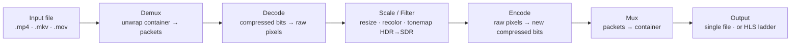

# The Video Crash Course

**Everything you need to understand how digital video actually works — from a single pixel to a planet-scale streaming pipeline — explained from zero.**

You have watched thousands of hours of video. You have probably never been told what a video *is*. This course fixes that. By the end you will understand, in real depth, what happens between a camera sensor and the picture on a phone halfway around the world: how color is stored, why raw video is impossible to ship, how codecs perform their magic, what a "container" actually contains, how Netflix-style adaptive streaming decides which quality to send you, why some codecs cost money and others don't, and how a modern GPU transcoder stitches it all together.

It is a *crash course*: it starts at zero and assumes nothing, but it does not stay shallow. Each chapter goes as deep as a working engineer needs, with concrete numbers, worked examples, and diagrams. If a term sounds like jargon the first time you meet it, that is fine — every term is defined where it first appears and again in the [Glossary](GLOSSARY.md).

> **Why this course exists.** We publish it alongside [**rivet**](https://github.com/rivet-transcoder/rivet), **our** GPU-accelerated video transcoder (written in Rust). Rather than hand-wave, we point at a *real* implementation — ours: when we explain how a muxer writes an MP4, there is actual code in rivet that does exactly that. rivet is the course's running example — but **you do not need to read or write any Rust** to follow along. The concepts are universal; rivet is just the worked example that keeps us honest.

---

## Who this is for

- **The curious** — you have no background and want to genuinely understand the thing you use every day.
- **Software engineers** — you are touching video for the first time (an upload feature, a streaming product, a "just transcode this" ticket) and the existing material is either a 600-page spec or a Stack Overflow `ffmpeg` incantation with no explanation.
- **Founders, PMs, and lawyers** — you need to understand the trade-offs and the *patent landscape* well enough to make decisions.

No prerequisites. If you know what a file is and roughly what a pixel is, you are ready. A little programming background helps with the systems chapters but is not required.

## How to read this

The chapters build on each other, so **reading in order is the intended path** — Part I gives you the vocabulary the rest of the course assumes. But each chapter is also self-contained enough to be a reference: skim the Glossary, jump to the chapter you need, follow the cross-links.

Three recurring callouts:

- 🧠 **Mental model** — the one idea to hold onto if you forget everything else.
- 🔬 **Going deeper** — optional detail for when you want the full picture.
- 🛠️ **In rivet** — where this concept lives in a real codebase, so you can see it isn't magic.

---

## The big picture

Almost everything in this course is a station on one assembly line. Keep this map in your head; we will zoom into each box in turn.

**Transcoding** = decode an existing video back to raw pixels, optionally transform them (resize, recolor), then re-encode to a new codec/quality and re-wrap it. That is the whole job. Every chapter is a piece of this picture — and Part V shows how a real system runs it across multiple GPUs at scale.

---

## Table of contents

### Part I · Foundations — *what a video actually is*

| # | Chapter | What you'll learn |
|---|---------|-------------------|
| 01 | [What Is Video, Really?](chapters/01-what-is-video.md) | Frames, pixels, resolution, frame rate, aspect ratio, interlacing, and time. The mental model the whole course rests on. |
| 02 | [Color, Pixels & the Eye](chapters/02-color-and-pixels.md) | Why video isn't stored as RGB. YUV/Y′CbCr, chroma subsampling (4:2:0/4:2:2/4:4:4), bit depth, color spaces (BT.709/2020), gamut, transfer functions, and the difference between SDR and HDR. |
| 03 | [Why We Compress](chapters/03-why-compression.md) | The arithmetic that makes raw video impossible to ship, and the difference between lossless and lossy compression. The "why" behind everything that follows. |

### Part II · Codecs — *how compression works*

| # | Chapter | What you'll learn |
|---|---------|-------------------|
| 04 | [How Video Compression Works](chapters/04-how-codecs-work.md) | The universal codec model: intra/inter prediction, I/P/B frames, GOPs and keyframes, motion estimation, the transform + quantization, and entropy coding. Why decoding is exact but encoding is a search. |
| 05 | [The Codec Zoo](chapters/05-the-codec-zoo.md) | A guided tour: MPEG-2, H.264/AVC, H.265/HEVC, VP9, AV1, ProRes and friends — with profiles, levels, tiers, generational efficiency gains, and which to reach for when. |
| 06 | [Encoders & Rate Control](chapters/06-encoders-and-rate-control.md) | Inside the encoder: rate control (CRF/CQP/CBR/VBR/ICQ), speed-vs-quality presets, 1- vs 2-pass, lookahead, and how we *measure* quality (PSNR, SSIM, VMAF). |
| 07 | [Bitstreams, NAL Units & Codec Strings](chapters/07-bitstreams-and-nal-units.md) | The bytes themselves: NAL units, the parameter sets (SPS/PPS/VPS), Annex-B vs length-prefixed, how a decoder bootstraps, and how to read a codec string like `avc1.640028`. |
| 08 | [Audio in Brief](chapters/08-audio.md) | Sample rate, channels, PCM, and the codecs (AAC, Opus, MP3, AC-3) — plus the crucial distinction between *passthrough* and *transcode*. |

### Part III · Containers — *muxing & demuxing*

| # | Chapter | What you'll learn |
|---|---------|-------------------|
| 09 | [Containers & Muxing](chapters/09-containers-and-muxing.md) | The difference between a codec and a container. Inside MP4/ISOBMFF (boxes/atoms), MKV/WebM, MPEG-TS. Timestamps (PTS/DTS), the sample table, interleaving, faststart, and fragmented MP4. |
| 10 | [Demuxing the Wild](chapters/10-demuxing.md) | The reverse problem: parsing real-world files, extracting elementary streams, and the surprising messiness of "just read the file." |

### Part IV · Streaming — *delivery at scale*

| # | Chapter | What you'll learn |
|---|---------|-------------------|
| 11 | [Adaptive Bitrate Streaming](chapters/11-adaptive-bitrate-streaming.md) | The rendition ladder, HLS vs MPEG-DASH, CMAF, segments and playlists, and how a player measures your bandwidth and switches quality mid-stream without you noticing. |
| 12 | [Web Delivery & Compatibility](chapters/12-web-delivery-and-compatibility.md) | What browsers and devices actually support, faststart, MIME and codec strings, "optimized for web" as a pile of concrete decisions, and how playback really begins. |

### Part V · Systems — *building a real transcoder*

| # | Chapter | What you'll learn |
|---|---------|-------------------|
| 13 | [The Transcoding Pipeline](chapters/13-the-transcoding-pipeline.md) | The end-to-end data flow as an engineered system: decode-once fan-out for ladders, back-pressure, bounded memory, and why a naïve script is 5× slower than it needs to be. |
| 14 | [GPU Acceleration & Scheduling](chapters/14-gpu-acceleration.md) | Why hardware: NVENC/NVDEC, Intel QSV, AMD AMF, Vulkan Video. Surface formats (NV12/P010), the silent-software-fallback trap, and scheduling encode work fairly across many GPUs. |
| 15 | [Filters: Scaling, Color & Tonemapping](chapters/15-filters-scaling-tonemapping.md) | Resizing (bilinear/bicubic/Lanczos), colorspace conversion, and tonemapping HDR down to SDR without it looking wrong. |

### Part VI · The Real World — *law, money & a full build*

| # | Chapter | What you'll learn |
|---|---------|-------------------|
| 16 | [Patents, Royalties & the Codec Wars](chapters/16-patents-and-royalties.md) | Why some codecs cost money: the patent pools (MPEG-LA, Access Advance, Sisvel), H.264/HEVC royalties, the Alliance for Open Media, AV1's royalty-free promise, and the litigation still in play. |
| 17 | [Putting It All Together](chapters/17-putting-it-all-together.md) | One worked example end to end: take a real file, probe it, build an ABR ladder, transcode to HLS, and inspect the output — wiring together every concept in the course. |

### Appendices

| Appendix | Contents |
|----------|----------|
| [Glossary](GLOSSARY.md) | Every term in the course, defined in one place. |
| [Further Reading & Tools](FURTHER-READING.md) | The specs, books, talks, and command-line tools to go deeper, plus how to inspect files yourself. |

---

## A note on staying current

Video moves fast at the edges (new codecs, new patent suits, new browser support) but the fundamentals in Parts I–IV change on a scale of decades. Where something is genuinely in flux — AV1 patent litigation, hardware support — the chapter says so explicitly rather than pretending the ground is solid.

## License

This course is documentation, free to read and share. **rivet**, our companion engine, is under its own [source-available license](https://github.com/rivet-transcoder/rivet/blob/main/LICENSE.md).

---

*Ready? Start with [Chapter 01 — What Is Video, Really?](chapters/01-what-is-video.md)*
