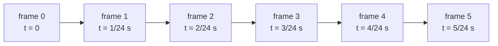
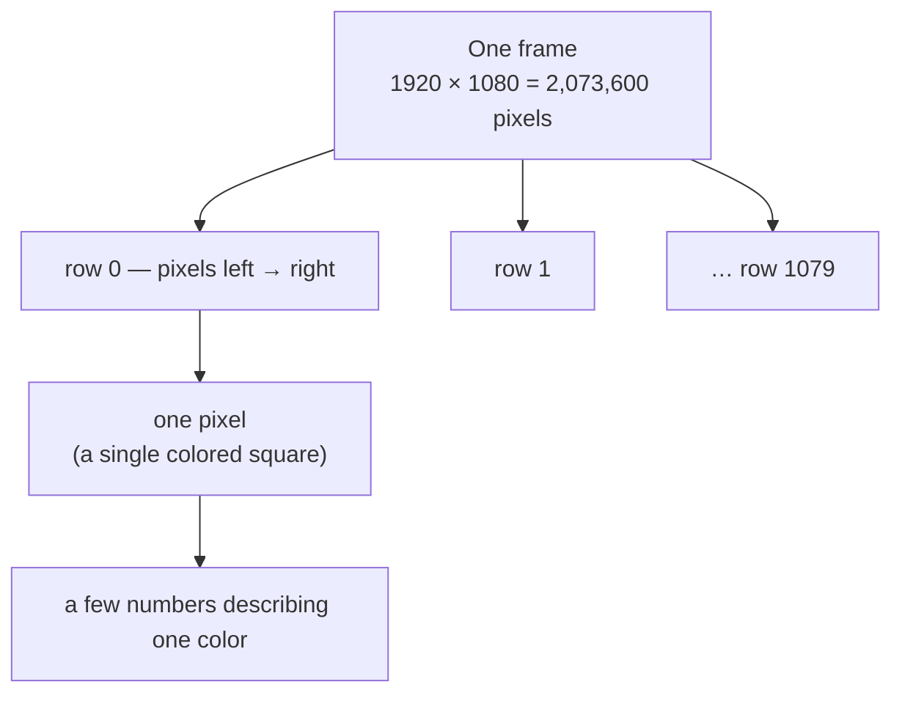
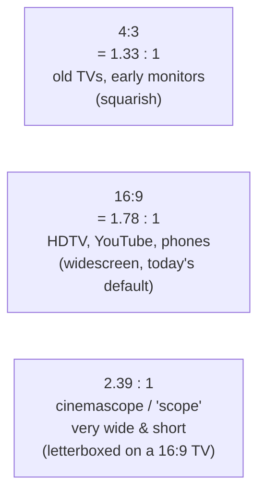
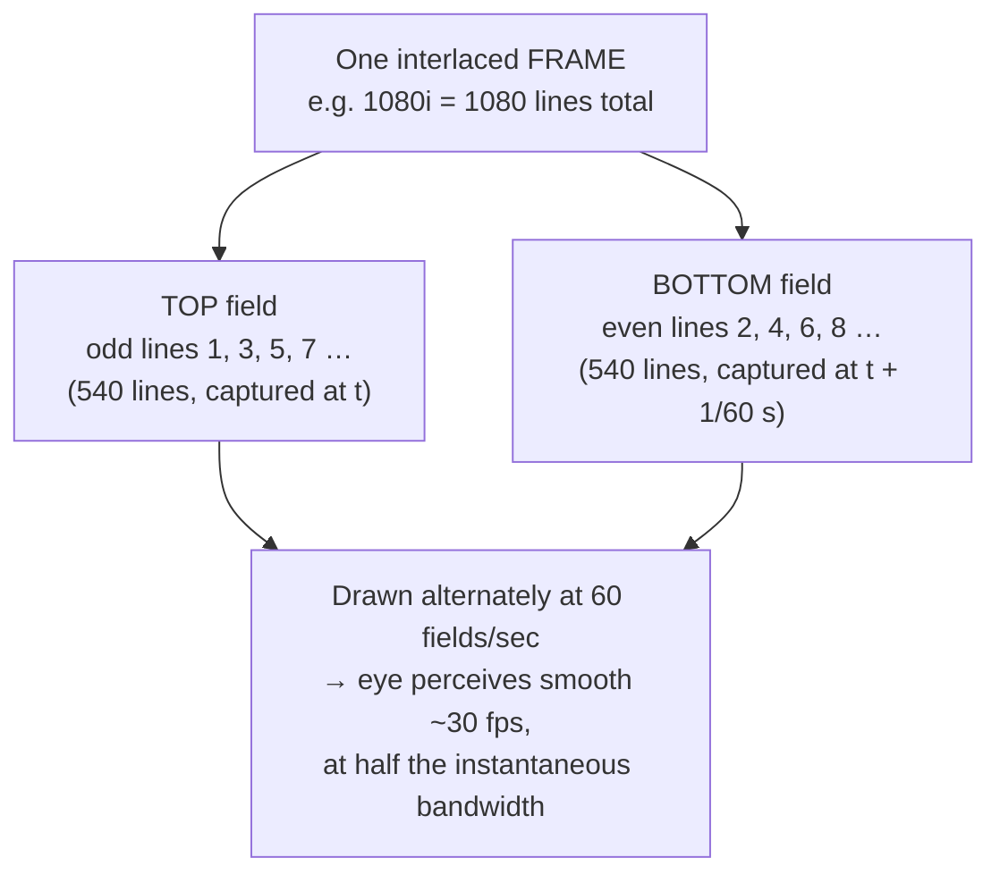
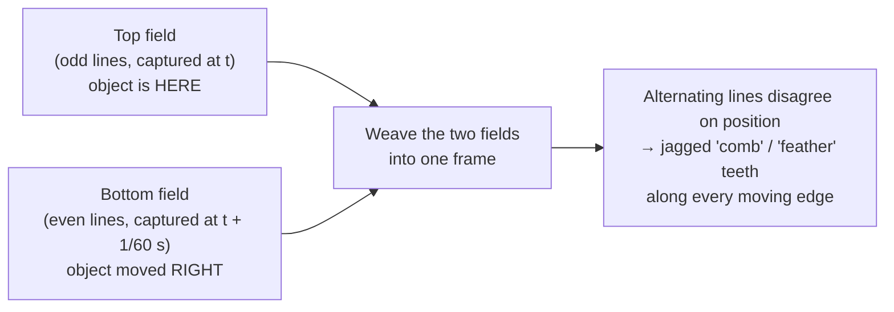
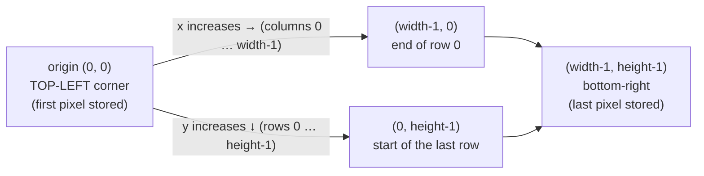
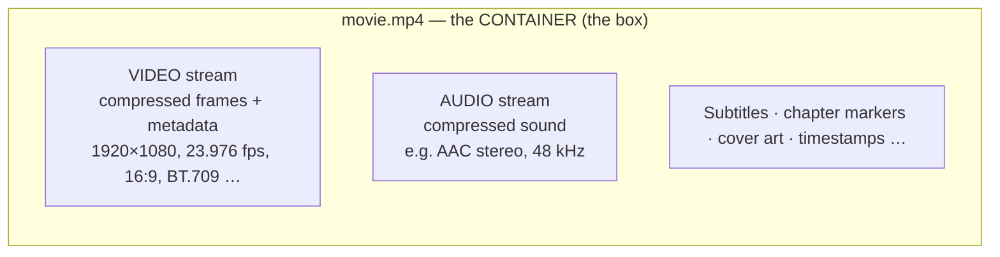

# Chapter 01 — What Is Video, Really?

> **Part I · Foundations** — What a video fundamentally *is*: a stack of still pictures, played fast, plus the handful of numbers (resolution, frame rate, aspect ratio) that describe it.

You have watched, by a conservative estimate, tens of thousands of hours of video. You have almost certainly never been told what a video *is*. The honest answer is gloriously simple, and once you have it, every later chapter — codecs, color, streaming, GPUs — is just detail hung on this one frame. So let's get the frame right.

This chapter builds the mental model the entire course rests on: a video is a flipbook. Everything else is bookkeeping about how fast you flip, how big each page is, and how the pages are stored.

---

## The flipbook

Take a stack of index cards. On each card, draw a stick figure, shifting its arm a little from card to card. Flip the stack with your thumb. The figure *waves*. There is no motion on any single card — motion is an illusion your brain manufactures from a fast sequence of still images.

That is video. Completely. A video is:

> **A sequence of still images, called _frames_, shown one after another fast enough that your eye blends them into continuous motion.**

A "movie," a TikTok, a Zoom call, a security-camera feed, a video game's output — all the same thing under the hood: still pictures, in order, played quickly. The differences between them (how big the pictures are, how many per second, how they're squeezed down for storage) are the subject of this course. But the core is the flipbook, and if you hold onto nothing else, hold onto that.



Each box is a *complete still picture*. Played at 24 per second, the tiny changes from frame to frame read as a stick figure waving its arm. Time runs left to right.

> 🧠 **Mental model:** A video is a flipbook — a stack of still pictures played fast. Frame = one page. Frame rate = how fast you flip. Hold this; the rest is detail.

### Why does the illusion work? (Persistence of vision & flicker fusion)

Two things in your visual system conspire to turn a sequence of stills into motion.

- **Persistence of vision.** Your retina and brain hold onto an image for a brief moment (tens of milliseconds) after the light is gone. A new frame arrives before the old one has fully faded, so you never perceive a gap — the images smear together into continuity. This is the old, slightly outdated textbook explanation, but it captures the gist: your eye is *slow*, and video exploits that slowness.
- **Flicker fusion** and the **phi/beta phenomena.** Above a certain rate (the *flicker-fusion threshold*, very roughly 50–90 flashes per second depending on brightness and where you're looking), a flickering light stops looking like flicker and starts looking steady. And your brain actively *infers* motion between two slightly-different stills that appear in quick succession — it doesn't just fail to notice the gap, it constructs the in-between movement. That construction is why a wagon wheel can appear to spin backward in old films, and why smooth panning shots can look stuttery: your motion-inference machinery is being fed frames faster or slower than it likes.

The practical upshot for us: there is a *minimum* flip rate below which motion looks like a slideshow, and a comfortable range above it. Film settled on **24 frames per second** as the lowest rate that reads as motion while saving on expensive film stock. We'll return to frame rate in detail below.

> 🔬 **Going deeper:** "Persistence of vision" is a real effect but a famously incomplete explanation — if all your eye did was smear frames together, fast motion would just look blurry, not *moving*. The motion you perceive is largely an active reconstruction by your visual cortex (the "beta movement" and "phi phenomenon" studied by Gestalt psychologists). For our purposes the engineering consequence is what matters: feed the eye enough distinct stills per second and it builds smooth motion for free. Codecs, displays, and cameras are all designed around the numbers where that free lunch holds.

---

## Inside a single frame: pixels

Freeze the flipbook on one card. What *is* that still picture, digitally?

A digital image is a grid of tiny colored squares called **pixels**. "Pixel" is a contraction of **pic**ture **el**ement — it is the smallest addressable dot of the picture, the atom of the image. Zoom far enough into any digital photo or video frame and the smooth image dissolves into a mosaic of these uniform-colored squares.

Each pixel stores a **color**, encoded as a small set of numbers. The everyday version you may have met is **RGB**: three numbers giving the amount of **R**ed, **G**reen, and **B**lue light to mix. A pixel storing `(255, 0, 0)` is pure bright red; `(255, 255, 255)` is white; `(0, 0, 0)` is black.

That is the one-sentence version, and it's enough for this chapter. But here is a teaser that the *next* chapter is built around: **video almost never actually stores pixels as RGB.** It stores brightness separately from color, and then deliberately throws away some of the color, because your eye barely notices. *Why* and *how* is the whole of [Chapter 02 — Color, Pixels & the Eye](02-color-and-pixels.md). For now: a frame is a grid of pixels, and each pixel is a few numbers describing a color.



Zoom far enough into any frame and the smooth image dissolves into a mosaic of these uniform-colored squares. A single 1920×1080 frame holds over **two million** of them.

### How big is a frame? (Resolution)

The **resolution** of a frame is how many pixels wide by how many pixels tall it is, written `width × height`. A common HD frame is **1920 × 1080** — 1920 pixels across, 1080 down — which is **2,073,600 pixels** in a single frame. (People round that to "two megapixels.")

Resolution is the first number anyone quotes about a video because it sets the ceiling on detail: more pixels means finer texture, sharper edges, legible small text — and, as [Chapter 03 — Why We Compress](03-why-compression.md) will hammer home, dramatically more data.

The industry mostly talks in named "ladder" rungs rather than raw pixel counts. Here is the ladder you'll see everywhere, from a YouTube quality menu to a transcoder's config:

| Common name      | Pixel dimensions (16:9) | Total pixels   | Generation |
|------------------|-------------------------|----------------|------------|
| 240p             | 426 × 240               | ~102,000       | low / mobile |
| 360p             | 640 × 360               | ~230,000       | SD-ish |
| 480p ("SD")      | 854 × 480               | ~410,000       | Standard Definition |
| 720p ("HD")      | 1280 × 720              | ~922,000       | High Definition |
| 1080p ("Full HD")| 1920 × 1080             | ~2,073,600     | High Definition |
| 1440p ("2K"/QHD) | 2560 × 1440             | ~3,686,400     | between HD and 4K |
| 2160p ("4K"/UHD) | 3840 × 2160             | ~8,294,400     | Ultra HD |
| 4320p ("8K")     | 7680 × 4320             | ~33,177,600    | Ultra HD |

A few things worth internalizing from this table:

- **The numbers grow with the square, not linearly.** Going from 1080p to 4K is *not* "twice as much" — it's **2× the width and 2× the height = 4× the pixels** (8.3 million vs 2.1 million). 8K is 4× *again* over 4K, or **16×** the pixels of 1080p. This quadratic blowup is exactly why higher resolution is so expensive to store and transmit.
- **"SD / HD / UHD" are loose marketing tiers**, not precise specs. *Standard Definition* (SD) is roughly the old TV-era resolutions (≤480-ish lines). *High Definition* (HD) covers 720p and 1080p. *Ultra High Definition* (UHD) covers 4K and 8K. The lines between them are fuzzy and the marketing is fuzzier ("2K," "Full HD," "QHD" all overlap).

### What does the "p" in "1080p" mean?

This trips up almost everyone, because the **p** does **not** stand for "pixels." It stands for **progressive** — as opposed to **interlaced** (an **i**, as in "1080i"). We'll unpack progressive vs interlaced in detail later in this chapter. For now: the number (1080) is the count of horizontal lines of pixels stacked vertically — the *height* — and the letter says *how those lines are delivered over time* (all at once = progressive = `p`; in alternating halves = interlaced = `i`).

So "1080p" literally reads as "1080 lines tall, delivered progressively." The width is implied by the aspect ratio (almost always 16:9, giving 1920 wide). This is a historical convention inherited from broadcast television, where the number of scan *lines* was the headline spec.

> 🛠️ **In rivet:** In our companion transcoder, each rung of an output ladder is just a `width × height` plus a per-rung quality setting. When you ask rivet for a "standard ladder" off a 1080p source, we hand you something like 1080p / 720p / 480p / 360p — the named rungs above — and feed all of them from a *single* decode of the source (the "decode once" trick we lean on in [Chapter 13](13-the-transcoding-pipeline.md)).

---

## Aspect ratio: the shape of the frame

**Aspect ratio** is the proportion of width to height, independent of how many pixels there are. It is written as `width:height`. The two you'll meet constantly:

- **4:3** (1.33:1) — the squarish shape of old TVs and early computer monitors. For every 4 units wide, 3 units tall.
- **16:9** (1.78:1) — the widescreen shape of essentially all modern video: HDTV, YouTube, phones in landscape, most streaming.

Cinema goes wider still: **1.85:1** ("flat") and **2.39:1** ("scope"/anamorphic widescreen) are common theatrical ratios, which is why movies on a 16:9 TV often have black bars top and bottom (*letterboxing*) — the film is wider than your screen, so it's scaled to fit the width and padded vertically.



### The subtle part: DAR, SAR, and PAR (and why pixels aren't always square)

Here's a wrinkle that confuses people because it requires distinguishing *three* aspect ratios that are usually — but not always — the same.

- **DAR — Display Aspect Ratio.** The shape of the picture *as the viewer should see it.* This is the "16:9" you care about.
- **SAR — Storage (or Sample) Aspect Ratio.** The shape implied by the raw pixel grid: `stored_width : stored_height`. *(Beware: in some tools — notably FFmpeg — "SAR" is used to mean the **Sample Aspect Ratio**, i.e. what we're about to call PAR. The acronym is overloaded. We'll use DAR/PAR and spell out the third explicitly.)*
- **PAR — Pixel Aspect Ratio.** The shape of an *individual pixel.* Usually pixels are square (PAR = 1:1), but they don't have to be.

The relationship is just multiplication:

```
   DAR  =  (stored_width / stored_height)  ×  PAR
        =  pixel-grid shape  ×  pixel shape
```

When pixels are square (PAR = 1:1), DAR is simply the grid's own ratio and all three line up. But some formats store **non-square pixels** on purpose — a technique called **anamorphic**. The classic example is DVD:

> **Worked example — anamorphic DVD.** A widescreen DVD stores its picture at **720 × 480** pixels. Compute the grid ratio: 720 / 480 = **1.5 : 1**, which is 3:2 — *not* 16:9. So how does it fill a 16:9 screen correctly? The pixels are defined as **wide** (PAR ≈ 1.21:1 for NTSC widescreen). The player stretches each stored pixel horizontally on display:
>
> `DAR = (720/480) × (32/27) ≈ 1.5 × 1.185 ≈ 1.78 : 1 = 16:9` ✓
>
> The disc stores a "squished" 720×480 image made of skinny-tall... no — *wide* pixels, and the player un-squishes it horizontally to the correct widescreen shape at playback time. Store narrow, display wide.

Why bother? Because in the analog-TV and DVD era, the number of usable horizontal samples was fixed by the broadcast standard. Anamorphic storage let producers pack a widescreen image into that fixed grid and rely on the display to restore the proportions — squeezing more *effective* horizontal resolution into the available pixels than a letterboxed version would.

For modern web video you can almost always assume **square pixels (PAR 1:1)**, so DAR = grid ratio and you can forget this distinction — *until* you ingest an old DVD rip, some broadcast content, or certain camera formats and the picture comes out comically stretched or squished. That's a PAR/DAR mismatch, and now you know the name of the demon.

> 🔬 **Going deeper:** "Anamorphic" also shows up in cinematography meaning a special lens that optically squeezes a wide field of view onto standard film, to be un-squeezed in projection — same idea, different layer of the stack. The digital-storage version (non-square sample aspect ratio) is conceptually identical: store squeezed, display un-squeezed.

> 🛠️ **In rivet:** We built our transcoder to read the source's pixel/display aspect ratio from the container metadata rather than blindly trusting the pixel grid — otherwise we'd produce stretched output. When rivet probes a file it reports the resolution it will actually treat the picture as; for the common square-pixel web case the grid ratio and display ratio are identical and there's nothing to correct.

---

## Frame rate: how fast we flip

**Frame rate** is the number of frames shown per second, abbreviated **fps** (frames per second) or given in **Hz** (hertz, "per second"). It is the "how fast do you flip the flipbook" number, and it controls how smooth motion looks.

The values you'll encounter, and where they come from:

| Frame rate     | Where it comes from |
|----------------|---------------------|
| **24 fps**     | The cinema standard since the late 1920s. The lowest rate that reliably reads as motion — chosen to economize on film while keeping sound-sync stable. The "film look." |
| **25 fps**     | Broadcast TV in **PAL** regions (Europe, much of Asia/Africa/Australia). Tied to the 50 Hz electrical grid. |
| **30 fps**     | Broadcast TV in **NTSC** regions (North America, Japan) and a lot of web/phone video. Tied to the 60 Hz grid. (Really 29.97 — see below.) |
| **50 / 60 fps**| "High frame rate" for smooth motion — sports, video games, screen recordings, fast action. Doubles of 25/30. |
| **120+ fps**   | High-speed capture (for slow-motion playback) and high-refresh gaming/VR. |

A higher frame rate gives smoother motion and clearer fast action, at the cost of *more frames to store and transmit per second* — twice the frame rate is, all else equal, roughly twice the data. There is also an aesthetic dimension: 24 fps carries a century of cinematic association ("film look"), while 60 fps reads as hyper-real, "live," sometimes derided as the "soap-opera effect." Neither is "better"; they're tools.

> 🧠 **Mental model:** Resolution is how *detailed* each page of the flipbook is. Frame rate is how *fast* you flip. They're independent dials, and each one multiplies the amount of data you have to deal with.

### The weird ones: 29.97, 23.976, and the NTSC fractional-rate saga

Look closely at real-world American video and you'll find frame rates that are *almost* whole numbers but maddeningly not: **29.97 fps**, **23.976 fps**, **59.94 fps**. These aren't mistakes. They're a 70-year-old hack fossilized into the format.

Here's the short version of a long story. Early black-and-white NTSC television ran at exactly 30 frames (60 fields) per second, locked to the 60 Hz power line for stability. When **color** was added in 1953, engineers had to squeeze a color subcarrier signal into the existing black-and-white channel *without breaking the millions of B&W sets already in homes* (backward compatibility — a theme that recurs throughout video). The math worked out cleanly only if they nudged the frame rate down by a tiny factor:

```
   30 fps × (1000 / 1001)  =  29.970029...  ≈  29.97 fps
   24 fps × (1000 / 1001)  =  23.976023...  ≈  23.976 fps   (film transferred to NTSC video)
   60 fps × (1000 / 1001)  =  59.940059...  ≈  59.94 fps
```

That `1000/1001` factor — a slowdown of about **0.1%** — is the whole reason. It avoided interference between the audio and color subcarriers. And because formats are forever, it never went away: NTSC-derived digital video, and content mastered for it, still runs at these fractional rates today. PAL regions, which adopted color differently, kept clean **25 fps** and dodged the whole mess.

This is why a transcoder must treat frame rate as an exact **rational number** (a fraction like `30000/1001`), not a rounded decimal — accumulate the 0.1% error over a two-hour movie and your audio drifts noticeably out of sync. We'll see this come back as **timebase/timescale** at the end of the chapter.

> 🔬 **Going deeper — 3:2 pulldown.** A related headache: how do you show **24 fps** film on a **~30 fps (29.97)** TV? You can't just play it faster. The trick, called **3:2 pulldown** (or "telecine"), repeats film frames in an alternating pattern across video fields — frame A spread over 3 fields, frame B over 2, frame C over 3, and so on — to stretch 24 film frames into 30 video frames per second's worth of fields. The pattern is reversible: software can "inverse-telecine" to recover the original 24 progressive frames. If it *isn't* reversed, you get an ugly stuttery cadence (some frames held longer than others) and motion that judders. Detecting and undoing pulldown is a real task in the deinterlacing/filtering stage of a serious pipeline.

> 🛠️ **In rivet:** Frame rate is carried as an exact rational and can be *capped* on output — e.g. `--max-frame-rate 30` to limit a 60 fps source's output cadence, halving the frame count (and roughly the bitrate) when smoothness past 30 fps isn't worth the bits. The cap is a deliberate quality/size knob, not a default.

---

## Progressive vs interlaced: the ghost of the CRT

Remember that the **p** in "1080p" means *progressive* and the **i** in "1080i" means *interlaced*. This distinction is a direct inheritance from how old **CRT** (cathode-ray tube) televisions painted their picture, and it still haunts video today.

### Progressive: the simple, modern way

A **progressive** frame is a complete picture, all its lines present, delivered in one shot. Frame 0 is a whole image; frame 1 is the next whole image; and so on — exactly the flipbook we've been describing. Every digital screen you own (phone, laptop, modern TV) is natively progressive. **Progressive is the default mental model and you should think in it.**

### Interlaced: a clever, awful bandwidth hack

A **CRT** drew its picture by sweeping an electron beam across the screen line by line, top to bottom, making the phosphor glow. Early TV engineers faced a bind: drawing all the lines 30 times a second would have required more broadcast bandwidth than was available, but drawing only 30 *full* pictures a second made the screen visibly **flicker** (the top of the screen would dim before the beam got back around to it).

Their solution: **interlacing.** Split each frame into two **fields**:

- The **top field** (or "upper") contains only the *odd-numbered* lines: 1, 3, 5, 7, …
- The **bottom field** (or "lower") contains only the *even-numbered* lines: 2, 4, 6, 8, …

Draw the odd-line field, then the even-line field, alternating **60 fields per second**. Each field is only half the lines, so it's half the bandwidth — but because the two interleaved fields refresh at 60 Hz, the eye perceives smooth, flicker-free motion at an *effective* 30 frames per second. It was a brilliant trick to get smooth, flicker-free motion out of scarce 1950s bandwidth, and it powered television for half a century.



So a **480i** signal (old NTSC TV) is 480 lines delivered as two 240-line fields. **1080i** (a common HDTV broadcast format) is 1080 lines delivered as two 540-line fields, 60 fields per second. The headline trick: 1080i and 1080p carry the same line count, but 1080i splits each frame's lines across two time-staggered fields to halve the instantaneous bandwidth.

### Why it's a problem now, and what we do about it

Interlacing made sense for a beam-scanning CRT. On a modern progressive display it's a liability, because the two fields of one "frame" were captured **at slightly different moments** (1/60 s apart). When something moves between those two instants, weaving the fields back into one frame produces tell-tale horizontal **comb artifacts** ("combing" or "feathering") along moving edges — the odd lines show the object slightly ahead of where the even lines show it.



Fixing this is called **deinterlacing**: reconstructing whole progressive frames from interlaced fields. Approaches range from crude (throw away one field and double the other — fast, halves vertical resolution) to sophisticated (motion-compensated interpolation that estimates where things moved between fields and synthesizes the missing lines). Good deinterlacing is genuinely hard and is one of the filter operations a quality pipeline performs before re-encoding.

Modern web and streaming video is **overwhelmingly progressive** — interlacing is a legacy you mostly meet when ingesting older broadcast content, certain camcorder footage, or TV captures. But "mostly" isn't "never," so a serious transcoder has to detect interlaced input and deinterlace it rather than passing comb artifacts downstream.

> 🧠 **Mental model:** Think progressive (whole frames). Treat interlacing as a legacy compression-by-time hack from the CRT era: each "frame" is really two half-resolution snapshots taken a beat apart, and turning them back into clean whole frames (deinterlacing) is a real, lossy step.

> 🛠️ **In rivet:** In our pipeline, deinterlacing belongs to the filter/scale stage covered in [Chapter 15 — Filters](15-filters-scaling-tonemapping.md), the same stage where we resize and convert color. We aim to hand the encoder clean progressive frames regardless of how messy the source was.

---

## How a frame is laid out: the pixel coordinate system

When code (or a codec, or a GPU) addresses pixels, it needs a coordinate system, and video uses a specific, near-universal convention worth knowing because it surprises people coming from math class.

- The **origin (0, 0) is the top-left corner**, not the bottom-left. The classic math convention puts (0,0) at the bottom-left with `y` increasing upward; video (and most computer graphics) flips it: **`y` increases downward.**
- `x` runs left → right (column index, 0 to width−1).
- `y` runs top → bottom (row index, 0 to height−1).
- Pixels are stored in **row-major** order: all of row 0 left-to-right, then all of row 1, and so on — like reading English text, line by line.



Pixels are stored in **row-major** order — all of row 0 left-to-right, then all of row 1, and so on, exactly like reading English text line by line. Note the flip from math class: the origin is top-left and **`y` increases *downward*.**

Why top-left? It mirrors how a CRT beam scanned (top-left, sweeping right and down) and how image files and framebuffers are laid out in memory, so it became the entrenched convention across graphics, imaging, and video. The one place you'll trip over it is when porting math/plotting code (bottom-left origin) into image code (top-left origin) — a classic vertical-flip bug.

The amount of memory one uncompressed frame occupies is just `width × height × (bytes per pixel)`. For a 1920×1080 frame at the simple 3-bytes-per-pixel RGB layout, that's `1920 × 1080 × 3 = 6,220,800 bytes ≈ 6 MB` — *per frame.* Park that number; [Chapter 03](03-why-compression.md) multiplies it by frame rate and duration to explain why raw video is a non-starter and compression is mandatory, not optional.

---

## Time: duration, timebase, and the first whiff of timestamps

A video isn't just a *set* of frames — it's an *ordered, timed* sequence. Two more numbers finish the picture:

- **Duration** — how long the video runs, in seconds (or h:m:s). Roughly, `duration ≈ frame_count / frame_rate`. A 14,400-frame clip at 24 fps runs `14400 / 24 = 600` seconds = 10 minutes.
- **Timebase / timescale** — the *unit of time* the format uses to stamp each frame.

That second one deserves a teaser, because it's where this chapter quietly hands off to the containers chapter. Computers don't like storing time as floating-point seconds — rounding errors accumulate, and remember those awkward `30000/1001` fractional frame rates. So video formats define a **timescale** (also called **timebase**): an integer number of "ticks per second," and then every frame's time is expressed as an *integer count of ticks.*

For example, with a timescale of **90,000** ticks per second (a very common choice in broadcast and MPEG formats), a frame that should appear at 0.5 seconds gets the timestamp `45000` (because 45000 / 90000 = 0.5). A frame at 1/24 s gets `90000 / 24 = 3750`. Using a fine integer tick rate lets the format represent both 24, 25, 30, and the ugly `30000/1001` rates *exactly*, with no floating-point drift, by choosing a timescale that divides them all cleanly.

These per-frame integer timestamps are the **PTS** (Presentation Time Stamp — *when* to show this frame) and **DTS** (Decode Time Stamp — *when* to decode it, which can differ from display order, as you'll see once B-frames enter the story). We are not going to develop them here — that's the job of [Chapter 09 — Containers & Muxing](09-containers-and-muxing.md). The point for *now* is just to plant the idea: **a frame doesn't only have pixels, it has a timestamp**, and that timestamp is an integer measured in a format-defined tick rate, not a float in seconds.

> 🧠 **Mental model:** A video = (ordered frames) + (a clock). The clock counts in integer "ticks per second" so it can represent 24, 25, 30, and 29.97 fps all *exactly*. Each frame is stamped with a tick count saying when to show it.

---

## The picture stream vs. the file: a crucial distinction

One last conceptual split, and it's the bridge to the second half of the course.

What we've described in this chapter — the timed sequence of frames, with its resolution, frame rate, and aspect ratio — is the **picture stream** (more formally, the *elementary video stream*, once it's compressed). It is the *content*: the actual moving image.

But you don't download a "picture stream." You download an **`.mp4`** or **`.mkv`** or **`.mov`** file. That file is a **container** — a structured wrapper that holds the compressed picture stream *plus* one or more audio streams, *plus* subtitles, *plus* chapter markers, *plus* the metadata (resolution, frame rate, aspect ratio, timestamps, the `colr` color tags from [Chapter 02](02-color-and-pixels.md)) that tells a player how to interpret all of it. The container is the box; the streams are what's in the box.



The same picture stream can live in different containers (an H.264 video can sit inside `.mp4`, `.mkv`, `.mov`, or `.ts`), and one container can hold streams compressed by different codecs. Pulling the streams *out* of the box is **demuxing**; packing them *into* a box is **muxing**. That whole topic — boxes/atoms, the sample table, interleaving, faststart — is [Chapter 09 — Containers & Muxing](09-containers-and-muxing.md) and [Chapter 10 — Demuxing the Wild](10-demuxing.md). Tuck the distinction away: **the file is not the video; the file is a box that *contains* the video** (and its companions).

> 🔬 **Going deeper:** The "compressed frames" inside that video stream aren't simple stills anymore — most of them describe themselves as *differences from other frames* ("the next frame is the previous one, but this region moved left 12 pixels"). That's the entire magic of [Chapter 04 — How Video Compression Works](04-how-codecs-work.md). For this chapter, the flipbook of independent stills is the right model; just know the real bytes are cleverer.

---

## Worked example: reading a real clip's specs

Let's tie every term in this chapter together by reading the kind of one-line summary a tool like `rivet probe` or `ffprobe` prints for a real file:

> **`1920 × 1080, 16:9, 23.976 fps, progressive, 142,857 frames, 99 min 17 s`**

Decode it piece by piece:

- **1920 × 1080** — the **resolution**. Each frame is 1920 pixels wide and 1080 tall = **2,073,600 pixels** per frame. This is "1080p" / "Full HD."
- **16:9** — the **display aspect ratio**. 1920/1080 = 1.777… = 16:9 exactly, and since this is modern web-ish content the pixels are square (PAR 1:1), so the grid ratio *is* the display ratio — no anamorphic correction needed.
- **23.976 fps** — the **frame rate**, and that telltale fractional value is the `24 × 1000/1001` NTSC slowdown: this is film-rate content (a movie) mastered for the NTSC world. A careful tool stores it as the exact rational `24000/1001`, not the rounded `23.976`.
- **progressive** — the **p** in 1080p. Each frame is a whole picture, no fields, no deinterlacing needed. Good — it'll feed an encoder cleanly.
- **142,857 frames / 99 min 17 s** — the **duration** falls out of the other two: `142857 frames ÷ (24000/1001) fps ≈ 5957 seconds ≈ 99 min 17 s`. (Notice we used the *exact* rational frame rate; using the rounded 23.976 would have introduced a small error over 140,000 frames.)

And one thing this line does **not** tell you, which the next chapter is entirely about: *how the color in each of those two-million-pixel frames is actually encoded* — almost certainly **not** as the simple RGB we used as a placeholder, but as separated brightness-and-color with some of the color deliberately thrown away. On to that.

---

## Recap

- A **video is a flipbook**: a timed, ordered sequence of still images (**frames**) shown fast enough — thanks to **persistence of vision** and **flicker fusion** — that your brain builds continuous motion. Hold this model above all else.
- A frame is a grid of **pixels** (picture elements); each pixel stores a color as a few numbers. *How* that color is encoded is [Chapter 02](02-color-and-pixels.md)'s job — and it's almost never plain RGB.
- **Resolution** (`width × height`) sets detail and grows with the *square*: 4K is 4× the pixels of 1080p, not 2×. The named ladder (360p→8K) and SD/HD/UHD tiers are how the industry talks about it; the **p** means **progressive**, the line count is the height.
- **Aspect ratio** is the frame's shape (4:3 vs 16:9); usually pixels are square so DAR = grid ratio, but **anamorphic** formats (DVD) store non-square pixels (PAR ≠ 1:1) and rely on the display to un-squeeze them.
- **Frame rate** (fps) is the flip speed; film is 24, PAL TV 25, NTSC TV ~30 — and the weird **29.97 / 23.976** values are a 1953 backward-compatibility hack (`× 1000/1001`) that demands rates be treated as exact rationals.
- **Progressive** (whole frames, the modern default) vs **interlaced** (two time-staggered half-resolution fields per frame, a CRT-era bandwidth trick) — interlaced sources need **deinterlacing** or they show comb artifacts.
- Pixels live in a **top-left-origin, row-major** coordinate system, and one raw 1080p frame is ~6 MB — a number [Chapter 03](03-why-compression.md) will multiply into a crisis. A frame also carries a **timestamp** in an integer **timescale**, a teaser for [Chapter 09](09-containers-and-muxing.md). Finally: **the file is a container** that *wraps* the picture stream, not the picture stream itself.

**Next:** [Chapter 02 — Color, Pixels & the Eye](02-color-and-pixels.md)
