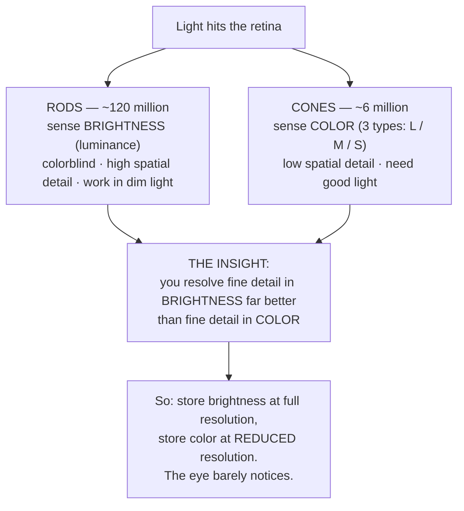
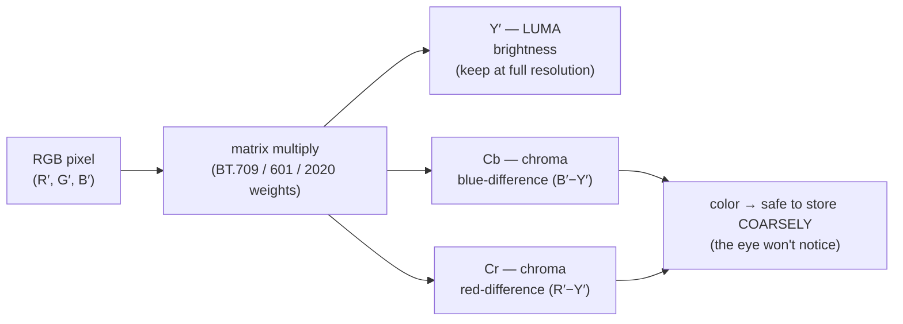
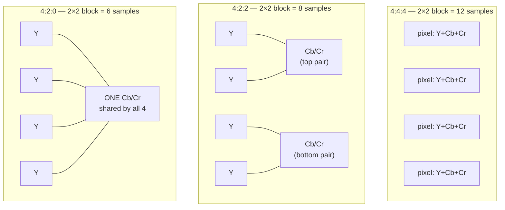
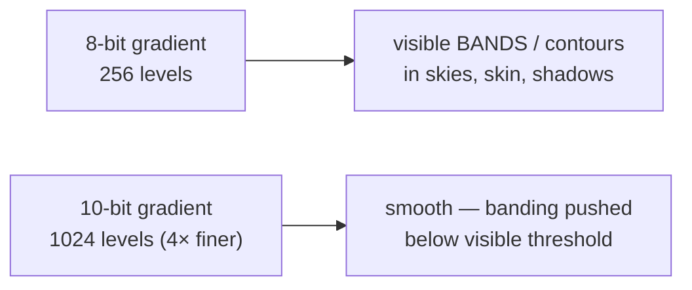
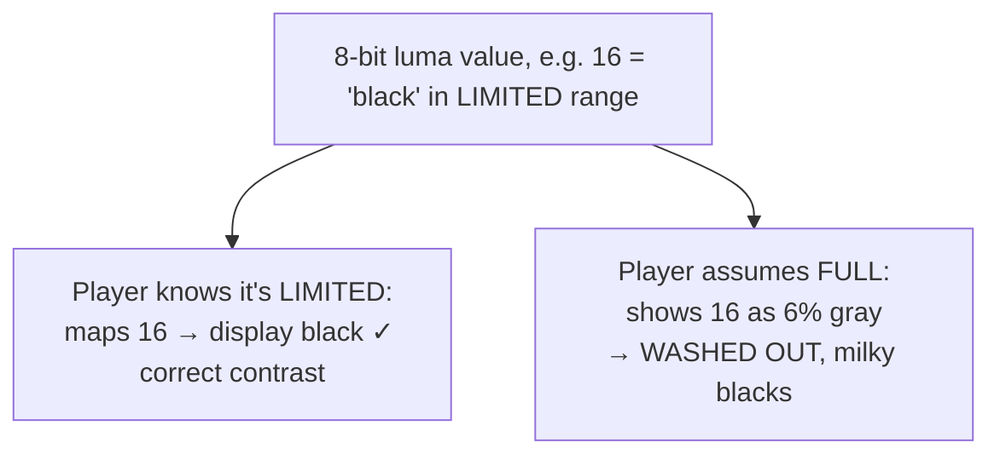
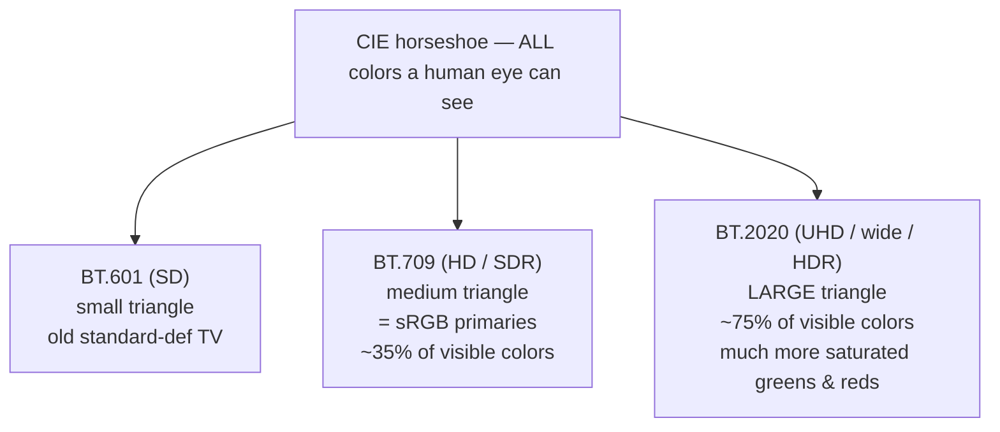
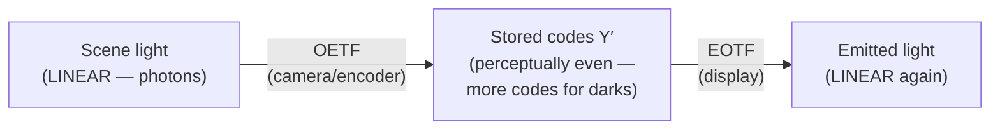
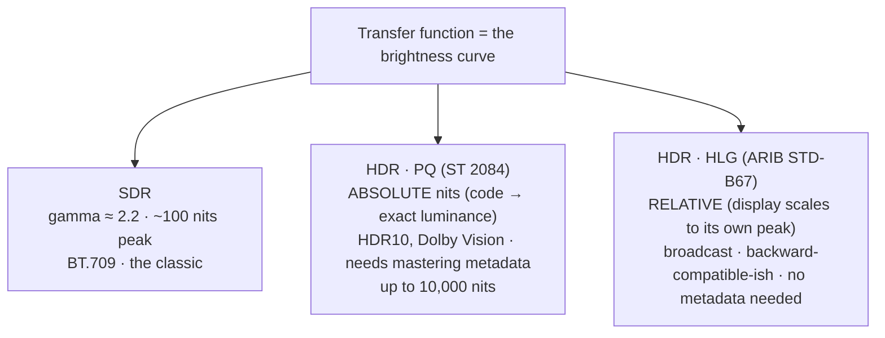
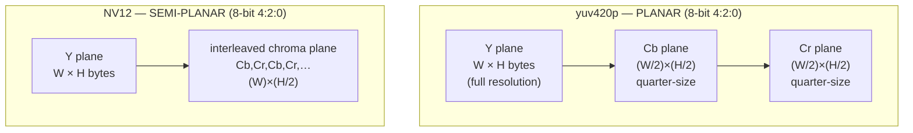
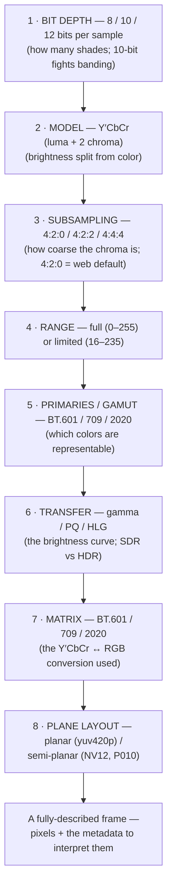

# Chapter 02 — Color, Pixels & the Eye

> **Part I · Foundations** — How a single pixel's color is actually stored, and why video splits brightness from color, throws away most of the color, and tags everything with metadata that — when wrong — wrecks the picture.

This is the load-bearing chapter of the course. Compression (Part II), HDR tonemapping (Chapter 15), GPU surface formats (Chapter 14), and half the bugs you'll ever hit with video all trace back to ideas introduced here. We're going to start at your retina and end at the exact byte layout of a frame in memory — and the through-line connecting them is a single fact about your own eyes that the entire industry is built on top of.

Take your time with this one. If a later chapter confuses you, the odds are good the missing piece is here.

---

## It starts with the eye

Everything about how video stores color is reverse-engineered from how *you* see color. So we begin with the hardware in your head.

The light-sensing surface at the back of your eye, the **retina**, has two kinds of photoreceptor cells:

- **Rods** — roughly **120 million** of them. They are exquisitely sensitive to *brightness* (luminance) and work in dim light, but they are **colorblind** — they give you no hue information at all. They're also packed densely across the retina, giving you fine spatial detail in light and dark.
- **Cones** — only about **6 million**, concentrated in a tiny central pit (the *fovea*). They sense *color*, and come in three types tuned to roughly long (reddish), medium (greenish), and short (bluish) wavelengths. They need decent light to work, which is why colors wash out at night ("at night all cats are gray" — that's your rods working alone).

Sit with those numbers: **~120 million brightness sensors versus ~6 million color sensors.** Your eye devotes roughly **twenty times** more hardware to *how bright* something is than to *what color* it is.



The consequence, which we'll spend the rest of the chapter cashing out: **your perception of fine detail comes almost entirely from brightness, and barely at all from color.** You can blur the *color* of an image dramatically — smear it like a child coloring outside the lines — and as long as the *brightness* edges stay sharp, your eye reports a crisp picture. Blur the brightness instead and everything turns to mush.

> 🧠 **Mental model:** Your eye is a high-resolution black-and-white camera with a low-resolution color camera bolted on. Video storage mirrors that exactly: keep brightness sharp, let color be coarse. This one asymmetry justifies **chroma subsampling**, much of how codecs allocate bits, and the very decision to not store RGB.

---

## RGB: the obvious way to store a color (that video mostly avoids)

Before we get to what video *does*, let's nail down the everyday model it *rejects*.

Screens make color by **additive mixing** of three primary lights — **R**ed, **G**reen, and **B**lue. Each pixel on your display is three tiny sub-lights; tell each how bright to be and the trio blends, at viewing distance, into a single perceived color. This is *additive* mixing (mixing **light**): all three at full = white; all off = black; red + green light = yellow. (That last one surprises people raised on mixing **paint**, which is *subtractive* — paint pigments absorb light, so there the rules differ. Light adds; pigment subtracts.)

How precisely can we set each primary? That's **bit depth** — the number of bits used per channel:

- **8 bits per channel** is the classic standard: each of R, G, B is an integer from **0 to 255** (that's 2⁸ = 256 distinct levels). Three channels give 256 × 256 × 256 = **16,777,216** ≈ **16.7 million** representable colors. This is "24-bit color" or "true color."
- More bits = finer gradations (we'll get to 10- and 12-bit shortly).

So a pixel is `(R, G, B)`, e.g. `(255, 0, 0)` = pure red, `(255, 255, 255)` = white, `(128, 128, 128)` = mid-gray. A full frame in this format costs **3 bytes per pixel** (one byte each for R, G, B) — the 6 MB-per-1080p-frame figure from [Chapter 01](01-what-is-video.md).

RGB is intuitive, it's what your monitor's panel ultimately wants, and it's what image editors expose. So why doesn't video store it?

Because RGB **spreads the brightness information across all three channels.** The perceived brightness of a pixel is buried in a mix of R, G, and B — there's no single "brightness" number to keep sharp and no single "color" number to make coarse. RGB gives us no way to exploit the eye's twenty-to-one brightness-over-color bias. To exploit it, we need to *separate brightness from color* into different numbers. That separation is the next idea, and it's the foundation of basically all video.

---

## Y′CbCr: splitting brightness from color

Instead of (Red, Green, Blue), video stores each pixel as:

- **Y′** — **luma**, the brightness (how light or dark the pixel is), and
- **Cb** and **Cr** — two **chroma** ("color difference") components that, together, say *what color* the brightness is tinted.

This representation is called **Y′CbCr**. You will also constantly see it called **"YUV"** — strictly, "YUV" referred to an analog encoding, and "Y′CbCr" is the digital one, but in practice everyone (filenames, APIs, casual speech) says "YUV" to mean the digital Y′CbCr. We'll use them interchangeably, with a slight preference for the precise term.

What do the pieces mean?

- **Y′ (luma)** is a weighted sum of R, G, B chosen to match how bright the eye perceives each primary. The HD/SDR standard (BT.709, met formally below) defines:

  ```
  Y′ = 0.2126·R′ + 0.7152·G′ + 0.0722·B′
  ```

  Notice the weights are wildly unequal, and look at the winner: **green carries ~72% of perceived brightness**, red ~21%, blue only ~7%. That's not arbitrary — it reflects your cones being most sensitive to green-ish light. (The little prime marks ′ mean "gamma-encoded," a wrinkle we'll resolve in the transfer-function section. Hold that thought.)

- **Cb (blue-difference chroma)** ≈ how much the pixel leans blue versus the gray of that brightness — proportional to `(B′ − Y′)`.
- **Cr (red-difference chroma)** ≈ how much it leans red versus that gray — proportional to `(R′ − Y′)`.

Green doesn't get its own chroma channel: since Y′ already encodes the green-heavy brightness, green is recovered from Y′ together with Cb and Cr. Two color-difference numbers plus one brightness number fully reconstruct R, G, B — it's a lossless, reversible rotation of the same information, just re-parceled so brightness sits alone in one channel.



Why go to this trouble? Because now brightness lives in *one* channel (Y′) that we keep pristine, and color lives in *two* channels (Cb, Cr) that — per the eye insight — we can store at reduced resolution and quality almost for free. RGB couldn't give us that lever. Y′CbCr hands it to us. The very next section pulls that lever.

> 🔬 **Going deeper:** The exact weights depend on which standard you're in — they're tied to the color primaries. BT.601 (SD) uses `Y′ = 0.299R′ + 0.587G′ + 0.114B′`; BT.709 (HD) the 0.2126/0.7152/0.0722 above; BT.2020 (UHD/wide) `0.2627/0.6780/0.0593`. These are the **matrix coefficients**, and using the *wrong* set to decode is a real bug — apply the BT.601 matrix to BT.709 content and skin tones drift, greens and reds shift. We'll meet the metadata tag that prevents this later in the chapter.

---

## Chroma subsampling: throwing away color on purpose

Here's where the eye insight pays off in cold, hard bytes.

Since you barely resolve fine *color* detail, video stores the two chroma channels (Cb, Cr) at **lower spatial resolution** than the luma channel (Y′). We keep one Y′ value for every single pixel — brightness stays sharp — but share each Cb/Cr value across a *block* of neighboring pixels. This is **chroma subsampling**, and it is nearly universal: almost every video you've ever watched is subsampled.

### The J:a:b notation

Subsampling schemes are written as three numbers, `J:a:b`, describing a conceptual block **J pixels wide and 2 pixels tall**:

- **J** — the width of the reference block, essentially always **4**.
- **a** — how many chroma samples appear in the **top** row of those J pixels.
- **b** — how many chroma samples *change* in the **bottom** row (0 means the bottom row reuses the top row's chroma).

It's a clunky notation (the `b` "number of changes" convention is genuinely confusing), but you only need to recognize three values in practice. Let's take them in order from "keep everything" to "the web default."

### 4:4:4 — full chroma (no subsampling)

Every pixel gets its own Y′, its own Cb, and its own Cr. No color information is discarded. This is what image editing, high-end film mastering, screen recordings of text/graphics, and chroma-key (green-screen) work want — anywhere crisp color *edges* matter (a hard line between two colors of equal brightness vanishes if you blur the chroma).

For a 2×2 block of 4 pixels: **4 Y + 4 Cb + 4 Cr = 12 samples.**

### 4:2:2 — half the chroma horizontally

Chroma is sampled at full vertical resolution but **half horizontal** resolution: each horizontal *pair* of pixels shares one Cb/Cr. Color detail is halved left-to-right but preserved top-to-bottom. This is the classic **"mezzanine" / broadcast / editing** format — enough color fidelity for professional post-production and compositing, while already cutting data. (Apple ProRes, broadcast cameras, and SDI links commonly use 4:2:2.)

For a 2×2 block: **4 Y + 2 Cb + 2 Cr = 8 samples.**

### 4:2:0 — half the chroma in *both* directions (the web default)

Chroma is halved **both** horizontally and vertically: a single Cb/Cr value is shared across each **2×2 block** of four pixels. The chroma planes are therefore **one-quarter the resolution** of the luma plane (half the width × half the height). Luma stays full-resolution, so brightness edges remain razor-sharp; only color is coarsened — and your eye shrugs.

For a 2×2 block: **4 Y + 1 Cb + 1 Cr = 6 samples.**

This is the format of essentially all consumer and web video — H.264, HEVC, VP9, AV1 in their mainstream profiles, every streaming service, your phone's camera. When this course says "video," assume **4:2:0** unless stated otherwise.



### The data saving, computed

Lay the three side by side for the same four pixels (a 2×2 block):

| Scheme | Y samples | Cb samples | Cr samples | Total | Samples / pixel | vs 4:4:4 |
|--------|:---------:|:----------:|:----------:|:-----:|:---------------:|:--------:|
| 4:4:4  | 4 | 4 | 4 | **12** | 3.0 | — |
| 4:2:2  | 4 | 2 | 2 | **8**  | 2.0 | −33% |
| 4:2:0  | 4 | 1 | 1 | **6**  | 1.5 | **−50%** |

The headline: **4:2:0 stores half the samples of full 4:4:4** (1.5 versus 3.0 per pixel), and **25% fewer than 4:2:2** (6 versus 8) — while keeping luma, the channel your eye actually uses for detail, fully intact. Half the data, no visible loss for natural imagery. That is an extraordinary bargain, and it's *before* a codec does any real compression. It's also why the on-disk luma plane is full-size and the two chroma planes are quarter-size — a layout we'll see concretely in the pixel-format section.

When do you *not* subsample? When color edges are the content: green-screen keying (you're literally selecting on color, so coarse color = ragged edges), motion-graphics and text with saturated colors, and mastering formats meant for further editing. There you pay for **4:2:2** or **4:4:4**. For final delivery to human eyeballs, **4:2:0** wins almost every time.

> 🛠️ **In rivet:** We encode 4:2:0 by design — it's what browsers and devices universally decode, and it's the right call for web delivery. Our encoders emit AV1/H.264/H.265 in 4:2:0 (8- or 10-bit); we don't produce 4:2:2 or 4:4:4 output, because the entire point of our default pipeline is files that *just play* everywhere. A 4:4:4 source gets down-sampled to 4:2:0 on the way through, in the same filter stage that resizes it.

---

## Bit depth: how many shades per channel

We met 8-bit color above (0–255 per channel). **Bit depth** is worth its own section, because more bits buys something even for ordinary "standard" video, and it's a separate axis from subsampling.

| Bit depth | Levels per channel | Total RGB colors | Where it's used |
|-----------|:------------------:|:----------------:|-----------------|
| **8-bit** | 256 (0–255) | 16.7 million | Standard web/consumer SDR video |
| **10-bit**| 1,024 (0–1023) | ~1.07 **billion** | HDR; high-quality SDR; modern streaming |
| **12-bit**| 4,096 (0–4095) | ~68 billion | Cinema mastering, Dolby Vision pipelines |

Each extra bit *doubles* the number of distinguishable levels. Why care, if 16.7 million colors already sounds like plenty?

Because of **banding.** Consider a smooth gradient — a clear sky fading from deep blue at the top to pale near the horizon. With only 256 brightness levels to cover that fade, the steps between adjacent levels can become *visible*: instead of a seamless gradient you see distinct bands or contours, like a topographic map. It's most obvious in skies, skin, smoke, shadows, and slow dissolves — large, smoothly-varying areas. The eye is brutally good at spotting these edges (back to that brightness sensitivity).

**10-bit** gives 1024 levels instead of 256 — **4× finer gradations** — which is usually enough to push banding below the visible threshold. The crucial, counterintuitive point: **10-bit helps even for ordinary SDR content**, not just HDR. The extra precision smooths gradients regardless of how bright the picture gets. This is why several streaming services and modern codecs use 10-bit even for SDR, and why 10-bit is sometimes *more efficient* to compress (the encoder isn't fighting quantization artifacts that 8-bit introduces). HDR essentially *requires* 10-bit, because it stretches the tonal range even wider, making 8-bit banding unavoidable — but 10-bit's banding win is general.



> 🔬 **Going deeper:** Encoders also fight banding with **dithering** — adding a tiny, carefully-shaped noise so the *average* of a region lands between the available levels, trading a visible hard edge for invisible fine grain. Dithering and higher bit depth are complementary. And there's a subtlety: bit depth interacts with the transfer function (next-but-one section). Spending your codes wisely across the tonal range — more codes where the eye is sensitive — is as important as having more codes total.

---

## Full vs. limited range: the washed-out-picture bug

Here's a small numeric convention that causes an outsized number of real-world "why does this look wrong" bugs.

When you have 8 bits (0–255) to store a luma value, there are two conventions for *which* numbers mean black and white:

- **Full range** (also "PC range" / "0–255"): black is **0**, white is **255**. All 256 codes are used. This is what computer graphics, JPEG, and sRGB typically assume.
- **Limited range** (also "studio range," "TV range," "video range," "16–235"): black is **16**, white is **235** for luma (chroma uses **16–240**). Codes 0–15 and 236–255 are reserved as "footroom" and "headroom" — historically to absorb analog overshoots and signal processing without clipping.

Limited range is the **default for video** (broadcast heritage); full range is the default for **still images and the desktop**. Both are legitimate. The catastrophe is a **mismatch** — content stored in one range, interpreted by the player as the other:

- **Limited content shown as full range** (the player doesn't expand 16–235 back out to 0–255): the darkest black (16) displays as a *dark gray* instead of true black, and white (235) as a slightly-dim white. The whole image looks **washed out / milky / low-contrast** — "raised blacks." This is the single most common color bug in amateur video pipelines.
- **Full content shown as limited range** (the player wrongly stretches 16–235 → 0–255): everything below code 16 gets **crushed to pure black**, everything above 235 gets **blown to pure white**, and contrast is over-stretched in between — **crushed blacks and clipped highlights**, often with an over-saturated, harsh look.



The fix is never to guess: the file must *carry a tag* saying which range it is, and the whole chain must honor it. That tag — `video_full_range_flag` / "color range" — is part of the metadata bundle we get to shortly. When it's missing or wrong, you get exactly the washed-out or crushed look above.

> 🛠️ **In rivet:** Color range is one of the signals we track from demux through encode to mux, so we don't silently turn a correctly-tagged limited-range source into a washed-out output. Range, primaries, transfer, and matrix travel together as the source's color metadata and get re-emitted (or deliberately converted) on the output side rather than dropped on the floor.

---

## Color primaries & gamut: which colors can you even represent?

So far we've talked about *brightness* levels and *how* color is parceled. Now: *which* colors are on the table at all? That's the **gamut**, defined by the **color primaries**.

Recall a display mixes three primaries (R, G, B). But "red" isn't one specific color — a display's red could be a deep crimson or a lighter scarlet. The exact chromaticities of the three primaries (plus the **white point**, what "white" means) define a **triangle** on the map of all colors the human eye can see. Every color *inside* that triangle is reproducible by mixing the primaries; everything outside is unreachable for that system. The size and placement of that triangle *is* the gamut.

The "map of all colors" is the **CIE 1931 chromaticity diagram** — picture a horseshoe-shaped (tongue-shaped) blob. The curved outer edge is the *spectral locus*: pure single-wavelength colors, from deep violet at one tip, sweeping through blue, green, yellow, and around to red at the other tip, with a straight "line of purples" closing the bottom. The interior fills with progressively less-saturated colors, fading to white at the center. **Every color a human can perceive lies inside this horseshoe.** A display's gamut is a triangle drawn inside it, corners at the three primaries; a bigger triangle reaches more saturated, vivid colors.



The three standards you'll meet, smallest to largest:

- **BT.601** — the Standard-Definition gamut (NTSC/PAL TV). You meet it on DVDs and old broadcast content. (Two slightly different primary sets for the 525-line and 625-line worlds, but treat it as "the SD gamut.")
- **BT.709** — the High-Definition / SDR gamut. **This is the workhorse**: nearly all HD and web video, and it shares its primaries with **sRGB** (the standard computer-display color space), so HD video and your monitor speak the same color language. Covers roughly a third of visible colors.
- **BT.2020** — the Ultra-HD / wide-gamut standard, used for 4K and HDR. A *much* larger triangle — far more saturated greens and reds — covering roughly three-quarters of visible colors. (Real displays can't yet fully reproduce BT.2020; they cover a big chunk of it and approximate the rest.)

Two consequences worth holding:

1. **Gamut is separate from bit depth and from subsampling.** You can have wide-gamut 8-bit, or narrow-gamut 10-bit, etc. They're independent axes (though HDR conventionally pairs BT.2020 + 10-bit).
2. **Gamut, like range, must be *tagged*.** A BT.2020 image decoded as if it were BT.709 will look **desaturated and hue-shifted** (the player squeezes wide-gamut numbers into a narrow-gamut interpretation, and vivid colors fall flat); the reverse over-saturates. Same lesson as range: the *meaning* of the numbers lives in metadata, not in the numbers themselves.

---

## Transfer functions & gamma: why the numbers aren't proportional to light

Now the subtlest of the foundational ideas, and the reason for all those prime marks (Y′, R′) we've been sprinkling around. It explains the difference between SDR and HDR, so it's worth getting right.

### The problem: light is linear, but perception isn't

Out in the world, light is **linear**: double the photons, double the physical brightness. But your *perception* of brightness is profoundly **non-linear** — you discriminate fine differences in **dark** tones far better than in **bright** ones. The step from near-black to slightly-less-black is glaringly obvious; the same physical step added to an already-bright region is nearly invisible. (This is a form of the Weber–Fechner law — perceived change scales with relative, not absolute, change.)

This creates a storage problem. Suppose you naively store **linear light** in 8 bits, evenly spaced. You'd "waste" tons of code values on bright tones where the eye can't tell adjacent codes apart, while **starving the dark tones** where the eye is hyper-sensitive — and dark gradients would band horribly. Linear-light 8-bit looks terrible in the shadows.

### The fix: encode light through a non-linear transfer function

So before storing, we pass the linear light through a **non-linear curve** that allocates **more code values to darks and fewer to brights**, matching the eye's sensitivity. This curve is the **transfer function** (historically "**gamma**," because the classic curve was roughly `output = input^gamma`). The display then applies the *inverse* curve to turn the stored codes back into linear light to emit.

The two halves have names you'll see in metadata and specs:

- **OETF** — **O**pto-**E**lectronic **T**ransfer **F**unction: scene **light → signal**, applied at the **camera/encoder** side (compresses linear light into perceptually-even codes).
- **EOTF** — **E**lectro-**O**ptical **T**ransfer **F**unction: signal **→ display light**, applied at the **display** side (the inverse, expanding codes back to physical light).



And **that** is what the prime mark means. **Y′** (with the prime) is the **gamma-encoded** luma — the non-linear stored value. Plain **Y** (no prime) would be linear *luminance*. Video stores Y′CbCr (primed) because it stores the perceptually-coded, transfer-function-applied values, not raw linear light. People are sloppy and drop the prime constantly, but the distinction is real and occasionally bites (mixing linear and gamma-encoded values — e.g. resizing or blending in the wrong space — produces subtly wrong brightness, especially at edges).

> 🧠 **Mental model:** The numbers in a video file are **not proportional to physical brightness**. They're run through a perceptual curve (the transfer function) that crams more precision into the darks, because that's where your eye looks hardest. The display undoes the curve. Get the curve wrong and the whole image is too dark, too bright, or flat.

For SDR, the transfer function is roughly a **gamma ≈ 2.2–2.4** power curve (BT.709's OETF on the capture side, with displays applying a complementary EOTF). For decades this was the only curve that mattered. Then HDR arrived and needed new ones.

---

## SDR vs. HDR: how bright can white be?

**Dynamic range** is the span from the darkest black to the brightest white a system can represent. This is where the transfer function becomes the headline feature.

### SDR — Standard Dynamic Range

SDR was built around the **CRT television**, whose reference white was about **100 nits** (a *nit*, cd/m², is a unit of brightness; 100 nits is a dim-ish modern indoor display). The SDR gamma curve assumes that modest peak. SDR can't represent a spec-bright sunlit highlight and a deep shadow in the same frame — there simply isn't enough range, so highlights clip and the picture is "tone-mapped" into that narrow window by the camera/colorist. For most of video history, SDR (BT.709 gamut + ~gamma-2.2 transfer + ~100-nit target) *was* video.

### HDR — High Dynamic Range

HDR displays can hit **1,000 nits and beyond** (some 4,000+, with a spec ceiling of 10,000), and reach deeper blacks. That lets a single frame hold a brilliant specular glint *and* detail in the shadows at once — closer to what your eye sees in the real world. But the old gamma-2.2 curve, designed for 100 nits, can't encode that range without ugly banding. HDR needs **new transfer functions** built for high brightness, and there are two in wide use:

- **PQ — Perceptual Quantizer** (standardized as **SMPTE ST 2084**, carried by **HDR10** and **Dolby Vision**). PQ is an **absolute** curve: a given code value maps to a *specific physical luminance in nits*. Code X means "emit exactly Y nits," full stop. The curve was derived from the **Barten model** of human contrast sensitivity, so it spends code values exactly where the eye can tell differences across the whole 0–10,000-nit range — extremely efficient, but absolute, which means the content is mastered for an assumed peak brightness and carries metadata describing it (coming up next).
- **HLG — Hybrid Log-Gamma** (**ARIB STD-B67**, also in **BT.2100**). HLG is a **relative** curve designed for **broadcast**. Its lower half mimics the traditional gamma curve (so an HLG signal looks *acceptable* on an SDR screen — backward-compatible-ish), while its upper half switches to a logarithmic curve for the bright highlights. Crucially it's **relative**: the display scales the signal to *its own* peak brightness, so the same broadcast looks reasonable on a 400-nit TV and a 1,000-nit TV with **no per-content metadata required**. That makes HLG the favorite for live TV, where you can't run a Dolby-Vision-style mastering pass on a football match.



The takeaway: **SDR vs HDR is fundamentally a transfer-function (and brightness-target) distinction**, riding along with the wider BT.2020 gamut and 10-bit depth. HDR isn't "more pixels" — it's "brighter brights, darker darks, and a curve that can encode them."

> 🛠️ **In rivet:** By default we **tonemap HDR down to 8-bit SDR BT.709** — the full PQ/HLG-to-gamma conversion lives in our codec crate's tonemap path and is the subject of [Chapter 15](15-filters-scaling-tonemapping.md). The reason is brutally practical: a lot of "HDR" footage (phones default to HLG capture) lands *eye-searingly bright* or washed-out when a player handles it imperfectly, and SDR BT.709 is the one thing every screen renders correctly. We keep an opt-in HDR-output path (`Hdr10`/`Hlg` color policies → 10-bit BT.2020), but web-safe SDR is the default we ship.

---

## The metadata that signals all of this (and what breaks without it)

Step back and notice something alarming: a raw chunk of Y′CbCr numbers is **meaningless on its own.** The exact same bytes could be:

- BT.709 or BT.2020 primaries (different actual colors),
- gamma-2.2 or PQ transfer (wildly different brightness),
- limited or full range (washed out vs correct),
- decoded with the BT.601 or BT.709 matrix (shifted hues).

The pixels don't say which. The *interpretation* lives entirely in **metadata** tags that travel alongside the video — the four that matter most, plus HDR extras:

| Tag | Question it answers | Example values |
|-----|---------------------|----------------|
| **Color primaries** | Which gamut / which RGB triangle? | BT.709, BT.2020, BT.601 |
| **Transfer characteristics** | Which brightness curve? | BT.709 gamma, PQ (ST 2084), HLG |
| **Matrix coefficients** | Which Y′CbCr ↔ RGB matrix? | BT.709, BT.601, BT.2020-NCL |
| **Color range** | Full (0–255) or limited (16–235)? | full / limited |

For **HDR**, two more pieces describe the brightness the content was *mastered* for, so a display can adapt:

- **Mastering Display Color Volume** (**MDCV**, SMPTE ST 2086) — the primaries, white point, and min/max luminance of the *monitor the content was graded on*. "This was mastered on a 1,000-nit BT.2020 display." Carried in the MP4 `mdcv` box.
- **MaxCLL / MaxFALL** (Content Light Level) — the **Max**imum **C**ontent **L**ight **L**evel (brightest single pixel anywhere) and **Max**imum **F**rame-**A**verage **L**ight **L**evel (brightest frame on average). Lets a display that can't hit the content's peak tone-map intelligently. Carried in the MP4 `clli` box.

> 🧠 **Mental model:** Video bytes are **uninterpreted numbers**; the metadata tags are the **decoder ring**. Right tags → right picture. Missing tags → the decoder *guesses* (usually BT.709-limited for HD, BT.601 for SD) and is sometimes wrong. Wrong tags → confidently wrong colors.

What actually goes wrong:

- **Missing tags:** the decoder applies a default. For HD it'll assume BT.709 limited, which is right often enough that bugs hide — until you feed it SD (BT.601) content or an HDR clip, and it renders with the wrong matrix/curve.
- **Wrong matrix:** BT.601 vs BT.709 mismatch → noticeable hue shift, especially in skin tones and saturated greens/reds.
- **Wrong range:** the washed-out / crushed-black bug from earlier.
- **HDR shown as SDR (wrong transfer):** a PQ signal interpreted with a gamma curve looks **extremely dark and desaturated** (the PQ curve allocates codes very differently). The infamous "why is this HDR video so dim and gray on my screen" complaint.
- **SDR shown as HDR:** looks blown out and unnatural.

This is why a real transcoder treats color metadata as **first-class data to be read, preserved, or *deliberately* converted** — never silently dropped. Drop the tags and you've handed the downstream player a guessing game.

> 🛠️ **In rivet:** We extract primaries/transfer/matrix/range (and the HDR `mdcv`/`clli` metadata) on demux, carry it through the pipeline, and write the correct tags on the output container — or, when we tonemap HDR→SDR, we *rewrite* them to BT.709/limited to match the pixels we actually produced. Re-tagging after a conversion is as important as the conversion itself: if we tonemapped the pixels to SDR but left a PQ tag on the file, every player would re-apply an HDR transform and the result would look wrong. Pixels and tags must agree.

---

## On-disk pixel formats: where the bytes actually go

We've been abstract. Let's get concrete: when a frame of 4:2:0 Y′CbCr sits in a file or in GPU memory, how are the bytes physically arranged? You'll see these format names constantly (`yuv420p`, `NV12`, `P010`…), and they encode three things at once: bit depth, subsampling, and **plane layout**.

**Plane layout** comes in two flavors:

- **Planar** — each component gets its own contiguous block ("plane"): the whole Y plane, then the whole Cb plane, then the whole Cr plane, one after another.
- **Semi-planar** — the Y plane is separate, but Cb and Cr are **interleaved** into a single combined plane: `Cb, Cr, Cb, Cr, …`. Hardware (GPUs, camera ISPs, video decode blocks) tends to prefer this — it matches how their memory and DMA engines like to read chroma.

The four formats you must recognize:

| Format | Bits | Subsampling | Layout | The 10-bit detail |
|--------|:----:|:-----------:|--------|-------------------|
| **yuv420p** | 8  | 4:2:0 | **Planar** (Y, then Cb, then Cr) | — (a.k.a. I420) |
| **NV12**    | 8  | 4:2:0 | **Semi-planar** (Y, then interleaved CbCr) | — GPU-favorite |
| **yuv420p10le** | 10 | 4:2:0 | **Planar** | 10 bits in the **low** bits of a 16-bit little-endian word |
| **P010**    | 10 | 4:2:0 | **Semi-planar** (Y, then interleaved CbCr) | 10 bits in the **high** bits of a 16-bit word |



Two things trip people up here:

1. **Planar vs semi-planar is just *ordering*, not different data.** Both `yuv420p` and `NV12` hold the same 8-bit 4:2:0 information; they only differ in whether the chroma sits in two separate planes or one interleaved plane. Converting between them is a cheap shuffle.
2. **The 10-bit alignment gotcha.** 10 bits don't fit in a byte, so 10-bit formats store each sample in a **16-bit** word — but they disagree on *where in the 16 bits the 10 live.* `yuv420p10le` puts the value in the **low** 10 bits (top 6 bits zero). **P010** puts it in the **high** 10 bits (bottom 6 bits zero), i.e. the value is shifted left by 6. Feed P010 data to code expecting low-aligned 10-bit (or vice versa) and you get garbage that's either 64× too bright or too dark. This MSB-vs-LSB alignment is a classic, infuriating bug at the boundary between a hardware decoder (P010) and software expecting `yuv420p10le`.

> 🛠️ **In rivet:** **NV12** (8-bit) and **P010** (10-bit) are the GPU **surface formats** our hardware decode/encode paths hand around — NVDEC/NVENC, Intel QSV, and AMD AMF all speak these natively, which is exactly why the hardware ecosystem standardized on semi-planar. Our software/CPU side works in the planar `yuv420p` / `yuv420p10le` layouts, and a conversion happens at the GPU↔CPU boundary. (QSV's 10-bit path uses P010 specifically; getting the high-bit alignment right is one of those details that's invisible when correct and a disaster when not.) GPU surfaces, NV12/P010, and the silent-software-fallback trap are the subject of [Chapter 14](14-gpu-acceleration.md).

---

## Putting the color stack together

Every concept in this chapter is one layer of a single description of "what is this pixel?" Stacked up, a fully-specified frame says:



Miss or mismatch *any* of these eight and the picture is subtly (or catastrophically) wrong. Get them all right and you have an image a decoder can faithfully reconstruct — which is exactly what it needs, because the *next* part of the course is about how a codec takes these faithfully-described frames and squeezes them by 100× without you noticing. But first we have to prove *why* that squeeze is non-negotiable.

---

## Recap

- Your eye has **~120 million brightness sensors (rods) and only ~6 million color sensors (cones)** — you resolve fine detail in brightness far better than in color. **This single asymmetry justifies almost everything in this chapter.**
- Video stores **Y′CbCr** (luma + two chroma channels), not RGB, specifically to **separate brightness from color** so it can keep brightness sharp and store color coarsely. Luma is a green-heavy weighted sum (BT.709: `0.2126R + 0.7152G + 0.0722B`).
- **Chroma subsampling** exploits that: **4:2:0** (the web default) keeps full-resolution luma but quarter-resolution chroma — **half the samples of 4:4:4**, with no visible loss for natural images. Keep **4:2:2/4:4:4** only for editing, keying, and graphics where color *edges* matter.
- **Bit depth** (8/10/12) sets shades per channel; **10-bit cuts banding even for SDR**. **Range** (full 0–255 vs limited 16–235) mismatch is the classic **washed-out / crushed-blacks** bug.
- **Gamut** (BT.601/709/2020 primaries) is which colors are representable; **transfer functions** (gamma vs **PQ**/**HLG**) encode light non-linearly to match the eye — and **SDR vs HDR is fundamentally a transfer-function + brightness-target distinction**. The prime in **Y′** means "gamma-encoded."
- Pixels are **meaningless without metadata**: primaries, transfer, matrix, range (plus `mdcv`/`clli` for HDR) are the decoder ring. Missing or wrong tags → washed-out, hue-shifted, or dim-and-gray pictures. **Pixels and tags must always agree.**
- On disk, 4:2:0 lives as **planar** (`yuv420p`, `yuv420p10le`) or **semi-planar** (`NV12`, `P010`, the GPU favorites); the **10-bit high-vs-low alignment** (P010 high bits, yuv420p10le low bits) is a notorious boundary bug.

**Next:** [Chapter 03 — Why We Compress](03-why-compression.md)
