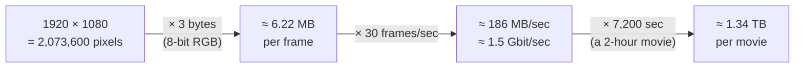
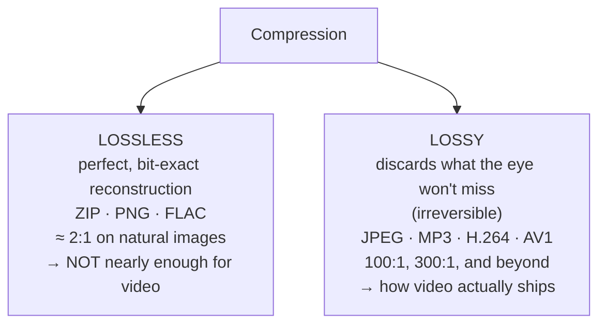
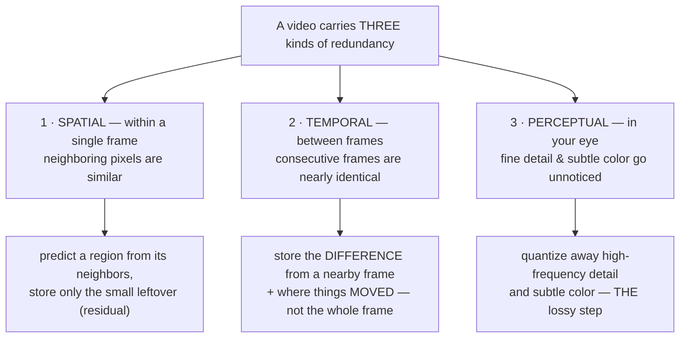
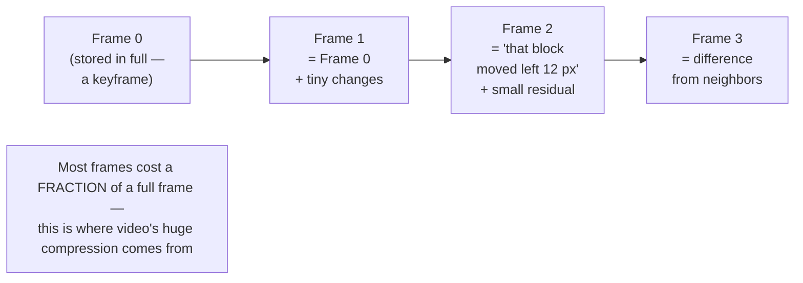
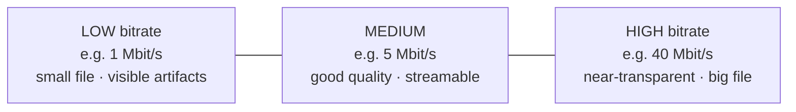

# Chapter 03 — Why We Compress

> **Part I · Foundations** — The arithmetic that makes raw video physically impossible to store or ship, the difference between lossless and lossy compression, and the three redundancies every codec exploits. The "why" behind all of Part II.

We now know what a video is (a timed flipbook of frames — [Chapter 01](01-what-is-video.md)) and how each frame's color is stored (Y′CbCr, subsampled, tagged — [Chapter 02](02-color-and-pixels.md)). This chapter answers the question that makes the rest of the course necessary: **why can't we just store the frames as-is?**

The answer is a single multiplication problem. Let's do it, watch the number become absurd, and then understand the three tricks that tame it. By the end you'll know *why* compression is mandatory and *what* a codec must exploit — which is exactly the runway for [Chapter 04](04-how-codecs-work.md), where we see *how*.

---

## The arithmetic of raw video

Let's compute, with real numbers, how much data a raw (uncompressed) video actually is. We'll use a perfectly ordinary clip: **1080p, 30 fps, 8-bit color.** No exotic 4K, no HDR. The kind of thing your phone shoots before breakfast.

Start with one frame, using the simple 8-bit RGB model from [Chapter 02](02-color-and-pixels.md) (3 bytes per pixel — one each for R, G, B):

```
   1920 × 1080 pixels   =  2,073,600 pixels per frame
   × 3 bytes/pixel       =  6,220,800 bytes per frame   ≈ 6.22 MB
```

**Six megabytes for a single still frame.** Now press play — 30 of those every second:

```
   6,220,800 bytes/frame × 30 frames/sec  =  186,624,000 bytes/sec
                                           ≈  186 MB per second
```

Convert to the bits-per-second that networks speak (× 8):

```
   186,624,000 bytes/sec × 8  =  1,492,992,000 bits/sec  ≈ 1.5 Gbit/sec
```



Sit with **1.5 gigabits per second.** That's the raw bitrate of an utterly mundane 1080p30 clip. Now stretch it to a feature film — 2 hours is 7,200 seconds:

```
   186,624,000 bytes/sec × 7,200 sec  =  1,343,692,800,000 bytes  ≈ 1.34 TB
```

**A two-hour movie, raw, is about 1.3 terabytes.** One movie would fill a typical laptop SSD twice over. You could not stream it (no home connection moves 1.5 Gbit/s), could not fit it on any disc, could not email it, could not afford to store a library of them. Raw video is, flatly, a non-starter — and that's the *easy* case.

> 🧠 **Mental model:** Uncompressed 1080p30 is ~1.5 Gbit/s and a 2-hour movie is ~1.3 TB. Hold those two numbers. Every codec, container, and streaming trick in this course exists to drag them down by two orders of magnitude or more.

### "But wait — didn't Chapter 02 already halve this?"

Sharp catch. [Chapter 02](02-color-and-pixels.md) showed that video stores **4:2:0 Y′CbCr** (1.5 bytes per pixel), not 3-byte RGB. So the *true* raw figure is half of what we just computed: ~93 MB/s, ~0.67 TB per movie. But notice what that means: **chroma subsampling — already a lossy 2:1 win the eye doesn't notice — barely dents the problem.** Half of "impossible" is still impossible. We used RGB above to make the arithmetic transparent; even after the free 4:2:0 halving, you need *vastly* more compression than subsampling alone provides. Hold that thought — it foreshadows that subsampling is just *one* of three redundancies, and a small one at that.

### It gets much worse: 4K and 8K

Resolution grows with the *square* of the dimensions ([Chapter 01](01-what-is-video.md)), so the raw bitrate explodes:

| Resolution | Pixels/frame | Raw bitrate (30 fps, RGB) | 2-hour raw size |
|------------|:------------:|:-------------------------:|:---------------:|
| 1080p (Full HD) | 2.07 M | ~1.5 Gbit/s | ~1.3 TB |
| 4K / 2160p (UHD) | 8.29 M | **~6 Gbit/s** (≈4×) | **~5.4 TB** |
| 8K / 4320p | 33.2 M | **~24 Gbit/s** (≈16×) | **~21 TB** |

And we haven't touched **higher frame rates** (60 fps doubles everything again) or **higher bit depth** (10-bit is 25% more, since each sample now takes more than a byte). A raw 8K60 10-bit stream is well over **60 Gbit/s** — faster than most data-center network links, for *one* video.

The conclusion is inescapable: **video must be compressed, and compressed hard, or it cannot exist as a product.** Not "should be." *Must.*

---

## What "compressed hard" means: the ratios in practice

So how hard do we actually squeeze? Let's compare the raw 1.5 Gbit/s of our 1080p30 clip against the bitrates real systems use:

| Delivery context | Typical 1080p bitrate | Compression vs raw (1.5 Gbit/s) |
|------------------|:---------------------:|:-------------------------------:|
| A streaming service (Netflix/YouTube HD) | ~5 Mbit/s | **~300 : 1** |
| A higher-quality web stream | ~8 Mbit/s | ~185 : 1 |
| Blu-ray disc (video) | up to ~40 Mbit/s | ~37 : 1 |
| Broadcast HDTV | ~10–15 Mbit/s | ~100–150 : 1 |

Look at the streaming row: a **5 Mbit/s** stream is roughly **300 times smaller** than the raw source, and it looks *good* — good enough that you watch it for hours without complaint. That 300:1 is the magic this course exists to explain.

Let's make the storage win concrete. Our 2-hour movie:

- **Raw:** ~1.34 TB.
- **At 5 Mbit/s:** `5,000,000 bits/s × 7,200 s = 36,000,000,000 bits = 4.5 GB`.

**1.34 TB → 4.5 GB.** The same two hours of video, ~300× smaller, now fits comfortably on a disc and streams over an ordinary home connection with room to spare. *That* is why your phone can hold thousands of videos and why Netflix can serve a planet.

Notice the spread in that table, too. Blu-ray spends ~8× more bits than a streaming service (~40 vs ~5 Mbit/s) for the same resolution — buying higher quality with a gentler compression ratio. There's a **dial** here: how aggressively you compress trades file size against picture quality. We'll name that dial (bitrate / CRF) at the end of the chapter, and devote [Chapter 06](06-encoders-and-rate-control.md) to it.

### Why we care so much: storage, bandwidth, and cost

Three real-world pressures make compression non-optional:

- **Storage.** A video platform holding millions of hours of content at raw rates would need *exabytes* — economically impossible. At 300:1 it's merely enormous-but-feasible.
- **Bandwidth.** No consumer connection carries 1.5 Gbit/s, let alone 6 Gbit/s for 4K. A 5 Mbit/s stream fits on essentially any modern broadband line and even a decent mobile connection. Compression is what lets video *travel*.
- **Cost.** Bandwidth and storage cost money at every hop — the platform's egress bills, the CDN, the viewer's data plan. Every bit you *don't* send is money saved, multiplied by billions of streams. This is why a streaming company will spend enormous engineering effort to shave 10% off a bitrate at equal quality: at scale, 10% is a fortune.

> 🛠️ **In rivet:** Shrinking the bitrate at a given quality is the whole job of the transcoder we build. When we transcode a big source MP4 down to an ABR ladder of AV1 renditions, we're trading a one-time compute cost (the encode) for a permanent, per-stream saving on storage and delivery — paid back every single time someone hits play. The more efficient the codec (AV1 over H.264, say), the bigger that recurring saving, which is a recurring theme in [Chapter 05](05-the-codec-zoo.md) and [Chapter 16](16-patents-and-royalties.md).

---

## Lossless vs. lossy: two fundamentally different deals

Before we see *how* compression works, we have to split it into two species, because they make completely different promises.

### Lossless compression

**Lossless** compression reduces size while preserving **every single bit** — decompress it and you get back the *exact* original, byte for byte. It works by finding and removing *statistical* redundancy: patterns, repetition, predictable structure. You already use it constantly:

- **ZIP / gzip** for files,
- **PNG** for images,
- **FLAC** for audio,
- lossless modes of some video codecs (FFV1, lossless H.264).

The catch: lossless compression of natural images and video only achieves about **2:1**, sometimes up to 3:1 on simple content. Why so modest? Because a photograph is *information-dense* — there's genuine detail in every region, and you can't discard any of it without changing the bits. A 2:1 ratio turns our 1.3 TB movie into ~650 GB. Still impossible to ship. **Lossless alone cannot solve the video problem.** It's not even close.

### Lossy compression

**Lossy** compression throws information *away* — permanently, irreversibly — choosing to discard precisely the parts a human won't notice are missing. The decompressed result is *not* bit-identical to the original; it's a perceptual near-twin. This is the key that unlocks 100:1, 300:1, and beyond:

- **JPEG** for images,
- **MP3 / AAC / Opus** for audio,
- **H.264 / HEVC / VP9 / AV1** for video.

The trade is quality for size, and it's a *tunable* trade — you choose how much to throw away. Throw away a little and the result is visually indistinguishable from the original (we call this "visually lossless," though it's mathematically lossy). Throw away a lot and you get the blocky, smeary look of a heavily-compressed clip. The art of a codec is throwing away the *right* information — the bits the eye misses — first.



> 🧠 **Mental model:** Lossless = "make it smaller, change nothing" (~2:1, not enough). Lossy = "make it *much* smaller by discarding what you won't miss" (100:1+, irreversible). Video is overwhelmingly **lossy** — and the genius is *which* information gets discarded.

So lossy compression is the deal we take. But "throw away what the eye won't miss" is a strategy, not a mechanism. *What* exactly is safe to throw away, and *where* does the redundancy hide? There are three answers, and together they are the blueprint for every video codec ever made.

---

## The three redundancies every codec exploits

A video is staggeringly redundant in three distinct ways. A codec is, at heart, three machines — one to attack each kind of redundancy. Understanding these three is understanding 90% of what a codec *is*; [Chapter 04](04-how-codecs-work.md) is essentially a detailed tour of the machinery that implements them.



### 1. Spatial redundancy — pixels near each other are alike

Look at any single frame. Smooth regions dominate: a patch of sky is nearly one blue, a wall is nearly one color, a face is gentle gradients. **Adjacent pixels are strongly correlated** — given one pixel, you can *predict* its neighbor with small error. So instead of storing every pixel's full value, a codec predicts each region from what's nearby and stores only the **residual** — the small difference between the prediction and reality. Smooth areas have tiny residuals (cheap to store); only edges and texture cost real bits.

This is **intra-frame** ("within a frame") compression, and it's exactly what **JPEG** does to a still image. It's the same idea behind chroma subsampling from [Chapter 02](02-color-and-pixels.md) — exploiting that nearby color samples are redundant. In [Chapter 04](04-how-codecs-work.md) this becomes **intra prediction** plus the **transform** (DCT) that concentrates a block's energy into a few numbers.

### 2. Temporal redundancy — frames barely change

This is the big one, the redundancy unique to *video* (as opposed to stills), and the reason video compresses far better than a pile of separate JPEGs. At 30 frames per second, **consecutive frames are almost identical.** In a talking-head shot, the background is frozen and only the lips and eyes move. In a slow pan, the whole frame just shifts a few pixels. Frame to frame, 95%+ of the picture is *unchanged*.

So why store each frame from scratch? A codec stores a frame as the **difference from a previous (or future) frame**, plus a description of **motion** — "this block of pixels is the same as that block over there, just moved 12 pixels left." That's **inter-frame** ("between frames") compression, built on **motion estimation**. It's why video gets its enormous ratios: most frames cost a tiny fraction of a full frame's data. [Chapter 04](04-how-codecs-work.md) develops this as **P-frames and B-frames**, **motion vectors**, and the **GOP** structure — and it's where the lion's share of the 300:1 actually comes from.



### 3. Perceptual redundancy — the eye misses things

The third redundancy lives not in the video but in **you**. As [Chapter 02](02-color-and-pixels.md) established, the human visual system has blind spots: it's far less sensitive to **fine, high-frequency detail** than to broad shapes, and far less sensitive to **subtle color** than to brightness. A codec leans into this hard — it represents each block in terms of frequency (smooth-to-detailed) components and then **quantizes** (coarsens, rounds off) the high-frequency and color components the eye won't miss, often to zero. Chroma subsampling was a crude version of this; the real thing, **quantization in the frequency domain**, is the *primary lossy step* in a codec and the main quality/size dial.

This is the machine that makes compression *lossy*. The first two redundancies (spatial, temporal) are largely about prediction and could in principle be lossless; **perceptual** redundancy is where the codec deliberately discards information, and it's the knob you turn when you ask for "smaller file, lower quality." [Chapter 04](04-how-codecs-work.md) covers the transform-and-quantize pipeline that implements it.

> 🔬 **Going deeper:** These three aren't independent stages bolted together — they interlock. Inter-frame prediction (temporal) produces a *residual* that is itself spatially compressed (transform + quantize), and the quantization is tuned perceptually. A real codec is a tight loop: predict (in space and time), transform the leftover, quantize it perceptually, and entropy-code the result losslessly. We'll assemble that exact loop in the next chapter. The point for now: every bit a codec saves traces back to one of these three sources of redundancy.

---

## Bitrate: the master quality-vs-size dial

We keep gesturing at "how hard you compress." Time to name it. The single most important number describing a compressed video is its **bitrate**: how many bits the stream spends per second of video, measured in **kbit/s** (kbps, thousands) or **Mbit/s** (Mbps, millions).

Bitrate *is* the quality-vs-size dial:

- **Higher bitrate** = more bits to describe each second = more detail preserved, fewer discarded = **better quality, bigger file.**
- **Lower bitrate** = fewer bits per second = more aggressively quantized, more thrown away = **smaller file, lower quality** (eventually visible blocking, blurring, banding).

Everything else equal, bitrate and file size are directly proportional (`size ≈ bitrate × duration`, the very calculation we did above: 5 Mbit/s × 7200 s = 4.5 GB). And bitrate is what the table of "300:1 vs 37:1" was really measuring — a 5 Mbit/s stream and a 40 Mbit/s Blu-ray of the same content differ precisely in how many bits per second they're willing to spend.



### The wrinkle: not every second needs the same bits

Here's the subtlety that makes bitrate *interesting* and sets up a whole later chapter. **Different content needs different amounts of data to look equally good.** A static talking head against a plain wall is *easy* — little spatial detail, almost no motion (temporal redundancy is huge), so a few hundred kbit/s look perfect. A confetti explosion, rippling water, or a fast camera whip through a crowd is *hard* — tons of high-frequency detail and motion everywhere (little temporal redundancy), so it needs many megabits per second to avoid falling apart.

This means a **constant** bitrate is a blunt instrument:

- **CBR (Constant Bitrate)** holds the bitrate fixed second to second. Simple and predictable for broadcast and bandwidth-limited channels — but it *over-spends* bits on easy scenes (wasting them) and *starves* hard scenes (which then look bad). You get inconsistent quality.
- The smarter approaches let the bitrate **vary** — spend more on the explosion, less on the talking head — to hold *quality* roughly constant instead of *bitrate*. That's **VBR** (Variable Bitrate) and especially **constant-quality** modes like **CRF**, which we'll meet properly in [Chapter 06](06-encoders-and-rate-control.md).

The mental shift: you can ask a codec for "this many bits per second" (rate-targeted) *or* "this much quality, spend whatever bits that takes" (quality-targeted). Most modern transcoding for storage uses the latter, because what you actually care about is how it *looks*, not a fixed file size.

> 🛠️ **In rivet:** The **CRF** ("Constant Rate Factor") knob we expose is exactly this quality-vs-size tradeoff, made into a single number. A lower CRF means "preserve more, spend more bits" (bigger, better); a higher CRF means "discard more, spend fewer bits" (smaller, lower quality). It's a *constant-quality* target: we let the bitrate float up on the hard scenes and down on the easy ones so the *perceived* quality stays even, rather than nailing a fixed bitrate and letting quality lurch around. Picking the right CRF per rung of an ABR ladder is precisely the storage-vs-quality decision this whole chapter is about — and the mechanics of how the encoder honors it are [Chapter 06](06-encoders-and-rate-control.md).

---

## Where this leaves us

We've proven the thesis of Part I's finale: **raw video is impossible to ship** (~1.5 Gbit/s for plain 1080p30, ~1.3 TB per movie, and quadratically worse for 4K/8K), **lossless compression isn't nearly enough** (~2:1), so video relies on **lossy** compression to reach the **300:1** ratios that make streaming and storage feasible. And we've identified *what* a codec exploits to get there — **spatial**, **temporal**, and **perceptual** redundancy — with **bitrate** as the dial controlling how much it keeps versus discards.

What we *haven't* seen is the actual machinery. How does a codec predict a block from its neighbors? How does it find that "this block moved 12 pixels left"? What is this "transform" that sorts a block into frequencies, and how does quantization throw the high ones away? How do I-, P-, and B-frames fit together into a stream a decoder can replay exactly? That machinery — the engine room where 300:1 is actually manufactured — is **[Chapter 04 — How Video Compression Works](04-how-codecs-work.md)**, the start of Part II and the heart of the course.

---

## Recap

- **Raw video is impossible to ship.** Plain 1080p30 8-bit is **~1.5 Gbit/s**; a 2-hour movie is **~1.3 TB**. 4K is ~4× that, 8K ~16×. Even the "free" 4:2:0 halving from [Chapter 02](02-color-and-pixels.md) leaves it hopeless.
- Real delivery runs at **~5 Mbit/s for 1080p — roughly 300:1 compression** — turning that 1.3 TB movie into ~4.5 GB. Blu-ray spends more (~40 Mbit/s, ~37:1) for higher quality; the ratio is a deliberate **dial**.
- Compression splits into **lossless** (perfect, bit-exact, but only ~2:1 on natural images — not enough) and **lossy** (irreversible, discards what the eye won't miss, reaches 100:1+ — how video actually ships).
- Codecs exploit **three redundancies**: **spatial** (neighboring pixels are alike → predict + store the residual), **temporal** (consecutive frames barely change → store differences + motion; the biggest win, unique to video), and **perceptual** (the eye misses fine detail & subtle color → quantize them away; the lossy step).
- **Bitrate** (kbps/Mbps) is the master **quality-vs-size** dial: more bits = better and bigger. Because scene complexity varies, **constant bitrate (CBR)** wastes/starves bits, so **variable / constant-quality (VBR, CRF)** modes spend bits where they matter — a teaser for [Chapter 06](06-encoders-and-rate-control.md).
- Next we open the engine and see *how* a codec turns those three redundancies into 300:1.

**Next:** [Chapter 04 — How Video Compression Works](04-how-codecs-work.md)
