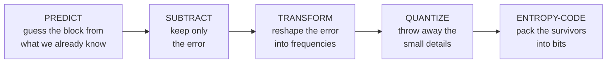
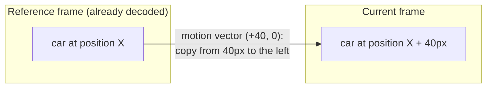
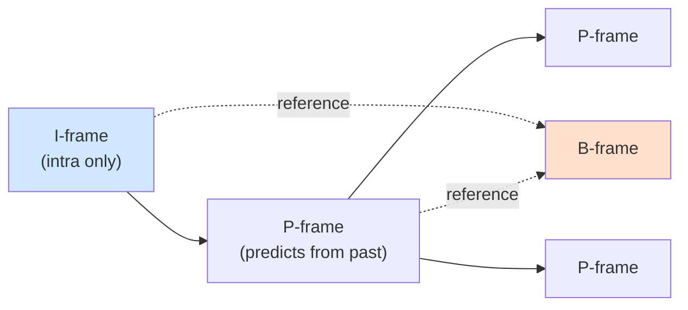
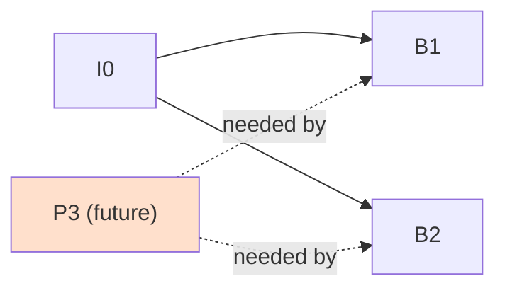
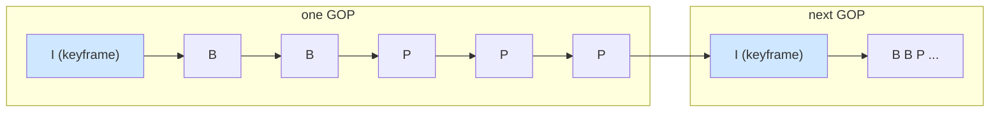
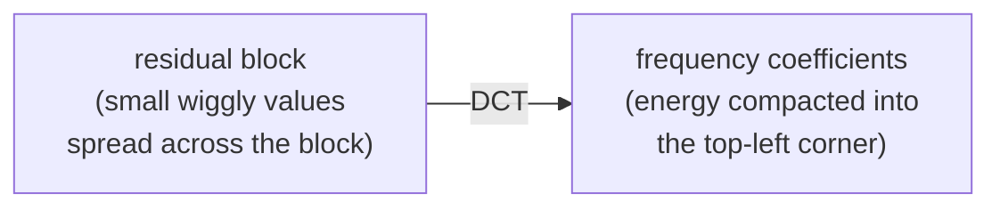
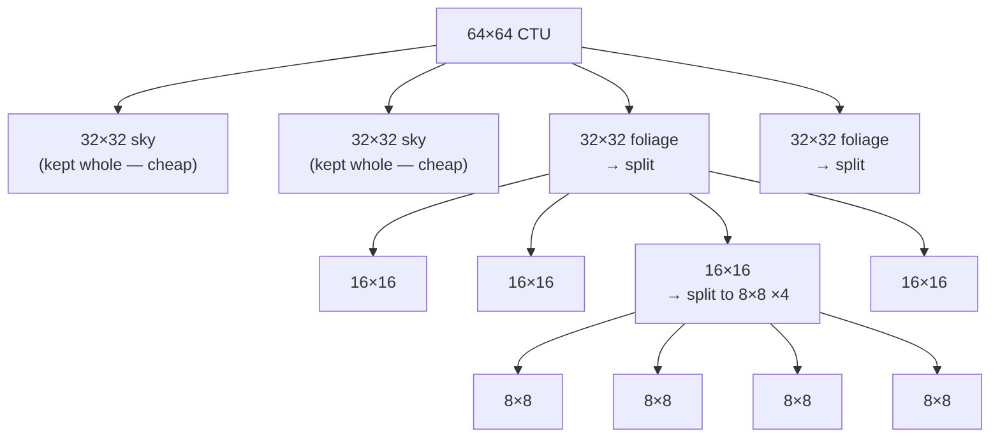

# Chapter 04 — How Video Compression Works

> **Part II · Codecs** — What actually happens inside a video codec? This chapter builds the universal mental model — predict, subtract, transform, quantize, entropy-code — that every modern codec from H.264 to AV1 shares.

In [Chapter 03](03-why-compression.md) we saw *why* raw video is impossibly large and *why* it's so compressible (it's full of redundancy). This chapter is the keystone: it explains the machine that exploits that redundancy. By the end you'll understand the canonical encode loop, the difference between intra and inter prediction, why B-frames force decode order to diverge from display order, what a transform and quantization step actually compute, and — most importantly — why **decoding is exact and boring while encoding is a search over an astronomical space of choices.** That last asymmetry is the single most important idea in the entire field.

---

## What "codec" means

**Codec** = **CO**der + **DE**coder. It is a *pair* of algorithms joined by a contract:

- The **encoder** takes pixels and produces a compressed **bitstream** — a sequence of bits.
- The **decoder** takes that bitstream and reconstructs pixels.

The contract between them is a **standard** — a document like *ITU-T H.264* or the *AV1 Bitstream Specification* — that defines, bit by bit, exactly what a conformant bitstream looks like and exactly how a decoder must turn it back into pixels.

Here is the subtle, crucial part that trips up almost everyone new to video:

> 🧠 **Mental model:** A codec standard specifies the **decoder**, not the encoder. It says "if you see *these* bits, you *must* produce *these* pixels." It says almost nothing about *how to choose* the bits in the first place. The encoder is free to be lazy or brilliant, fast or slow, as long as the bits it emits are legal. This is why "H.264" is not one thing: x264, NVENC, and a phone's hardware encoder all emit legal H.264, but at the same bitrate they look wildly different.

We'll return to this asymmetry again and again. First, the pipeline.

---

## The canonical encode loop

Every block-based video codec — MPEG-2, H.264, HEVC, VP9, AV1 — runs the same five-stage assembly line on each chunk of the picture. Memorize this sequence; it is the spine of the whole field:



And decoding is **exactly this pipeline run backwards**:


Let's name the stages precisely, then spend the rest of the chapter unpacking each one.

| Stage | Encoder does | Decoder does | Lossy? |
|-------|--------------|--------------|:------:|
| **Predict** | Guess the block from already-known pixels | Make the same guess | No |
| **Subtract / Add** | Residual = original − prediction | Block = prediction + residual | No |
| **Transform** | Convert residual to frequency coefficients (DCT/DST) | Inverse transform | No* |
| **Quantize** | Divide coefficients by a step, round | Multiply back by the step | **YES** |
| **Entropy code** | Pack symbols losslessly (CABAC, etc.) | Unpack them | No |

\*The transform is mathematically lossless in theory; in practice integer transforms introduce tiny, bounded rounding that both sides agree on, so it stays exact. **Quantization is the one and only intentionally lossy step.** Everything that makes video "lossy" — every artifact, every quality-vs-size tradeoff — comes from that single box.

> 🧠 **Mental model:** Think of compression as *describing a picture to someone who can already make a very good guess.* You don't send the whole picture; you send the **guess instructions** ("copy that block from the last frame, shifted three pixels left") plus the **small corrections** ("...and the top-right got a touch brighter"). Prediction makes the guess. The residual is the correction. The transform + quantize step decides how cheaply to send the correction. Entropy coding is the final, free squeeze.

---

## Prediction, the heart of it all

Compression lives or dies on prediction. The better the encoder can *predict* a block of pixels from information the decoder already has, the smaller the leftover error — and the fewer bits to send. There are two great families of prediction, corresponding to the two kinds of redundancy from Chapter 03.

### Intra prediction (spatial — within one frame)

**Intra prediction** predicts a block from its *already-decoded neighbors in the same frame* — the pixels directly above and to the left. It exploits **spatial redundancy**: real images are locally smooth. A patch of blue sky is surrounded by more blue sky; the edge of a table continues in a straight line.

Because the decoder processes blocks in raster order (left-to-right, top-to-bottom), by the time it reaches a block it has *already reconstructed* the row above and the column to the left. The current 4×4 block (the `?` cells) is predicted from those known border pixels — the top row `T` and left column `L`:

| | col 0 | col 1 | col 2 | col 3 |
|---|:---:|:---:|:---:|:---:|
| **top (known)** | T | T | T | T |
| **row 0** | L | ? | ? | ? |
| **row 1** | L | ? | ? | ? |
| **row 2** | L | ? | ? | ? |
| **row 3** | L | ? | ? | ? |

The encoder fills the `?` cells using one of several **modes**:

- **DC mode** — fill the whole block with a single value: the average of the neighboring border pixels. Great for flat regions.
- **Directional / angular modes** — copy the border pixels *along a chosen angle*. H.264 has 8 directional intra modes for a 4×4 block; HEVC has 33; AV1 has 56 fine-grained angles plus smooth and recursive modes. If there's a diagonal edge running at 45°, a 45° directional mode extends it perfectly into the block.
- **Planar / smooth mode** — fit a gentle gradient across the block from the top and left borders. Ideal for slow shading, like a sky fading from light to dark.

The encoder tries the candidate modes, sees which one yields the smallest residual (for the fewest bits), and writes just the **mode number** into the bitstream. The decoder reads the mode and regenerates the identical prediction. A flat 16×16 block can sometimes be coded in a handful of bits: "DC mode, residual ≈ 0."

A frame coded **entirely** with intra prediction (no reference to other frames) is an **I-frame** — more on frame types shortly. It's self-contained: you can decode it knowing nothing about any other frame.

### Inter prediction (temporal — across frames)

**Inter prediction** predicts a block from a *different, already-decoded frame* — a **reference frame**. It exploits **temporal redundancy**: consecutive frames are nearly identical, differing mostly where things moved.

The key object is the **motion vector (MV)**: a 2-D offset `(dx, dy)` that says *"the content of this block looks like a block in the reference frame, shifted by `dx` horizontally and `dy` vertically."* Instead of re-sending the pixels, the encoder sends the motion vector and lets the decoder *copy* from the reference.



This splits into two very differently-priced operations:

- **Motion estimation** (encoder only, *expensive*): the encoder must *search* the reference frame to **find** the best-matching block. Where did this block come from? It tries many candidate offsets — sometimes hundreds — comparing each against the current block, hunting for the smallest difference. This search is one of the most compute-heavy parts of encoding; it's why encoding is so much slower than decoding, and why "encoder speed presets" mostly trade search effort for time.
- **Motion compensation** (decoder, *cheap*): the decoder doesn't search for anything. It reads the vector and simply **applies** it — copy the referenced block, done. A handful of additions per pixel.

> 🧠 **Mental model:** Motion estimation is like a detective combing security footage to find where a person was a moment ago — slow, exhaustive. Motion compensation is reading the detective's one-line note ("they were three feet to the left") and acting on it instantly. The encoder pays the detective's bill so the decoder never has to.

Two refinements that matter enormously in practice:

- **Sub-pixel motion.** Objects don't move in whole-pixel steps. Codecs allow motion vectors at **half-pel** and **quarter-pel** (and AV1, **eighth-pel**) precision. To copy from a fractional position, the decoder **interpolates** between pixels with a small filter (e.g. a 6- or 8-tap filter). Sub-pixel motion dramatically improves matches for smooth, real-world motion — a vector of `(+12.25, −3.75)` is common.
- **Multiple reference frames.** A block isn't limited to predicting from the immediately previous frame. H.264 and later let a block choose among *several* stored reference frames (e.g. the last 4 decoded frames). This helps with things that get briefly occluded — a face passes behind a pole and reappears; the encoder can reach back to the frame *before* the pole.

The leftover after inter prediction — the part the motion vector *couldn't* explain (lighting changes, new detail, imperfect matches) — is again a **residual**, handled by the transform/quantize stages exactly like the intra residual.

---

## Frame types: I, P, and B

Because prediction can reach within a frame (intra) or across frames (inter), pictures come in types defined by *what they're allowed to predict from.*



### I-frame (Intra) — the entry point

An **I-frame** uses only intra prediction. It depends on *no other frame*, so it can be decoded standalone. That independence makes it the **entry point**: every place you can start decoding (the beginning, a seek target, a channel change, the start of a streaming segment) must be at an I-frame. The price of that independence is size — an I-frame is much larger than a P or B frame because it can't borrow from temporal redundancy. A special, stricter kind called an **IDR** ("Instantaneous Decoder Refresh") frame additionally forbids any *later* frame from referencing anything *before* it — a hard reset. We'll see why that matters under "GOP" below.

### P-frame (Predicted) — looks to the past

A **P-frame** may use intra prediction *and* inter prediction from **previously decoded** frames (the past, in display order). Each block independently chooses: "intra-code me" or "copy from reference frame *k* with vector *v*." P-frames are far smaller than I-frames because most blocks find a good temporal match.

### B-frame (Bi-predictive) — looks both ways

A **B-frame** may predict from frames in **both the past and the future** (in display order), even *averaging* a past prediction and a future prediction together for a block. Bidirectional prediction is remarkably powerful: an object appearing mid-scene can be predicted from where it *ends up*; smooth motion can be interpolated from both sides, halving error. B-frames are typically the smallest of all.

But "predict from the future" has a startling consequence:

> 🧠 **Mental model:** To decode a B-frame that references a future frame, the decoder must *already have decoded that future frame*. So the decoder has to receive the future reference **before** the B-frame that needs it — which means **the order frames are decoded is not the order they're displayed.**

### Decode order ≠ display order

Consider a stream where two `B` frames sit between an `I`/`P` pair. In **display** order they appear `I0 B1 B2 P3` — but `B1` and `B2` both reference `P3`, the frame *after* them:



Since `B1` and `B2` need `P3`, the decoder must decode `P3` *first*. So the two orders diverge:

- **Display order:** `I0 → B1 → B2 → P3 → B4 → B5 → P6`
- **Decode order:** `I0 → P3 → B1 → B2 → P6 → B4 → B5`

The decoder reorders them back to display order before showing them. This is precisely why a video stream needs **two timestamps** per frame: a **DTS** (Decode Time Stamp — when to feed it to the decoder) and a **PTS** (Presentation Time Stamp — when to actually show it). For frames with no reordering they're equal; with B-frames they diverge. (We'll dig into PTS/DTS, timescales, and how containers carry them in [Chapter 09](09-containers-and-muxing.md).)

### Reference vs non-reference frames

Orthogonal to I/P/B is whether a frame is a **reference** — i.e., whether *other* frames are allowed to predict from it. Classic B-frames are often **non-reference** (disposable): you can drop them entirely and everything else still decodes. Modern codecs also allow **reference B-frames** and **hierarchical B** structures (B-frames referencing other B-frames in a pyramid), which buy extra efficiency and enable **temporal scalability** — drop the top pyramid layer to halve the frame rate without breaking the stream. That trick underlies a lot of low-latency and adaptive streaming.

---

## The GOP: structuring a stream

A **GOP** (**Group Of Pictures**) is the repeating pattern of frame types between one I-frame and the next. The leading I-frame (specifically an IDR) is the **keyframe** — the only place decoding can begin. **GOP length** is how many frames pass between keyframes.



### Closed vs open GOP

- A **closed GOP** is fully self-contained: no frame inside it references a frame in any *other* GOP. You can cut the stream cleanly at every GOP boundary. This requires the boundary I-frame to be an IDR.
- An **open GOP** allows the B-frames right after an I-frame to reference the *previous* GOP's frames (reaching back across the boundary). Slightly more efficient, but you can't splice or seek to that I-frame as cleanly. Streaming systems generally insist on **closed GOPs** so every segment is independently decodable.

### The GOP-length tradeoff

How often should you place a keyframe? It's a genuine tension:

| Shorter GOP (keyframes often) | Longer GOP (keyframes rare) |
|-------------------------------|-----------------------------|
| ✅ Fast seeking (a keyframe is never far away) | ❌ Seeking jumps to a distant keyframe, then decodes forward |
| ✅ Clean splice / segment boundaries for streaming | ❌ Harder to segment for adaptive streaming |
| ✅ Quick error recovery if a frame is lost | ❌ One lost frame can corrupt many that follow |
| ❌ **Bigger files** — I-frames are expensive, more of them = more bits | ✅ **Smaller files** — fewer costly I-frames, more cheap P/B |

Streaming typically lands on a keyframe every **1–4 seconds** (e.g. every 48 frames at 24 fps) — short enough to seek and segment, long enough to stay efficient. We'll see in [Chapter 11](11-adaptive-bitrate-streaming.md) why **keyframe alignment across renditions** is non-negotiable for adaptive streaming: if a viewer switches from the 720p to the 1080p stream, the switch can only happen at a shared keyframe boundary.

> 🛠️ **In rivet, our transcoder:** We expose GOP length as a per-rung knob (the keyframe interval inside each rung's `Quality`). For our CMAF/HLS output mode we keep every rendition's keyframes aligned to segment boundaries, so a player can switch rungs cleanly — the whole point of an ABR ladder. Each chunk in our multi-GPU encode also begins with an IDR, which is exactly why we can stitch independently-encoded chunks back into one playable file (see [Chapter 13](13-the-transcoding-pipeline.md)).

---

## The residual: what prediction got wrong

After prediction — intra or inter — the encoder computes the **residual**:

```
  residual = original_block − predicted_block       (pixel by pixel)
```

If prediction were perfect, the residual would be all zeros and we'd send nothing but the prediction instructions. In reality it's a block of small numbers — mostly near zero, with a few larger values where the guess missed (a sharp edge the motion vector didn't quite line up, a glint of new highlight). The residual is *the actual visual information left to transmit*, and it's the input to the next two stages. Crucially, residuals tend to be **small and low-energy** — which is exactly what makes the transform so effective.

> 🔬 **Going deeper:** Encoders reconstruct the *same* prediction the decoder will, by predicting from **already-quantized, already-reconstructed** neighbors — not from the pristine originals. This is called the **reconstruction loop** or **prediction loop**: the encoder contains a miniature decoder inside it so that encoder and decoder stay in lockstep. If the encoder predicted from clean originals while the decoder predicted from lossy reconstructions, their guesses would drift apart and errors would accumulate frame after frame ("drift"). Keeping a decoder inside the encoder prevents drift. It's why the encode-loop diagram at the end of this chapter has a feedback path.

---

## The transform: energy compaction

Now we have a small block of residual values. We *could* send them directly, but there's a much cheaper representation. Enter the **transform**.

A transform — almost always a **DCT** (Discrete Cosine Transform), sometimes a **DST** (Discrete Sine Transform) for small intra blocks, and in AV1 a menu of transforms — converts a block of pixel-domain values into a block of **frequency-domain coefficients**. Instead of "the value at each position," you get "how much of each *spatial frequency pattern* is present."



The output coefficients of an 8×8 DCT lay out by frequency — the lowest frequency (the **DC coefficient**, the block's average) in the top-left, the highest frequency in the bottom-right. For natural content the energy piles up in the top-left and the rest is near-zero:

| | freq 0 (low) | freq 1 | freq 2 | freq 3 (high) |
|---|:---:|:---:|:---:|:---:|
| **low** | **DC = big** | small | · | ~0 |
| | small | · | ~0 | ~0 |
| | · | ~0 | ~0 | ~0 |
| **high** | ~0 | ~0 | ~0 | ~0 |

The magic is **energy compaction**: for natural image content, the DCT concentrates almost all the signal's energy into a *few* low-frequency coefficients in the top-left corner — especially the **DC coefficient**, which is just the block's average value. The high-frequency coefficients (bottom-right), representing fine, rapid detail, are usually tiny or zero. The transform doesn't *delete* anything (it's reversible), but it **reshapes** the data so the important parts cluster together and the negligible parts become near-zero.

> 🔬 **Going deeper:** Why a *cosine* transform? Because it's an excellent, computationally cheap approximation of the statistically optimal transform (the Karhunen–Loève transform) for the kind of correlated signals natural images produce — and it has fast O(n log n) algorithms. The DCT essentially asks: "Express this block as a weighted sum of standard ripple patterns, from flat (DC) to fastest-checkerboard." Real residuals are dominated by the flat and gentle patterns, so most weights come out near zero. Older codecs used a fixed 8×8 DCT; modern codecs (HEVC, AV1) use **multiple transform sizes** (4×4 up to 32×32 or 64×64) and even **multiple transform *types*** chosen per block, because matching the transform to the local content compacts energy even better.

So far, **nothing has been thrown away.** Inverse-DCT the coefficients and you get the residual back exactly. The discarding happens next.

---

## Quantization: THE lossy step

**Quantization** is where video becomes *lossy*, where bits are actually saved, and where the entire quality-vs-size dial lives. It is conceptually trivial and practically everything.

For each transform coefficient, you **divide by a step size and round to the nearest integer**:

```
  quantized      = round( coefficient / Qstep )

  …and on decode:

  reconstructed  = quantized × Qstep      (you get back a multiple of Qstep,
                                           NOT the original value)
```

Rounding throws information away — irreversibly. A coefficient of `103` with `Qstep = 16` becomes `round(103/16) = 6`, and on decode `6 × 16 = 96`. You've lost the difference (`103 → 96`). Do this to every coefficient and you've blurred away the exact values in exchange for *small numbers that are cheap to store*.

Here's why it's such a powerful lever. The high-frequency coefficients are already tiny. Divide them by a meaty step and round, and **they collapse to zero**:

| High-freq coefficient | 3 | 1 | −2 | 0 | 1 |
|---|:---:|:---:|:---:|:---:|:---:|
| **÷ Qstep (16), rounded** | 0 | 0 | 0 | 0 | 0 |

A block that was a spread of numbers becomes *a few non-zero low-frequency coefficients followed by a long run of zeros.* Those runs of zeros compress to almost nothing in the next stage. **This is the mechanism by which most of the bits are saved.** You are quite literally deciding *how much fine detail to discard*, and the human eye barely misses high-frequency detail in busy regions — exactly the psychovisual lever Chapter 03 promised.

### QP — the master dial

In practice the step size is controlled by a single integer, the **quantization parameter (QP)** (sometimes surfaced to users as **CRF**, a closely related quality index). Higher QP → bigger step → more coefficients zeroed → **smaller file, lower quality.** Lower QP → smaller step → more detail kept → **bigger file, higher quality.**

- **Low QP** (e.g. 18): near-transparent quality, large files. Few coefficients zeroed.
- **High QP** (e.g. 40): visibly degraded, tiny files. Aggressive zeroing.

> 🧠 **Mental model:** QP is the *single most important number* in all of video encoding. If you remember one knob, remember this one. Almost everything an encoder's rate control does (Chapter 06) boils down to *choosing QP per frame, per region, even per block* to hit a target size or quality. Bitrate is the *outcome*; QP is the *cause*.

### Where artifacts come from

Quantization is also the source of the visual artifacts you've seen on bad streams:

- **Blocking** — because quantization happens per block, neighboring blocks get reconstructed slightly differently, and the block edges become visible as a grid. Worse at high QP.
- **Ringing / mosquito noise** — zeroing high-frequency coefficients near a sharp edge (a caption, a branch against sky) leaves the edge unable to be represented crisply, producing shimmering halos. This is the frequency-domain analog of [the Gibbs phenomenon](../GLOSSARY.md).
- **Banding** — over-quantizing smooth gradients (a sunset sky) collapses subtle shade differences into visible steps.

Codecs fight these with **in-loop filters** (next section) and encoders fight them with smart QP allocation, but the root cause is always: *quantization discarded the information needed to represent that detail.*

---

## Entropy coding: the free, lossless squeeze

After quantization we have a block of mostly-zero integers (plus prediction modes, motion vectors, and other side info). The final stage, **entropy coding**, packs all these symbols into as few bits as possible — **losslessly**. No quality is lost here; this stage just refuses to waste bits.

The principle is **Shannon's source coding**: assign *short* codes to *frequent* symbols and *long* codes to *rare* ones. Since most quantized coefficients are zero (a very frequent symbol), and runs of zeros are common, entropy coders represent them in a tiny number of bits. Two families dominate:

- **VLC / CAVLC** (*Context-Adaptive Variable-Length Coding*, H.264 Baseline) and run-length schemes assign integer-bit-length codes to symbols — simple, fast, decent.
- **Arithmetic / range coding** — **CABAC** (*Context-Adaptive Binary Arithmetic Coding*, H.264 Main/High & HEVC) and the **range coders** in VP9/AV1 — encode an entire sequence of symbols into a *single fractional number*, escaping the "whole bits per symbol" limit. A symbol with 90% probability can cost a *fraction* of a bit. They're **context-adaptive**: they continuously update their probability estimates based on recently-seen symbols, so they squeeze harder as they learn the stream's statistics.

The tradeoff is the usual one:

> 🔬 **Going deeper:** **CABAC compresses ~10–15% better than CAVLC but is significantly slower**, because arithmetic coding is inherently serial — each bit's decoding depends on the running state from the previous bit, so it's hard to parallelize. That serial dependency is a real headache for hardware decoders at 4K/8K, and it's why standards add tricks (HEVC's *tiles* and *wavefront parallel processing*, AV1's *tiles*) to break a frame into independently-entropy-coded regions that can be decoded in parallel. The pattern recurs throughout codec design: every bit you save costs compute somewhere, and parallelism must be deliberately engineered back in.

The output of entropy coding *is* the compressed bitstream — the bytes that get wrapped in NAL units ([Chapter 07](07-bitstreams-and-nal-units.md)) and packed into a container ([Chapter 09](09-containers-and-muxing.md)).

---

## Block structures: how the picture is carved up

We've been saying "block," but how big is a block, and how does the encoder decide? This is one of the biggest sources of efficiency gains across codec generations.

Codecs partition each frame into a grid of large units, then **recursively subdivide** each unit into smaller blocks where the content demands it:

| Codec | Top-level unit | Max size | Partitioning |
|-------|----------------|:--------:|--------------|
| **H.264 / AVC** | Macroblock | 16×16 | Down to 4×4 sub-blocks |
| **HEVC / H.265** | CTU (Coding Tree Unit) | 64×64 | Quadtree → down to 8×8 |
| **VP9** | Superblock | 64×64 | Quad + some rectangular |
| **AV1** | Superblock | 128×128 | Quad **+ binary + ternary** (T-split) trees |

The mechanism is a **recursive tree**. Start with the big unit; if the content within it is uniform (flat sky), keep it whole — one prediction, one transform, cheap. If it straddles a complex boundary (the edge of a building against sky), **split** it into quadrants and ask the same question of each. Repeat until each leaf block is small enough to predict well. Here is a 64×64 HEVC CTU over a region that's half flat sky, half busy foliage:



### Why bigger and more flexible blocks help

As resolution climbs from 1080p to 4K to 8K, a single object covers *more pixels.* A patch of flat wall that was 16×16 at 1080p is 64×64 at 4K. With H.264's 16×16 macroblocks you'd spend overhead coding 16 separate blocks (16 sets of headers, modes, motion vectors) for one uniform region. HEVC's 64×64 CTU and AV1's 128×128 superblock can cover it with **one** prediction and a fraction of the overhead. That's a major reason newer codecs win so decisively at high resolution. The flexible split shapes (AV1's binary and ternary splits) let the partition follow real object boundaries far more tightly than a rigid quadtree, squeezing out still more redundancy.

> 🔬 **Going deeper:** Choosing the partition is itself a *search* — the encoder must evaluate many possible tree splittings and pick the one with the best **rate-distortion** tradeoff (Chapter 06). For a 128×128 AV1 superblock the number of legal partitionings is astronomical. Encoders use heuristics and early-termination to avoid exhaustively trying all of them. This is a large slice of where encode time goes, and a large slice of where a *better* encoder beats a worse one at the same bitrate.

---

## In-loop filters: cleaning up after quantization

Quantization leaves artifacts — especially blocking at the seams between blocks. Modern codecs apply **in-loop filters**: post-processing applied to the reconstructed frame *inside the decode loop*, so that the filtered frame is what gets stored and used as a reference for future frames (hence "in-loop," as opposed to a cosmetic filter applied only to the display output).

- **Deblocking filter** (H.264 onward) — smooths the discontinuities at block boundaries, the single biggest cosmetic win. It detects whether an edge is a *real* image edge (leave it) or a *quantization-induced* block seam (smooth it).
- **SAO — Sample Adaptive Offset** (HEVC) — adds small, signaled corrective offsets to classes of pixels to claw back banding and ringing.
- **CDEF — Constrained Directional Enhancement Filter** (AV1) — a direction-aware deringing filter that follows edges to suppress ringing without blurring genuine detail. AV1 also has a **loop restoration** filter (Wiener / self-guided) for an extra denoise/sharpen pass.

> 🧠 **Mental model:** In-loop filters are the codec's *cleanup crew*, sweeping up the mess quantization makes — and crucially, they clean the **reference** frames too, so the mess doesn't propagate and compound across an entire GOP. Because both encoder and decoder run the identical filter inside the same loop, they stay in perfect agreement. A frame that *looks* better as a reference yields *better predictions* for the next frame, so in-loop filtering improves compression, not just appearance.

---

## The asymmetry, revisited: why two encoders differ

Now we can state the field's defining truth precisely.

**Decoding is deterministic.** Given a legal bitstream, every conformant decoder — software, your phone's chip, a $40,000 broadcast box — reconstructs the **bit-identical** pixels. The standard mandates it. There is exactly one right answer, and decoding is the (fast, cheap) act of computing it. A decoder makes *no creative choices*; it just executes.

**Encoding is a search.** At every block the encoder faces a forest of decisions:

- Intra or inter? Which of 35 (or 56) intra modes?
- Which reference frame(s)? What motion vector — and how hard do I search for it (full pixel? quarter-pel? eighth-pel)?
- How to partition this superblock — keep it whole or split, and how?
- Which transform size and type?
- What QP — and should I spend more bits here (a face) and fewer there (out-of-focus background)?
- Should this be a B-frame, and reference what?

Each combination yields a different (size, quality) pair. The space of combinations for even a single frame is **astronomically large** — far too big to search exhaustively. So an encoder is fundamentally a **heuristic search** that tries to find a good point on the **rate-distortion curve** (lowest distortion for a given bit budget) within a time budget. A *fast* preset searches a little and accepts a worse choice; a *slow* preset searches harder and finds a better one. Two encoders, both emitting perfectly legal bits, will land on different decisions — and therefore different quality at the same bitrate.

> 🧠 **Mental model:** A bitstream is like a **recipe** and a decoder is a cook who follows it exactly — every cook produces the identical dish. The *encoder* is the chef *inventing* the recipe, choosing among billions of possible recipes for the one that tastes best within the page budget. The standard guarantees the cooks agree; it says nothing about how clever the chef is. **This is why "which encoder" matters as much as "which codec," and it's the entire subject of [Chapter 06](06-encoders-and-rate-control.md).**

---

## The full loop, annotated

Here is the complete encode→decode picture, including the **reconstruction loop** inside the encoder that keeps it in lockstep with the decoder. Read the encoder path left-to-right; note the feedback path that rebuilds the reference frame so the encoder predicts from the *same* lossy pixels the decoder will.

```mermaid
flowchart TB
    subgraph ENC["ENCODER"]
        direction LR
        inp["input block"] --> sub["subtract"]
        pred["PREDICT<br/>intra / inter<br/>(motion estimation<br/>searches here)"] --> sub
        sub -- residual --> dct["DCT"]
        dct -- coeffs --> q["quantize (QP)"]
        q --> ent["entropy code"]
        q -- "reconstruction loop" --> iq["de-quantize<br/>+ inverse-DCT"]
        iq --> add1["add prediction"]
        add1 --> filt["in-loop filter<br/>deblock / SAO / CDEF"]
        filt -- "reconstructed reference" --> pred
    end
    ent -- "bitstream (bits on the wire / disk)" --> DEC
    subgraph DEC["DECODER"]
        direction LR
        ent2["entropy decode"] --> dq2["de-quantize<br/>+ inverse-DCT"]
        dq2 -- residual --> add2["add prediction"]
        pred2["PREDICT<br/>apply MV / intra mode"] --> add2
        add2 --> filt2["in-loop filter"]
        filt2 --> out["pixels out"]
        filt2 -- reference --> pred2
    end
```



Trace one block through it: the encoder predicts, subtracts to get the residual, transforms it to coefficients, **quantizes** (the lossy squeeze), and entropy-codes the result onto the wire. It *also* runs the bottom half on itself — de-quantize, inverse-transform, add back the prediction, in-loop-filter — to build the exact reconstructed frame the decoder will see, so its next predictions are based on the same (slightly lossy) pixels the decoder has. The decoder simply runs that bottom half: entropy-decode → de-quantize → inverse-transform → add prediction → filter → pixels. Same answer, every time.

> 🛠️ **In rivet, our transcoder:** A transcode is *decode then re-encode.* Our pipeline runs `decode → (optional scale / tonemap) → encode`. A hardware decoder — NVDEC on NVIDIA, QSV on Intel, AMF on AMD, or FFmpeg — reverses some *source* codec's loop back to raw frames; an optional filter stage rescales or tonemaps ([Chapter 15](15-filters-scaling-tonemapping.md)); then a hardware encoder (NVENC / QSV / AMF, or our rav1e CPU path) runs a *fresh* encode loop — by default into **AV1**, the royalty-clean codec we default to — choosing new I/P/B structure, GOP length, partitions, motion vectors, and QP for each output rung. Because the decode side is deterministic but the encode side is a fresh search, the output is a genuinely new bitstream, not a repackaging — which is why transcoding is expensive, and why we put so much of rivet's cleverness into the encoder and its rate control.

---

## Recap

- A **codec** is a coder/decoder pair bound by a standard that specifies the **decoder** exactly and leaves the **encoder** free to be as clever as it can — the root of every "same codec, different quality" surprise.
- Every block-based codec runs the same loop: **predict → subtract (residual) → transform → quantize → entropy-code**, and decoding is that loop reversed.
- **Intra prediction** exploits spatial redundancy (predict from neighbors in the same frame); **inter prediction** exploits temporal redundancy (predict from a reference frame via a **motion vector**). Motion *estimation* (search) is expensive and lives in the encoder; motion *compensation* (apply) is cheap and lives in the decoder.
- **I/P/B frame types** define what a frame may predict from. B-frames predict bidirectionally, forcing **decode order ≠ display order** — the reason PTS and DTS exist. Keyframes (IDR) bound the **GOP** and are the only entry points; GOP length trades seek/streaming agility against compression efficiency.
- The **transform** compacts a residual's energy into a few low-frequency coefficients; **quantization** (the one lossy step, controlled by **QP**) zeros the small ones to save the bulk of the bits — and is the source of blocking, ringing, and banding. **Entropy coding** (CABAC, range coders) is the final lossless squeeze. **In-loop filters** clean quantization artifacts in both displayed and reference frames.
- **Block structures** scale from H.264's 16×16 macroblocks to AV1's 128×128 superblocks with recursive splitting — a big reason newer codecs win at high resolution. And above all: **decoding is exact and deterministic; encoding is a heuristic search over an astronomical space** — which is exactly why the next chapter on the codec zoo, and the one after on encoders, matter so much.

**Next:** [Chapter 05 — The Codec Zoo](05-the-codec-zoo.md)
