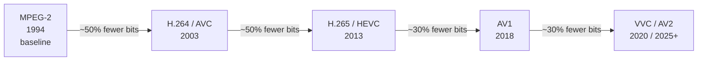
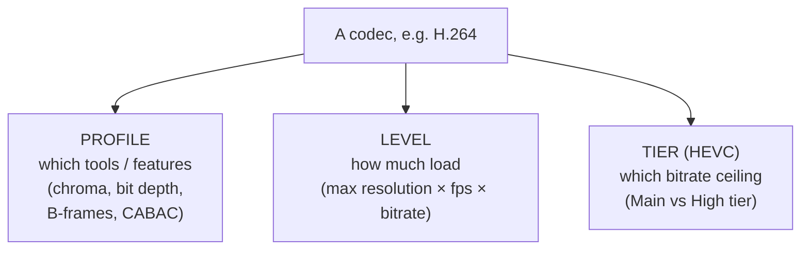
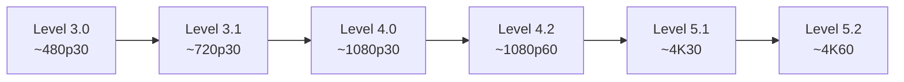
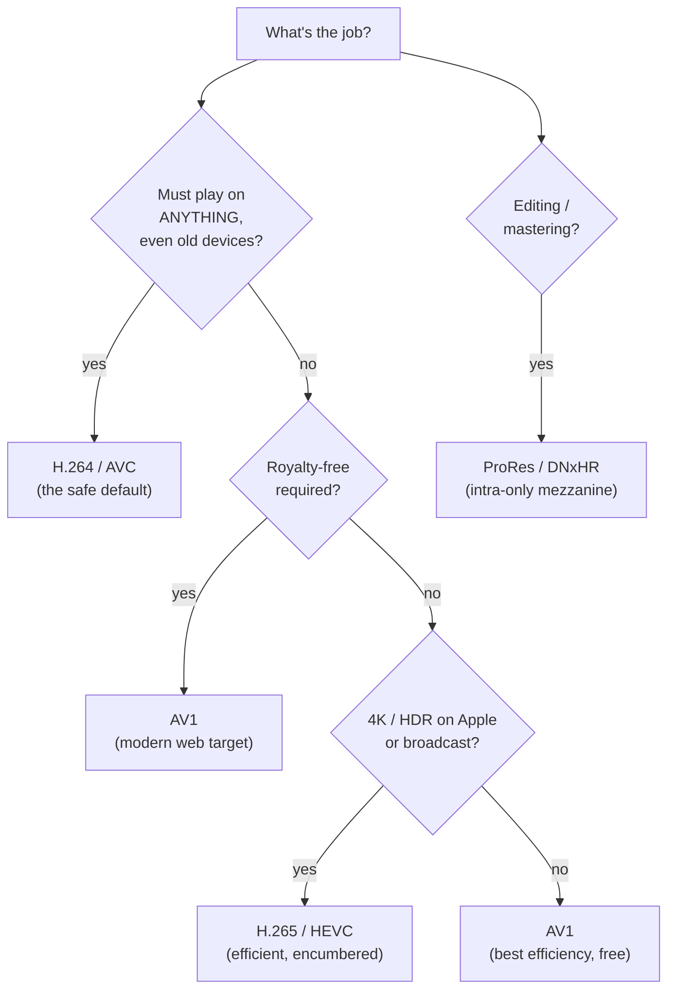

# Chapter 05 — The Codec Zoo

> **Part II · Codecs** — Now that you know *how* a codec works, *which* codecs exist, where each one is used, and how to choose between them? A guided, opinionated tour from ancient MPEG-2 to modern AV1, plus the profile / level / tier dimensions every codec shares.

[Chapter 04](04-how-codecs-work.md) showed that every block-based codec runs the same loop — predict, transform, quantize, entropy-code — and that the standard pins down the *decoder* while leaving the *encoder* free to be clever. This chapter zooms out to the **species** in the zoo. Each codec is a particular set of tools bolted onto that universal loop: bigger blocks, more intra modes, smarter entropy coders, fancier filters. We'll walk the family tree, profile the major players, then nail down the three dimensions — **profile, level, tier** — that describe *what a given stream actually demands of a decoder*. Royalty and patent details get their own chapter ([Chapter 16](16-patents-and-royalties.md)); here we only flag where they bite.

---

## The generational story: ~50% every ~10 years

Before the individual animals, understand the arc of the whole zoo. Video codecs improve in **generations**, and each generation follows a startlingly consistent rule of thumb:

> 🧠 **Mental model:** Each codec generation delivers roughly **30–50% smaller files at the same visual quality** as the previous one — in exchange for **more compute**, usually several times more encode and decode work. Compression efficiency and computational cost rise together. The bits you save come out of someone's silicon and electricity budget.

Why does the same percentage keep appearing? Because each generation reinvests its extra compute budget into the same handful of levers from Chapter 04: **bigger, more flexibly-partitioned blocks** (16×16 → 64×64 → 128×128), **more prediction modes** (8 → 33 → 56+ intra directions), **finer motion** (quarter-pel → eighth-pel, more reference frames), **better transforms** (one DCT → a menu of sizes and types), **smarter entropy coding** (CAVLC → CABAC → adaptive range coders), and **stronger in-loop filters** (deblock → +SAO → +CDEF +loop-restoration). None of it is magic; it's the same loop, ground finer.

The numbers are rules of thumb, not guarantees. "~50% better" depends heavily on content, resolution, the *encoder* used (remember Chapter 04's asymmetry), and the quality metric. A lovingly-tuned H.264 encoder can beat a lazy HEVC one. But across a representative corpus, at high quality, the generational ladder is real and bankable.

---

## The major codecs, profiled

Let's meet the animals. For each: a one-line identity, its history, where you actually encounter it, what it's good and bad at, how widely it's supported, and a royalty flag (details in [Chapter 16](16-patents-and-royalties.md)).

### MPEG-2 — the fossil that won't die

- **Identity:** The 1990s workhorse. *ISO/IEC 13818-2*, also called H.262.
- **History:** Standardized 1994 by the Moving Picture Experts Group. The codec that made **DVD**, **digital cable**, and over-the-air **digital TV (ATSC, DVB)** possible.
- **Where you meet it:** DVDs, a lot of broadcast and cable TV *to this day*, some camcorder formats, the occasional legacy transport stream. If you've ever demuxed a `.ts` file off a TV tuner, odds are it was MPEG-2 video.
- **Strengths:** Dead simple, decodes on a potato, universally understood by ancient hardware. Rock-solid, frozen, predictable.
- **Weaknesses:** Ancient efficiency — it needs *roughly 2–3× the bits* of H.264 for the same quality. 8-bit 4:2:0 only in common use, no fancy prediction, tiny 16×16 macroblocks, no in-loop deblocking.
- **Support:** Effectively universal in *hardware* (it's been in decode silicon for 30 years), though some modern *software* stacks drop it.
- **Royalty:** Was heavily patent-encumbered; the core patents have now **expired** (around 2018), so MPEG-2 is essentially royalty-free today. Flag for [Chapter 16](16-patents-and-royalties.md).

### H.264 / AVC — the universal language

- **Identity:** *The* default. **A**dvanced **V**ideo **C**oding, *ITU-T H.264 / ISO MPEG-4 Part 10*. If you only learn one codec deeply, learn this one.
- **History:** Finalized 2003 by the Joint Video Team (ITU-T VCEG + ISO MPEG). It hit a sweet spot of efficiency, complexity, and timing that made it the substrate of the modern video internet — YouTube's early growth, Blu-ray, the iPhone, Flash-then-HTML5 video, video calling, security cameras.
- **Where you meet it:** *Everywhere.* It is the safe-default codec — the one format you can hand to literally any device built in the last 15 years and expect it to play. Web `<video>`, mobile, set-top boxes, drones, doorbells, the lot.
- **Strengths:** Unmatched **compatibility** — hardware decode in essentially every phone, browser, TV, and SoC since ~2010. Mature, fast, well-understood encoders (x264 is a legend). Excellent quality at the bitrates the web actually uses.
- **Weaknesses:** A generation behind on efficiency (HEVC/AV1 beat it by ~50%). Its tools cap out: 16×16 macroblocks hurt at 4K, weaker than newer codecs for HDR/high-bit-depth.
- **Profiles you'll hear about:** **Baseline** (no B-frames, no CABAC — for low-power/video-calling), **Main** (B-frames + CABAC), **High** (the web/streaming standard — 8-bit 4:2:0 with extra transform tools), **High 10** (10-bit), **High 4:2:2 / High 4:4:4** (pro chroma). More on profiles below.
- **Support:** The gold standard. When something *must just play*, it's H.264.
- **Royalty:** Patent-pool licensed (MPEG-LA / Via LA). Widely paid-into and tolerated, but not free — a real cost flag ([Chapter 16](16-patents-and-royalties.md)).

> 🧠 **Mental model:** H.264 is the **English of video codecs** — not the most elegant, not the newest, but the one *everyone* speaks. Reach for it when compatibility outranks efficiency.

### H.265 / HEVC — the efficient one with baggage

- **Identity:** **H**igh **E**fficiency **V**ideo **C**oding, *ITU-T H.265 / ISO MPEG-H Part 2*. H.264's direct successor.
- **History:** Standardized 2013, again by a joint ITU/ISO team. Designed for the 4K and HDR era: ~50% the bitrate of H.264 at equal quality.
- **Where you meet it:** **4K Blu-ray (UHD)**, **4K/HDR broadcast and satellite**, **Apple's ecosystem** (iPhones record HEVC by default; Safari and Apple TV play it natively), a lot of CCTV/NVR gear, and 4K streaming on platforms that licensed it.
- **Strengths:** Big efficiency jump — 64×64 CTUs, 33 intra directions, the SAO in-loop filter, strong HDR/10-bit support (the **Main 10** profile is the HDR workhorse). Excellent at high resolution where its bigger blocks shine.
- **Weaknesses:** Heavier to encode/decode than H.264. And — famously — a **fractured, expensive patent-licensing situation**: *three separate patent pools* plus unpooled holders, with murky terms, especially around streaming/content royalties. That uncertainty **chilled its adoption on the open web** — browsers were reluctant to ship it, which is a big part of *why AV1 exists*. Flag hard for [Chapter 16](16-patents-and-royalties.md).
- **Support:** Strong in *hardware* (most GPUs and SoCs since ~2015 decode it) and across Apple devices; historically *weak* in web browsers, though that's slowly improving.
- **Royalty:** The cautionary tale. Technically excellent, commercially encumbered.

### VP8 / VP9 — Google's royalty-free push

- **Identity:** Open, royalty-free codecs from Google (via its 2010 acquisition of On2 Technologies). **VP8** is roughly H.264-class; **VP9** is roughly HEVC-class.
- **History:** VP8 (2010) was Google's royalty-free answer to H.264, paired with the WebM container and Vorbis/Opus audio. VP9 (2013) was the serious follow-up, targeting HEVC efficiency *without* HEVC's licensing mess.
- **Where you meet it:** **YouTube** serves an enormous amount of VP9 (it's how Google ships 4K and high-bitrate streams royalty-free to billions of devices). WebRTC uses VP8/VP9 widely for real-time calling. WebM files on the open web.
- **Strengths:** Royalty-free (Google's stance), good efficiency (VP9 ≈ HEVC-ish), broad *browser* support (Chrome, Firefox, Edge; Android hardware decode common). Superblocks up to 64×64, a clean range-coder entropy stage.
- **Weaknesses:** VP9 encoding (libvpx) is slow and fiddly; less hardware *encode* support than the H.26x line; Apple support is patchier than for HEVC.
- **Support:** Excellent in browsers and on Android; weaker on Apple and in dedicated broadcast gear.
- **Royalty:** Positioned royalty-free by Google. The **direct predecessor and proving ground for AV1** — VP9's structure and tooling fed straight into the AV1 design.

### AV1 — the modern open target

- **Identity:** The current royalty-free flagship, from the **Alliance for Open Media (AOMedia)** — a consortium of Google, Netflix, Amazon, Microsoft, Mozilla, Cisco, Intel, and many others. *Open by design, free by design.*
- **History:** Released 2018 as the industry's coordinated answer to HEVC's licensing chaos. AOMedia pooled patents from dozens of companies into a royalty-free grant, fusing the best ideas from VP10, Daala, and Thor. The explicit goal: a state-of-the-art codec the *entire web* could ship without per-stream royalties.
- **Where you meet it:** **YouTube, Netflix, and Meta** stream AV1 at scale; modern browsers (Chrome, Firefox, Edge, and Safari on recent Apple silicon) decode it; recent GPUs (NVIDIA Ada/RTX 40-series+, Intel Arc, AMD RDNA3+) have **hardware AV1 encode and decode**. It is **the modern web delivery target**.
- **Strengths:** ~30% more efficient than HEVC (and royalty-free — the killer combo). 128×128 superblocks with flexible binary/ternary partitioning, 56+ intra modes, the CDEF and loop-restoration filters, excellent film-grain synthesis and HDR support. Designed for the streaming era.
- **Weaknesses:** **Slow to encode** — early software encoders were notoriously heavy, though SVT-AV1 and hardware encoders have largely tamed this. Decode is heavier than H.264. Hardware *encode* support is recent (only newer GPUs have the silicon), so older devices fall back to slower software encode.
- **Support:** Rapidly maturing. Broad browser decode, growing hardware decode, expanding hardware encode. Not yet as universally *guaranteed* as H.264, but climbing fast.
- **Royalty:** **Royalty-free by design** — the entire reason it exists. (With caveats worth knowing about emerging patent-pool claims — see [Chapter 16](16-patents-and-royalties.md).)

> 🛠️ **In rivet, our transcoder:** **AV1 is our default output codec**, and that choice is load-bearing for the whole project. AV1 + Opus audio in an MP4 gives us a royalty-clean delivery package that plays across the modern web without per-stream licensing exposure — exactly the position we built rivet to occupy. We still encode **H.264** and **H.265** on demand for legacy-player compatibility (those carry the licensing obligations AV1 was designed to avoid), but if you don't ask for a codec, you get AV1. On the decode side we ingest the *entire* zoo below — H.264, HEVC, VP8, VP9, AV1, MPEG-2, MPEG-4 Part 2, and ProRes — because input can be anything, but output should be the clean, modern target.

### AV2 and VVC (H.266) — the next generation

Two codecs are forming the *next* rung of the ladder, and they mirror the AV1-vs-HEVC standoff exactly:

- **VVC / H.266** (**V**ersatile **V**ideo **C**oding, 2020) — the ITU/ISO successor to HEVC. Roughly another ~50% over HEVC, with strong tools for 8K, 360°/VR, and adaptive resolution. Technically excellent — and, like HEVC, **licensing-heavy**, with multiple pools and the same adoption-chilling uncertainty. Mostly seen in broadcast and pro contexts so far, not the open web.
- **AV2** — AOMedia's next royalty-free codec (developing through the mid-2020s), the open successor to AV1, aiming to do to VVC what AV1 did to HEVC: comparable efficiency, free to ship. Early days as of this writing.

The pattern rhymes: a technically strong but encumbered ITU/ISO codec, shadowed by an open AOMedia alternative. Don't deploy either yet for general delivery, but know they're coming.

### ProRes / DNxHR — the editing codecs

Everything above is a **delivery** codec, tuned to make small files for *playback*. There's a whole other genus tuned for the opposite job: **production / mezzanine codecs** for *editing*.

- **Apple ProRes** and **Avalanche/Avid DNxHR** are **intra-only** codecs (every frame is an I-frame — no inter prediction at all).
- **Where you meet them:** Professional video editing, color grading, camera recording, broadcast production masters, and as the high-quality **mezzanine** intermediate you transcode *from* before producing delivery renditions.
- **Why intra-only?** Editing software needs to jump to *any* frame instantly, scrub backward, and cut on any frame. With inter prediction, reaching frame *N* means decoding the whole GOP up to it (Chapter 04). With every frame standalone, *random access is free* and decode is trivially parallel. The cost is **huge files** — ProRes can be 10–50× the size of an H.264 delivery file — but in an edit bay, fast scrubbing and clean re-encoding matter far more than disk space.
- **Quality:** Visually near-lossless at the high tiers (ProRes 422 HQ, 4444), 10-bit and beyond, designed to survive many generations of re-encoding without visible degradation.

> 🧠 **Mental model:** Delivery codecs (H.264/AV1) are *vacuum-packed* for shipping — tiny, but you must "unpack" a whole GOP to reach a frame. Editing codecs (ProRes) are *laid out flat on a workbench* — bulky, but every frame is right there, instantly, independently. You edit in ProRes, then **transcode to AV1/H.264 for delivery**. That transcode-from-mezzanine step is a core job for a transcoder.

### Lossless codecs — the archive

At the far end: codecs that throw away *nothing*. **FFV1** (a robust, checksummed lossless codec popular in film/TV archival and preservation), and lossless modes of **H.264/x264** and others. Pixel-for-pixel identical to the source, large files, used where the master must be preserved exactly — national archives, scientific imaging, anywhere a single discarded coefficient is unacceptable. Not for delivery; for *keeping*.

---

## The dimensions every codec shares

Naming a codec — "H.264" or "AV1" — is only the start. A single codec spans a wide range of capability and decoder cost, and three orthogonal dials describe *which slice* a given stream uses. You'll see these in the codec string ([Chapter 07](07-bitstreams-and-nal-units.md)) and in every encoder's settings. Get them straight and a lot of "why won't this play?" mysteries dissolve.

### Profile — *which tools are allowed*

A **profile** is a named subset of the codec's **features** — the toolbox a conformant stream is permitted to use, and therefore the toolbox a decoder must implement to play it. Profiles exist so a low-power chip can advertise "I support Baseline" without being forced to implement every exotic tool.

Key things profiles gate:

- **Chroma subsampling** — 4:2:0 (consumer), 4:2:2, or 4:4:4 (pro). (See [Chapter 02](02-color-and-pixels.md).)
- **Bit depth** — 8-bit vs 10-bit vs 12-bit per sample.
- **Coding tools** — B-frames, CABAC, specific transforms, etc.

Examples to anchor it:

| Codec | Profile | What it adds |
|-------|---------|--------------|
| H.264 | **Baseline** | No B-frames, no CABAC — low-power, low-latency (video calls) |
| H.264 | **Main** | B-frames + CABAC |
| H.264 | **High** | The streaming/web standard — 8-bit 4:2:0 + extra transform tools |
| H.264 | **High 10** | Adds 10-bit |
| H.264 | **High 4:2:2 / 4:4:4** | Pro chroma + higher bit depth |
| HEVC | **Main** | 8-bit 4:2:0 |
| HEVC | **Main 10** | 10-bit — the HDR workhorse |
| AV1 | **Main** | 8/10-bit, 4:2:0 (the web profile) |
| AV1 | **High / Professional** | 4:4:4, 12-bit, etc. |

> 🧠 **Mental model:** A profile is a **menu the decoder promises it can cook from.** "Main 10" means "I can handle everything on the Main menu *plus* 10-bit dishes." If a stream uses a tool the decoder's profile doesn't include — say, 10-bit pixels on an 8-bit-only decoder — playback fails or falls back to software. Profile mismatches are a top cause of "it plays here but not there."

### Level — *how much load*

A **level** is a ceiling on the **decoding burden**, independent of which tools are used. It bounds things like maximum resolution × frame rate (expressed as max luma samples per second), maximum bitrate, and maximum buffer sizes. Levels let a decoder advertise "I can keep up with *this much* throughput."

The canonical anchor: **H.264 Level 4.0 ≈ 1080p30** (a max of about 1080p at 30 fps within its bitrate ceiling). Need 1080p60? That's Level 4.2. 4K? Level 5.1 or 5.2. A decoder chip is rated to a maximum level; feed it a higher-level stream and it can't keep up.

> 🧠 **Mental model:** If **profile** is *which dishes are on the menu*, **level** is *how fast the kitchen can plate them.* A decoder can support a rich profile but a low level (fancy tools, but only at modest resolution/frame-rate), or a simple profile at a high level (basic tools, but at 8K). Profile and level are independent; a stream declares both, and a device must satisfy both to play it.

### Tier — *which bitrate ceiling* (HEVC)

HEVC adds a third dial, the **tier**, which sits *inside* a level and picks between two bitrate ceilings:

- **Main tier** — the lower bitrate ceiling, for consumer streaming and broadcast.
- **High tier** — a much higher bitrate ceiling, for professional contribution feeds and mastering where bits are cheap.

So an HEVC stream is "Main 10 profile, Level 5.1, Main tier," say. Most other codecs fold this into the level; HEVC breaks it out separately. You'll rarely touch High tier outside professional pipelines.

> 🔬 **Going deeper:** These three dials are exactly what a **codec string** encodes so a player can decide *before downloading a byte* whether it can play a stream. An HEVC string like `hvc1.2.4.L153.B0` packs profile (2 = Main 10), tier+level (`L153` = Level 5.1 Main tier), and constraint flags; an AV1 string like `av01.0.08M.10` packs profile (0 = Main), level (`08` ≈ 4.0), tier (`M` = Main), and bit depth (`10`). [Chapter 07](07-bitstreams-and-nal-units.md) dissects these character by character — and [Chapter 12](12-web-delivery-and-compatibility.md) shows how `MediaSource.isTypeSupported()` uses them to negotiate compatibility in the browser.

---

## The comparison table

Pulling the zoo together. "Efficiency" is *relative bits for equal quality* (lower is better); these are representative rules of thumb, not lab results.

| Codec | Year | Efficiency vs H.264 | Device support | Licensing status |
|-------|:----:|:-------------------:|----------------|------------------|
| **MPEG-2** | 1994 | ~0.4× (needs ~2.5× the bits) | Universal (legacy HW) | Patents expired — free |
| **H.264 / AVC** | 2003 | **1.0× (baseline)** | **Universal** | Patent pool — paid |
| **VP8** | 2010 | ~1.0× | Browsers, Android | Royalty-free (Google) |
| **H.265 / HEVC** | 2013 | ~1.5–2× better | Strong HW + Apple; weak web | **Fractured pools — encumbered** |
| **VP9** | 2013 | ~1.5–2× better | Browsers + Android; weak Apple | Royalty-free (Google) |
| **AV1** | 2018 | ~2–2.7× better | Growing (modern HW + browsers) | **Royalty-free (AOMedia)** |
| **VVC / H.266** | 2020 | ~3× better | Sparse (broadcast/pro) | Encumbered (pools) |
| **AV2** | ~2025+ | next-gen | Emerging | Royalty-free (AOMedia) |
| **ProRes / DNxHR** | — | *worse* (intra-only, huge) | Pro editing | Apple / Avid |
| **FFV1 / lossless** | — | *much worse* (lossless) | Archival | Free |

---

## Which codec when? A decision guide

There's no single "best" codec — only the best fit for a goal. The decision collapses onto three competing priorities: **compatibility**, **efficiency**, and **royalty-freedom**. You usually can't max all three.

- **Need it to *just play*, everywhere, today?** → **H.264.** Compatibility beats everything; you pay efficiency and (small) royalties for certainty.
- **Delivering to the modern web at scale and want to avoid licensing exposure?** → **AV1.** Best efficiency *and* royalty-free — the combination that justifies its slower encode. This is the position we take in rivet by default.
- **4K/HDR into the Apple ecosystem or broadcast, and licensing is already handled?** → **HEVC.** Excellent where it's supported and paid for; avoid it for open-web delivery because of the patent fog.
- **Serving Google-scale and already royalty-conscious?** → **VP9** remains a fine, well-supported royalty-free option (it's how YouTube got here), though AV1 supersedes it for new work.
- **Editing, grading, or producing a master?** → **ProRes / DNxHR.** Intra-only, fast to scrub, near-lossless — then transcode to a delivery codec at the end.
- **Archiving a master forever?** → **FFV1** or lossless. Keep every bit.

The tension between efficiency and royalty-freedom is the whole reason the open codecs (VP9, AV1, AV2) exist, and it's why a transcoder's *default* output codec is a genuinely strategic choice — not just a quality knob. The full royalty/patent picture, including the open questions hanging over AV1, is [Chapter 16](16-patents-and-royalties.md).

> 🛠️ **In rivet, our transcoder:** This is exactly the matrix we encoded into rivet's defaults so you don't have to re-derive it per file. We **decode the entire zoo** on input — hardware paths (NVDEC / QSV / AMF) for H.264, HEVC, VP9, AV1, MPEG-2, MPEG-4 and a software path (FFmpeg) that adds ProRes and the long tail. On output we **encode AV1 by default** (royalty-clean + modern-web-efficient) and offer **H.264 / H.265** when a legacy target demands them. The profile, level, and bit-depth you end up with show up in the codec string we write into the container — 8-bit AV1 Main for web-safe SDR, 10-bit (AV1 Main / HEVC Main 10) when you keep HDR — which is the subject of the next chapter.

---

## Recap

- Codecs improve in **generations**, each ~**30–50% more efficient** than the last for **more compute** — the same Chapter-04 levers (bigger blocks, more modes, finer motion, better transforms and entropy coding, stronger filters) ground progressively finer.
- The **delivery** lineage runs **MPEG-2 → H.264 → HEVC → AV1** (with VP8/VP9 as Google's royalty-free branch, and VVC/AV2 forming the next rung). **H.264** is the universal-compatibility default; **HEVC** is efficient but patent-encumbered; **AV1** is the royalty-free, modern-web target; **MPEG-2** is the still-running fossil.
- **Editing codecs** (ProRes, DNxHR) are **intra-only** mezzanines — huge files, instant random access, used in production; **lossless** codecs (FFV1) are for archival. You transcode *from* these *to* a delivery codec.
- Every codec is sliced by three orthogonal dials: **profile** (which tools/features — chroma, bit depth, B-frames), **level** (the decode-load ceiling — e.g. H.264 Level 4.0 ≈ 1080p30), and, for HEVC, **tier** (Main vs High bitrate ceiling). A device must satisfy *all* the dials a stream declares.
- **Choosing a codec** trades **compatibility** vs **efficiency** vs **royalty-freedom** — you rarely get all three. H.264 for reach, AV1 for efficient-and-free delivery, HEVC for licensed 4K/HDR, ProRes for editing. The royalty details are [Chapter 16](16-patents-and-royalties.md).

**Next:** [Chapter 06 — Encoders and Rate Control](06-encoders-and-rate-control.md)
