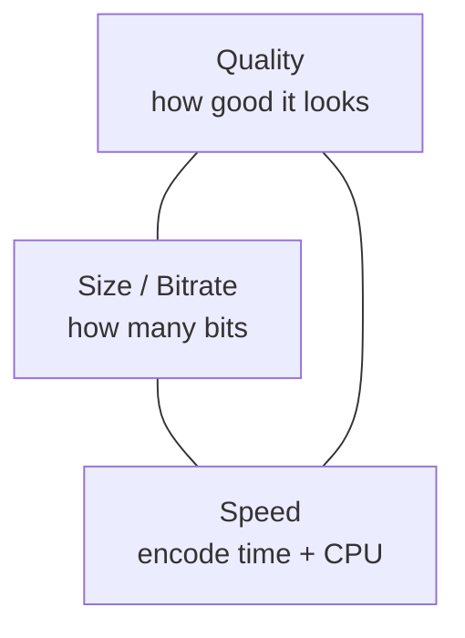
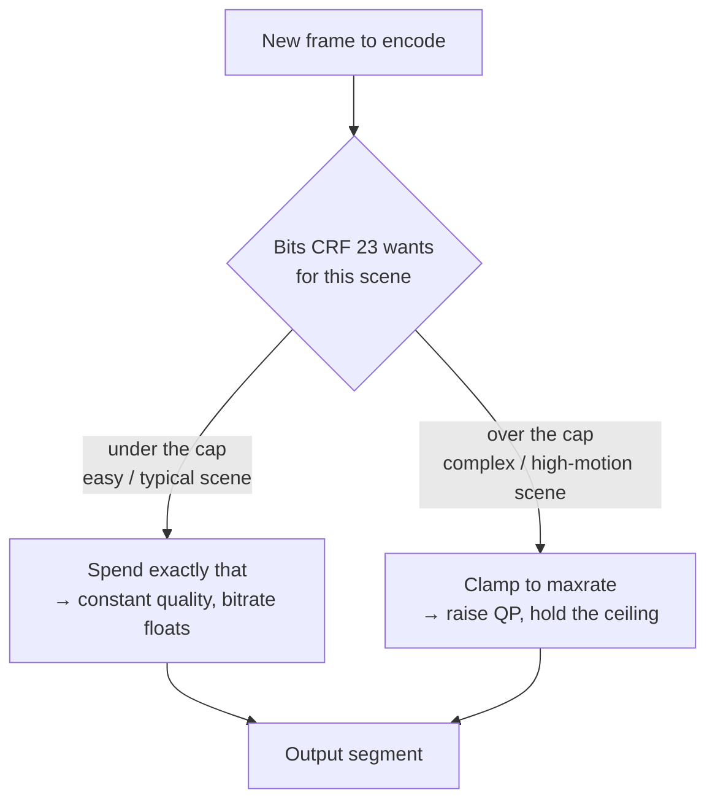
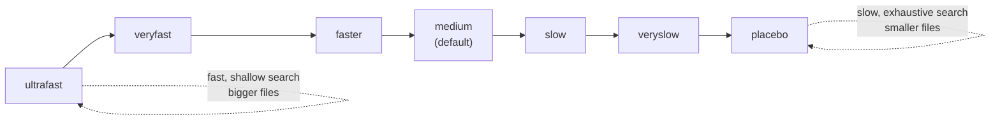
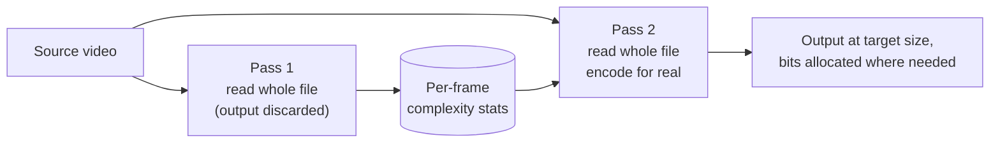
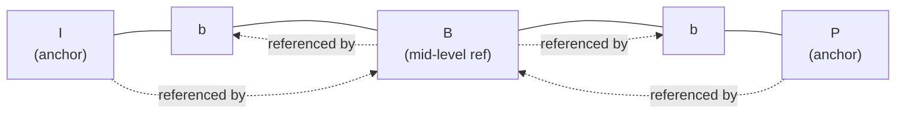
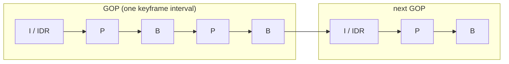

# Chapter 06 — Encoders & Rate Control

> **Part II · Codecs** — Why the same codec gives wildly different results depending on *which* encoder you use and *how* you tell it to spend bits.

In [Chapter 04](04-how-codecs-work.md) we said something that sounded almost like a throwaway line: **encoding is a search.** This chapter is where that idea earns its keep. A codec like H.264 or AV1 is only a *specification* — a contract about what a legal bitstream looks like and how a decoder must interpret it. It says nothing about *how* to produce a good one. That job belongs to the **encoder**, and the choices an encoder makes — how hard to search, where to spend bits, how to hit a target — are the difference between a 3 GB file and a 300 MB file that look identical. This chapter unpacks those choices: the encoder zoo, **rate control** (the single most important knob you'll ever touch), presets, multi-pass analysis, the smart tricks encoders play, and how to actually *measure* whether the result is any good.

---

## One spec, many encoders

Here's the thing that trips up newcomers: **"H.264" is not a program.** It's a 750-page ITU-T document (Recommendation H.264 / ISO 14496-10). Anyone can write software that emits H.264-compliant bitstreams, and many people have. The decoder on the other end only cares that the bytes are legal — it has no idea, and no way to know, which encoder produced them.

So for a single codec you get a whole family of competing encoder *implementations*:

| Codec | Software encoders | Hardware encoders |
|-------|-------------------|-------------------|
| **H.264 / AVC** | **x264** (the gold standard, open-source) | NVENC, QSV, AMF, Apple VT |
| **H.265 / HEVC** | **x265** | NVENC, QSV, AMF, Apple VT |
| **AV1** | **libaom** (reference), **SVT-AV1** (scalable, fast), **rav1e** (Rust) | NVENC (Ada+), QSV (Arc+), AMF (RDNA3+) |
| **VP9** | libvpx-vp9 | (limited HW) |

They all produce bitstreams the *same* decoders can play. But they are **not** interchangeable in quality, speed, or features:

- **x264** is so good that after ~20 years it is still the benchmark every other H.264 encoder is measured against. It is the result of a generation of psychovisual-tuning obsession.
- **libaom** is AV1's *reference* encoder — it defines correctness, and it is famously, gloriously **slow** (think 0.1–1 frames per second at high quality settings on a single core).
- **SVT-AV1** (Scalable Video Technology, originally Intel + Netflix) trades a sliver of efficiency for an order of magnitude more speed by being aggressively multi-threaded. It's now the practical default for production AV1 encoding.
- **rav1e** is a memory-safe Rust AV1 encoder — slower than SVT-AV1 but a clean, auditable codebase.
- **Hardware encoders** (NVENC, QSV, AMF) live on a fixed-function block of silicon inside the GPU. They are *blisteringly* fast and sip power, but they're constrained by what the silicon implements.

> 🧠 **Mental model:** A codec is the **rules of chess**. An encoder is a **chess engine**. Stockfish and a beginner both play legal chess, but one of them is going to crush you. Same rules, radically different skill — and "skill" for an encoder means *finding a smaller bitstream that looks just as good in the time budget you gave it.*

### Why is encoding a search, again?

Recall from [Chapter 04](04-how-codecs-work.md): to encode a block, the encoder must *choose*. Which neighboring block to predict from? Which of dozens of intra-prediction directions? What motion vector (searched across a window of the reference frame)? Split this 64×64 block into four 32×32, or sixteen 16×16, or leave it whole? Each choice has a **cost** — bits to signal it — and a **distortion** — how wrong the reconstruction is. The encoder is trying to minimize a combined score:

```
cost = distortion + λ · bits
```

This is **rate-distortion optimization (RDO)**, and λ (lambda) is the exchange rate between "looking good" and "being small." Trying *every* combination is astronomically expensive — a single 4K frame has more partition/mode/motion permutations than there are atoms in your coffee. So an encoder **searches a subset.** A *slow* encoder searches more of that space and finds better answers. A *fast* encoder takes shortcuts. That single fact — how much of the search space you explore — explains nearly everything about the speed-vs-quality tradeoff below.

> 🔬 **Going deeper — what λ actually does:** Imagine the encoder weighing two ways to code one block. Option A is a cheap mode that costs **20 bits** but leaves a distortion (SSD) of **900**. Option B is a fancier mode costing **50 bits** with distortion **300**. With a small λ (say 2 — "bits are cheap, I'm at a low QP/high quality"), the scores are `A: 900 + 2·20 = 940` vs `B: 300 + 2·50 = 400` → **B wins** (spend the bits for quality). With a large λ (say 20 — "bits are precious, I'm at a high QP/low bitrate"), `A: 900 + 20·20 = 1300` vs `B: 300 + 20·50 = 1300` → a **tie**; any larger λ and the cheap option A wins. **λ is derived from the quantizer**: a higher QP (more compression) means a larger λ, which systematically tilts every one of these millions of per-block decisions toward "spend fewer bits." That's the machinery underneath rate control — change the quantizer and you change λ and the encoder *re-decides the entire frame.*

---

## The triangle you can't cheat

Every encoding decision lives inside one stubborn three-way tradeoff:



> 🧠 **Mental model:** **Pick any two; the third gives.** Want great quality *and* a tiny file? You'll pay in encode time (a slow, exhaustive search). Want it *fast* and *small*? Quality drops. Want it *fast* and *great*? The file gets bigger (a quick search "wastes" bits because it didn't find the cleverer, cheaper encoding).

Hold that triangle in your head. **Rate control** decides how you trade Quality ↔ Size. **Presets** decide how you trade Speed ↔ (Quality-at-a-given-Size). They are two separate dials, and confusing them is the #1 source of encoding mistakes.

---

## Rate control: the most important knob

**Rate control (RC)** answers one question: *how many bits does each frame get?* That's it. But the way you answer it changes everything about predictability, file size, and streaming behavior. There are a handful of fundamental modes. Let's go through them from "simplest" to "what you actually want."

### CQP — Constant Quantizer (Constant QP)

The **quantizer** (QP) is the knob from [Chapter 04](04-how-codecs-work.md) that controls how aggressively the encoder throws away detail after the transform: a low QP keeps lots of detail (big file), a high QP discards a lot (small file).

**CQP just nails QP to a fixed number for the whole video** (sometimes with a small fixed offset for B-frames vs I-frames). Every frame gets the same quantizer, period.

- ✅ **Dead predictable quality knob, and *fast*** — no analysis, no feedback loop.
- ✅ **Reproducible & stitchable.** Encode two halves of a clip separately at the same CQP and they splice together with no rate discontinuity — there's nothing adapting between them. (This property is load-bearing for chunked multi-GPU encoding; see the rivet note below.)
- ❌ **Wildly unpredictable file size.** A static talking-head and a confetti explosion both get QP 24, but the explosion is vastly harder to compress, so it balloons. You can't target a bitrate.
- ❌ **Wastes bits where the eye doesn't care, starves them where it does.** Easy scenes get *more* quality than they need; hard scenes get *less*.

CQP is rarely the right final-delivery choice, but it's the foundation everything else is built on, and it's perfect for reproducible chunk-based encoding.

### CRF — Constant Rate Factor (the VOD default)

**CRF is the mode you'll use for almost all on-demand video.** It's a clever twist on CQP: instead of holding the *quantizer* constant, it holds **perceived quality** constant by *varying* the quantizer scene-by-scene.

The insight: the human eye is **less sensitive to detail in high-motion or highly-textured regions** (you can't see fine grain on a fast-panning crowd) and **more sensitive in still, flat regions** (banding on a clear sky is glaring). So CRF *raises* QP (spends fewer bits) during complex/fast scenes where you won't notice, and *lowers* QP (spends more) during simple/slow scenes where you would. The result: roughly **constant *perceptual* quality** across the whole video, with bitrate floating up and down as needed.

You set **one number** and walk away. The scale:

| Encoder | CRF range | "Visually lossless" | Sane default | Notes |
|---------|-----------|---------------------|--------------|-------|
| **x264 / x265** | 0–51 | ~18 | **23** | lower = better quality + bigger |
| **libaom / SVT-AV1** | 0–63 | ~20 | ~30 | AV1 uses a wider 0–63 scale |
| **rav1e** | 0–255 (quantizer) | — | ~80–100 | exposes the raw AV1 q-index |

The two rules of thumb worth memorizing for x264/x265:

1. **CRF ~18 is "visually lossless"** — most people can't tell it from the source at normal viewing distance.
2. **Each +6 CRF roughly *halves* the bitrate; each −6 roughly *doubles* it.** (The relationship is approximately `bitrate ∝ 2^(−CRF/6)`.) So CRF 23 is about half the size of CRF 17, and CRF 29 about a quarter.

> 🔬 **Going deeper:** CRF is *not* a bitrate. It's a quality *intent*. The encoder figures out the bitrate that *delivers* that intent for *your specific content*. Two clips at CRF 23 can have a 10× difference in bitrate — and that's the whole point: simple content gets a small file, complex content gets the bits it actually needs, both at the same perceived quality. This is exactly why CRF beats "just pick 5 Mbps" for a library of varied content.

> ⚠️ AV1's CRF numbers are **not** comparable to x264's. CRF 23 in x264 and CRF 23 in SVT-AV1 are different quality points on different scales. Never port a CRF value across codecs — recalibrate.

### CBR — Constant Bitrate (live & broadcast)

**CBR forces the bitrate to a fixed value** — say, exactly 6 Mbps — at all times, smoothed over a short window. If a scene is easy, the encoder **pads** (spends bits it doesn't need, e.g. by lowering QP); if a scene is hard, it **drops quality** (raises QP) to stay under the ceiling. It never exceeds the rate, and never undershoots much either.

- ✅ **Fits a fixed pipe.** Broadcast channels, satellite links, and many live-streaming ingest endpoints have a *hard, constant* bandwidth budget. CBR matches it exactly.
- ✅ **Predictable buffering.** A player knows precisely how much data arrives per second.
- ❌ **Inefficient.** You waste bits on easy scenes and starve hard ones — the opposite of what you want for quality-per-bit. CBR is about *delivery constraints*, not efficiency.

CBR is a **live/broadcast** tool. For video-on-demand (VOD), it's the wrong choice — you're leaving quality on the table.

### VBR — Variable Bitrate (with caps)

**VBR lets the bitrate float** to match scene complexity (like CRF) but aims at an **average target bitrate** over the whole file, usually with a **maximum rate** (`maxrate`) and a **buffer size** (`bufsize`) ceiling so it never spikes above what a player can handle.

- ✅ More efficient than CBR — bits follow complexity.
- ✅ Hits an average target you can budget storage/bandwidth around.
- ⚠️ The maxrate/bufsize caps are a **leaky bucket**: `bufsize` is the bucket's capacity, `maxrate` the drain rate; the encoder can burst above the average as long as the bucket doesn't overflow. Tuning these is where VBR gets fiddly.

### Capped CRF — the best of both (and the ABR sweet spot)

Here's the practical winner for **adaptive streaming** ([Chapter 11](11-adaptive-bitrate-streaming.md)): **CRF with a maxrate/bufsize ceiling.**

You set a CRF (say 23) for constant *quality*, **plus** a `maxrate` cap (say 8 Mbps) and a `bufsize`. The encoder behaves like CRF — floating bitrate, constant perceived quality — **right up until** a scene gets so complex that holding CRF 23 would blow past 8 Mbps. At that point the cap kicks in and it behaves like VBR, clamping the peak.



You get CRF's "don't waste bits on easy scenes" efficiency **and** VBR's "never exceed what the network/player can handle" safety. This is why capped CRF is the default recommendation for VOD that will be streamed adaptively. Every rung of an ABR ladder gets a CRF *and* a cap appropriate to that resolution.

### Hardware rate-control modes: ICQ, QVBR, CQ

Hardware encoders expose their own RC modes with vendor-specific names, but they map onto the concepts above:

| HW mode | Vendor | Equivalent to | What it does |
|---------|--------|---------------|--------------|
| **CQP** | all | CQP | fixed quantizer |
| **CQ** (Constant Quality) | NVENC | CRF-ish | constant-quality target, AV1 CQ scale 0–63 |
| **ICQ** (Intelligent Constant Quality) | QSV (Intel) | CRF | quality target with content adaptation |
| **QVBR** (Quality-defined VBR) | NVENC, QSV | capped CRF | a quality target *with* a bitrate cap — the HW capped-CRF |
| **CBR / VBR** | all | CBR / VBR | as above |

The key takeaway: **a hardware encoder's "constant quality" mode (CQ/ICQ) is the CRF equivalent**, and **QVBR is the hardware capped-CRF.** When someone says "use ICQ 23 on the Intel card," they mean "give me CRF-23-like behavior in hardware."

> 🛠️ **In rivet:** In our companion engine, rate control surfaces as `--crf <n>` (or a per-rung `Quality::crf(28)`), and each ladder rung carries its own `Quality`. Above the raw CRF, we also expose a backend-agnostic `QualityTarget` (`VisuallyLossless` / `High` / `Standard` / `Low`) expressed in **perceptual VMAF bands**, which our calibration layer translates into each vendor's native knob — so the *same* job looks the same whether it lands on NVENC, QSV, or AMF. On the Intel path that knob is **ICQ** (QSV rate-control mode 9 — the CRF equivalent); on NVENC it's a CQ value on AV1's 0–63 scale. For reproducible **chunked** multi-GPU encoding, our seam modes can pin **constant-QP** so independently-encoded GOPs splice with no rate discontinuity at the seams.

### A rate-control cheat sheet

Faced with a new job, you pick a mode by answering one question: *what's the constraint — a quality bar, or a bitrate bar?*

| Your situation | Use | Why |
|----------------|-----|-----|
| VOD, single file, "make it look good and reasonably small" | **CRF** (1-pass) | constant perceived quality, lets the file size float to suit content |
| VOD for **adaptive streaming** (per rung) | **capped CRF** | CRF quality + a `maxrate` ceiling so no rung ever exceeds its network budget |
| Hard size/bitrate target ("≤ 5 Mbps average") | **2-pass VBR** | the second pass distributes the fixed budget where it's needed |
| **Live** stream / fixed pipe / broadcast | **CBR** (1-pass, fast preset) | the future doesn't exist yet and the bandwidth is fixed |
| Reproducible chunked / archival masters | **CQP** | deterministic, splice-able, no rate feedback loop |
| Hardware encode, quality-first | **CQ / ICQ / QVBR** | the HW equivalents of CRF / capped CRF |

> ⚠️ **The most common rate-control mistake:** confusing a **quality** target (CRF/CQP — "look *this* good, size floats") with a **bitrate** target (CBR/VBR — "be *this* big, quality floats"). Setting a CRF *and* expecting a predictable file size, or setting a bitrate *and* expecting consistent quality across varied content, is asking the mode to do the opposite of its job. Decide which axis you're constraining **first**, then pick the mode.

---

## Presets: trading speed for efficiency (NOT quality)

This is the dial people most often misunderstand. A **preset** controls **how hard the encoder searches** — how much of that rate-distortion space from earlier it actually explores. x264/x265 name their presets like a tempo marking, from a fast-and-sloppy search to an exhaustive one:



SVT-AV1 uses a numeric `--preset 0..13` (0 = slowest/best, 13 = fastest). Hardware encoders use `P1..P7` (NVENC) or similar.

Here's the crucial mental correction:

> 🧠 **Mental model:** A preset does **not** set quality. At a fixed CRF, *every* preset targets roughly the **same perceived quality** — but a **faster preset spends MORE bits to get there.** The slow preset finds the clever, compact encoding; the fast preset gives up and uses a lazier, fatter one. So the real axis is **encode time vs. compression efficiency (file size at equal quality).**

A concrete way to see it: encode the same clip at CRF 23 on `ultrafast` and on `veryslow`. They look about the same. But `ultrafast` might produce a 9 MB file and `veryslow` a 5 MB file — same quality, **45% smaller** because the slow search found better predictions. The cost: `veryslow` might take 20× longer.

| | Fast preset (e.g. ultrafast / SVT preset 12) | Slow preset (e.g. veryslow / SVT preset 2) |
|---|---|---|
| Search depth | shallow — few modes, small motion window | deep — many modes, wide motion search, more partitions |
| Encode speed | very fast (real-time+) | very slow |
| File size @ equal CRF | **larger** | **smaller** |
| Perceived quality @ equal CRF | ~same | ~same |
| Use case | **live** (you have no time) | **VOD** (encode once, serve millions) |

This is *why* **live streaming uses fast presets** (the frame must be encoded in ~16 ms or you're behind) and **VOD uses slow presets** (you encode once, offline, and every saved megabyte is multiplied by millions of viewers). The economics are completely different.

> 🔬 **Going deeper:** `placebo` (x264) is named as a joke — the extra encode time over `veryslow` buys quality gains so small they're effectively a placebo. Don't use it in production. The real production sweet spots are `medium`–`slow` for x264/x265, and SVT-AV1 presets ~4–8 depending on your time budget.

---

## One pass vs. two pass

When you target a **specific file size or average bitrate** (VBR), the encoder faces a chicken-and-egg problem: to allocate bits intelligently across the whole video, it needs to know which scenes are hard — but it's encoding left-to-right and hasn't seen the end yet.

- **1-pass:** the encoder guesses as it goes, using only what it's seen so far (plus a lookahead window). Fast, single read of the source. Good enough for CRF (where you're not targeting a size) and required for **live** (the future literally doesn't exist yet).
- **2-pass:** the encoder reads the **entire video twice.** Pass 1 analyzes complexity per frame and writes a stats log (no real output). Pass 2 uses that global knowledge to **distribute the bit budget optimally** — giving the confetti explosion the bits it needs by taking them from the static title card. The result hits your target size with **markedly better quality distribution** than 1-pass at the same size.



> 🧠 **Mental model:** 1-pass is **packing for a trip without knowing the weather.** 2-pass is **checking the forecast first, then packing.** Same suitcase (bit budget), much better choices.

**When to use which:** Use **CRF (1-pass)** when you care about *quality* and don't have a hard size target — this is most VOD. Use **2-pass VBR** when you have a *hard bitrate/size target* (e.g. "this must be ≤ 5 Mbps average for the 1080p rung"). Use **1-pass CBR/fast-preset** for live. (CRF itself is effectively a single-pass quality-targeting mode and doesn't usually need a second pass.)

---

## What makes a smart encoder smart

Beyond rate control and search depth, encoders carry a bag of tricks that separate the good ones from the merely correct. These are *why* x264 beat everything for a decade.

### Lookahead

The encoder buffers a window of **future** frames (e.g. 40–60) before committing the current one. With lookahead it can see a scene change coming, detect that the next two seconds are a slow fade, or notice that this frame will be heavily referenced by future frames (and so deserves more bits). Lookahead feeds both rate control and frame-type decisions. More lookahead = better decisions = more latency and memory. Live encoders keep it short; VOD encoders open it wide.

### B-frame placement & pyramids

Recall frame types from [Chapter 04](04-how-codecs-work.md): **I** (intra, standalone), **P** (predicted from the past), **B** (bi-predicted, from past *and* future). B-frames are the cheapest. A smart encoder decides **adaptively** how many B-frames to place between anchors based on content (slow scenes tolerate more B-frames; fast cuts want fewer).

**B-pyramids** take it further: a B-frame can itself serve as a reference for *other* B-frames, forming a hierarchy:



The big `B` in the middle is bi-predicted from both anchors *and* serves as a reference for the little `b` frames on either side. The frames deeper in the pyramid are displayed later but encoded earlier and at higher QP, because they're seen briefly and referenced by nobody. This squeezes out more redundancy and is a big efficiency win — at the cost of **reordering** (encode order ≠ display order), which ripples into PTS/DTS timestamps ([Chapter 09](09-containers-and-muxing.md)) and decode buffering.

### Scene-cut detection

A hard cut to a new scene means the new frame has *nothing* in common with the previous one — predicting from it is useless. A smart encoder **detects the cut and inserts an I-frame (keyframe) right there**, so the new scene starts clean instead of wasting bits on a doomed prediction. It also aligns the GOP structure to the cut. This both improves quality and makes seeking land on natural boundaries. (For ABR, you *also* want keyframes at regular **fixed** intervals so segments align across renditions — there's a tension here, resolved in [Chapter 11](11-adaptive-bitrate-streaming.md).)

### Adaptive quantization (AQ)

Within a *single* frame, not all blocks are equal. **AQ varies the quantizer per-block:** it spends *more* bits (lower QP) on flat, smooth regions where compression artifacts and **banding** would be glaring, and *fewer* bits (higher QP) on busy, textured regions where artifacts hide in the noise. A clear blue sky and a gravel path in the same frame get treated very differently. AQ is one of the biggest perceptual-quality wins in modern encoders — it directly targets *where the eye looks.*

### Psychovisual tuning

The deepest rabbit hole. The encoder's RDO math (`distortion + λ·bits`) measures distortion mathematically (typically SSD — sum of squared differences). But the eye doesn't see math; it sees **structure and energy.** Psychovisual tuning (x264's `psy-rd`, for instance) deliberately *biases* the encoder toward retaining detail/grain/texture that is mathematically "wrong" (higher SSD) but **looks more like the original** to a human. It will keep film grain that a pure-math encoder would smooth into a plasticky blur, because the grainy version *looks right* even though it scores worse on a naive metric. This is the art layered on top of the science — and it's exactly why you can't fully trust the simple metrics in the next section.

### Keyframes, GOPs & the keyframe interval

One frame-structure knob deserves its own mention because it straddles rate control, seeking, and streaming. Recall I-frames (keyframes/IDR) are self-contained, while P/B frames reference others. The span from one keyframe to just before the next is a **GOP** (*Group of Pictures*), and the **keyframe interval** (a.k.a. GOP size) is how often you force one.



It's a genuine tradeoff:

- **Frequent keyframes** (short GOP, e.g. every 1–2 s) → bigger files (I-frames are expensive — no prediction to lean on) but **fast seeking** (a player can only start decoding at a keyframe) and **resilience** (errors can't propagate past the next keyframe).
- **Rare keyframes** (long GOP, e.g. every 10 s) → smaller files (more cheap P/B frames) but coarse seeking and slower channel-change.

For **adaptive streaming** this knob becomes a hard requirement, not a preference: every segment must **begin with a keyframe**, and keyframes must land at **identical, regular timestamps across every rung** so a player can switch renditions at a segment boundary without a glitch. That's why streaming encodes pin a **fixed** keyframe interval (e.g. exactly every 2 or 4 seconds) and usually disable the scene-cut detector's freedom to move them — the segment grid wins over the "insert a keyframe exactly at the cut" instinct. A **closed GOP** (no frame references across the boundary) is required so each segment is truly independent. We'll build on this directly in [Chapter 11](11-adaptive-bitrate-streaming.md).

---

## Hardware vs. software encoders

You'll choose between encoding on the **CPU (software)** or on a dedicated **GPU encode block** (NVIDIA NVENC, Intel QSV, AMD AMF). They are good at opposite things.

| | Software (x264 / x265 / SVT-AV1) | Hardware (NVENC / QSV / AMF) |
|---|---|---|
| **Speed** | slow (esp. slow presets) | very fast — often many× real-time |
| **Power** | high CPU load | very low (fixed-function silicon) |
| **Quality per bit** | **best** — full algorithmic flexibility, psy tuning | slightly worse at equal bitrate |
| **Flexibility** | every knob, latest research | only what the chip implements |
| **Cost to scale** | more CPU cores | one encode block per GPU (limited concurrent sessions) |
| **Best for** | VOD where quality-per-bit is king | live, real-time, high-volume batch, low-power |

The honest summary: at the **same bitrate**, a good software encoder on a slow preset will **out-quality** a hardware encoder — the silicon's search is fixed and shallower, and it can't do the fanciest psychovisual tricks. But hardware is **10–100× faster and uses a fraction of the power**, and modern hardware (Ada-generation NVENC AV1, Arc QSV AV1) has narrowed the gap dramatically — it's now "slightly worse," not "obviously worse." For live, for batch transcoding at scale, and for anything power-constrained, hardware wins decisively. For a prestige VOD encode where you'll serve the file a billion times, software's efficiency edge pays for itself.

> 🛠️ **In rivet:** We built rivet to be **GPU-encode-first by design** — it dispatches to NVENC / QSV / AMF per detected vendor and **fails fast** if a host has no AV1-encode silicon, rather than silently dropping to a 20×-slower CPU path. Our reasoning is exactly the tradeoff above: for the high-throughput transcoding *service* we run, predictable hardware speed beats a software-quality edge we'd pay for in latency and machine count. We hold quality consistent across vendors via the calibrated perceptual-target layer mentioned earlier. See [Chapter 14](14-gpu-acceleration.md) for how our GPU encode path actually works.

---

## Measuring quality: PSNR, SSIM, VMAF — and "looks fine"

You changed a setting. Is the output better or worse? "It looks fine to me" is how bad encodes ship. You need **objective metrics** — full-reference metrics that compare the encoded frame against the original source pixel-by-pixel.

### PSNR — Peak Signal-to-Noise Ratio

The oldest and simplest. Compute the **mean squared error (MSE)** between source and encoded pixels, then express it as a logarithmic ratio in **decibels (dB)**:

```
MSE  = average( (source_pixel − encoded_pixel)² )   over all pixels
PSNR = 10 · log10( MAX² / MSE )      where MAX = 255 for 8-bit
```

- Higher dB = closer to the source. Typical range: **30 dB (poor) to 50 dB (excellent).** Above ~45 dB is usually transparent.
- Each halving of MSE adds ~3 dB.

✅ Trivial to compute, universally understood.
❌ **It does not match the eye.** PSNR treats every pixel error equally, but the eye doesn't — it weights structure and ignores some kinds of error entirely. Two encodes with identical PSNR can look very different. PSNR will happily tell you that smoothing away film grain (low error) is "good," even though it looks worse to a human (recall psychovisual tuning).

### SSIM — Structural Similarity

A smarter metric. Instead of raw pixel error, **SSIM** compares **local structure** — luminance, contrast, and *structural correlation* — over small windows (e.g. 8×8 or 11×11 Gaussian), then averages. It correlates better with perception because the eye is a *structure detector*, not a difference engine.

- Output is **0.0 to 1.0** (1.0 = identical). **>0.98** is typically excellent, ~0.95 good.
- Catches structural distortions (blocking, blurring) that PSNR shrugs at.

✅ Much closer to perception than PSNR, still cheap.
❌ Still a low-level statistical model; doesn't capture everything (temporal artifacts, masking, banding) the way a trained perceptual model does.

### VMAF — Video Multi-method Assessment Fusion

The modern standard, developed by **Netflix** (open-source). VMAF doesn't pick one formula — it **fuses several elementary metrics** (detail loss, contrast masking, motion) and feeds them into a **machine-learning model trained on human opinion scores** (real people rating real distorted clips). The output is a **0–100 perceptual score** designed to track what humans actually report.

- **0–100.** Roughly: **~93+ is "indistinguishable from source"** for typical content, ~80 is "good," below ~70 starts to visibly degrade. Netflix famously targets around VMAF 93 for its top rungs.
- Crucially, **VMAF is computed per-rung at the resolution the viewer sees** — it models the upscale a player does, so it can compare a 720p encode and a 1080p encode on the same scale. This makes it the right tool for **building ABR ladders** ([Chapter 11](11-adaptive-bitrate-streaming.md)): you can ask "what bitrate does the 720p rung need to hit VMAF 93?"

✅ Best correlation with human perception; the industry's modern go-to.
❌ Heavier to compute; model-dependent (there are tuned variants for phone screens, 4K, etc.); can be **gamed** — encoders specifically optimized to score well on VMAF may not look proportionally better, so don't optimize *solely* for it.

> ⚠️ **The danger of "looks fine."** Every metric is a *proxy.* PSNR misses perception; SSIM misses high-level effects; VMAF can be over-fit; and your own eyeballs are biased, tired, and looking at one device. The professional habit is to **use a perceptual metric (VMAF/SSIM) as a regression guard** — to catch "did this change make things measurably worse?" — and to **spot-check with real human eyes on real content** for the things metrics miss (banding in skies, mosquito noise around text, grain that got smoothed to plastic). Trust the numbers to catch regressions; trust your eyes for the final call.

> 🛠️ **In rivet:** Our test suite computes **PSNR and SSIM** on round-tripped encodes as **regression gates** — we wrote pure-Rust implementations (PSNR via MSE→dB; SSIM via the windowed structural model) that assert per-frame quality floors per content pattern, so a config change that quietly drops quality by several dB **fails our CI** instead of shipping. (A perceptual VMAF gate is on our roadmap.) This is the "trust the numbers to catch regressions" habit, mechanized.

---

## A worked example: CRF 18 vs 23 vs 28

Let's make the CRF scale concrete. Take a single 1080p clip with mixed motion and encode it three times with x264/x265, changing *only* the CRF (same preset, same everything else). Approximate, content-dependent numbers — your mileage will vary enormously by source:

| CRF | Approx. bitrate | Approx. file (2 min clip) | VMAF (≈) | Verdict |
|-----|-----------------|---------------------------|----------|---------|
| **18** | ~10 Mbps | ~150 MB | ~98 | Visually lossless — overkill for streaming, great for a master |
| **23** | ~5.6 Mbps | ~84 MB | ~95 | The default. Excellent; the size/quality sweet spot for most VOD |
| **28** | ~3.1 Mbps | ~47 MB | ~91 | Noticeably softer on close inspection; fine for a low-bandwidth rung |

Read the pattern: from CRF 18 → 23 (a +5 step) the bitrate roughly **halves** (10 → 5.6), and 23 → 28 halves again (5.6 → 3.1) — that's the "+6 ≈ half the bitrate" rule in action (a +5 step gives ≈ 2^(−5/6) ≈ 0.56×). Meanwhile VMAF drops only a few points each step, because CRF is *trying* to hold perceived quality steady — most of what you "lose" is detail the eye barely registers. The art of VOD encoding is finding the highest CRF (smallest file) where the perceptual drop is still acceptable for that rung's audience and screen.

> 🔬 **Going deeper:** This is also why a **per-title** approach beats a fixed bitrate ladder. A cartoon and a gritty action film at CRF 23 produce *completely* different bitrates — and that's correct. A fixed "1080p = 5 Mbps" rule over-spends on the cartoon and under-spends on the action film. CRF (especially capped CRF) adapts automatically; per-title optimization (Netflix's term) takes it further by choosing the CRF *per clip* to hit a target VMAF. We'll return to this when we build ladders in [Chapter 11](11-adaptive-bitrate-streaming.md).

---

## Recap

- **One codec spec → many encoder implementations.** x264, x265, libaom, SVT-AV1, rav1e, and the hardware blocks (NVENC/QSV/AMF) all emit the same-codec bitstreams but differ hugely in quality, speed, and features. **Encoding is a rate-distortion search**, and how much of that space you explore is the master variable.
- **The triangle — quality, size, speed — can't be cheated.** Pick two; the third gives.
- **Rate control decides how bits are spent:** **CQP** (fixed quantizer — predictable quality, unpredictable size, perfectly reproducible), **CRF** (constant *perceived* quality by varying QP per scene — the VOD default; +6 ≈ half the bitrate; x264 ~23 default, ~18 visually lossless; AV1 on a 0–63 scale), **CBR** (fixed rate for live/broadcast pipes), **VBR** (float to an average with maxrate/bufsize caps), and **capped CRF** (CRF + a ceiling — the ABR sweet spot). Hardware modes **CQ/ICQ** ≈ CRF and **QVBR** ≈ capped CRF.
- **Presets trade speed for *efficiency*, not quality.** At a fixed CRF, faster presets spend **more bits** for the same look. Live → fast presets; VOD → slow presets.
- **2-pass** reads the file twice to distribute a fixed bit budget optimally — use it for hard size targets; **1-pass CRF** for quality-first VOD; **1-pass** for live.
- **Encoder smarts:** lookahead, adaptive B-frames & pyramids, scene-cut keyframe insertion, per-block adaptive quantization, and psychovisual tuning — the difference between "correct" and "great."
- **Hardware** = fast, low-power, slightly worse per bit; **software** = slow, best per bit. Modern AV1 hardware has narrowed the gap.
- **Measure, don't eyeball:** **PSNR** (simple dB, ignores the eye), **SSIM** (structural, 0–1), **VMAF** (Netflix's ML perceptual model, 0–100, the modern standard) — use metrics as regression guards and human eyes for the final call. "Looks fine" ships bad encodes.

**Next:** [Chapter 07 — Bitstreams, NAL Units & Codec Strings](07-bitstreams-and-nal-units.md) — now that an encoder has produced compressed bytes, what do those bytes actually look like, how are they framed into packets, and how does a player read a string like `avc1.640028` to know what it's about to decode?
