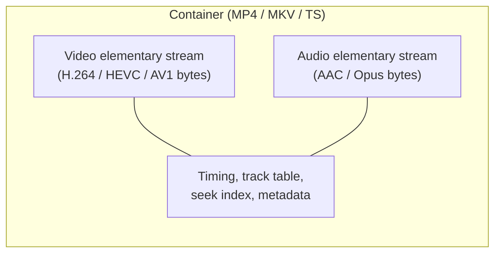
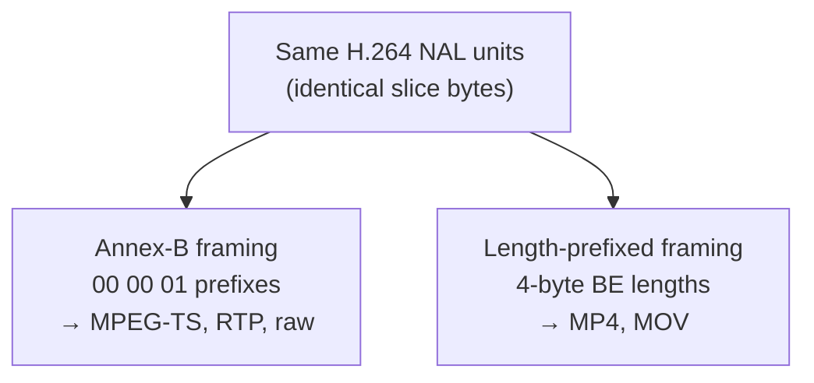
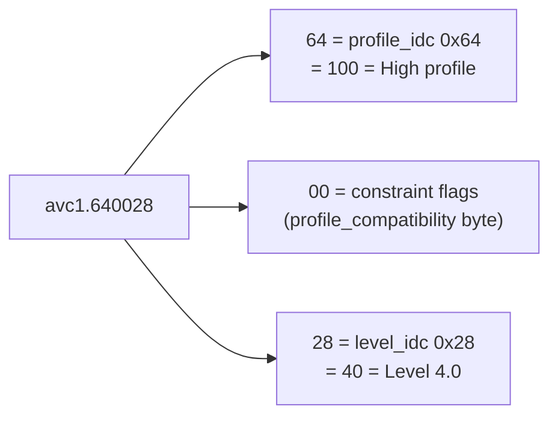
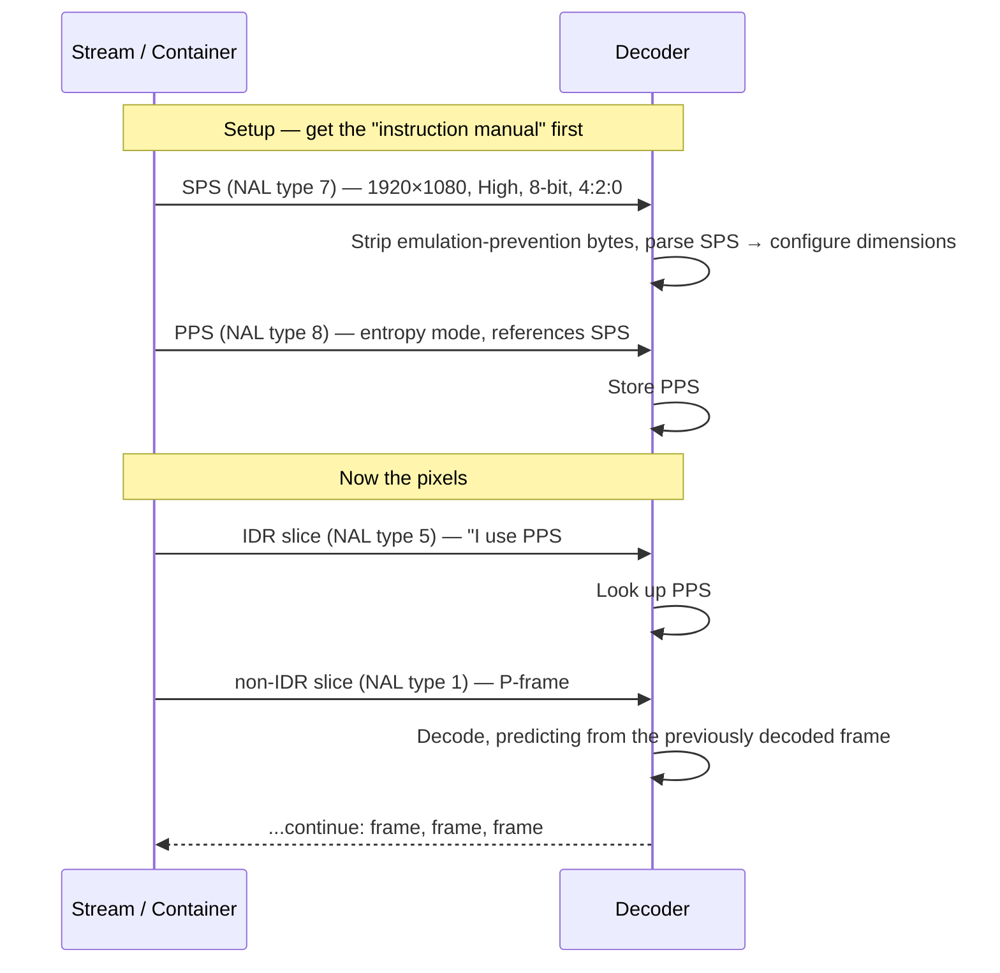

# Chapter 07 — Bitstreams, NAL Units & Codec Strings

> **Part II · Codecs** — What the encoder's compressed bytes actually look like, how they're chopped into packets, and how a player reads a string like `avc1.640028` to know what it's about to decode.

[Chapter 06](06-encoders-and-rate-control.md) ended with an encoder producing compressed bytes. But "compressed bytes" is too vague to be useful — a decoder can't just be handed a blob and told "good luck." The bytes have **structure**: they're framed into typed packets, some carry pixels and some carry *instructions for reading the pixels*, and the whole thing has to be self-describing enough that a player can look at it and answer "is this H.264 High profile at 1080p, or HEVC Main 10?" *before* it commits to decoding. This chapter is the byte-level tour of the **elementary stream** — the raw output of the codec, separate from the container that will later wrap it.

---

## The elementary stream vs. the container

First, a clean separation that everything else hangs on:

- The **elementary stream (ES)** is the pure, naked output of the codec — the compressed video (or audio) bytes and nothing else. It has *no* notion of a filename, a timestamp track, an audio track playing alongside, or how to seek. It's just: frame, frame, frame, encoded.
- The **container** (MP4, MKV, MPEG-TS — [Chapter 09](09-containers-and-muxing.md)) is the box that *wraps* one or more elementary streams, adds timestamps, interleaves audio with video, records the duration, and makes the whole thing seekable and playable.



> 🧠 **Mental model:** The elementary stream is a **letter**; the container is the **envelope** — with the address, the stamp, and room for a second letter (audio) in the same envelope. You can take the exact same letter and put it in different envelopes (remux MP4 → MKV) without rewriting a word of it. This chapter is about the *letter*.

The same elementary stream can be carried two different ways depending on the envelope — and that difference (Annex-B vs. length-prefixed, below) is one of the most common sources of "why won't this file play" bugs. Let's build up to it.

---

## NAL units: typed packets (H.264 & HEVC)

H.264 and HEVC don't emit one undifferentiated stream of bits. They chop the stream into **NAL units** — *Network Abstraction Layer* units. The name is deliberate: the designers separated the **video coding layer** (the actual compression math) from the **network abstraction layer** (how you packetize it to send over a network, a file, or a broadcast). A NAL unit is the transport-friendly atom.

Each NAL unit is a typed packet. There are two broad families:

- **VCL NAL units** (*Video Coding Layer*) — these carry the actual encoded picture data, i.e. **slices**. A frame is made of one or more slices, and each slice is a VCL NAL. This is the pixels.
- **non-VCL NAL units** — everything else: the *metadata and instructions* a decoder needs. Parameter sets (SPS/PPS/VPS), supplemental info (SEI), and structural markers (AUD).

### The NAL header

Every H.264 NAL unit begins with a **single header byte**:

| Bits | Field | Meaning |
|------|-------|---------|
| 1 | `forbidden_zero_bit` | always 0 (a corruption check) |
| 2 | `nal_ref_idc` | priority / "is this referenced by other frames?" |
| 5 | `nal_unit_type` | **what kind of NAL this is** (0–31) |

So the type is just the low 5 bits of the first byte. A worked example: the byte **`0x67`** is `0110 0111` in binary → `forbidden=0`, `nal_ref_idc=11` (3, high priority), `nal_unit_type=00111` (**7**). Type 7 is an SPS. Here are the H.264 types you'll meet constantly:

| `nal_unit_type` | Name | Family | Typical header byte |
|:---:|------|--------|:---:|
| 1 | Coded slice, **non-IDR** (P/B frame) | VCL | `0x41`, `0x61` |
| 5 | Coded slice, **IDR** (keyframe) | VCL | `0x65` |
| 6 | **SEI** (supplemental enhancement info) | non-VCL | `0x06` |
| 7 | **SPS** (sequence parameter set) | non-VCL | `0x67` |
| 8 | **PPS** (picture parameter set) | non-VCL | `0x68` |
| 9 | **AUD** (access unit delimiter) | non-VCL | `0x09` |

> 🔬 **Going deeper:** **HEVC's NAL header is two bytes**, because it needed more room: a 6-bit `nal_unit_type` (so types run 0–63), a 6-bit `nuh_layer_id` (for layered/scalable coding), and a 3-bit `nuh_temporal_id_plus1` (for temporal sub-layers). HEVC's important types differ accordingly: **VPS = 32**, **SPS = 33**, **PPS = 34**, IDR slices are **19/20**, and prefix/suffix SEI are **39/40**. The *concept* is identical to H.264 — typed packets, VCL vs. non-VCL — just a wider header and a renumbered table.

> 🧠 **Mental model:** Think of a NAL stream as a **train**. Most cars are freight (VCL slices — the cargo is pixels). But interspersed are special cars: the **manifest** (SPS/PPS — "here's how to read the freight"), **notes for the crew** (SEI — closed captions, HDR metadata), and **couplers between trains** (AUD — "a new frame starts here"). The decoder reads the manifest cars first, then knows how to unload the freight.

---

## Framing: how do you find where each NAL begins?

A NAL unit is just a run of bytes. But the decoder receives a continuous stream — *where does one NAL end and the next begin?* There are two completely different answers, and **which one a file uses depends on the container.** This is the single most important practical fact in this chapter.

### Framing #1 — Annex-B (start codes)

The classic method, named after Annex B of the H.264 spec. Every NAL unit is preceded by a **start code**: either the 3-byte sequence `00 00 01` or the 4-byte `00 00 00 01`. The decoder scans for these magic bytes; everything between two start codes is one NAL.

```
00 00 00 01 67 64 00 28 ...      ← start code + SPS (type 7)
00 00 00 01 68 EE 3C 80          ← start code + PPS (type 8)
00 00 00 01 65 88 84 00 ...      ← start code + IDR slice (type 5)
00 00 01    41 9A 12 ...         ← (3-byte) start code + non-IDR slice (type 1)
```

- ✅ **Self-synchronizing.** If you join a broadcast or RTP stream midway, you just scan forward for the next `00 00 01` and you're aligned. No external index needed.
- ✅ Perfect for **streaming and broadcast** transports where there's no file-level table of contents: **MPEG-TS**, **RTP**, raw `.h264`/`.265` "elementary" files.
- ❌ Scanning for start codes costs CPU, and the payload could *accidentally* contain `00 00 01` — which would be catastrophically misread as a NAL boundary. (The fix is emulation prevention, below.)

### Framing #2 — length-prefixed (AVCC / HVCC)

The method used **inside MP4 and MOV**. There are no start codes. Instead, each NAL unit is preceded by an explicit **length field** — usually **4 bytes, big-endian** — that says exactly how many bytes the NAL is. The decoder reads the length, then reads exactly that many bytes, then reads the next length. No scanning, no ambiguity.

```
00 00 00 1A 65 88 84 00 ...      ← length = 0x0000001A (26) + IDR NAL (starts 0x65)
00 00 00 09 41 9A 12 ...         ← length = 0x00000009 (9)  + non-IDR NAL (starts 0x41)
```

- ✅ **No scanning, no accidental-start-code problem.** O(1) to jump to the next NAL.
- ✅ Ideal for **file containers** (MP4) that already have a seek index and random access.
- ❌ **Not self-synchronizing** — lose your place and you can't recover by scanning; you need the container's index. Useless for a midstream broadcast join.

The length field's size isn't always 4 — it's recorded in the config record (the `avcC`'s `lengthSizeMinusOne`, so 1, 2, or 4 bytes), but **4 bytes big-endian is overwhelmingly the common case.**

> ⚠️ **The #1 remux gotcha:** the *exact same* H.264 slices are framed with **start codes in MPEG-TS** and with **length prefixes in MP4**. When you remux a `.ts` into an `.mp4` (no re-encoding!), the bytes of each NAL are identical, but you **must** strip the `00 00 01` start codes and replace them with 4-byte length prefixes (and move the SPS/PPS out to the config record — see bootstrap below). Get this wrong and the file is silently broken. This conversion is bread-and-butter work for a demuxer/muxer.



### Emulation-prevention bytes: the `00 00 03` trick

Annex-B has a problem: what if the *actual compressed payload* happens to contain the bytes `00 00 01`? The decoder would mistake it for a start code and shatter. The solution is **emulation prevention.** Whenever the encoder is about to write a `00 00 00`, `00 00 01`, `00 00 02`, or `00 00 03` inside the payload, it inserts an **emulation-prevention byte `0x03`** after the two zeros:

| Raw payload bytes (RBSP) | Written to stream (EBSP) |
|---|---|
| `00 00 00` | `00 00 03 00` |
| `00 00 01` | `00 00 03 01` |
| `00 00 02` | `00 00 03 02` |
| `00 00 03` | `00 00 03 03` |

The decoder, when reading, watches for `00 00 03` and **deletes the `03`**, recovering the original bytes. The clean, de-escaped bytes are called the **RBSP** (*Raw Byte Sequence Payload*); the escaped, on-the-wire form is the **EBSP** (*Encapsulated* RBSP).

> 🔬 **Going deeper:** This is exactly why a parser that wants to read fields out of an SPS (to get the resolution, say) must **first strip emulation-prevention bytes** before doing the bit-by-bit Exp-Golomb decode — otherwise a stray `03` lands in the middle of a field and the whole parse desyncs. AV1's OBU framing (below) sidesteps this entirely by using explicit length fields instead of start codes, so it needs no emulation prevention.

---

## Parameter sets: the decoder's instruction manual

Here is the deepest "aha" of the chapter. The slices (VCL NALs) are just *pixels* — but pixels relative to *what*? What resolution? What chroma format? 8-bit or 10-bit? Which entropy-coding mode? Those answers don't live in every slice (that would be wasteful — they barely change). They live in **parameter sets**, which the slices then *reference by ID*.

| Set | Scope | Carries (the important bits) |
|-----|-------|------------------------------|
| **SPS** — Sequence Parameter Set | a whole **sequence** of frames | **width & height**, profile & level, **chroma format** (4:2:0/4:2:2/4:4:4), **bit depth**, frame-cropping, VUI (color info) |
| **PPS** — Picture Parameter Set | a picture (or group) | entropy mode (CABAC vs CAVLC), quantization defaults, slice-group config, deblocking |
| **VPS** — Video Parameter Set *(HEVC only)* | the whole stream, above SPS | layer/sub-layer structure for scalable & multi-view HEVC |

The **SPS is the source of truth for the video's dimensions.** When a tool reports "1920×1080," it parsed that out of the SPS — not the container (the container can lie or omit it). A slice header says "I belong to PPS #0," and PPS #0 says "I belong to SPS #0," and SPS #0 says "we're 1920×1080, High profile, 8-bit, 4:2:0." That chain is how a decoder configures itself.

> 🛠️ **In rivet:** We lean on this directly. When our muxer builds the `CODECS=` attribute for an HLS playlist or validates that two independently-encoded chunks are compatible, it **parses the SPS** (our `parse_h264_sps` / `parse_hevc_sps`) to read profile/level/chroma/bit-depth/dimensions straight from the bitstream — never trusting a container field that might be wrong. The SPS *is* the contract. (More on that in the codec-strings section below.)

### Inside an SPS: how the width and height are actually stored

It's worth opening the hood once, because "just read the resolution from the SPS" hides a beautifully economical encoding. The SPS doesn't store width and height as plain 16-bit integers. It stores them with **Exp-Golomb coding** — a variable-length scheme where small numbers cost few bits and large numbers cost more — and it stores them in **macroblock units**, not pixels.

An unsigned Exp-Golomb codeword (`ue(v)`) is built as: count the leading zero bits (call it `n`), then read one `1`, then read `n` more bits; the value is `2^n − 1 + (those n bits)`:

| Bits | leading zeros | value |
|------|:---:|:---:|
| `1` | 0 | 0 |
| `010` | 1 | 1 |
| `011` | 1 | 2 |
| `00100` | 2 | 3 |
| `00111` | 2 | 6 |

For H.264, width and height come from these fields (each `ue(v)`):

```
pic_width_in_mbs_minus1            → width  = (value + 1) × 16
pic_height_in_map_units_minus1     → height = (value + 1) × 16   (for progressive frames)
```

So a 1920×1080 video stores `pic_width_in_mbs_minus1 = 119` (because (119+1)×16 = 1920) and a height in 16-pixel **macroblocks**. But 1080 is **not** divisible by 16 (1080 = 67.5 macroblocks!). The encoder rounds *up* to 68 macroblocks = **1088** coded pixels, then stores a **frame-cropping rectangle** (`frame_crop_bottom_offset`) telling the decoder to shave 8 lines off the bottom for display. This is why the SPS is the *true* source of dimensions: the coded size (1088) and the display size (1080) differ, and only the SPS's crop fields reconcile them.

> 🔬 **Going deeper:** This is also why parsing an SPS requires **first stripping emulation-prevention bytes** (above) and then doing a careful *bit-by-bit* read — the fields are not byte-aligned, an Exp-Golomb codeword can straddle byte boundaries, and a single misread bit desyncs everything after it. HEVC uses the same Exp-Golomb machinery but stores `pic_width_in_luma_samples` / `pic_height_in_luma_samples` directly in luma samples with a separate conformance-window crop. AV1's sequence header stores `max_frame_width_minus_1` / `max_frame_height_minus_1` as plain fixed-width fields — no Exp-Golomb — which is one of many ways AV1's bitstream is more parser-friendly.

### SEI: the metadata side-channel

One more non-VCL NAL type deserves a callout: **SEI** (*Supplemental Enhancement Information*, H.264 type 6, HEVC types 39/40). SEI carries information that is **not required to decode the pixels** but *is* required to present them correctly. The decoder may ignore it and still produce a valid picture — but a player that wants to do the right thing reads it. SEI messages carry, among other things:

- **HDR static metadata** — *mastering display colour volume* (SMPTE ST 2086) and *content light level* (MaxCLL/MaxFALL), so an HDR display knows the mastering monitor's peak brightness and gamut ([Chapter 15](15-filters-scaling-tonemapping.md)).
- **Closed captions** (CEA-608/708, embedded in `user_data` SEI).
- **Picture timing** — buffering and timing hints for the decoder.
- **Recovery points** — "you can start clean decoding from here" markers for streams without frequent IDRs.

> 🧠 **Mental model:** If the SPS is the *manual* and the slices are the *cargo*, SEI is the **sticky notes** — "this is HDR, mastered at 1000 nits," "captions are in here," "you can safely tune in starting now." Optional to read, but ignore them and you get a technically-correct picture that's too dark, uncaptioned, or starts with a glitch.

---

## Bootstrapping: the decoder needs the manual *before* the pixels

A decoder cannot decode slice #1 of a keyframe until it already has the SPS and PPS that slice references. So the obvious question: **how do the parameter sets reach the decoder before the first slice?** Two strategies — and they map onto two different MP4 sample-entry names you'll see constantly.

### Out-of-band: `avc1` / `hvc1`

In MP4, the parameter sets can be stored **once, up front, in the container's config record** — outside the stream of samples (hence "out-of-band"). For H.264 this record is the **`avcC` box** (*AVCDecoderConfigurationRecord*); for HEVC it's **`hvcC`**. The decoder reads the config record at setup time, ingests the SPS/PPS, and is ready before the first sample arrives. The MP4 *sample entry* is named **`avc1`** (H.264) or **`hvc1`** (HEVC) to signal "parameter sets are out-of-band; you won't find them inline."

The `avcC` box layout is small and worth seeing, because its first four bytes are *the exact source* of the codec string we'll decode next:

| Offset | Field | Example |
|:---:|------|:---:|
| 0 | `configurationVersion` | `01` |
| 1 | `AVCProfileIndication` (= `profile_idc`) | `64` (High) |
| 2 | `profile_compatibility` (constraint flags) | `00` |
| 3 | `AVCLevelIndication` (= `level_idc`) | `28` (4.0) |
| 4 | `lengthSizeMinusOne` (low 2 bits) | `FF` → length size 4 |
| 5… | SPS count + SPS NAL(s), then PPS count + PPS NAL(s) | |

### In-band: `avc3` / `hev1`

Alternatively, the parameter sets travel **inside the sample stream**, repeated at (or before) **every keyframe**. The decoder picks them up in-line as it goes. The MP4 sample entry is then named **`avc3`** (H.264) or **`hev1`** (HEVC). This is what **Annex-B transports always do** (MPEG-TS repeats SPS/PPS at each IDR so a mid-stream join can decode), and it's what you want for **segmented streaming (CMAF/HLS, [Chapter 11](11-adaptive-bitrate-streaming.md))**, where a player may start at *any* segment and each segment must therefore be independently decodable — it can't rely on an init segment it might have skipped.

| | `avc1` / `hvc1` | `avc3` / `hev1` |
|---|---|---|
| Parameter sets | **out-of-band** in `avcC`/`hvcC` | **in-band**, repeated at keyframes |
| Best for | single-file VOD (one config up front) | streaming, segments, mid-stream join |
| Self-contained segments? | no (need the init/config) | yes (each keyframe carries its own SPS/PPS) |

> 🛠️ **In rivet:** Our bitstream muxer (`nal_mux`) supports **both**. For a plain single-file MP4 it emits `avc1`/`hvc1` with parameter sets out-of-band in the config box. For our multi-GPU **chunk-and-stitch** path — where independent GPUs each encode a slice of the timeline and we splice the results — it switches to `avc3`/`hev1` and keeps the SPS/PPS **inline in every chunk**, so chunks from different encoders (even different GPU vendors) each decode with their *own* parameter sets and stitch cleanly. We mirrored exactly what AV1 does natively with inline sequence-header OBUs (next).

---

## AV1's answer: OBUs

AV1 doesn't use NAL units or Annex-B start codes at all. Its atom is the **OBU** — *Open Bitstream Unit*. The idea is the same (typed packets) but the framing is cleaner: each OBU has a small header (a 4-bit `obu_type`, an extension flag, and a "has size field" flag) and is **self-delimited by an explicit LEB128 length field** — so there's no start-code scanning and **no emulation-prevention bytes needed.**

| `obu_type` | Name | Role (analogy) |
|:---:|------|----------------|
| 1 | **OBU_SEQUENCE_HEADER** | the "SPS" of AV1 — resolution, profile, bit depth, color config |
| 2 | OBU_TEMPORAL_DELIMITER | frame boundary marker (like AUD) |
| 3 | OBU_FRAME_HEADER | per-frame parameters |
| 4 | OBU_TILE_GROUP | the actual coded tile data (the "pixels") |
| 6 | **OBU_FRAME** | frame header + tile group combined (the common case) |
| 5 | OBU_METADATA | HDR metadata, etc. (like SEI) |

The **sequence header OBU** is AV1's parameter-set equivalent — it's the source of truth for dimensions and profile, just like the SPS. In MP4, it's stored in the **`av1C` box** (*AV1CodecConfigurationRecord*), the AV1 analog of `avcC`. AV1 sample entries are always **`av01`**.

> 🧠 **Mental model:** Three codecs, one idea. **"Here's how to read the pixels"** travels as an **SPS** (H.264), an **SPS/VPS** (HEVC), or a **sequence-header OBU** (AV1). **"Here are the pixels"** travels as a **slice** (H.264/HEVC) or a **tile group / frame OBU** (AV1). Learn the pattern once and every codec's bitstream stops being mysterious.

---

## Reading codec strings: `avc1.640028` decoded

Now the payoff — the thing you'll *actually* type and read in the wild. When a website hands video to a browser via HLS, DASH, or the HTML `<source>`/`MediaSource` API, it advertises the codec with a compact **codec string** like `codecs="avc1.640028, mp4a.40.2"`. The browser parses it to decide *can I even play this?* **before** downloading a byte of media. These strings are dense but completely decodable once you know the grammar — and they come **straight out of the SPS / config record** we just dissected.

### `avc1.640028` — H.264

The format is `avc1.PPCCLL`, three hex byte-pairs taken verbatim from the first three meaningful bytes of `avcC`:



- `avc1` → it's AVC / H.264 (out-of-band parameter sets).
- `64` → `profile_idc = 0x64 = 100` → **High profile**. (Common values: `42`=Baseline/Constrained Baseline, `4D`=Main, `64`=High.)
- `00` → the constraint-set flags byte; `00` means no extra constraints asserted.
- `28` → `level_idc = 0x28 = 40`. Levels are the number ÷ 10, so **Level 4.0** (max ~1080p30 or 720p60). `1F`=3.1, `33`=5.1, etc.

**The beautiful part:** remember the Annex-B SPS example earlier, whose payload started `67 64 00 28`? Those bytes `64 00 28` after the NAL header *are* the profile/constraint/level — the **identical bytes** that become `avc1.640028`. The codec string is just the SPS's identity, lifted out and hex-encoded.

### `hev1.2.4.L93.B0` — HEVC

HEVC strings are dot-separated fields (this example happens to be the in-band `hev1` flavor; `hvc1` would mean out-of-band):

- `hev1` → HEVC, parameter sets in-band.
- `2` → `general_profile_space` (empty) + `general_profile_idc = 2` → **Main 10** (10-bit!). Profile 1 = Main (8-bit), 2 = Main 10, 3 = Main Still Picture.
- `4` → `general_profile_compatibility_flags`, in hex → `0x4`.
- `L93` → tier + level. **`L` = Main tier** (`H` = High tier), and `93` is the `general_level_idc`. HEVC levels are the number ÷ 30, so `93 / 30 =` **Level 3.1**. (`L120` = 4.0, `L150` = 5.0.)
- `B0` → the first constraint-indicator-flags byte.

So `hev1.2.4.L93.B0` reads as: **HEVC, Main 10 (10-bit), Main tier, Level 3.1.** A player that can't do 10-bit HEVC bails right here, having downloaded nothing.

### `av01.0.08M.10` — AV1

AV1 strings follow `av01.P.LLT.DD`:

- `av01` → AV1.
- `0` → `seq_profile = 0` → **Main** profile (4:2:0, 8- or 10-bit). Profile 1 = High (4:4:4), 2 = Professional.
- `08M` → `seq_level_idx = 08` and `M` = **Main tier** (`H` = High tier). Level index 8 maps to **AV1 Level 4.0** (the index encodes level as `2.0 + idx`, four steps per major; idx 8 → 4.0).
- `10` → **10-bit** depth. (`08` would be 8-bit, `12` 12-bit.)

So `av01.0.08M.10` = **AV1 Main profile, Level 4.0 Main tier, 10-bit.** (The full AV1 string can append more fields — monochrome flag, chroma subsampling, color primaries/transfer/matrix — but the short three-field form above is what you'll usually see.)

### `mp4a.40.2` — AAC audio (preview of [Chapter 08](08-audio.md))

Audio gets a codec string too:

- `mp4a` → MPEG-4 Audio.
- `40` → `objectTypeIndication = 0x40` → MPEG-4 Audio.
- `2` → audio object type **2 = AAC-LC** (Low Complexity — the streaming default). `mp4a.40.5` = HE-AAC, `mp4a.40.29` = HE-AAC v2.

(Opus, by contrast, has the trivially simple codec string **`opus`** — no parameters — which is one of many small ways the modern codecs are nicer to work with.)

| Codec string | Decodes to |
|---|---|
| `avc1.640028` | H.264 High, Level 4.0, 8-bit |
| `avc1.42E01F` | H.264 Constrained Baseline, Level 3.1 |
| `hev1.2.4.L93.B0` | HEVC Main 10, Main tier, Level 3.1 |
| `hvc1.1.6.L120.90` | HEVC Main (8-bit), Main tier, Level 4.0 |
| `av01.0.08M.10` | AV1 Main, Level 4.0, 10-bit |
| `mp4a.40.2` | AAC-LC |
| `opus` | Opus |

> 🛠️ **In rivet:** Our `codec_strings` module **generates these strings by parsing the bitstream we just produced** — it reads the SPS/`avcC` (or `hvcC`/`av1C`) for the profile, tier, level, and bit-depth fields and formats the exact `avc1.…` / `hev1.…` / `av01.…` token for the HLS `CODECS=` attribute. Because it's read from the real config box rather than guessed, the playlist's advertised codec always matches the bytes a player will actually receive — which is the whole point of the string: an honest "can you play this?" gate.

### Why the string is load-bearing: the support gate

The codec string isn't decoration — it's the **contract a player uses to refuse playback before wasting bandwidth.** A browser exposes exactly this check:

```js
MediaSource.isTypeSupported('video/mp4; codecs="av01.0.08M.10"')  // → true / false
```

The player concatenates the container MIME type and the codec string, and the browser answers whether it can decode that *specific* profile/level/depth — `true` for AV1 8-bit on a modern browser, perhaps `false` for AV1 12-bit or HEVC Main 10 on hardware that lacks it. The richer `navigator.mediaCapabilities.decodingInfo({...})` API goes further, reporting not just *supported* but *smooth* and *power-efficient* (i.e. "is there hardware decode?"). An ABR player ([Chapter 11](11-adaptive-bitrate-streaming.md)) reads the `CODECS=` attribute from the master playlist and **silently skips any rendition it can't play** — so an honest, correctly-formatted codec string is the difference between graceful fallback and a black screen. Advertise `avc1.640028` but actually ship 10-bit High 4:2:2, and the player commits to a stream it then chokes on.

---

## Putting it together: a decoder bootstrapping a stream

Here's the full sequence a decoder runs when it opens an H.264 elementary stream and decodes the first keyframe — every concept from this chapter in order:



Notice the ordering is **mandatory**: SPS → PPS → IDR slice. Hand the decoder the IDR first and it errors out ("no parameter sets") — exactly the failure mode that the out-of-band `avcC` (config-first) and in-band `avc3` (params-at-every-keyframe) strategies exist to prevent. When you see a stream that plays from the start but breaks when you seek, or plays in VLC but not a browser, the cause is almost always a parameter-set delivery problem — and now you know precisely where to look.

---

## Recap

- The **elementary stream** is the codec's raw compressed output — the "letter"; the **container** ([Chapter 09](09-containers-and-muxing.md)) is the "envelope" that adds timing, tracks, and seeking.
- **H.264/HEVC split the stream into typed NAL units.** **VCL** NALs carry slices (pixels); **non-VCL** NALs carry the metadata: **SPS** (sequence — *the source of truth for resolution, profile, bit depth, chroma*), **PPS** (picture), **VPS** (HEVC only), **SEI**, **AUD**. The type is the low 5 bits of the H.264 NAL header byte (e.g. `0x67` → type 7 → SPS).
- **Two framings, chosen by the container:** **Annex-B** uses `00 00 01` / `00 00 00 01` **start codes** (self-synchronizing → MPEG-TS, RTP, raw streams) and needs **emulation-prevention `00 00 03`** bytes; **length-prefixed** (AVCC/HVCC) uses **4-byte big-endian lengths** with no scanning (→ MP4/MOV). Remuxing between them rewrites the framing, not the slice bytes.
- A decoder needs **parameter sets before the first slice.** **Out-of-band** (`avc1`/`hvc1`) stores them once in the `avcC`/`hvcC` config record; **in-band** (`avc3`/`hev1`) repeats them at every keyframe — the latter is essential for segmented streaming where a player joins mid-stream.
- **AV1 uses OBUs** instead of NALs (length-delimited, no emulation prevention); the **sequence-header OBU** is its SPS-equivalent, stored in `av1C`, and sample entries are `av01`.
- **Codec strings** are the SPS/config record, hex-encoded, so a player can gate playback before downloading media: `avc1.640028` = H.264 High/L4.0, `hev1.2.4.L93.B0` = HEVC Main 10/L3.1, `av01.0.08M.10` = AV1 Main/L4.0/10-bit, `mp4a.40.2` = AAC-LC.

**Next:** [Chapter 08 — Audio in Brief](08-audio.md) — the other, smaller elementary stream riding in the same envelope: how sound becomes samples, the codecs that compress it, and the crucial passthrough-vs-transcode decision that decides whether you touch it at all.
