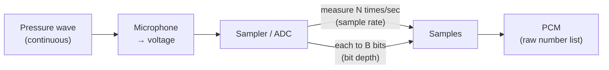
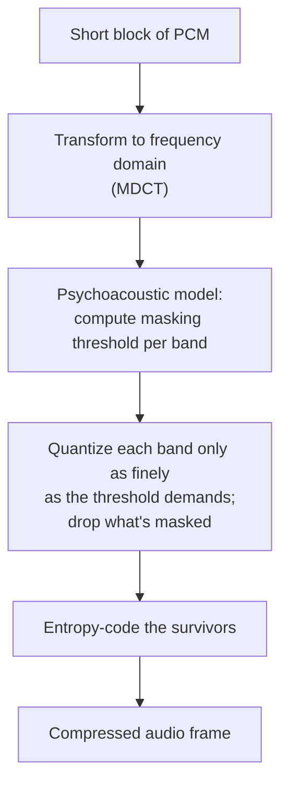
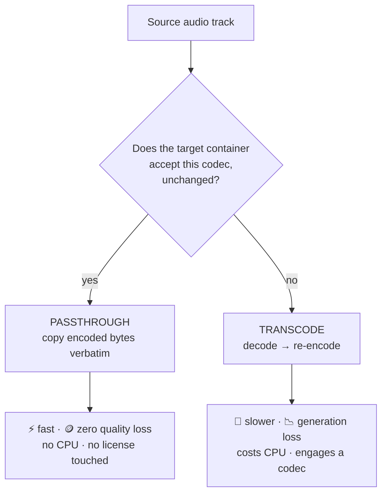
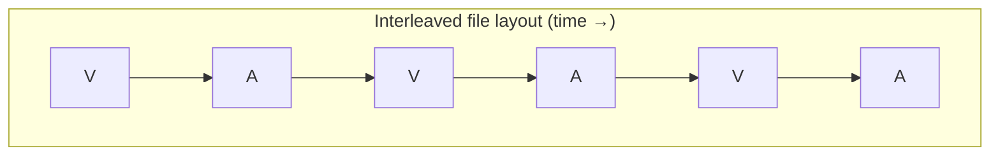

# Chapter 08 — Audio in Brief

> **Part II · Codecs** — The other, much smaller stream riding in the same envelope: how sound becomes numbers, the codecs that shrink it, and the one decision — copy it or re-encode it — that matters most in a transcoder.

So far this course has been relentlessly about pixels. But every video file you've ever watched carries a second, parallel stream that's just as important to the experience and far cheaper to handle: **audio**. A viewer will forgive a slightly soft image; they will *not* forgive crackling, out-of-sync, or missing sound. The good news is that audio is conceptually simpler than video and an order of magnitude smaller in data — a whole audio track often costs less than a single video *rung*. This chapter is the complete-but-compact tour: sampling, bit depth, channels, the codec zoo, the all-important **passthrough vs. transcode** choice, and how audio sits inside the container in lockstep with the video.

---

## Sound is a wave; digital audio is a list of numbers

Sound is a **pressure wave** — air molecules compressing and rarefying, vibrating your eardrum. A microphone converts that pressure into a continuously varying **voltage**. To store it digitally we have to turn that smooth, continuous curve into a finite list of numbers. Two questions define how:

1. **How often do we measure it?** → the **sample rate**.
2. **How precisely do we record each measurement?** → the **bit depth**.



The result of this process — a raw list of amplitude numbers — is called **PCM** (*Pulse-Code Modulation*). PCM is to audio what a raw, uncompressed pixel buffer is to video: the honest, lossless, *huge* baseline that everything else compresses.

### Sample rate & Nyquist

The **sample rate** is how many amplitude measurements we take per second, in hertz (Hz). The two you'll meet constantly:

- **44.1 kHz** — the CD standard (44,100 samples/second). Still common in music files.
- **48 kHz** — the **video and professional standard**. Essentially all video audio is 48 kHz. When in doubt in a video pipeline, it's 48 kHz.

Why those specific numbers? Because of the **Nyquist–Shannon theorem**, one of the load-bearing facts of all signal processing:

> 🧠 **Mental model — Nyquist:** To faithfully capture a sound containing frequencies up to **f**, you must sample at **at least 2 × f**. Sample any slower and high frequencies don't just vanish — they **alias**, folding back down and masquerading as *false low-frequency tones* (the audio equivalent of a wagon wheel spinning backward in a film). The sample rate is a hard ceiling on the highest frequency you can represent: at rate **R**, the maximum is **R / 2**, the *Nyquist frequency*.

Human hearing tops out around **20 kHz**. So you need to sample at ≥ 40 kHz to capture everything we can hear. 44.1 kHz captures up to 22.05 kHz; 48 kHz up to 24 kHz. The few extra kHz above 20 aren't wasted — they give the **anti-aliasing filter** (which must remove everything above Nyquist *before* sampling) room to roll off gently instead of needing a physically impossible brick-wall cutoff exactly at 20 kHz.

### Bit depth & dynamic range

Each sample is a number, and the **bit depth** is how many bits that number gets — which sets how *finely* we can distinguish loud from quiet:

- **16-bit** — the CD / streaming standard. 65,536 possible amplitude levels.
- **24-bit** — studio / production. 16.7 million levels, more headroom for editing.

The practical meaning of bit depth is **dynamic range** — the ratio between the loudest and the quietest sound you can represent before the quiet end dissolves into quantization noise. The rule of thumb: **each bit ≈ 6 dB of dynamic range.**

- 16-bit → ~**96 dB** of dynamic range — already enormous (roughly the gap between a whisper and a jackhammer).
- 24-bit → ~**144 dB** — more than the ear or any speaker can actually use, but valuable as editing headroom so rounding errors never reach the audible floor.

> 🔬 **Going deeper:** Sample rate controls the *frequency* axis (how high a pitch you can store); bit depth controls the *amplitude* axis (how wide a loudness range, and how low the noise floor). They're orthogonal. A 48 kHz / 16-bit file can store any pitch up to 24 kHz with ~96 dB of range — which comfortably exceeds human perception on both axes, which is exactly why it became the consumer standard.

### Channels & layouts

A single stream of samples is **mono** (one channel). Most content is **stereo** (two channels — Left, Right — for spatial imaging). Surround formats add more:

| Layout | Channels | Composition |
|--------|:---:|-------------|
| Mono | 1 | C |
| **Stereo** | 2 | L, R |
| **5.1** | 6 | L, R, **C** (center/dialogue), **LFE** (subwoofer), Ls, Rs (rear surrounds) |
| **7.1** | 8 | 5.1 + two side surrounds |

The **".1"** is the **LFE** — *Low-Frequency Effects* — a band-limited channel for the subwoofer (the rumble), which needs so little bandwidth it counts as a fraction of a channel. A **channel layout** is the agreed mapping of each channel's samples to a physical speaker position; get the mapping wrong on a remux and the center-channel dialogue ends up in the subwoofer. Channels are interleaved sample-by-sample in PCM: `L R L R L R …` for stereo.

---

## Why we compress audio too

Let's price out raw PCM to see why audio codecs exist. Bitrate is just `sample_rate × bit_depth × channels`:

```
48,000 samples/s  ×  16 bits  ×  2 channels  =  1,536,000 bits/s  ≈  1.5 Mbit/s
```

So uncompressed stereo audio is about **1.5 Mbit/s** (CD-rate 44.1 kHz is ~1.41 Mbit/s). That's small next to video — but a transparent-quality *compressed* audio stream needs only ~**128 kbit/s**, a **~12× reduction**, and a 5.1 PCM track would be ~4.6 Mbit/s, which is no longer negligible. Audio codecs shrink the stream dramatically with no *audible* loss by exploiting the limits of human hearing — chiefly **psychoacoustic masking.**

### How lossy audio compression works: masking

The ear is not a perfect instrument; it has measurable blind spots, and lossy audio codecs are engineered to hide all their errors *inside* those blind spots. The central trick is **masking** — a loud sound rendering a nearby quieter sound **inaudible.**

- **Frequency masking (simultaneous masking):** a loud tone at, say, 1 kHz raises the **threshold of hearing** in a band of frequencies around it. A quiet tone at 1.1 kHz that would be plainly audible in silence becomes *completely inaudible* when the 1 kHz tone is playing. The codec computes this **masking threshold** across the spectrum for each short block of audio, then **quantizes coarsely (or discards entirely)** any spectral content that falls below the threshold — because no listener could ever hear it.
- **Temporal masking:** a loud sound also masks quieter sounds *just before* it (pre-masking, a few ms) and *just after* it (post-masking, up to ~100 ms). So quantization noise can be hidden in the moments shadowing a transient.



> 🧠 **Mental model:** Masking is to audio what chroma subsampling ([Chapter 02](02-color-and-pixels.md)) is to video — both spend bits only where a human can actually perceive the difference and throw away the rest. A lossy audio codec isn't trying to preserve the *waveform*; it's trying to preserve the *listening experience*, and the masking model is its map of where it can cheat. This is exactly why re-encoding already-lossy audio (transcode) degrades it: the second encoder's masking model can't perfectly recover what the first one's quantization already perturbed, so small errors compound.

---

## The audio codec zoo

| Codec | Type | Royalty | Where you meet it |
|-------|------|---------|-------------------|
| **AAC** (AAC-LC) | lossy | licensed | The MP4 / streaming **default**; iTunes, YouTube, broadcast |
| **Opus** | lossy | **royalty-free** | The modern web/WebRTC default; superb at low bitrate |
| **MP3** | lossy | expired (free now) | Legacy ubiquity; podcasts, old libraries |
| **AC-3 / E-AC-3** | lossy | licensed (Dolby) | Broadcast, cinema, streaming **surround** |
| **Vorbis** | lossy | royalty-free | Older open stacks; WebM, OGG |
| **FLAC** | **lossless** | royalty-free | Archival, audiophile; ~50–60% of PCM size |

### AAC — the streaming workhorse

**AAC** (*Advanced Audio Coding*, the successor to MP3) is the default audio codec of the MP4 world. The variant you'll see 95% of the time is **AAC-LC** (*Low Complexity*) — the right balance of quality, decode cost, and universal support; it's the `mp4a.40.2` codec string from [Chapter 07](07-bitstreams-and-nal-units.md). Transparent for most listeners at ~128 kbit/s stereo.

Like video's SPS, an AAC decoder needs a small config blob before it can decode: the **AudioSpecificConfig (ASC)**, which encodes the object type, sample rate, and channel configuration. In MP4 the ASC rides inside the **`esds` box** (*Elementary Stream Descriptor*), the audio analog of `avcC`.

There are higher-efficiency variants for low bitrates: **HE-AAC** adds **SBR** (*Spectral Band Replication* — it reconstructs high frequencies from a compact description, great below ~64 kbit/s), and **HE-AAC v2** adds **PS** (*Parametric Stereo*). They trade a touch of fidelity and decoder ubiquity for bitrate.

### Opus — the modern, royalty-free champion

**Opus** (IETF **RFC 6716**) is the codec to reach for when you can. It's **completely royalty-free**, standardized by the IETF, and it's a hybrid of two engines — **SILK** (tuned for speech) and **CELT** (tuned for music) — that it blends adaptively. The result is *outstanding* quality across a huge bitrate range: intelligible speech at ~12 kbit/s, transparent music at ~96–128 kbit/s, all with low latency. It's the **mandatory-to-implement codec for WebRTC** and the de-facto web audio default.

Opus has a quirk that simplifies pipelines: it **always operates at 48 kHz internally.** Feed it 44.1 kHz and a resampler runs first. Its config box in MP4 is **`dOps`** (carrying the `OpusHead`), and it signals **`pre_skip`** — the encoder's startup latency, in 48 kHz ticks — so a decoder can discard the priming samples cleanly (more on priming below). Its codec string is just **`opus`**.

### The rest, briefly

- **MP3** (*MPEG-1/2 Audio Layer III*) — the codec that started the digital-music era. Lossy, everywhere, and its patents have now expired (so it's effectively free). You'll *receive* it constantly from older sources; you rarely *produce* it anymore.
- **AC-3 (Dolby Digital)** and **E-AC-3 (Dolby Digital Plus / DD+)** — the broadcast and cinema surround codecs (ATSC/DVB TV, Blu-ray, streaming 5.1/7.1). Licensed by Dolby. You typically **pass these through** untouched rather than re-encode (you can't legally or practically re-encode to Dolby without a license).
- **Vorbis** — Xiph's older royalty-free lossy codec, found in WebM and OGG. Like Vorbis-in-MKV, its three setup headers travel in the container's `CodecPrivate`. Largely superseded by Opus.
- **FLAC** — *Free Lossless Audio Codec.* **Lossless** compression (perfect reconstruction, ~50–60% of PCM size). For archival and audiophile delivery where no generation loss is tolerable.

### Typical bitrates

| Use | Codec | Bitrate (stereo) |
|-----|-------|------------------|
| Speech / podcast | Opus | 24–48 kbit/s |
| "Transparent-ish" music | AAC-LC / Opus | **96–128 kbit/s** |
| High-quality music | AAC / Opus | 192–256 kbit/s |
| 5.1 surround | E-AC-3 / AAC | 384–640 kbit/s |

The number to anchor on: **96–128 kbit/s stereo is the transparency sweet spot** for AAC-LC and Opus — most listeners on most gear can't distinguish it from the source. That's why it's the streaming default.

---

## The decision that defines a transcoder: passthrough vs. transcode

Here is the single most important operational concept for *handling* audio in a pipeline. When a transcoder ingests a file, for **each** audio track it makes one choice:



**Passthrough (a.k.a. copy / remux)** takes the source's already-compressed audio bytes and drops them, **byte-for-byte unchanged**, into the new container. Nothing is decoded, nothing re-encoded.

- ✅ **Instant** — it's a memory copy, not a computation.
- ✅ **Zero quality loss** — the bits are literally identical; there is no "generation loss."
- ✅ **No license engaged** — copying AAC bytes is not "using" the AAC codec; you never decode or encode, so no patent activity occurs. (This is a genuinely important legal nicety — [Chapter 16](16-patents-and-royalties.md).)
- ❌ Only possible when **the target container accepts the source codec** (e.g. AAC → MP4 ✓; but AAC → WebM ✗, since WebM only takes Opus/Vorbis).

**Transcode** decodes the audio all the way back to PCM, then **re-encodes** it to a different codec or settings.

- ✅ Lets you **change the format** (MP3 → Opus) or re-encode to a target bitrate.
- ❌ **Slow** (decode + encode), **costs CPU**, and — because the source was already lossy — incurs **generation loss** (re-compressing already-compressed audio degrades it further, like photocopying a photocopy).

> 🧠 **Mental model:** Passthrough is **forwarding an email** — instant, perfect copy. Transcode is **retyping the email from a printout** — slower, and every retype introduces small errors. **Always prefer passthrough when the target container allows it.** You only transcode audio when you *must*: to satisfy a container that won't carry the source codec, to hit a royalty-clean output codec, or to normalize a chaotic library to one format.

---

## Audio inside the container

Audio doesn't float free — it's a **track** in the container ([Chapter 09](09-containers-and-muxing.md)) with its own timeline, running in parallel with the video track. Three things make that coexistence work.

### Two tracks, two timelines, woven together

The container holds the video samples and the audio samples on **separate tracks**, each with its own timing, but **interleaved** in the physical byte layout so they arrive together. A player reading the file sequentially gets "a bit of video, then the audio for that moment, then more video" — instead of all the video followed by all the audio (which would force constant seeking, fatal for streaming).



### A/V sync

Every sample — video and audio — carries a **presentation timestamp (PTS)**. The player runs a clock and presents each sample at its PTS, keeping picture and sound aligned. By convention the **audio is usually the master clock**: the ear is far more sensitive to audio glitches (a dropout, a pitch wobble) than the eye is to an occasional repeated or dropped video frame, so players resync video *to* audio rather than the reverse. Audio's very fine time resolution (48,000 ticks per second) makes this **sample-accurate**.

### Priming / encoder delay (the click you don't hear)

One subtle gotcha worth knowing exists. Lossy audio encoders (AAC, Opus) work in overlapping blocks and need a few "warm-up" samples before their output is valid — so they emit a small chunk of **priming** (a.k.a. *encoder delay*) at the very start. If a decoder played those priming samples, you'd hear a click or the audio would start slightly late and drift out of sync. So the amount is **signaled and discarded**: AAC carries it via an edit list / gapless-playback metadata (~2112 samples is typical), and Opus carries it as the **`pre_skip`** field in its `OpusHead`. A correct muxer preserves this value so a correct decoder trims exactly the right amount and A/V sync is sample-perfect from the first frame.

> 🛠️ **In rivet:** Audio is a parallel, lightweight stage in our pipeline, and we run the passthrough-first policy by the book. **AAC and Opus pass through untouched** (byte-for-byte, no quality loss — and AAC passthrough stays license-clean precisely *because* we never decode or encode it); **AC-3 and E-AC-3 pass through** too. Only **MP3 and Vorbis are transcoded — to Opus at 48 kHz** (our encoder runs libopus internally at 48 kHz, resampling a 44.1 kHz MP3 source on the way in, using 20 ms frames and emitting the `dOps` config + the correct `pre_skip` per RFC 7845 so downstream sync stays exact). Anything else is dropped with a warning rather than guessed at. This is the audio half of our royalty posture: we default to **AV1 video + Opus audio + MP4**, which carries zero codec-royalty exposure on output — the licensing story we unpack in [Chapter 16](16-patents-and-royalties.md).

---

## Loudness: the metadata that decides how loud you sound

One more concept matters enormously the moment you assemble a *library* of content from many sources: **loudness normalization.** A clip ripped from a quiet indie film and an ad mastered to be punishingly loud will, played back to back, blast the viewer's ears on the transition. Bitrate doesn't fix this; **loudness** is about perceived *level*, not data rate.

The modern, standardized way to measure perceived loudness is **LUFS** (*Loudness Units relative to Full Scale*), defined by **ITU-R BS.1770** and adopted as **EBU R128** (Europe) and the ATSC A/85 target (US broadcast). LUFS is *not* a simple peak or RMS meter — it applies a **frequency weighting** that models the ear's sensitivity and **gates out silence**, producing a single number that tracks how loud a human *thinks* something is.

| Target | Integrated loudness |
|--------|---------------------|
| EBU R128 (broadcast) | **−23 LUFS** |
| Many streaming platforms | **−14 LUFS** (approx.) |
| Podcasts (common) | −16 LUFS |

Normalization works by measuring a clip's **integrated loudness** (averaged over its whole length) and applying a single gain so it hits the target — *without* re-encoding the codec (it can be applied as a gain on decode, or baked in during a transcode, or signaled as metadata the player applies, like ReplayGain / Sound Check). The key insight for a transcoder:

> 🔬 **Going deeper:** Loudness normalization is **orthogonal** to codec, bitrate, and sample rate — it's a *level* decision layered on top. A streaming service runs every uploaded asset through a loudness measurement and either normalizes the audio or stores a gain value the player applies at runtime, so the whole catalog plays at a consistent level and nobody dives for the volume knob between titles. **True peak** is tracked alongside (in dBTP) to make sure the gain doesn't push samples into clipping. If your pipeline ingests from wildly varied sources, loudness handling is the difference between a polished service and an ear-stabbing one.

## Downmixing & upmixing

Source audio and target playback don't always have the same channel count. A 5.1 surround source delivered to a phone with two speakers must be **downmixed** to stereo; the standard ITU/ATSC downmix folds the center channel into both L and R at −3 dB, the surrounds in attenuated, and (usually) drops the LFE:

```
L_out = L + 0.707·C + 0.707·Ls
R_out = R + 0.707·C + 0.707·Rs
```

The reverse — **upmixing** stereo to surround — is guesswork (the information was never captured) and is best left to the playback device's matrix decoder rather than baked into a file. For streaming, the common practice is to **deliver stereo as the baseline rendition** (universally playable) and offer a separate surround rendition where the source has it. Getting the downmix coefficients and channel order right is fiddly but mechanical — and another reason **passthrough is preferable** when the source channel layout already matches the target.

---

## Recap

- **Sound → numbers** by **sampling**: the **sample rate** (44.1 kHz CD, **48 kHz video standard**) sets the highest representable frequency via **Nyquist** (max = rate ÷ 2; sample at ≥ 2× the top frequency or it *aliases*), and the **bit depth** (16-bit ≈ 96 dB dynamic range) sets the loud-to-quiet range. The raw result is **PCM**.
- **Channels**: mono → stereo (L/R) → 5.1 / 7.1, where ".1" is the **LFE** subwoofer channel; a **channel layout** maps channels to speakers.
- Raw stereo PCM is ~**1.5 Mbit/s** (48 kHz × 16-bit × 2), so we compress — typically to ~**128 kbit/s** transparently — using psychoacoustic masking.
- **Codecs:** **AAC-LC** (the MP4/streaming default, config in `esds`/ASC; HE-AAC for low bitrate), **Opus** (modern, royalty-free, IETF, brilliant at low bitrate, 48 kHz internal, the web/WebRTC default), **MP3** (legacy), **AC-3/E-AC-3** (Dolby broadcast surround), **Vorbis** (older open), **FLAC** (lossless).
- **96–128 kbit/s stereo** is the transparency sweet spot for AAC/Opus.
- **Passthrough vs. transcode** is the defining audio decision: **passthrough** copies the encoded bytes verbatim (instant, lossless, no license engaged — when the target container accepts the codec); **transcode** decodes→re-encodes (needed to change format, but slow and lossy). Always prefer passthrough.
- Audio lives as a **parallel track** in the container — **interleaved** with video, kept in **A/V sync** by per-sample timestamps (audio is usually the master clock), with **priming/encoder-delay** samples signaled (`pre_skip` / edit list) and discarded so sync is sample-accurate.

**Next:** [Chapter 09 — Containers & Muxing](09-containers-and-muxing.md) — we've now met both elementary streams (video and audio); time to build the envelope that carries them: the box structure of MP4, how tracks and timing are recorded, and what "muxing" actually writes to disk.
