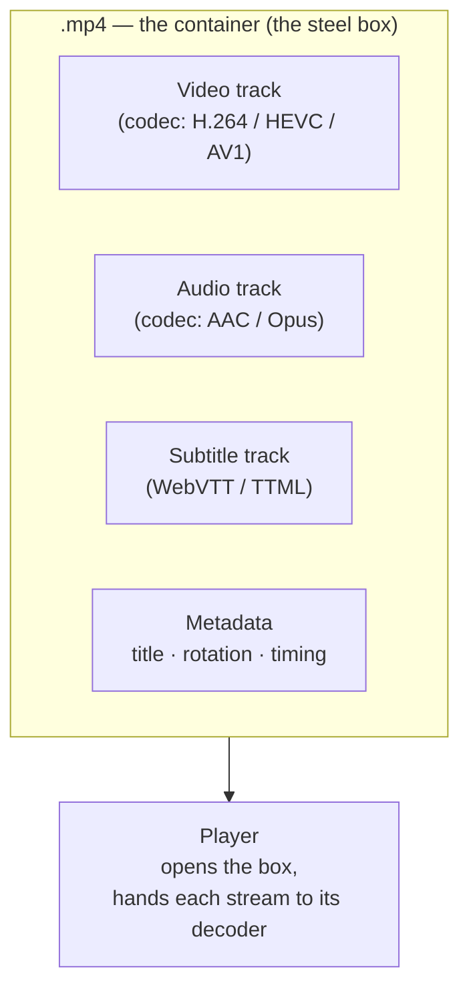
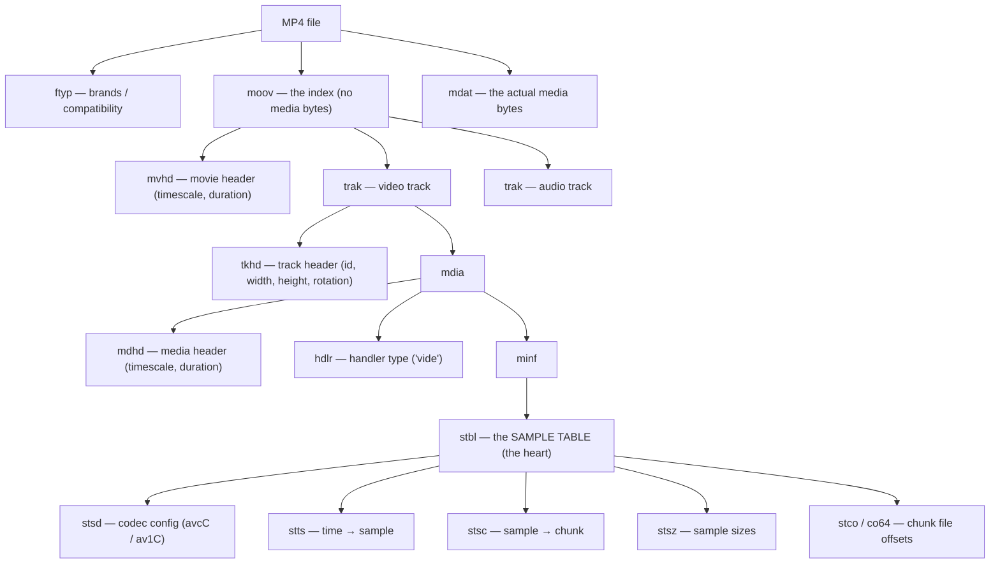
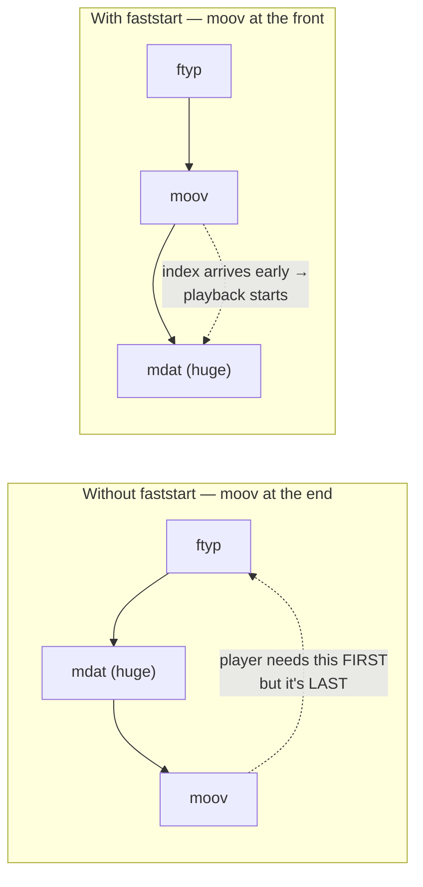
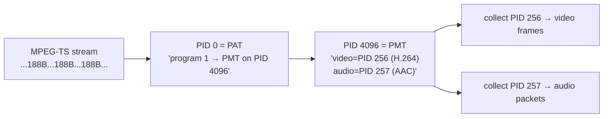
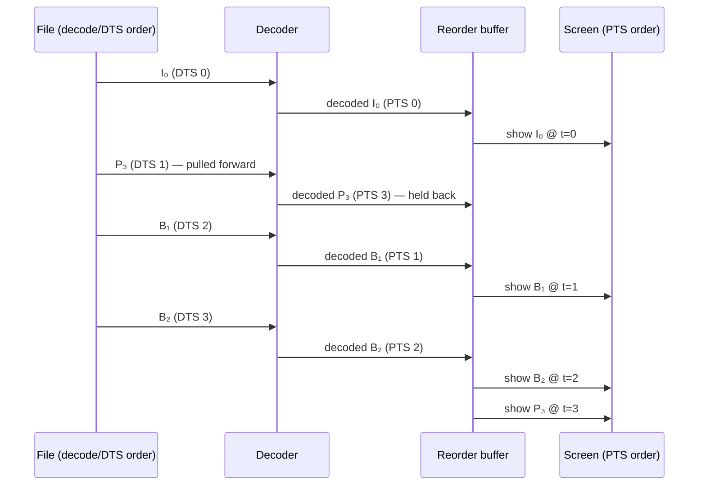
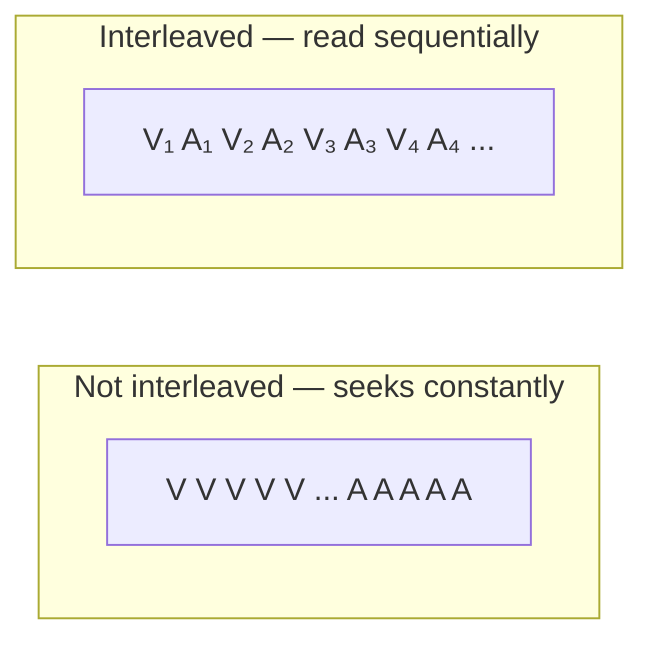
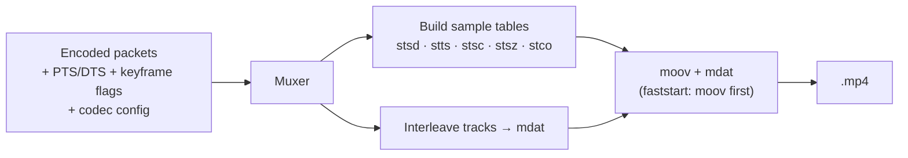

# Chapter 09 — Containers & Muxing

> **Part III · Containers** — What the `.mp4` actually is, why it isn't the same thing as the codec inside it, and how a single file carries video, audio, subtitles, and timing all at once.

You have spent this course so far learning what a *codec* does: how H.264, HEVC, or AV1 turn pixels into a compact stream of bytes. But when you double-click `holiday.mp4`, you are not opening an H.264 stream — you are opening a **container**. This chapter is about the box, not the goods inside it: what it provides, how it is laid out byte for byte, and how a player walks its structure to find "the bytes for frame 1,000 and the exact moment it should appear." We will take ISO Base Media File Format (the guts of MP4) apart box by box, then tour MKV and MPEG-TS, and finish on the timing machinery — PTS, DTS, and timescales — that keeps your audio in sync with your video.

---

## Codec ≠ container: the shipping-container analogy

Here is the single most common confusion in all of video, and it is worth killing on sight.

A **codec** is a compression format — a *language* for representing pixels (H.264, AV1) or audio samples (AAC, Opus). A **container** is a file format — a *box* that holds one or more coded streams plus the information needed to play them together.

Think of a real shipping container. The steel box is a standardized, identical thing: 40 feet long, corner castings in fixed places, a door that latches the same way on every dock in the world. What is *inside* — bananas, car parts, frozen fish — is a completely separate question. The crane operator, the ship, the customs form: they all deal with the box. Only the buyer at the end opens it and cares about the bananas.



The consequences of this separation are everywhere:

- **The same codec lives in many containers.** An H.264 video stream can be wrapped in `.mp4`, `.mkv`, `.mov`, `.ts`, or `.flv`. The compressed picture bytes are *byte-for-byte identical*; only the wrapping differs. Re-wrapping without re-compressing is called **remuxing**, and it is nearly instant because no pixels are touched.
- **The same container holds many codecs.** An `.mkv` file might carry HEVC video, two Opus audio tracks, and three subtitle languages.
- **The file extension lies about the codec.** `.mp4` tells you the container is ISOBMFF. It tells you *nothing* about whether the video inside is H.264 or AV1 — you have to look inside to find out (that "looking inside" is [probing](10-demuxing.md), and it is the subject of the next chapter).

> 🧠 **Mental model:** A codec is a *language*; a container is an *envelope*. The envelope says who the letters are for and what order to read them in; it does not care what language they're written in. When someone says "MP4 vs H.264," they are comparing an envelope to a language — a category error.

---

## What a container actually provides

If a container is just an envelope, what is it *for*? Four jobs. Every container format — MP4, MKV, MPEG-TS, AVI — exists to do these, and they differ mainly in *how* they do them.

### 1. Multiplexing (the "mux" in muxing)

A movie is not one stream. It is a video stream, one or more audio streams, maybe subtitles, maybe chapter markers and a thumbnail. **Multiplexing** (muxing) is the act of weaving these separate **elementary streams** into one file so they travel together. The reverse — pulling them back apart — is **demultiplexing** (demuxing), the whole of [Chapter 10](10-demuxing.md).

The word comes from telecommunications: a multiplexer combines many signals onto one wire. Same idea here — many streams, one file.

### 2. Timing and synchronization

Each elementary stream is just a sequence of compressed chunks. The container is what says *when* each chunk should be presented, on a shared clock, so that the spoken word "hello" lands on the frame where the lips move. Without the container's timing metadata, video and audio are two piles of bytes with no relationship. This is the hardest and most important job, and we devote a whole section to it below.

### 3. Seeking (random access)

When you drag the scrubber to 47:30, the player must answer: *which bytes do I need, and where in the file are they?* It cannot decode the preceding 47 minutes to get there. A container provides an **index** — a table mapping time to byte offsets — so the player can jump straight to the right place (more precisely, to the nearest keyframe before it; recall [Chapter 04](04-how-codecs-work.md) on why you can only start decoding at a keyframe).

### 4. Metadata

Title, artist, creation date, the **display rotation** flag (so a phone-shot vertical video plays upright), language tags, and the all-important **codec configuration** — the parameter sets a decoder needs to bootstrap (SPS/PPS for H.264, the sequence header for AV1; [Chapter 07](07-bitstreams-and-nal-units.md)). The container is where this lives.

---

## MP4 / ISOBMFF: the web's container, box by box

MP4 is the container of the web and of nearly every phone on earth. Its formal name is the **ISO Base Media File Format (ISOBMFF)**, standardized as ISO/IEC 14496-12. "MP4" (14496-14), QuickTime `.mov`, the fragmented form used by streaming, and the `.m4a`/`.m4s` variants are all the same box structure with different brand labels. Learn ISOBMFF once and you understand all of them.

### Everything is a box

An ISOBMFF file is nothing but a sequence of **boxes** (the spec's word; QuickTime called them **atoms** — same thing). A box is the simplest possible structure:

| Bytes | Field | Meaning |
|-------|-------|---------|
| 0–3 | `size` | Total box length in bytes, **big-endian** u32, *including* this header |
| 4–7 | `type` | Four ASCII characters — the "fourcc" — e.g. `ftyp`, `moov`, `mdat` |
| 8…  | payload | `size − 8` bytes: either raw data, or *more boxes* nested inside |

That is the entire grammar. Eight bytes of header, then content. The genius is the recursion: a box's payload can be a stream of child boxes, which themselves contain boxes, forming a tree. A parser that knows nothing about a box type can still skip over it perfectly, because the `size` field tells it exactly how many bytes to jump.

A worked example. Here are the first 16 bytes of a real MP4, in hex:

```
00 00 00 18  66 74 79 70  69 73 6F 6D  00 00 02 00
└─ size=24 ─┘└─ 'ftyp' ──┘└─ 'isom' ──┘└ minor=512┘
```

The first four bytes `00 00 00 18` are `0x18` = **24**, the box length. The next four spell `ftyp`. So: "a 24-byte box of type `ftyp`." The parser reads its 16 bytes of payload, then knows the next box starts at file offset 24. It repeats, forever, until end of file.

Two escape hatches in the `size` field you will meet in the wild:

- **`size == 1`** means "the real size doesn't fit in 32 bits." The true length is a 64-bit big-endian integer in the 8 bytes *after* the type field (a 16-byte header total). This is the **`largesize`** form, and it exists because a 32-bit size caps a box at 4 GiB — fine for a `moov`, a real problem for the `mdat` of a feature film. (We will see rivet emit exactly this below.)
- **`size == 0`** means "this box runs to the end of the file." Only legal for the last box.



### `ftyp` — the brand label on the box

The very first box is the **File Type box**, `ftyp`. It is the container's way of announcing "here is what flavor of ISOBMFF I am and what specs I conform to," so a parser knows up front whether it can handle the file. Its payload:

- a **major brand** (a fourcc like `isom`, `mp42`, `iso6`, `qt  `),
- a **minor version** (a u32, informational),
- a list of **compatible brands** — every spec the file claims to satisfy.

Brands matter for compatibility. A strict parser might refuse a file whose major brand predates a feature the file uses. For AV1, the spec (AV1-ISOBMFF) *requires* the `av01` brand to be listed. Apple's stack wants a modern structural brand like `iso6` when the file uses 64-bit offsets. Get the brand list wrong and a perfectly valid file gets rejected by a picky player.

> 🛠️ **In rivet:** when **our** container crate writes an MP4, its `build_ftyp` emits `major_brand=iso6` plus compatible brands `iso6` / `iso2` / `av01` / `mp41` / `mp42`. Each brand is there for a concrete reason: `av01` because AV1-ISOBMFF mandates it, `iso6` so a strict parser accepts our `co64`/largesize boxes, and the `mp4x` brands to keep legacy and AAC-rule players happy. Apple compatibility is *explicit, not incidental*.

### `moov` — the index that holds no media

The **Movie box**, `moov`, is the file's table of contents. Critically, **it contains no media samples at all** — not one pixel. It holds the *metadata* describing where the media is and how to interpret it: the overall timescale, the duration, and one **`trak`** (Track box) per elementary stream.

Inside each `trak` is a nested chain that the spec lays out the same way every time:

```
trak
 └─ mdia                    (media information)
     ├─ mdhd                (media header: this track's timescale + duration)
     ├─ hdlr                (handler: 'vide' for video, 'soun' for audio)
     └─ minf
         └─ stbl            ← the Sample Table — where the real work is
```

Everything above `stbl` is bookkeeping (what kind of track, what clock it runs on). The **`stbl`, the Sample Table box, is where a player learns how to find any frame.** It is worth slowing down for.

### The Sample Table (`stbl`): how a player finds sample *N*

First, vocabulary:

- A **sample** is one compressed unit of media — for video, one coded frame; for audio, one coded packet (e.g. 1024 PCM samples' worth of AAC).
- A **chunk** is a contiguous run of samples stored together in the file. Storing samples in chunks (rather than scattering them) keeps reads sequential.

The sample table is a set of parallel sub-tables that, *together*, let a player answer two questions for any sample: **"what is its timestamp?"** and **"where are its bytes?"** No single box answers both; you cross-reference them. Here are the five that matter:

| Box | Full name | Answers |
|-----|-----------|---------|
| `stsd` | Sample Description | *How do I decode these samples?* — the codec and its config (`avcC`, `hvcC`, `av1C`) |
| `stts` | Time-to-Sample | *How long does each sample last?* — run-length list of durations |
| `stsc` | Sample-to-Chunk | *Which samples live in which chunk?* — run-length list of (chunk, samples-per-chunk) |
| `stsz` | Sample Size | *How many bytes is each sample?* — a size for every sample |
| `stco` / `co64` | Chunk Offset | *Where does each chunk start in the file?* — a byte offset per chunk (`co64` = 64-bit) |

The cleverness is that these are stored **run-length compressed**, not as one giant per-sample array, because real video is regular. `stts` doesn't store 30,000 timestamps for a 1000-second clip; it stores "30,000 samples, each lasting 1 tick" — one entry. `stsc` doesn't list every sample's chunk; it stores "starting at chunk 1, there are 30 samples per chunk" — one entry, until the pattern changes.

#### `stsd` — the codec configuration

The Sample Description box names the codec (via a sample-entry fourcc like `avc1`, `hev1`, `av01`) and carries the **decoder configuration record** the decoder needs *before* it can interpret a single sample. For H.264 that is the **`avcC`** box, holding the SPS and PPS parameter sets; for HEVC the **`hvcC`** (VPS+SPS+PPS); for AV1 the **`av1C`** holding the sequence header. This is the bridge back to [Chapter 07](07-bitstreams-and-nal-units.md): in MP4, the parameter sets live *out of band*, here in `stsd`, not inline with every keyframe. (That design choice is exactly what creates the Annex-B conversion problem we tackle in the next chapter.)

#### A worked example: "give me sample 1,000"

Suppose a player wants frame 1,000 of a 30 fps video. Walk the tables:

1. **Timestamp** — consult `stts`. It says "30,000 samples, duration 3,000 ticks each" and `mdhd` says the timescale is 90,000 ticks/second. Sample 1,000's presentation time = 1,000 × 3,000 = 3,000,000 ticks = 3,000,000 ÷ 90,000 = **33.33 seconds**. (Sample numbering is 1-based in the spec.)
2. **Which chunk?** — consult `stsc`. Say it reads "from chunk 1 on, 30 samples per chunk." Sample 1,000 is in chunk ⌈1000 ÷ 30⌉ = chunk 34, and it is the (1000 − 33×30) = 10th sample within that chunk.
3. **Where is the chunk?** — consult `stco`/`co64`. Entry 34 says chunk 34 begins at file offset, say, 41,402,880.
4. **Where exactly is the sample inside the chunk?** — consult `stsz` for the sizes of the 9 samples before it in this chunk, sum them, add to the chunk offset. Now the player has the **exact byte range** of sample 1,000.

That four-table dance, run for every seek and every frame fetch, is the beating heart of MP4 playback. It is also why a corrupt `stco` makes a file unplayable even though every pixel is intact: the map is gone.

> 🔬 **Going deeper:** there is a sixth box you'll meet, **`stss`** (Sync Sample box), listing which samples are keyframes. When you seek to 47:30, the player finds the sample at that time via `stts`, then walks *back* through `stss` to the nearest preceding keyframe — because decoding can only begin there. A track with no `stss` is treated as "every sample is a keyframe" (true for intra-only codecs like ProRes). And **`ctts`** (Composition Time-to-Sample) carries the PTS-minus-DTS offset we'll meet below when B-frames reorder.

### `mdat` — where the media actually lives

The **Media Data box**, `mdat`, is the dumb bucket: it is just the raw concatenated sample bytes, in chunk order, with no internal structure of its own. All the meaning is imposed from outside by the `stbl` offsets pointing into it. An `mdat` can be a single byte or, in a long film, tens of gigabytes — which is exactly when its 32-bit `size` field overflows and the `largesize` form kicks in.

> 🛠️ **In rivet:** **our** muxer streams the `mdat` payload to a temp file while keeping only tiny per-sample metadata (sizes, keyframe flags) in RAM — so muxing a 500 MB rendition costs roughly 700 KB of resident memory, not 500 MB. When the payload would cross 4 GiB, we automatically switch the `mdat` header to the 16-byte `largesize` form *and* the chunk-offset table from `stco` to `co64`, and we recompute the offsets to account for the header growing 8 → 16 bytes. The two upgrades fire together, because both are triggered by the same file-size threshold.

### The faststart problem

Here is a subtlety that decides whether your video streams or stalls. The `moov` (the index) can be written *before* or *after* the `mdat` (the media). A naïve muxer writes `mdat` first — it has to, because it doesn't know the final sample sizes and offsets until it has written all the media, and the `moov` depends on those numbers. So the natural layout is:

```
[ftyp] [mdat ... gigabytes ...] [moov]
```

Now imagine a browser streaming this over HTTP. It cannot play *anything* until it has the `moov`, because the `moov` is the map. But the `moov` is at the *end* of the file. So the browser must download the entire multi-gigabyte file before the first frame appears. Catastrophe.

The fix is **faststart** (Apple's term; also "web-optimized" or "moov atom relocation"): move the `moov` to the **front**, right after `ftyp`:

```
[ftyp] [moov] [mdat ... gigabytes ...]
```

Now the index arrives in the first few hundred kilobytes, the player parses it, and playback begins after a short prefix download while the rest streams in. Every "optimize for web" button in a video tool is, at bottom, doing this relocation.



> 🛠️ **In rivet:** because we spool `mdat` to a temp file, faststart is free. We compute the entire `moov` from the cheap in-RAM metadata, write `ftyp` + `moov` first, *then* stream the temp file's bytes in as `mdat`. The expensive media never has to move; the index is born in the right place.

---

## MKV / WebM: the flexible alternative

MP4 is rigid: a fixed catalog of box types, defined by ISO. **Matroska** (`.mkv`) takes the opposite philosophy — a fully *extensible* container built on **EBML (Extensible Binary Meta Language)**, which you can think of as "binary XML." Where MP4 has a closed set of fourccs, EBML has a registry of numeric **element IDs** that can grow over time, each with a type (integer, string, binary, or a *master* element containing children). The structure is the same idea as ISOBMFF — a tree of length-prefixed elements — but the vocabulary is open-ended.

The trade-offs:

- **Matroska is flexible and feature-rich.** Unlimited tracks, rich chapter and subtitle support, attachments (fonts, cover art), and easy extension. It is the favorite of the archival and fansub communities for exactly this reason.
- **MP4 is ubiquitous and rigid.** Hardware decoders, Safari, and ad-tech all assume MP4. Matroska's flexibility is also its compatibility cost: fewer devices parse it natively.

**WebM** is the bridge. It is a deliberately *restricted subset* of Matroska — VP8/VP9/AV1 video, Vorbis/Opus audio only — created by Google so browsers could ship a royalty-free container without implementing all of Matroska. If you see `.webm`, it is MKV with the menu cut down to web-safe codecs.

> 🛠️ **In rivet:** **our** container crate demuxes both MKV and WebM through the same EBML walk, and reads the colour-metadata elements (mastering display, MaxCLL/MaxFALL) that the off-the-shelf parser doesn't surface — so HDR signaling survives the trip. Opus-in-MKV is especially clean: Matroska's `CodecPrivate` element *is* the RFC 7845 OpusHead body, so we hand it straight to the muxer with no re-synthesis.

---

## MPEG-TS: built for the unreliable wire

MP4 and MKV assume a **file** — something with a beginning, an end, and an index you can seek around in. **MPEG-TS (Transport Stream)**, ISO/IEC 13818-1, assumes the opposite: a **never-ending broadcast over a lossy channel** — over-the-air TV, cable, satellite, and the segments of older HLS live streams. Its whole design follows from that assumption.

A Transport Stream is a relentless sequence of fixed **188-byte packets**. Each packet starts with the sync byte **`0x47`** and a header carrying a 13-bit **PID (Packet Identifier)** that says which stream this packet belongs to. Why 188 bytes and why so small? Because the channel drops packets. If a packet is corrupted, you lose 188 bytes and resynchronize on the next `0x47` — you do not lose the whole file. The format is **self-synchronizing**: a receiver can tune in *mid-stream*, with no header and no index, and start decoding once it sees enough packets.

That "no central index" is the defining difference from MP4. There is no `moov`, no sample table, no file-offset map — because in a broadcast there *is* no file to index. Instead, the stream periodically re-broadcasts small tables that let a late-joining receiver bootstrap:

- the **PAT (Program Association Table)**, always on PID 0, which lists the programs (channels) in the stream and the PID of each program's map;
- the **PMT (Program Map Table)**, which lists the elementary streams (video PID, audio PID(s)) of one program and their codec types.

A receiver reads the PAT to find a PMT, reads the PMT to learn "video is on PID 256, AAC audio on PID 257," then collects packets with those PIDs and reassembles them into coded frames. Because these tables repeat every few hundred milliseconds, you can join at any moment.



The cost of all this resilience: TS is **inefficient** (every 188-byte packet spends 4 bytes on a header, ~2% overhead, and tables repeat constantly) and **carries no track-level dimensions** — a TS does not tell you the video is 1920×1080; that information lives only inside the elementary stream's bitstream headers. Recovering width, height, and frame rate from a TS therefore means *parsing the codec bitstream itself*, a wrinkle we deal with head-on in [Chapter 10](10-demuxing.md).

> 🛠️ **In rivet:** **our** TS demuxer walks the PAT and PMT, reassembles **PES (Packetized Elementary Stream)** payloads spread across many 188-byte packets back into whole access units, and — because TS carries no track header — parses the first frame's SPS (H.264/HEVC) or sequence header (MPEG-2) to recover dimensions, and takes the *median of inter-packet timestamp deltas* to infer frame rate. It even guards against scrambled (encrypted) streams by cleanly dropping output rather than emitting garbled samples.

---

## Timing: PTS, DTS, and the clock

We saved the hardest job for last. A container's most important and least visible work is **timing** — telling the player exactly when each sample should be decoded and when it should be shown. This is where two timestamps enter that confuse nearly everyone the first time: **PTS** and **DTS**.

- **PTS — Presentation Time Stamp:** when a frame should be *displayed* to the viewer.
- **DTS — Decode Time Stamp:** when a frame should be *fed to the decoder*.

For a video with no B-frames, PTS and DTS are equal and the distinction is pointless. The instant they diverge is the instant you have **B-frames**, and to see why we have to recall [Chapter 04](04-how-codecs-work.md).

### Why B-frames force two clocks

A **B-frame** (bidirectional) is predicted from frames both *before* and *after* it in display order. That "after" is the problem. If frame 2 (a B-frame) is predicted from frame 4, then the decoder must have already decoded frame 4 *before* it can decode frame 2 — even though frame 2 is shown first. So the order frames are stored and decoded (**decode order**) is *not* the order they are displayed (**presentation order**).

Consider a tiny GOP shown in this order: `I B B P`. The decoder cannot decode the B-frames until it has the P-frame they reference. So the encoder stores them reordered:

| Display order | I₀ | B₁ | B₂ | P₃ |
|---------------|----|----|----|----|
| **Decode order** | I₀ | P₃ | B₁ | B₂ |

The P-frame is pulled *forward* in the file so it arrives at the decoder before the B-frames that need it. Now both timestamps make sense:

- **DTS** increases monotonically in *storage/decode* order: I₀, P₃, B₁, B₂ get DTS 0, 1, 2, 3.
- **PTS** records the *display* time: I₀=0, P₃=3, B₁=1, B₂=2.

The decoder reads samples in DTS order, decodes each, and a **reorder buffer** holds the decoded frames until each one's PTS arrives, releasing them to the screen in PTS order. The container stores DTS implicitly (storage order + per-sample durations) and the **PTS−DTS offset** explicitly — in MP4 that offset lives in the `ctts` (composition offset) box mentioned earlier.



> 🧠 **Mental model:** DTS is the order the chef *cooks* the dishes; PTS is the order they are *served*. A dish that takes longer (the P-frame everything depends on) gets started early but plated in its proper place in the meal. The reorder buffer is the pass where finished plates wait for their turn.

### Timescale: the units the clock counts in

Timestamps are not stored in seconds — floating-point seconds would accumulate rounding error and can't represent something like exactly 1/30,000 of a second cleanly. Instead every track declares a **timescale** (also called the timebase): an integer number of **ticks per second**, in the `mdhd` box. All of that track's timestamps and durations are then expressed as integer counts of those ticks.

- A timescale of **90,000** is the MPEG classic (it's evenly divisible by both 24, 25, and 30 fps frame durations, and it's the native clock of MPEG-TS). At 90,000, a 30 fps frame lasts 3,000 ticks.
- Audio commonly uses a timescale equal to its **sample rate** — 48,000 for 48 kHz audio — so one tick is one audio sample and timing is exact.

Time in seconds is always `ticks ÷ timescale`. Using integers with a declared timescale means timing is *exact and reproducible*, never drifting — essential when a 90-minute film's audio must still be frame-aligned at the end.

### Edit lists: trimming without re-cutting

One more timing wrinkle. An **edit list** (the `elst` box) is a layer of indirection between the *media* timeline (the samples as stored) and the *presentation* timeline (what the viewer sees). It can say "start presentation 0.5 seconds into the media" (trimming a lead-in) or "hold the first frame for 1 second" or shift audio to correct sync — all *without* touching or re-encoding a single sample. It is a non-destructive edit recorded as metadata. We'll see in the next chapter how an edit list can quietly throw off a naïve demuxer that ignores it.

---

## Interleaving: keeping the read head happy

Within the `mdat`, how should video and audio samples be arranged? You *could* store all the video first, then all the audio. That would be a disaster for playback: to play the first second, the player needs the first second of video *and* the first second of audio, which would be at opposite ends of a multi-gigabyte file — a seek on every frame, fatal for streaming.

The fix is **interleaving**: alternate small chunks of each track in time order, so the data a player needs at moment *t* is physically close together.



The granularity is a balance. Interleave too finely (every single frame) and you bloat the chunk tables and waste header overhead; too coarsely (one chunk per minute) and a player must buffer a whole minute of one track to stay in sync, or seek. Roughly **one second per chunk** is the common sweet spot.

> 🛠️ **In rivet:** when **our** muxer writes a file with audio, it lays out an *interleaved* `mdat` that alternates roughly one second of video and one second of audio, with each track's `stco`/`co64` pointing at its own chunk's first sample. Both tracks stay locally available to the player without forcing large read-ahead.

---

## Fragmented MP4: the streaming reshape

Everything so far describes **non-fragmented** (or "progressive") MP4: one big `moov` index up front, one big `mdat` of media. That works beautifully for a finished file. It works *terribly* for two cases: **live streaming** (you can't write the `moov` until the stream ends — but the stream never ends) and **adaptive bitrate** (you want to serve the video in independently-fetchable pieces).

**Fragmented MP4 (fMP4)** restructures the same boxes to solve both. Instead of one monolithic `moov`+`mdat`, the file becomes a small **init segment** followed by a series of self-describing **fragments**:

```
[ftyp] [moov (init: codec config + track defs, NO sample table)]
[moof][mdat]   ← fragment 1: its own mini-index + its media
[moof][mdat]   ← fragment 2
[moof][mdat]   ← fragment 3
...
```

The trick is the **`moof` (Movie Fragment box)**. Each fragment carries its *own* little sample table (`tfhd`, `tfdt`, `trun` boxes — track fragment header, base decode time, and a run of sample sizes/durations/offsets) describing just that fragment's samples. The global `moov` shrinks to a declaration of the tracks and codecs (`mvex`/`trex`), with the per-sample detail pushed out into each fragment.

The payoff:

- **Live works:** you emit fragments as you encode them; there is no end-of-file index to wait for.
- **Each fragment is independently fetchable and decodable** (it starts at a keyframe and carries its own timing), which is *exactly* the unit an adaptive streaming player wants to request and switch between.

This is the foundation of **CMAF (Common Media Application Format)** and modern HLS/DASH, the entire subject of [Chapter 11](11-adaptive-bitrate-streaming.md). For now, just hold the shape in your head: fragmented MP4 trades one big index for many small ones so the media can flow as it's made.

> 🛠️ **In rivet:** **our** container crate emits fragmented MP4 for CMAF — the `moof`/`mfhd`/`tfhd`/`tfdt`/`trun` boxes plus init segments — and packs each sample's keyframe/dependency flags correctly so a player knows where it can switch quality. Getting one sync-flag bit wrong makes a player treat every frame as a keyframe (or none), so we pack it from a single tested helper rather than by hand. That fragmented output is what feeds the HLS ladder in Chapter 11.

---

## Muxing: the inverse of everything above

We have spent the chapter reading containers. **Muxing** is writing them — and it is just the inverse problem. Given:

- a sequence of **encoded packets** per elementary stream (from an encoder, [Chapter 06](06-encoders-and-rate-control.md)),
- each packet's **timing** (PTS, DTS, duration) and **keyframe flag**,
- the **codec configuration** (parameter sets / sequence header),

the muxer's job is to **build the box structure and sample tables** that describe them: write `ftyp`, assemble each track's `stsd` (with the right `avcC`/`hvcC`/`av1C`), accumulate the sample sizes into `stsz`, the durations into `stts`, the chunking into `stsc`, the chunk offsets into `stco`/`co64`, interleave the audio and video into `mdat`, relocate `moov` to the front for faststart — and hand back a file a player can walk exactly as we walked one above.



Everything in this chapter — boxes, the sample table, faststart, interleaving, PTS/DTS, fragmentation — is something a muxer must *get right* and a demuxer must *read back*. The next chapter takes the reading side seriously, because real-world files are nowhere near as tidy as the ones we just described.

---

## Recap

- A **codec** is a compression language (H.264, AV1); a **container** is the file that wraps coded streams together (MP4, MKV, TS). The same codec lives in many containers; the same container holds many codecs. The extension names the *container*, never the codec.
- A container provides four things: **multiplexing** (many streams, one file), **timing/synchronization**, **seeking** (an index), and **metadata**.
- **MP4 / ISOBMFF** is a tree of **boxes** (4-byte size + 4-byte type + payload). Key boxes: `ftyp` (brands), `moov` (the index — no media), `trak → mdia → minf → stbl` (the sample table), and `mdat` (the raw media). The sample table's five sub-boxes (`stsd`, `stts`, `stsc`, `stsz`, `stco`/`co64`) together let a player find any sample's timestamp and byte range.
- **Faststart** moves `moov` ahead of `mdat` so streaming playback can begin after a short prefix instead of downloading the whole file.
- **MKV/WebM** (EBML) is the flexible, extensible alternative; WebM is its web-safe subset. **MPEG-TS** is 188-byte self-synchronizing packets with PAT/PMT tables and no central index — built for lossy broadcast and live.
- **PTS** (display time) and **DTS** (decode time) diverge whenever **B-frames** reorder storage away from display order; a **timescale** (ticks/second) keeps all timing in exact integers. **Edit lists** trim and offset non-destructively.
- **Interleaving** keeps each track's data physically close in time so a player reads sequentially. **Fragmented MP4** (`moof`+`mdat`) replaces one big index with many small ones — the basis of CMAF and adaptive streaming.
- **Muxing** is the inverse of demuxing: turn encoded packets + timing into the box structure and sample tables.

**Next:** [Chapter 10 — Demuxing the Wild](10-demuxing.md)
