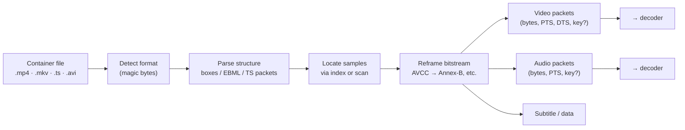
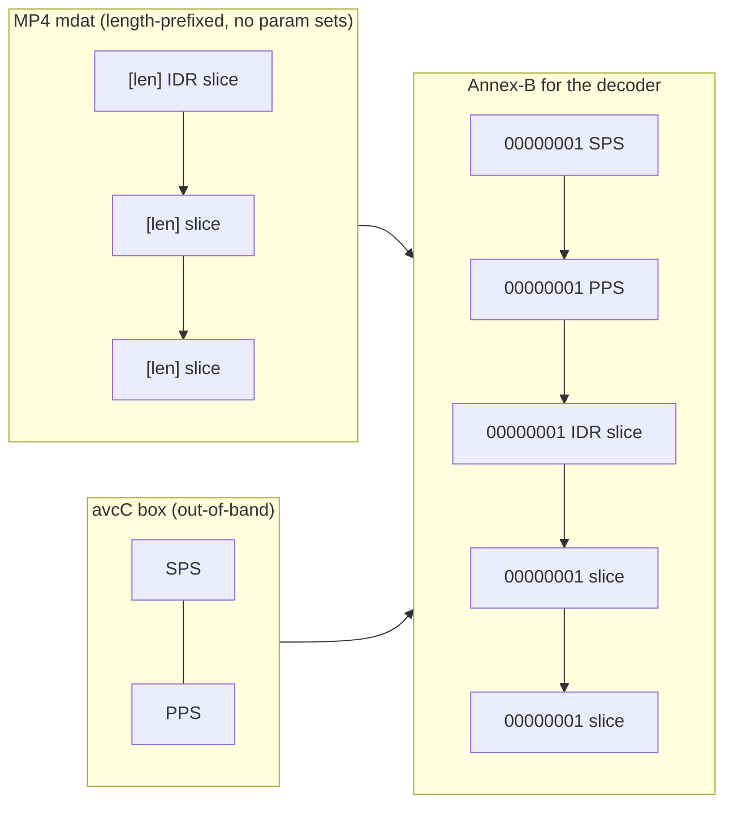
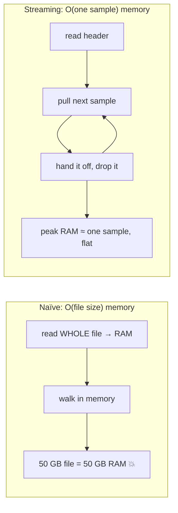

# Chapter 10 — Demuxing the Wild

> **Part III · Containers** — How a transcoder cracks open a real, messy, possibly-malformed file and emits a clean stream of timed packets — and all the ways the real world fights back.

[Chapter 09](09-containers-and-muxing.md) showed you the container as a *spec writer* sees it: a tidy tree of boxes with a perfect sample table. This chapter shows you the container as an *engineer* sees it at 2 a.m. when a customer's file won't play. **Demuxing** — reading a container back into its elementary streams — is conceptually simple and operationally brutal, because the files people actually upload are produced by a thousand different tools, half of which bend the spec and a few of which ignore it. We'll do the clean version first, then spend most of the chapter on everything that goes wrong, and finish with **probing**: figuring out what a file *is* before you commit to decoding it.

---

## The job, stated cleanly

A demuxer is the inverse of the muxer from last chapter. Its contract is small and precise:

> **Input:** a container file (or stream).
> **Output:** for each elementary stream, a sequence of `(packet bytes, PTS, DTS, keyframe?)` — coded frames or audio packets, each tagged with when to decode it, when to show it, and whether it's a random-access point.

That's it. The demuxer does **not** decode — it produces no pixels. It produces *compressed packets* ready to hand to a decoder ([Chapter 04](04-how-codecs-work.md)), plus the timing the player needs to keep streams in sync. Everything downstream — decode, filter, encode, re-mux — depends on this stream being correct, which is why a demuxer's real job is *robustness*, not parsing.



### The three honest steps

Under the messiness, every demuxer does three things:

1. **Parse the structure.** Walk the boxes (MP4), the EBML element tree (MKV), or the 188-byte packet stream (TS). Last chapter's grammar, applied.
2. **Locate the samples.** Use the index (`stbl` for MP4, Cues for MKV) to find each sample's byte range and timestamp — or, when there's no index (TS), *scan* and reassemble.
3. **Reframe the bitstream if needed.** The bytes as stored in the container are not always in the shape a decoder wants. The classic case: MP4 stores H.264 NAL units **length-prefixed** (each NAL preceded by its byte length), but most decoders expect **Annex-B** (NAL units separated by `00 00 00 01` start codes). The demuxer must rewrite the framing — and, because MP4 keeps the parameter sets out-of-band in `avcC`, splice the SPS/PPS back inline at the right places. (This is the payoff of [Chapter 07](07-bitstreams-and-nal-units.md); we'll hit the subtle version of it below.)

If every file were spec-perfect, this chapter would end here. They aren't. Welcome to the wild.

---

## Reframing in bytes: AVCC → Annex-B

Step 3 above — "reframe the bitstream" — sounds abstract until you watch it happen byte by byte, so let's do exactly that, because it's the single most common transformation a demuxer performs and it trips up everyone who meets it.

Recall from [Chapter 07](07-bitstreams-and-nal-units.md) that an H.264 stream is a sequence of **NAL units** (Network Abstraction Layer units — self-contained chunks like "one slice of a frame" or "a parameter set"). There are two ways to mark where one NAL ends and the next begins:

- **Annex-B** (used by MPEG-TS and by most decoders' input): each NAL is preceded by a **start code**, the byte pattern `00 00 00 01`. The decoder scans for that pattern to find boundaries. Self-delimiting, good for broadcast — you can join anywhere and resync on the next start code.
- **AVCC / length-prefixed** (used by MP4 and MKV): each NAL is preceded by its **length** as a big-endian integer (usually 4 bytes). No scanning — you read the length, then read exactly that many bytes. Compact and seekable, good for files.

A decoder that wants Annex-B chokes on length-prefixed input, so the demuxer rewrites it. Here is one frame's worth, a single NAL of length 9, as stored in an MP4's `mdat`:

```
00 00 00 09  65 88 84 21 AF 3C 9B 2D E0
└─ length=9 ┘└────── 9 bytes of NAL ──────┘
```

The demuxer replaces the 4-byte length prefix with a 4-byte start code, leaving the NAL payload untouched:

```
00 00 00 01  65 88 84 21 AF 3C 9B 2D E0
└ start code ┘└────── same 9 bytes ──────┘
```

Identical payload; different framing. (Note the length prefix isn't *always* 4 bytes — the `avcC` config record's `lengthSizeMinusOne` field declares 1, 2, or 4; real streaming profiles use 2. A demuxer that hard-codes 4 corrupts those files.)

But there's a catch that makes this more than a find-and-replace. In MP4 the **parameter sets live out-of-band** in the `avcC` box, *not* in the `mdat` with the frames. An Annex-B decoder expects them **inline, before the first keyframe**. So the demuxer must also *splice the SPS and PPS in* — as their own Annex-B NAL units — ahead of the first random-access frame:



Get the splice wrong — inject the parameter sets twice, or in the wrong order, or before a *non*-keyframe — and the decoder either rejects the stream or starts decoding at a frame it can't, producing a stall or a burst of corruption. This is precisely the failure the parameter-set tracker (below) exists to prevent.

---

## The wild is messy: edge cases that bite

What follows is not a catalog of rare curiosities. **Every one of these is something a production transcoder hits on real user uploads, often daily.** A demuxer that handles only well-formed files handles maybe 95% of inputs and loses the rest — and "the rest" is exactly the long tail of phones, screen recorders, broadcast capture cards, and ancient camcorders that real users have.

### Missing, late, or out-of-band parameter sets

A decoder cannot start without its **parameter sets** — H.264's SPS (sequence parameter set: resolution, profile, frame structure) and PPS (picture parameter set), HEVC's VPS/SPS/PPS, AV1's sequence header. [Chapter 07](07-bitstreams-and-nal-units.md) covered what they are; here's how they go wrong in the wild:

- **They're out-of-band and must be re-inlined.** In MP4/MKV the parameter sets live in the `avcC`/`hvcC` config box, *not* with the frames. A decoder fed Annex-B wants them inline before the first keyframe. The demuxer has to inject them — but inject them *wrong* and you get a stall.
- **They arrive late, or only once.** Some encoders put the SPS only in the config box and never repeat it; some streams put it inline but only on the very first keyframe. If your seek lands past that point, the decoder has no parameter set and shows nothing.
- **The dimensions live *only* in the SPS.** This is the big one for **MPEG-TS**, which (recall Chapter 09) has no track header at all. A TS file does not record anywhere that the video is 1280×720 — that number exists *only* inside the H.264 SPS or the MPEG-2 sequence header in the elementary stream. To learn the resolution, the demuxer must **parse the codec bitstream itself**.

  This is genuinely fiddly, because the SPS doesn't store width and height directly — it stores them in *macroblock units* with optional cropping, all encoded as variable-length **Exp-Golomb** numbers (a bit-packing scheme where small values use few bits). To recover 1280×720 you read `pic_width_in_mbs_minus1` and `pic_height_in_map_units_minus1`, convert macroblocks (16×16 each) to pixels, then subtract the `frame_crop_*_offset` fields:

  ```
  pic_width_in_mbs_minus1      = 79   → (79+1) × 16 = 1280 px wide
  pic_height_in_map_units...   = 44   → (44+1) × 16 = 720 px tall
  frame_cropping_flag          = 0    → no crop → 1280 × 720
  ```

  A common gotcha: 1080p is usually coded as 1920×**1088** (68 macroblocks high, because 1080 isn't a multiple of 16) with a crop of 8 rows off the bottom — so a demuxer that skips the crop fields reports 1088 and every downstream size is off by eight pixels. A demuxer that trusts the container instead of parsing this will report 0×0 for every TS file on earth.

> 🛠️ **In rivet:** **our** demuxers carry a small per-stream **parameter-set tracker** that watches the inline NAL types sample by sample and prepends *only the parameter sets that haven't appeared yet*, on the first random-access frame that's missing them. This fixes two real failures at once: an open-GOP MP4 from a streaming profile whose sample 0 is SPS-only with a non-keyframe slice, and an `avcC` that has the SPS but whose PPS arrives inline late. For TS, where no container dimensions exist, we parse the first frame's SPS/sequence header to recover width and height, and fall back to a logged 0×0 rather than fabricating a number.

### B-frame reordering: DTS ≠ PTS, in practice

[Chapter 09](09-containers-and-muxing.md) explained *why* decode order differs from presentation order when B-frames reference future frames. For a demuxer this is not theory — it's a correctness trap. The demuxer must emit packets in **decode order** (so the decoder gets references before the frames that need them) while preserving each packet's **PTS** (so the player shows them in the right order). In MP4 that means reading the `ctts` composition-offset box and adding it to the DTS to recover PTS. Drop the `ctts` and every B-frame gets the wrong display time — the video plays, but motion stutters and audio drifts. A demuxer that assumes PTS == DTS is silently wrong on most H.264 and HEVC content.

### Variable frame rate (VFR)

Lots of "30 fps" video isn't. Screen recorders emit a frame *only when the screen changes* — a static slide might hold for seconds, then a burst of frames during a scroll. Phone cameras drop frame rate in low light. This is **variable frame rate**: the interval between frames changes throughout the file. A demuxer must therefore treat **each sample's timestamp as authoritative**, never assume a constant `1/fps` spacing, and carry the real per-sample durations downstream. Assume constant frame rate on a VFR source and your audio gradually slides out of sync — the classic "the longer I watch, the worse the lip-sync gets" bug.

### Edit lists: the file says one thing, the timeline says another

An **edit list** (`elst`, Chapter 09) remaps the media timeline to the presentation timeline without re-encoding: "skip the first 0.5 s," "hold frame one for a beat," "shift audio +40 ms to fix sync." A correct demuxer must *apply* it. A naïve one ignores it and emits the raw media timeline — so the trimmed lead-in reappears, or audio and video start at slightly different times. Edit lists are common in anything exported from iMovie, Final Cut, or a phone's built-in trimmer.

### Multiple tracks and track selection

A real file can carry several video tracks (angles, or a thumbnail track), several audio tracks (languages, commentary, stereo + 5.1), and several subtitle tracks. The demuxer has to *enumerate* them and the system has to *choose*: which video track is the main one, which audio language, which subtitles. MPEG-TS multiplies this with **multiple programs** (whole channels) in one stream, each with its own PMT. Picking wrong means transcoding the director's commentary instead of the movie.

### Oddball fourccs and codec tags

The four-character code that names a codec is gloriously inconsistent across tools and decades. H.264 alone appears as `avc1`, `avc3`, `h264`, `H264`, `x264`, `DAVC`. MPEG-4 Part 2 hides behind `xvid`, `XVID`, `DIVX`, `DX50`, `mp4v`, `FMP4`, `3IVX`. ProRes is `apch`/`apcn`/`apcs`/`apco`/`ap4h`/`ap4x` depending on the variant. A demuxer needs a generous lookup table mapping all of these onto the handful of codecs it actually supports — and a sane fallback when it meets a tag it's never seen.

### Container-vs-stream disagreements

Sometimes the container *lies* — or rather, the container metadata and the actual bitstream disagree, because the muxer was sloppy or the file was edited. The container's `stsd` might claim one resolution while the SPS inside says another; the declared codec profile might not match what the bitstream actually uses; the container duration might not match the sum of sample durations. **When they disagree, the bitstream is the ground truth** — it's what the decoder will actually act on. Robust demuxers trust the stream over the container header for anything the decoder cares about.

### Huge files: when 32-bit numbers overflow

Two famous size cliffs:

- **MP4 at 4 GiB.** A box's `size` field is 32 bits; the `stco` chunk-offset table stores 32-bit file offsets. A file (or a single `mdat`) past 4 GiB overflows both. The container spec's answer is the 64-bit forms from Chapter 09: the `largesize` box header (`size==1` sentinel + 64-bit length) and the **`co64`** chunk-offset box (64-bit offsets). A demuxer must recognize and read both, or it mis-locates every sample past the 4 GiB mark.
- **AVI at 2 GiB.** The ancient RIFF/AVI format uses 32-bit chunk sizes and a 32-bit index (`idx1`), capping it near 2 GiB. The industry hack is **OpenDML** (AVI 2.0): the file is split every ~1 GiB into successive `RIFF AVIX` segments, each with its own index, tied together by an **`indx` super-index**, and the true frame count is stored in a 64-bit-safe `dmlh` field because the original `avih` frame count has already wrapped. A demuxer that doesn't understand OpenDML reads only the first ~1 GiB of a long DivX/XviD capture and stops.

### Truncated and corrupt files

Uploads get cut off mid-transfer. Recordings die when the battery does. Disks flip bits. A demuxer meets:

- a file whose `moov` promises 50,000 samples but whose `mdat` ends at sample 30,000 (truncated upload);
- a TS stream with a burst of corrupted packets in the middle;
- a box whose advertised `size` runs past the end of its parent (a malformed muxer).

The right behavior is **graceful degradation**: recover and emit what's valid, stop cleanly at the damage, and never crash or hang on hostile input. A demuxer is a parser of untrusted data — treating malformed input as an attack surface, not just an inconvenience, is the professional posture.

> 🛠️ **In rivet:** **our** MP4 reader runs a lenient box-size *pre-pass* before the strict parser: when a child box's advertised size overruns its parent (a real defect from older QuickTime and some prosumer cameras), it rewrites the size to fit so the file parses — while staying **byte-identical on every well-formed file**, so a clean MP4 is never mutated. And **our** AVI demuxer handles the OpenDML super-index, walking every `RIFF AVIX` segment and trusting the 64-bit `dmlh` frame count over the wrapped 32-bit `avih` one, so files past a couple of gigabytes demux correctly instead of truncating.

---

## Streaming demux: you can't read a 50 GB file into RAM

Here is a constraint that reshapes the whole design. A naïve demuxer reads the entire file into memory, then walks it. That is fine for a 20 MB clip and *fatal* for a 50 GB master or a live stream that never ends — you'd need 50 GB of RAM, or infinite RAM, neither of which you have.

The answer is **streaming (bounded-memory) demuxing**: parse **incrementally**, pulling one sample at a time, holding only as much in memory as the current sample plus a little cursor state. Peak memory stays *flat* — a few megabytes — regardless of whether the input is 20 MB or 20 GB.



This is a *pull* model: the demuxer exposes "give me the next packet," the pipeline consumes it, decodes it, and lets it go before asking for the next. The demuxer keeps a file cursor and just enough state to find the following sample — never the whole stream. It pairs naturally with the streaming *muxer* from Chapter 09 (which spools `mdat` to disk): together they let a transcoder process a multi-hour 4K file in a few megabytes of resident memory.

> 🛠️ **In rivet:** **our** production path is a per-format streaming demuxer — MP4, MKV, TS, AVI each implement the same "header now, then one sample at a time" interface, and nothing accumulates across samples. Peak heap for any pull is bounded by *that sample's* size plus the reader's cursor, not the file. (Audio, which is small, stays buffered — the RSS win there isn't worth the complexity.) The materialize-everything path is kept only as a thin adapter for tests.

---

## Probing: figuring out what a file *is*

Before you transcode a file you have to *know* it: what container, what video and audio codecs, what resolution, what frame rate, how long, what color space, how many tracks. Getting those answers is **probing**, and the discipline is to get them **cheaply** — without decoding the whole file, often without decoding a single full frame.

Probing reads only the *headers* and, at most, the *first few frames*:

| Question | Where the answer lives | Cost |
|----------|------------------------|------|
| What container? | First few **magic bytes** (`ftyp` for MP4, `0x1A45DFA3` for MKV, `0x47` sync for TS, `RIFF` for AVI) | trivial |
| What codecs? | Track `stsd` / PMT / EBML track entries | cheap — read the index |
| Resolution, profile, color? | The codec config (`avcC`/`av1C`) — or, for TS, **parse the first frame's SPS** | cheap-to-moderate |
| Duration? | `mvhd`/`mdhd` duration, or estimate from first+last PTS | cheap |
| Frame rate? | `stts` timing — or **median of PTS deltas** for VFR / TS | cheap |

The reason probing is its own step (and its own tool) is that the *decision* about what to do with a file — which renditions to build, which decoder to engage, whether it's even supported — depends on these facts, and you want them in milliseconds, not after a full decode pass. It's the difference between a service that responds to an upload instantly and one that thinks for a minute first.

> 🛠️ **In rivet:** **our** `rivet probe` surfaces exactly this — container, per-track codecs, resolution, frame rate, duration, color metadata, audio layout — by reading headers and, where the container omits something (TS dimensions, VFR frame rate), recovering it from the bitstream the same way the demuxer does. It's the front door to the pipeline: probe first, then decide the ladder.

---

## Putting the reading side together

Step back and the shape is clear. A demuxer is a small contract — `(bytes, PTS, DTS, keyframe?)` per stream — wrapped around a large pile of defensive engineering. The clean parse is the easy 5%. The other 95% is: re-inlining parameter sets the container hid out-of-band; recovering dimensions and frame rate from the bitstream when the container is silent; honoring B-frame reorder, VFR timing, and edit lists; mapping a zoo of fourccs; trusting the stream when the container disagrees; reading 64-bit forms for huge files; degrading gracefully on truncation and corruption; and doing all of it in bounded memory so a 50 GB input costs a few megabytes. Probing is the same machinery run in *reconnaissance* mode — learn what the file is, cheaply, before committing.

Everything past this point in the course assumes a clean demuxed stream. [Chapter 11](11-adaptive-bitrate-streaming.md) takes those packets into the world of adaptive streaming — segmenting, laddering, and serving them so a player can switch quality on the fly — and [Chapter 13](13-the-transcoding-pipeline.md) wires demux, decode, filter, encode, and mux into one engineered pipeline.

---

## Recap

- **Demuxing** is the inverse of muxing: read a container and emit, per elementary stream, a sequence of `(packet bytes, PTS, DTS, keyframe?)`. The demuxer produces *compressed packets* — it never decodes.
- The three honest steps are **parse the structure**, **locate the samples**, and **reframe the bitstream** when a decoder wants a different framing (e.g. MP4's length-prefixed NALs → Annex-B start codes, with parameter sets re-inlined).
- The real difficulty is **the wild**: missing/late/out-of-band parameter sets (and dimensions that live *only* in the SPS — critical for MPEG-TS, which carries no track header); **B-frame reorder** (DTS ≠ PTS); **variable frame rate**; **edit lists**; **multiple tracks/programs** and track selection; oddball **fourccs**; **container-vs-stream disagreements** (trust the stream); **huge files** (MP4 4 GiB → `largesize`/`co64`; AVI 2 GiB → OpenDML); and **truncated/corrupt** input (degrade gracefully — it's untrusted data).
- **Streaming demux** parses incrementally and keeps memory *flat* (≈ one sample), so a 50 GB file or an endless live stream costs megabytes, not gigabytes.
- **Probing** cheaply determines what a file *is* — container, codecs, resolution, frame rate, duration, color — from headers and the first few frames, without a full decode, so the system can decide what to do.

**Next:** [Chapter 11 — Adaptive Bitrate Streaming](11-adaptive-bitrate-streaming.md)
