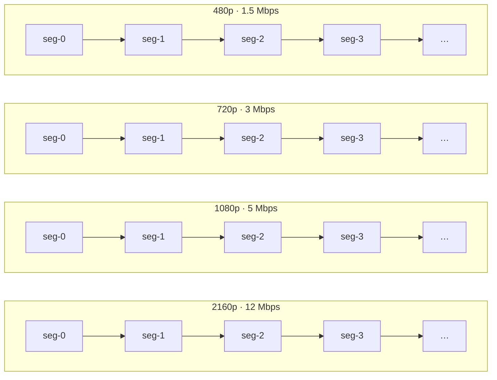
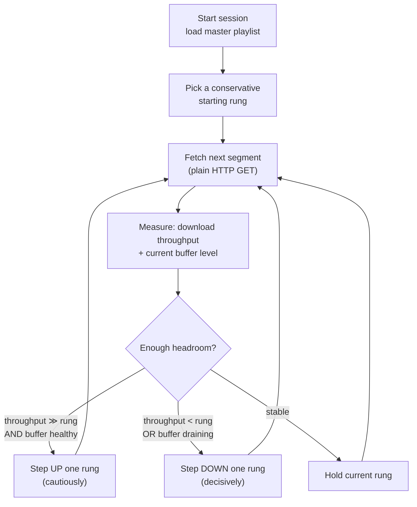
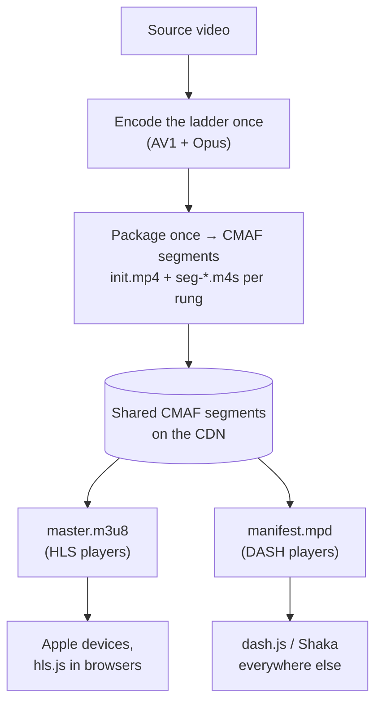
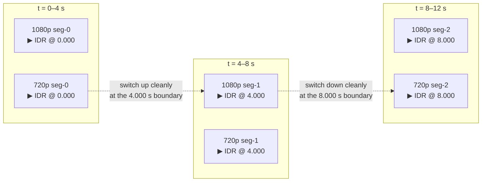

# Chapter 11 — Adaptive Bitrate Streaming

> **Part IV · Streaming** — How one piece of content reaches a phone on flaky 4G *and* a TV on gigabit fiber at the right quality each: the rendition ladder, segments and playlists, HLS vs DASH, the CMAF convergence, and how a player silently switches quality mid-stream.

In Parts I–III you learned what a video *is*, how codecs squeeze it ([Chapter 04](04-how-codecs-work.md)), and how a container wraps the compressed bits into a playable file ([Chapter 09](09-containers-and-muxing.md)). That gets you *a file*. This chapter is about the leap from "a file" to "a stream that plays well for everyone, everywhere, on every network." The answer the whole industry converged on is **Adaptive Bitrate Streaming (ABR)**, and once you see its shape — encode many versions, chop them into aligned chunks, let the player choose — every streaming service on Earth becomes legible.

---

## The problem: one file cannot serve everyone

Imagine you have a beautiful 10-minute 4K video and exactly one job: deliver it to viewers. You encode it once. Now pick the bitrate.

- Encode it at **12 Mbps** (gorgeous 4K). The viewer on home fiber is delighted. The viewer on a subway 4G connection that delivers 2 Mbps watches three seconds, then stares at a spinner forever — their pipe can't pull 12 megabits per second, so the **buffer** (the few seconds of video downloaded *ahead* of the playhead) drains to empty and playback stalls.
- Encode it at **1.5 Mbps** (soft, blocky). Now the subway viewer plays smoothly — but the fiber viewer with a 65-inch TV is staring at mush, getting a fraction of the quality their connection and screen could handle.

There is **no single bitrate** that is right for both. And it's worse than two cases: a real audience is a continuous spread of connection speeds (300 kbps to 1 Gbps), screen sizes (a 5-inch phone to an 85-inch TV), and devices (a $40 Android to an Apple TV). Worse still, *a single viewer's* bandwidth changes **second to second** — you walk from your living room (strong Wi-Fi) toward the garage (weak), your roommate starts a download, a cell tower hands you off. A fixed-bitrate file is a bet you lose constantly.

> 🧠 **Mental model:** A single encode forces you to choose *who to disappoint.* ABR refuses the choice. It prepares many versions of the same content and hands the decision — *which version, right now* — to the one party who actually knows the current network conditions: the **player**, measuring its own download speed in real time.

---

## The solution: a ladder of renditions, chopped into segments

ABR has exactly two structural ideas. Master these and the rest is syntax.

**Idea 1 — the rendition ladder.** Encode the *same content* at several quality/resolution operating points. Each version is a **rendition** (also called a **variant** or **rung**); the whole set is the **ladder**. A typical VOD ladder:

| Rung | Resolution | Video bitrate | Typical use |
|------|-----------|--------------:|-------------|
| 2160p | 3840 × 2160 | **12 Mbps** | 4K TV on fiber |
| 1080p | 1920 × 1080 | **5 Mbps** | Laptop / TV on good broadband |
| 720p | 1280 × 720 | **3 Mbps** | Tablet, average broadband |
| 480p | 854 × 480 | **1.5 Mbps** | Phone on decent 4G |
| 360p | 640 × 360 | **800 kbps** | Phone on weak/congested mobile |

(The audio is usually a *separate* rendition — one Opus or AAC stream at, say, 128 kbps — shared by all the video rungs, so you don't re-send audio five times. More on that under "muxed vs demuxed" below.)

> 🔬 **Going deeper:** Why these specific numbers? A good ladder spaces rungs so each step is **roughly 1.5–2×** the bitrate below it — close enough that switching is barely visible, far enough apart that you're not wasting storage on near-duplicates. Netflix famously went further with **per-title** and **per-shot** encoding: a simple cartoon and a grainy action film do *not* deserve the same ladder, so the optimal bitrate for "looks good at 1080p" is computed *per piece of content* from its rate-distortion curve (the convex hull of quality-vs-bitrate; see [Chapter 06](06-encoders-and-rate-control.md)). The five-row table above is the universal *shape*; the exact rungs are a tuning problem.

**Idea 2 — segments.** Chop *each* rendition along the time axis into many short, independently-decodable chunks called **segments** (or **fragments**, or **chunks**). A segment is typically **2 to 10 seconds** of video — **4 to 6 seconds is the sweet spot** for most VOD. A 10-minute video at 4-second segments becomes **150 segments per rendition.**

Put the two ideas together and you get a **grid**: renditions stacked as rows, time flowing left-to-right as columns of segments. Every cell is one short, self-contained chunk of video at one quality.



The player downloads **one segment at a time**, and — crucially — it may pick a *different rendition for each segment*. Segment 0 from 480p, segment 1 from 720p, segment 2 from 1080p, segment 3 back down to 720p. As long as the segments line up in time (we'll see exactly what "line up" requires), the result is one continuous video whose quality rises and falls with the network — usually without the viewer ever noticing a switch happened.

> 🧠 **Mental model:** ABR turns "stream a video" into "download a sequence of short files, choosing the quality of each on the fly." That's it. The player is doing repeated small downloads over plain HTTP, steering quality segment by segment based on how fast the *last* download went and how much buffer it has banked.

---

## Walking a real switch, second by second

Let's trace a concrete session on a 4-second-segment, five-rung ladder. The player's two inputs are **measured throughput** (how fast did the last segment download?) and **buffer level** (how many seconds of video are banked ahead of the playhead?).

| t (s) | Action | Throughput estimate | Buffer | Decision |
|------:|--------|--------------------:|-------:|----------|
| 0 | Start. No data yet. Pick a **safe low** rung. | — | 0 s | Request **480p** seg-0 |
| 1 | seg-0 (1.5 Mbps × 4 s = 6 Mbit) arrived in 1 s → ~6 Mbps measured | 6 Mbps | 4 s | Plenty of headroom → step up |
| 2 | Request **720p** seg-1 (3 Mbps). Arrives fast. | 7 Mbps | 7 s | Still headroom → step up |
| 4 | Request **1080p** seg-2 (5 Mbps). Arrives, buffer healthy. | 7 Mbps | 9 s | Throughput ≈ 1.4× the rung → **hold** 1080p |
| 8 | seg-4 download stalls — tunnel. Took 6 s for a 4 s segment. | 2.5 Mbps | 5 s → falling | Throughput < rung bitrate → **step down** |
| 10 | Request **480p** seg-5. Small, downloads fast, buffer recovers. | 3 Mbps | 7 s | Stabilize, then probe up again |

Notice the *asymmetry* in good ABR logic: **ramp up cautiously, drop down decisively.** Stepping up too eagerly risks requesting a rung you can't sustain, draining the buffer and stalling — the single worst outcome for a viewer (studies repeatedly show a **rebuffer** annoys people far more than slightly lower resolution). So players stay conservative on the way up (only step up when throughput comfortably exceeds the next rung *and* the buffer is healthy) and react fast on the way down (drop the moment the buffer starts draining).



This loop runs for the entire session, once per segment. We'll formalize the "enough headroom?" decision under **ABR algorithms** below — but first, how does the player even *know* what rungs and segments exist? It reads a **manifest**.

---

## HLS: Apple's text-playlist protocol

**HLS (HTTP Live Streaming)** is Apple's ABR protocol, born on the iPhone in 2009 and now the most widely deployed streaming format in the world. Its manifests are plain-text **playlists** with the extension **`.m3u8`** (a UTF-8 `.m3u` playlist — the `8` is the encoding). HLS uses *two tiers* of playlist.

### Tier 1 — the master (multivariant) playlist

The **master playlist** (Apple now calls it the **multivariant playlist**) is the entry point the player loads first. It does **not** list any segments. It lists the *variants* — one line of metadata per rung, pointing at that rung's own playlist. Here is a real, annotated master for our five-rung AV1 + Opus ladder:

```m3u8
#EXTM3U
#EXT-X-VERSION:7

# --- audio rendition group: one shared Opus stream all video rungs reference ---
#EXT-X-MEDIA:TYPE=AUDIO,GROUP-ID="aud",NAME="English",DEFAULT=YES,AUTOSELECT=YES,LANGUAGE="en",CHANNELS="2",URI="audio/playlist.m3u8"

# --- one #EXT-X-STREAM-INF per video rung; the URI on the next line is its media playlist ---
#EXT-X-STREAM-INF:BANDWIDTH=12500000,AVERAGE-BANDWIDTH=12000000,RESOLUTION=3840x2160,FRAME-RATE=24.000,CODECS="av01.0.13M.08,opus",AUDIO="aud"
video/2160p/playlist.m3u8

#EXT-X-STREAM-INF:BANDWIDTH=5300000,AVERAGE-BANDWIDTH=5000000,RESOLUTION=1920x1080,FRAME-RATE=24.000,CODECS="av01.0.08M.08,opus",AUDIO="aud"
video/1080p/playlist.m3u8

#EXT-X-STREAM-INF:BANDWIDTH=3200000,AVERAGE-BANDWIDTH=3000000,RESOLUTION=1280x720,FRAME-RATE=24.000,CODECS="av01.0.05M.08,opus",AUDIO="aud"
video/720p/playlist.m3u8

#EXT-X-STREAM-INF:BANDWIDTH=1650000,AVERAGE-BANDWIDTH=1500000,RESOLUTION=854x480,FRAME-RATE=24.000,CODECS="av01.0.04M.08,opus",AUDIO="aud"
video/480p/playlist.m3u8

#EXT-X-STREAM-INF:BANDWIDTH=880000,AVERAGE-BANDWIDTH=800000,RESOLUTION=640x360,FRAME-RATE=24.000,CODECS="av01.0.04M.08,opus",AUDIO="aud"
video/360p/playlist.m3u8
```

Read what each attribute tells the player — these are exactly the inputs to its rung-selection logic:

| Attribute | Meaning | Why the player cares |
|-----------|---------|----------------------|
| `BANDWIDTH` | **Peak** bits/sec of this variant (video + audio), incl. overhead | The player must believe its connection can sustain *this* before choosing the rung. It's the *upper bound* it plans against. |
| `AVERAGE-BANDWIDTH` | Average bits/sec | A truer steady-state figure for buffer math. |
| `RESOLUTION` | Pixel dimensions | Don't waste bits sending 4K to a 360-pixel-wide phone. |
| `FRAME-RATE` | Frames per second | Capability + smoothness hints. |
| `CODECS` | Codec strings (here AV1 + Opus) — see [Chapter 07](07-bitstreams-and-nal-units.md) | The player checks **can I even decode this?** *before* downloading a byte. Pick a variant whose codecs you can't play and you get a black screen — so this gate is decisive ([Chapter 12](12-web-delivery-and-compatibility.md)). |
| `AUDIO="aud"` | This video variant pairs with the `aud` audio group | Lets video and audio be separate renditions, combined at playback. |

> 🔬 **Going deeper:** `BANDWIDTH` is **mandatory** and must be the variant's *peak* segment bitrate, not its average — the spec is explicit, because a player that plans against the average can be ambushed by a peak-y segment and stall. The `CODECS` string `av01.0.13M.08` decodes as *AV1, profile 0 (Main), level 5.1 (the `13`), Main tier (`M`), 8-bit (`08`)*; `av01.0.08M.08` is the same codec at level 4.0. The player parses these to confirm hardware support before committing. Chapters [07](07-bitstreams-and-nal-units.md) and [12](12-web-delivery-and-compatibility.md) dissect codec strings in full.

### Tier 2 — the media playlist (one per rung)

Once the player picks a rung, it fetches *that rung's* **media playlist**, which finally lists the actual **segments** in order, each with its exact duration. Here's `video/1080p/playlist.m3u8`:

```m3u8
#EXTM3U
#EXT-X-VERSION:7
#EXT-X-TARGETDURATION:4                 # the longest segment is ≤ 4 s (a promise to the player)
#EXT-X-MEDIA-SEQUENCE:0                  # the first segment's sequence number
#EXT-X-PLAYLIST-TYPE:VOD                 # whole asset is known up-front (not live)
#EXT-X-MAP:URI="init.mp4"               # the INIT SEGMENT — codec config, no media (see below)
#EXTINF:4.000,                           # next segment is exactly 4.000 s long
video/1080p/seg-00000.m4s
#EXTINF:4.000,
video/1080p/seg-00001.m4s
#EXTINF:4.000,
video/1080p/seg-00002.m4s
#EXTINF:3.625,                           # the last segment is usually a short remainder
video/1080p/seg-00149.m4s
#EXT-X-ENDLIST                           # VOD: the list is complete, nothing more is coming
```

The grammar is tiny and worth memorizing:

- `#EXTINF:<duration>,` — the precise duration (seconds, float) of the **next** segment URI. The player **sums these** to know the timeline and to seek.
- `#EXT-X-MAP:URI="init.mp4"` — the **initialization segment**: the codec configuration (decoder setup, no pixels) the player must load *before* any media segment will decode. Every rung has its own `init.mp4` because the resolution differs.
- `#EXT-X-TARGETDURATION` — an upper bound on segment length, declared once.
- `#EXT-X-ENDLIST` — present only for **VOD**. Its **absence** is precisely what tells a player the stream is **live** and the playlist will keep growing (more on live below).

> 🧠 **Mental model:** HLS is two levels of pointer. The **master** answers *"what qualities exist, and can I play them?"* The **media playlist** answers *"for this quality, what chunks are there and how long is each?"* The player loads one master, then juggles N media playlists — re-reading whichever rung it's currently pulling segments from.

---

## MPEG-DASH: the ISO standard cousin

**MPEG-DASH** (*Dynamic Adaptive Streaming over HTTP*) is the open ISO/IEC standard (23009-1) that does the **exact same job** as HLS — ladder, segments, player-driven switching — with different syntax. Its manifest is a single **XML** file, the **`.mpd`** (Media Presentation Description). Where HLS nests playlists, DASH nests XML elements:

```xml
<MPD xmlns="urn:mpeg:dash:schema:mpd:2011" type="static"
     mediaPresentationDuration="PT10M0S" minBufferTime="PT4S"
     profiles="urn:mpeg:dash:profile:isoff-live:2011">
  <Period>
    <!-- one AdaptationSet per media type: here, the video ladder -->
    <AdaptationSet contentType="video" mimeType="video/mp4" segmentAlignment="true">
      <!-- one Representation per rung -->
      <Representation id="2160p" codecs="av01.0.13M.08" width="3840" height="2160" bandwidth="12000000">
        <SegmentTemplate timescale="24000" duration="96000"
            initialization="video/2160p/init.mp4"
            media="video/2160p/seg-$Number%05d$.m4s" startNumber="0"/>
      </Representation>
      <Representation id="1080p" codecs="av01.0.08M.08" width="1920" height="1080" bandwidth="5000000">
        <SegmentTemplate timescale="24000" duration="96000"
            initialization="video/1080p/init.mp4"
            media="video/1080p/seg-$Number%05d$.m4s" startNumber="0"/>
      </Representation>
      <!-- …720p, 480p, 360p… -->
    </AdaptationSet>

    <!-- the shared audio ladder -->
    <AdaptationSet contentType="audio" mimeType="audio/mp4" lang="en">
      <Representation id="audio" codecs="opus" bandwidth="128000" audioSamplingRate="48000">
        <SegmentTemplate timescale="48000" duration="192000"
            initialization="audio/init.mp4" media="audio/seg-$Number%05d$.m4s" startNumber="0"/>
      </Representation>
    </AdaptationSet>
  </Period>
</MPD>
```

The vocabulary maps almost one-to-one onto HLS:

| DASH concept | HLS equivalent | Role |
|--------------|----------------|------|
| `MPD` | master playlist | The whole presentation. |
| `Period` | (a section of) the timeline | A contiguous span (used for ad breaks, content changes). |
| `AdaptationSet` | the audio/video grouping | One per media type/language — "the video ladder," "the English audio." |
| `Representation` | a variant (`#EXT-X-STREAM-INF`) | One rung. Carries `bandwidth`, `width/height`, `codecs`. |
| `SegmentTemplate` | the `#EXTINF` list | A *rule* (`media="…seg-$Number$.m4s"`) that **generates** segment URLs by number, instead of listing each — far more compact for thousands of segments. |
| `segmentAlignment="true"` | (the alignment invariant) | Declares that segment boundaries line up across the ladder so switching is clean. |

The `$Number%05d$` template is a small but important efficiency win: a 4-hour live stream has thousands of segments, and DASH describes them with **one line** (`seg-$Number$.m4s`, start at 0, each 96000/24000 = 4 s long) rather than enumerating every URL. HLS historically enumerated each segment (verbose but dead-simple); modern HLS added byte-range and `EXT-X-` template-ish features, while DASH leaned on templates from day one.

### HLS vs DASH, at a glance

| | **HLS** | **MPEG-DASH** |
|--|---------|---------------|
| Owner | Apple (RFC 8216) | ISO/IEC 23009-1 (open standard) |
| Manifest | `.m3u8` text playlists (two tiers) | `.mpd` XML (one document) |
| Native playback | **Apple platforms** (Safari, iOS, tvOS) play it directly | **No browser plays DASH natively** — always needs a JS player (dash.js/Shaka) over MSE ([Chapter 12](12-web-delivery-and-compatibility.md)) |
| Codec freedom | Any | Any |
| Historical segment format | MPEG-TS (legacy), now **fMP4/CMAF** | **fMP4** always |
| DRM | Apple **FairPlay** | **CENC** common encryption → Widevine/PlayReady/FairPlay |
| Strength | Ubiquity (every Apple device), simplicity | Codec/DRM flexibility, compact templated manifests |

For years this was a genuine fork in the road: serve HLS *and* DASH (double the packaging, double the storage) to cover Apple *and* everyone else. The fix to that duplication is the most important development in modern streaming packaging.

---

## CMAF: the convergence that ended the fork

Here's the expensive absurdity ABR backed into. HLS historically demanded its segments be **MPEG-TS** (`.ts` transport-stream chunks); DASH demanded **fragmented MP4** (`.m4s`). Same pixels, same codec, **two incompatible packagings** — so a service supporting both Apple and the rest of the web had to encode-and-package **everything twice**, doubling CDN storage and cache misses.

**CMAF (Common Media Application Format)**, standardized in 2017 (ISO/IEC 23000-19), ends this. CMAF is **not** a new protocol — it's a single, agreed **segment container format**: **fragmented MP4** (the `init.mp4` + `.m4s` structure from [Chapter 09](09-containers-and-muxing.md)) that **both HLS and DASH can reference.** You encode and package the media **once**, into CMAF segments, and then write **two tiny manifests** — an `.m3u8` for HLS and an `.mpd` for DASH — that *point at the very same segment files.*



> 🧠 **Mental model:** CMAF separates *how the media is chunked* (one universal fMP4 format) from *how it's described* (two thin text manifests). The heavy thing — the actual encoded segments, gigabytes of them — exists **once**. The cheap things — the playlists — exist twice. That's why CMAF won: it collapses storage, doubles CDN cache-hit rate (every player pulls the same byte-identical segments), and lets you encode once. **This is exactly the package we emit** ([🛠️ below](#in-rivet)).

Anatomy of a CMAF rung, the two file types you'll see everywhere:

- **`init.mp4`** — the **initialization segment**. Container boxes + **codec configuration** (the decoder setup: SPS/PPS/VPS for H.26x, the AV1 sequence header, sample-entry metadata) and **no media samples.** Load it once per rung; it's what makes the following media segments decodable. This is the file `#EXT-X-MAP` / DASH `initialization=` point at.
- **`seg-NNNNN.m4s`** — a **media segment**: a `moof` (movie-fragment header: which samples, their sizes, durations, and timestamps) + an `mdat` (the actual coded frames). Each is a few seconds, self-contained given the init segment, and fetched over plain HTTP.

---

## Segment alignment: the invariant that makes switching possible

Everything above quietly assumes the player can jump from the 720p ladder to the 1080p ladder *between* segments and have it Just Work. That only holds if the ladder obeys one strict rule, and it's worth stating loudly because it's the single most common way home-rolled ABR breaks:

> **Every rendition must start each segment with a keyframe (an IDR) at the *same presentation timestamp*.** Segment boundaries must be **identical across the entire ladder**, and each boundary must be a clean decode-restart point.

Recall from [Chapter 04](04-how-codecs-work.md): a video stream is mostly **P- and B-frames** that can only be decoded by referencing *other* frames. The only frame you can start cold on is an **IDR keyframe** (Instantaneous Decoder Refresh) — it depends on nothing before it. So when the player finishes 720p `seg-2` and wants 1080p `seg-3`, the *first frame* of 1080p `seg-3` had **better** be an IDR landing at the exact timestamp where 720p `seg-2` ended. If it is, the decoder flushes, re-initializes from the 1080p `init.mp4`, and continues seamlessly. If it *isn't* — if 1080p's keyframes fall at different moments than 720p's — the switch lands mid-GOP on a frame that references pixels the player never decoded, and you get a **smear, a freeze, or a green flash.**



Achieving this is a *packaging-time* discipline: you force the encoder to place an IDR at a fixed cadence (e.g. every 4 seconds = every 96 frames at 24 fps) **for every rung**, with the **same GOP structure aligned to the same wall-clock times**, so the segment cut points coincide. This is why streaming insists on **closed GOPs** ([Chapter 04](04-how-codecs-work.md)) and a **fixed keyframe interval** rather than letting the encoder place keyframes wherever it likes (scene-cut detection is great for single-file VOD, dangerous for an unaligned ladder). Get the alignment right and the player has *N* interchangeable timelines stacked perfectly; get it wrong and "switch quality" becomes "glitch."

> 🛠️ **In rivet:** segment-aligned IDR placement across the whole ladder is non-negotiable in our HLS output, so we enforce it in the encoder config — every rung shares the keyframe cadence and segment boundaries by construction. (It's the same invariant that lets our multi-GPU engine chunk a single file at GOP boundaries and stitch the pieces back: each chunk begins with an IDR, so it's independently decodable — see [Chapter 13](13-the-transcoding-pipeline.md).)

---

## ABR algorithms: how the player actually decides

The "enough headroom?" diamond in the decision loop hides a genuinely hard control problem with a few well-known schools of thought. All run client-side, in the JS or native player.

- **Throughput-based (rate-based).** Estimate available bandwidth from recent download speeds (often a moving average, weighted toward recent segments), and pick the highest rung whose bitrate sits comfortably below it (with a safety margin, e.g. choose a rung ≤ 0.8 × estimated throughput). **Simple and responsive**, but jumpy — bandwidth estimates are noisy, and a couple of slow segments can trigger an unnecessary downshift.
- **Buffer-based.** Ignore throughput; steer by **how full the buffer is.** Lots of buffer banked → safe to request a higher rung; buffer draining → drop. The influential **BBA** (Buffer-Based Algorithm, Stanford/Netflix) showed this alone can be remarkably stable, because the buffer level *integrates* throughput over time and smooths the noise out.
- **Hybrid (the production answer).** Real players combine both, plus the buffer-occupancy optimization **BOLA** (a Lyapunov-control formulation, the default in dash.js) which casts rung selection as maximizing quality subject to not running the buffer dry. Throughput estimates seed the *startup* (when the buffer is empty and you have no history); buffer level governs the *steady state*. Modern variants even fold in **chunk-level** signals and content-aware hints.

> 🔬 **Going deeper:** The deep reason buffer-based methods are so stable: the buffer is a **low-pass filter** on bandwidth. Throughput is spiky millisecond to millisecond; the number of seconds banked ahead changes slowly and smoothly. Steering by a smooth signal yields smooth decisions (fewer needless quality oscillations, which viewers find *more* annoying than a steady slightly-lower quality). The hardest moment for any algorithm is the very **first segment** — zero buffer, zero history — which is why players start on a deliberately conservative rung and probe upward, exactly as in our walkthrough table.

---

## Live vs VOD, and the latency problem

The same ladder-and-segments machinery serves both, with two differences.

- **VOD (Video on Demand).** The whole asset exists before anyone watches. The media playlists are complete and capped with `#EXT-X-ENDLIST` (or DASH `type="static"`). The player can seek anywhere instantly — it knows every segment's duration and offset.
- **Live.** Segments are produced **as the event happens.** The playlist has **no** `#EXT-X-ENDLIST`; the player **re-fetches** the (growing) media playlist every few seconds to discover new segments, and a sliding window (`#EXT-X-MEDIA-SEQUENCE` advancing, old segments dropping off) keeps it bounded. DASH signals the same with `type="dynamic"` and a `minimumUpdatePeriod`.

Classic HLS/DASH live carries a painful tax: **latency.** With 6-second segments, a player typically buffers **3 segments** before it starts (to survive a hiccup), so it's already **~18 seconds behind real-time** before you add encode + packaging + CDN propagation. Glass-to-glass latencies of **20–40 seconds** were normal — fine for a movie, terrible for live sports (your neighbor cheers a goal before your stream shows it) or an interactive auction.

**Low-latency** extensions attack this by shrinking the unit of delivery *below* a full segment:

- **LL-HLS (Low-Latency HLS).** Splits each segment into **partial segments** ("parts," e.g. 0.25–1 s each) that are published and playable *before the full segment is done*. Adds `#EXT-X-PART` tags and **blocking playlist reloads** (the server holds the request open until new media is ready, eliminating a poll round-trip). Pulls latency toward **2–5 seconds.**
- **LL-DASH.** Uses **chunked-transfer encoding (CTE)**: the server starts streaming a segment's bytes over HTTP *while it's still being written*, so the player consumes the head of a segment before its tail exists. Same goal, transport-layer mechanism.

> 🧠 **Mental model:** Low-latency streaming is the **latency ↔ efficiency ↔ robustness** triangle pulled toward latency. Smaller delivery units (parts/chunks) mean fresher video but **more requests, more overhead, smaller buffers, and less room to ride out a network bump** — so a sudden congestion spike is more likely to stall. There's no free lunch: you trade buffer safety for immediacy, and you tune how far depending on whether you're shipping a blockbuster (buffer big, latency irrelevant) or a live poker table (latency is the product).

---

## Muxed vs demuxed renditions (a practical aside)

You may have noticed the audio sat in its **own** rendition group, referenced by every video rung via `AUDIO="aud"`. That's a **demuxed** (a.k.a. **split** or **decoupled**) layout: video-only segments and audio-only segments, combined by the player at playback. The alternative, **muxed**, bakes audio into each video segment.

| | Demuxed (split A/V) | Muxed (combined) |
|--|--------------------|------------------|
| Audio stored | **Once**, shared by all video rungs | **Repeated** inside every video rung |
| Storage | Lean (audio not duplicated 5×) | Heavier |
| Multi-language / commentary | Trivial — just add audio renditions | Combinatorial explosion (every video × every audio) |
| Player work | Must sync two timelines | Simpler — one stream |

Demuxed is the modern default for exactly the storage and multi-track reasons above, and it's what CMAF + HLS rendition groups + DASH AdaptationSets are built to express.

---

<a id="in-rivet"></a>
## 🛠️ In rivet

When you run our transcoder in HLS mode, you get a complete, standards-clean CMAF/HLS package out of one command:

```sh
rivet transcode input.mkv -o out/ --mode hls --ladder --segment-seconds 4
```

`--ladder` derives a standard ABR ladder from the source resolution (snapping to 2160/1440/1080/720/480/360/240 short sides, preserving aspect, capping the top rung); `--mode hls` packages CMAF segments; `--segment-seconds 4` targets 4-second segments (which still break exactly on keyframes). The output directory is the asset root:

```
out/
├── master.m3u8                          ← the multivariant playlist
├── audio/
│   ├── init.mp4                         ← Opus init segment
│   ├── seg-00000.m4s …                  ← Opus media segments
│   └── playlist.m3u8                    ← the audio media playlist
└── video/
    ├── 1080p/  { init.mp4, seg-*.m4s, playlist.m3u8 }
    ├── 720p/   { init.mp4, seg-*.m4s, playlist.m3u8 }
    └── 480p/   { init.mp4, seg-*.m4s, playlist.m3u8 }
```

The defaults are exactly the web-safe choices this chapter argued for: **AV1 video + Opus audio** (royalty-clean — [Chapter 16](16-patents-and-royalties.md)), **demuxed** audio shared across rungs, per-rung `init.mp4` + `seg-*.m4s` CMAF segments, a `master.m3u8` advertising each variant's `BANDWIDTH` / `RESOLUTION` / `CODECS`, and — the load-bearing invariant — **IDR/segment alignment across the whole ladder** so any player can switch rungs at any segment boundary cleanly. The master + media-playlist examples earlier in this chapter are the shape we emit. How those bytes are produced — decode once, fan the frames out to every rung, encode across multiple GPUs — is [Chapter 13](13-the-transcoding-pipeline.md); how a browser actually *plays* the package is next.

---

## Recap

- **One fixed-bitrate file cannot serve a varied, time-varying audience** — pick high and slow connections stall; pick low and fast connections look bad. ABR refuses the choice and hands quality selection to the **player**, which alone knows the live network.
- ABR has two structural ideas: the **rendition ladder** (the same content encoded at several resolution/bitrate rungs) and **segmentation** (each rendition chopped into short, independently-decodable chunks, typically **4–6 s**). Together they form a grid the player traverses, picking a rung **per segment** from measured **throughput** + **buffer level** — ramping up cautiously, dropping down decisively.
- **HLS** describes this with two tiers of `.m3u8` text playlist: a **master/multivariant** playlist (variants with `BANDWIDTH`/`RESOLUTION`/`CODECS`) and a **media** playlist per rung (`#EXTINF` segment durations + `#EXT-X-MAP` init segment). **MPEG-DASH** does the identical job in one `.mpd` XML (AdaptationSet → Representation → SegmentTemplate).
- **CMAF** ended the HLS-vs-DASH packaging fork by standardizing one **fragmented-MP4 segment format** (`init.mp4` + `.m4s`) that **both** protocols reference — encode and store **once**, write two thin manifests, double your CDN cache-hit rate.
- **Segment alignment** is the non-negotiable invariant: every rung must start each segment with an **IDR keyframe at the same timestamp**, so the player can switch renditions at any boundary without artifacts (the closed-GOP / fixed-keyframe-interval discipline from [Chapter 04](04-how-codecs-work.md)).
- **ABR algorithms** are throughput-based, buffer-based (stable because the buffer low-passes bandwidth), or hybrid (BOLA); **live vs VOD** differ by whether the playlist is capped (`#EXT-X-ENDLIST`); **low-latency** (LL-HLS parts, LL-DASH chunked transfer) trades buffer safety for freshness.

**Next:** [Chapter 12 — Web Delivery & Compatibility](12-web-delivery-and-compatibility.md)
