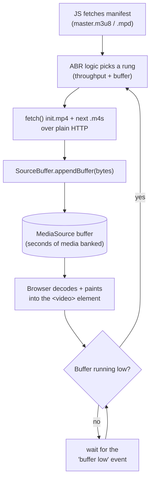
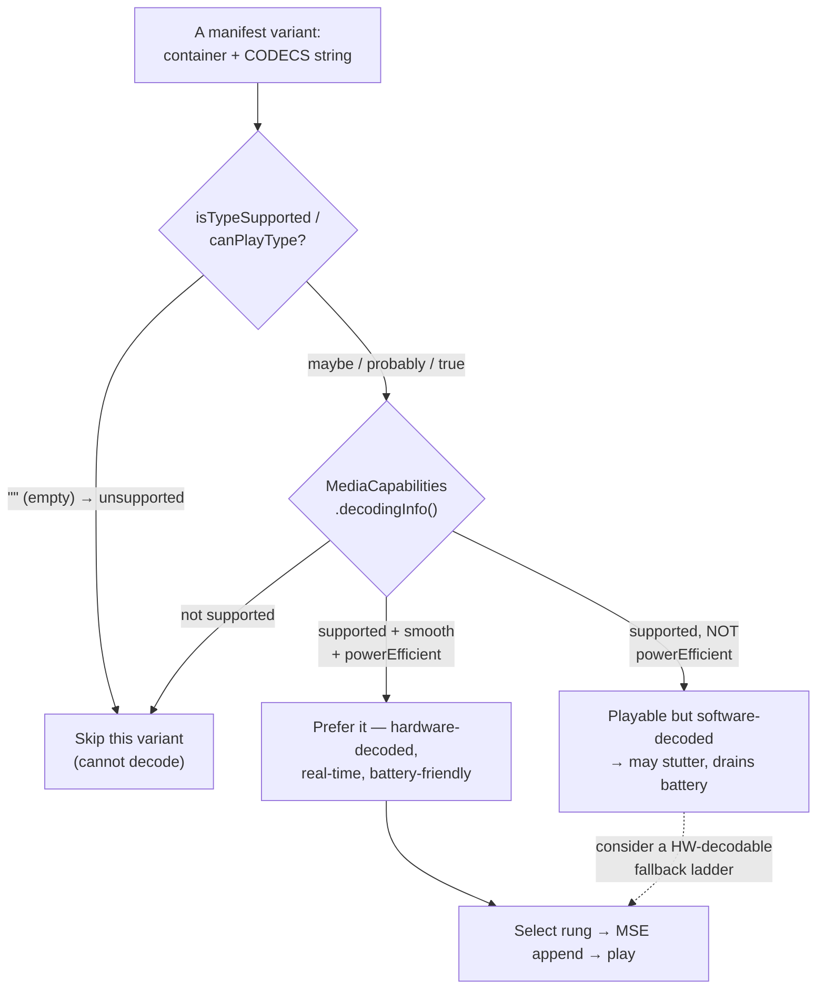

# Chapter 12 — Web Delivery & Compatibility

> **Part IV · Streaming** — What actually happens when a browser plays a video: `<video>` vs Media Source Extensions, how a player decides it *can* play a codec, what's supported where, and the concrete pile of decisions hiding behind "optimized for web."

[Chapter 11](11-adaptive-bitrate-streaming.md) built the streaming *package*: a ladder of CMAF renditions, segments, and the `master.m3u8` / `.mpd` manifests that describe them. This chapter is the other half of the handshake — the **client side.** How does playback *begin* in a browser? How does a player know it can decode a given codec *before* it downloads a single segment? What is genuinely supported across the messy real world of browsers and devices? And what does "make this video web-ready" actually mean, decision by decision? By the end, "it just plays" will stop being magic and become a checklist.

---

## How playback begins: `<video>` vs MSE

There are two fundamentally different ways video reaches the screen in a browser, and the difference is the spine of this chapter.

### The simple path: a plain `<video>` element

For a single, self-contained file you can hand the browser a URL and walk away:

```html
<video src="movie.mp4" controls></video>
```

The browser's **native media stack** takes over completely: it issues HTTP requests (using **byte-range** requests to fetch only the parts it needs — more below), demuxes the container, feeds the decoder, manages the buffer, draws frames, and handles seeking. You wrote zero JavaScript. This is **progressive download / playback** — perfect for a 30-second clip, a product video, a GIF-replacement loop. Its limitation is the whole reason Chapter 11 exists: a plain `<video src>` plays **one fixed file at one quality.** It cannot switch renditions as your bandwidth changes. There is no ABR.

### The ABR path: Media Source Extensions (MSE)

To do adaptive streaming *in a browser*, JavaScript must take control of *what bytes go into the decoder and when.* That power is **MSE — Media Source Extensions**, the W3C API underneath essentially every web video player (hls.js, dash.js, Shaka Player, video.js, JW Player, and the players inside YouTube, Netflix web, Twitch…).

The shape of MSE: instead of giving `<video>` a network URL, you give it a **`MediaSource`** object as its source. The `MediaSource` exposes one or more **`SourceBuffer`s** — in-memory queues you, the JavaScript, **push media segments into.** Your code runs the ABR loop from Chapter 11: read the manifest, pick a rung, `fetch()` that rung's `init.mp4` and the next `.m4s` segment over HTTP, and **`appendBuffer()`** the bytes into the SourceBuffer. The browser decodes and renders whatever is in the buffer. When the buffer runs low, your loop fetches and appends the next segment — choosing the rung afresh each time based on measured throughput and buffer level.

```javascript
const video = document.querySelector('video');
const mediaSource = new MediaSource();
video.src = URL.createObjectURL(mediaSource);

mediaSource.addEventListener('sourceopen', async () => {
  // Tell the browser exactly what we'll feed it — container + codecs.
  const sb = mediaSource.addSourceBuffer('video/mp4; codecs="av01.0.08M.08"');

  // 1. Append the init segment (codec config, no media) once.
  sb.appendBuffer(await (await fetch('video/1080p/init.mp4')).arrayBuffer());
  await onUpdateEnd(sb);

  // 2. The ABR loop: choose a rung, fetch a segment, append, repeat.
  for (let n = 0; n < segmentCount; n++) {
    const rung = chooseRung(measuredThroughput, bufferedSeconds(video));
    const url  = `video/${rung}/seg-${String(n).padStart(5,'0')}.m4s`;
    sb.appendBuffer(await (await fetch(url)).arrayBuffer());
    await onUpdateEnd(sb);
  }
  mediaSource.endOfStream();
});
```



> 🧠 **Mental model:** A plain `<video src>` is **the browser driving.** MSE is **JavaScript driving** — the JS player fetches segments and *spoon-feeds* them to the decoder through a SourceBuffer, which is exactly how HLS plays in browsers that don't support HLS natively. **hls.js parses the `.m3u8`, runs the ABR algorithm, and appends CMAF segments via MSE — turning every modern browser into an HLS player even though only Safari understands `.m3u8` URLs directly.** The decode/render is still native (fast, hardware-accelerated); only the *fetch-and-schedule* logic moved into JavaScript.

> 🔬 **Going deeper:** This is the answer to a question that confuses everyone: *"Chrome doesn't support HLS — so how does HLS play in Chrome?"* It doesn't play it *natively* — `<video src="x.m3u8">` fails in Chrome. But hls.js downloads the playlist and segments with `fetch()`, then pushes the segment bytes into a SourceBuffer with MSE. Chrome never sees an `.m3u8`; it only sees fragmented-MP4 bytes arriving in a buffer, which it decodes happily. MSE is the **universal substrate** that makes HLS *and* DASH playable everywhere, regardless of which protocol a browser "natively" supports. It's why the CMAF convergence ([Chapter 11](11-adaptive-bitrate-streaming.md)) matters so much — every MSE player wants the same fMP4 segments.

### EME: the DRM sibling (one paragraph)

If the content is protected, MSE has a companion: **EME — Encrypted Media Extensions.** When a SourceBuffer receives encrypted segments, the browser fires an `encrypted` event; the JS player forwards the license challenge to a **CDM (Content Decryption Module)** — Google **Widevine** (Chrome/Android/Firefox), Apple **FairPlay** (Safari/iOS), Microsoft **PlayReady** (Edge/Windows/Xbox) — which fetches a license from your license server and decrypts frames inside a protected path the JavaScript can never read. EME is *only* the standardized handshake between the player and the CDM; the actual decryption and the keys live in the (often hardware-backed) CDM, out of reach. We'll touch DRM concretely at the end of the chapter.

---

## Codec & MIME strings: how a player decides it *can* play something

Before a player commits to a variant, it must answer one question: **"can this client actually decode this?"** Pick a codec the device can't handle and the result is a black screen or a hard error. So both the manifest *and* the browser APIs speak a precise vocabulary of **MIME types + codec strings.**

A full media type looks like this:

```
video/mp4; codecs="avc1.640028, mp4a.40.2"
```

Read it in two halves:

- **`video/mp4`** — the **container** MIME type (here MP4/ISOBMFF). Other values: `video/webm`, `application/vnd.apple.mpegurl` (an HLS playlist), `application/dash+xml` (a DASH manifest).
- **`codecs="…"`** — the precise **codec strings** for the streams inside, comma-separated. This is the same `CODECS=` string the HLS/DASH manifest advertises per variant ([Chapter 11](11-adaptive-bitrate-streaming.md)), and it's dissected byte-by-byte in [Chapter 07](07-bitstreams-and-nal-units.md). A quick decode of the common ones:

| Codec string | Means | Notes |
|--------------|-------|-------|
| `avc1.640028` | H.264, **High** profile (`64`), constraints (`00`), **Level 4.0** (`28` hex = 40) | The bytes after `avc1.` are profile/constraints/level hex. |
| `hvc1.1.6.L93.B0` | HEVC/H.265, Main profile, Level 3.1 | Dotted fields, not hex — different grammar. |
| `vp09.00.10.08` | VP9, profile 0, level 1.0, 8-bit | |
| `av01.0.08M.08` | AV1, profile 0 (Main), Level 4.0, Main tier, 8-bit | The string Chapter 11's ladder used. |
| `mp4a.40.2` | AAC-LC (MPEG-4 Audio, object type 2) | The `.40.2` is the audio analogue. |
| `opus` | Opus audio | Mercifully just a name. |

The player feeds these strings to one of two browser APIs to get a yes/no/maybe **before downloading media:**

**1. `canPlayType()` / `MediaSource.isTypeSupported()` — the legacy gate.** Returns one of three deliberately wishy-washy strings:

```javascript
video.canPlayType('video/mp4; codecs="av01.0.08M.08"');
// → "probably"  (yes, almost certainly)
// → "maybe"     (the container is plausible but can't be sure from the type alone)
// → ""          (empty string = NO, definitely cannot play)

MediaSource.isTypeSupported('video/mp4; codecs="av01.0.08M.08"');
// → true / false  (the MSE-specific, boolean version a JS player uses)
```

An empty string is the only unambiguous answer — and it's the decisive one: **`""` means skip this variant.** A JS player iterates the manifest's variants and discards any whose `CODECS=` returns `""`, so it never picks a rung it can't decode.

**2. `MediaCapabilities.decodingInfo()` — the modern, richer gate.** `canPlayType` only answers *"is it supported?"* The **MediaCapabilities API** answers the questions that actually matter for choosing a codec on *this* device:

```javascript
const result = await navigator.mediaCapabilities.decodingInfo({
  type: 'media-source',                              // for MSE playback
  video: {
    contentType: 'video/mp4; codecs="av01.0.08M.08"',
    width: 1920, height: 1080,
    bitrate: 5_000_000, framerate: 24
  }
});
// result = { supported: true, smooth: true, powerEfficient: true }
```

Three booleans, and the second and third are the prize:

- **`supported`** — can decode it at all.
- **`smooth`** — can decode it *fast enough to not drop frames* at this resolution/bitrate/framerate (i.e., is decode fast enough to keep up in real time?).
- **`powerEfficient`** — is there a **hardware** decoder for it, or will the CPU grind through it in software (hot phone, dead battery)?

This is how a smart player makes the AV1-or-fallback decision: query MediaCapabilities for `av01…`, and if it comes back `supported: true, powerEfficient: true`, prefer the AV1 ladder (smaller files, same quality — [Chapter 16](16-patents-and-royalties.md)); if AV1 is merely `supported` but **not** `powerEfficient` (software decode), maybe fall back to the H.264 ladder so the phone doesn't melt.



> 🧠 **Mental model:** The manifest *advertises* what each variant needs (`CODECS=`); the client *checks itself* against that with `canPlayType` (yes/no/maybe) or, better, MediaCapabilities (supported / smooth / power-efficient). The negotiation is **client-driven and happens before any media downloads** — which is exactly why getting your codec strings right in the manifest is load-bearing. A wrong or missing `CODECS=` string makes a perfectly playable variant *look* unplayable, and the player silently skips it.

---

## What's actually supported where

Here is the messy truth the codec strings are negotiating against. Support means **decode** support (playing), which is what matters for delivery; encode support is a separate question.

| Codec | Browser / device reality | Hardware decode | Royalty status |
|-------|--------------------------|-----------------|----------------|
| **H.264 / AVC** | **Universal.** Every browser, every OS, every phone, smart TVs, set-top boxes, a decade-old laptop. | Everywhere | Patent-licensed (MPEG-LA) — [Ch 16](16-patents-and-royalties.md) |
| **HEVC / H.265** | **Fragmented.** Safari/Apple devices yes; Chrome/Firefox only where the **OS+GPU** provide a HW decoder (and even then gated). Patent fog kept it off the open web. | Apple + recent GPUs | Expensive, **multiple** pools (Access Advance, MPEG-LA, Sisvel) — the licensing mess that opened the door for AV1 |
| **VP9** | **Broad.** Chrome, Firefox, Edge, Android natively; **not Safari** (historically). Powered YouTube for years. | Wide on modern GPUs | **Royalty-free** (Google) |
| **AV1** | **Growing fast.** Chrome, Firefox, Edge, Android; Safari **17+ on Apple-silicon devices with a HW decoder**. Software decode everywhere as a fallback. | Recent only: NVIDIA RTX 30+, Intel 11th-gen+, Apple A17/M3+, recent Android SoCs | **Royalty-free** (Alliance for Open Media) — the whole point |
| **Opus (audio)** | Broad — all major browsers; Safari 11+. Plays in MP4 and WebM. | (audio, trivial to decode) | **Royalty-free** (IETF) |
| **AAC (audio)** | **Universal**, like H.264. | Everywhere | Patent-licensed |

Two takeaways drive real architecture decisions:

1. **H.264 + AAC is the universal floor.** If a variant must play *literally everywhere* (an ancient Android, a hotel smart TV), that's still the safe pair. It's the reason many ladders keep an H.264 rung at the bottom as a compatibility net.
2. **Broad AV1 hardware-decode support is the prize.** AV1 delivers the bitrate savings of HEVC (~30–50% over H.264 at equal quality) **with no royalties** ([Chapter 16](16-patents-and-royalties.md)) — but only pays off on the open web once enough clients can decode it **in hardware** (software AV1 decode works but cooks battery, so MediaCapabilities reports it not-`powerEfficient`). That hardware base is now large enough that AV1-first ladders with an H.264 fallback are a mainstream strategy — and it's why **we default to AV1** ([🛠️ below](#in-rivet)).

> 🔬 **Going deeper:** "Supported" is a moving target with a long tail. A browser version that decodes AV1 *in software* will report `supported: true` from `isTypeSupported` but `powerEfficient: false` from MediaCapabilities — technically playable, practically a battery fire on a phone. This is exactly why MediaCapabilities exists and why `canPlayType` alone is insufficient for a serious player: the right rung depends not just on *can it decode* but *can it decode this resolution, at this bitrate, in hardware, without dropping frames.* Always probe with the full `{width, height, bitrate, framerate}` descriptor, not just the codec string.

---

## Faststart, again — or the browser can't even begin

[Chapter 09](09-containers-and-muxing.md) introduced **faststart** (a.k.a. `+faststart`, or "web-optimized"). It matters most precisely *here*, at the moment of web playback, so it's worth restating in delivery terms.

An MP4 contains an **`moov`** box (the index: where every sample is, its size, its timestamp — the table of contents) and an **`mdat`** box (the actual media bytes). A decoder **cannot decode a single frame without the `moov`**, because it doesn't know where the frames *are*. Default MP4 muxers write `mdat` first and `moov` **last** (the index isn't final until all samples are written). For a local file that's fine — the player reads the whole thing. For **progressive HTTP playback it's a disaster**: the browser downloads megabytes of `mdat` it can't use, hits the `moov` only at the very end, and *only then* can start — so the video appears to hang on a black frame for the entire download.

**Faststart relocates `moov` to the front**, before `mdat`. Now the browser fetches the small index immediately, learns the layout, and starts decoding the first frames as they stream in. **Without faststart, a progressively-served MP4 either stalls until fully downloaded or doesn't start at all.** (For ABR/CMAF this specific problem dissolves — fragmented MP4 interleaves a tiny `moof` index *before each* segment's `mdat` by design — but for any plain `<video src="file.mp4">`, faststart is mandatory.)

---

## Progressive vs streaming vs ABR (and the HTTP underneath)

Three delivery models, increasing in sophistication, all riding on ordinary HTTP:

| Model | What it is | Switches quality? | When to use |
|-------|-----------|:-----------------:|-------------|
| **Progressive download** | One file over HTTP; play while it downloads (needs faststart) | ❌ | Short clips, simple embeds, GIF-replacement |
| **"Pseudo-streaming"** | Progressive + **byte-range seeking** | ❌ | A single VOD file you want to seek within |
| **ABR streaming** | A ladder of segmented renditions via HLS/DASH/CMAF over MSE | ✅ per segment | Anything real: long-form, live, varied audiences |

The connective tissue under all three is the **HTTP byte-range request** (`Range: bytes=5000000-5999999`). It's how seeking works on a plain `<video>`: drag the scrubber to the 8-minute mark and the browser doesn't re-download from the start — it consults the `moov` index, computes the byte offset of the nearest keyframe, and issues a `Range` request for *just that slice.* It's also how MSE players fetch sub-parts of files and how a **CDN (Content Delivery Network)** — the global mesh of edge caches that actually serves your bytes from a server near each viewer — caches and serves segments efficiently. Plain HTTP + byte ranges is the entire transport; there is no exotic streaming protocol underneath modern web video, which is exactly why it scales on commodity CDNs.

> 🧠 **Mental model:** Modern web video is **"a pile of small files served over boring HTTP, fetched cleverly."** No magic protocol — just HTTP GETs (whole segments) and HTTP Range GETs (slices of a file), cached at CDN edges. The cleverness is entirely in *which* bytes the client asks for and *when* (the ABR loop), not in the transport. That's the design choice that let streaming ride the existing web instead of building a parallel internet.

> 🔬 **Going deeper:** Trace a seek concretely. You have a faststart 200 MB H.264 MP4, 10 minutes long, and you drag to the 8:00 mark. The browser already has the `moov` (it's at the front), so it (1) looks up the **sync-sample table** (`stss` — the list of keyframe sample numbers) to find the nearest keyframe at or before 8:00, say sample 11,520; (2) reads the **sample-to-chunk** and **chunk-offset** tables (`stsc` / `stco`/`co64`) to compute that sample's **byte offset** in `mdat`, say byte 162,480,000; and (3) issues a single `Range: bytes=162480000-` request. The server replies `206 Partial Content` and streams from there. The viewer waited for one small round-trip and a keyframe to decode — not a 200 MB re-download. This is the whole reason the sample tables in [Chapter 09](09-containers-and-muxing.md) exist, and the whole reason `moov` must be reachable up front.

---

## Autoplay, muting & inline playback — the web's favorite gotcha

You can have a flawless, faststart, correctly-tagged, broadly-decodable video and still ship a player that **refuses to start** — because of browser **autoplay policies**, the single most common "why won't my video play?" support ticket in web delivery. These are *delivery* decisions as concrete as codec choice, so they belong on the checklist.

The rules, distilled across modern browsers:

- **Autoplay with sound is blocked** unless the user has "interacted with the domain" (clicked, tapped) or the site has earned a high media-engagement score. A muted `<video autoplay>` that *unmutes itself* in JavaScript will be **paused by the browser**. This exists to stop the web's plague of pages that blast audio at you on load.
- **Muted autoplay is allowed.** `<video autoplay muted>` (or `el.muted = true; el.play()`) starts without interaction in every major browser. This is why every social feed's auto-playing clip is **silent until you tap it** — the tap is the user gesture that authorizes sound.
- **`play()` returns a Promise that can reject.** If autoplay is blocked, `el.play()` *rejects*; a robust player **catches** that and shows a play button (a poster + tap-to-play UI) rather than failing silently.
- **iOS demands `playsinline`.** Without the `playsinline` attribute, mobile Safari hijacks playback into the **native fullscreen** player. For an inline feed, a custom player, or a background loop, you **must** set `playsinline` (and `muted` for autoplay).

```html
<!-- The robust "autoplay a silent loop in a feed" incantation, all four pieces: -->
<video autoplay muted loop playsinline src="clip.mp4"></video>
```

```javascript
// Programmatic start, handling the rejection that autoplay policy can throw:
try {
  await videoEl.play();
} catch (err) {
  // Autoplay was blocked → reveal a tap-to-play control instead of a dead element.
  showPlayButton();
}
```

> 🧠 **Mental model:** The browser's contract is *"sound requires permission; silence is free."* Autoplay-muted-inline is the universal pattern because it asks for nothing; the **user's first tap** is the gesture that unlocks audio and, on iOS, fullscreen. If a video "doesn't autoplay," the cause is almost always a missing `muted`/`playsinline` or an uncaught `play()` rejection — not the file.

---

## "Optimized for web" as a concrete checklist

"Make it web-ready" sounds like a vague incantation. It is not — it's a finite list of independent, checkable decisions. Here is the whole thing:

| Decision | Web-safe choice | Why |
|----------|-----------------|-----|
| **Video codec** | AV1 (efficiency + royalty-free) or H.264 (universal floor); often an AV1-first ladder with an H.264 fallback | Compatibility vs efficiency vs royalties — the trade space of [Chapter 16](16-patents-and-royalties.md) |
| **Audio codec** | Opus (royalty-free, efficient) or AAC (universal) | A "web audio codec" the target browsers decode |
| **Container** | MP4/ISOBMFF (or CMAF segments for ABR) | The format every browser demuxes |
| **Faststart** | `moov` **before** `mdat` for any progressive MP4 | Or the browser can't start until fully downloaded |
| **Chroma / bit depth** | **4:2:0, 8-bit** for SDR delivery | What hardware decoders and `<video>` universally support; 4:4:4 / 10-bit have spotty HW support ([Chapter 02](02-color-and-pixels.md)) |
| **Color tagging** | Correct primaries / transfer / matrix in the container (and tonemap HDR→SDR unless deliberately shipping HDR) | Untagged or mistagged color makes browsers guess — washed-out or oversaturated picture ([Chapter 15](15-filters-scaling-tonemapping.md)) |
| **Segment length** | 2–6 s, **keyframe-aligned across the ladder** | The ABR switching invariant ([Chapter 11](11-adaptive-bitrate-streaming.md)) |
| **Manifest correctness** | Accurate `BANDWIDTH` / `RESOLUTION` / `CODECS` per variant | A wrong `CODECS=` makes a playable variant look unplayable and get skipped |
| **Playback markup** | `muted` + `playsinline` for autoplay; catch the `play()` rejection | Browser autoplay policy blocks sound-on autoplay and iOS forces fullscreen without `playsinline` |

None of these is magic; each is a specific lever with a specific failure mode if you get it wrong. "Optimized for web" is just "all eight set correctly."

---

## DRM in brief

Premium content (studios, live sports) is contractually required to be encrypted in transit and at rest, decryptable only on authorized devices. The pieces:

- **CENC — Common Encryption** (ISO/IEC 23001-7). One encryption of the media (AES-CTR or AES-CBC) that **multiple DRM systems can unlock** — the CMAF-style "encrypt once, package once" idea applied to keys. Avoids encrypting the content separately per DRM.
- **The three CDMs**, split along ecosystem lines: **Widevine** (Google — Chrome, Firefox, Android), **FairPlay** (Apple — Safari, iOS, tvOS), **PlayReady** (Microsoft — Edge, Windows, Xbox). To cover everyone you provision keys for all three against the **same** CENC-encrypted segments.
- **EME** (from earlier) is the browser API that brokers the license exchange between the JS player and the CDM. The keys and decryption live inside the CDM — often in a hardware-backed secure path — so neither the JavaScript nor the page can ever read the decrypted frames.

That's the entire shape: encrypt once (CENC), unlock with whichever CDM the client has (via EME), keep the keys out of reach. The detailed key-delivery and license-policy machinery is its own subject; for this course, knowing the four names (CENC, Widevine, FairPlay, PlayReady) and that EME wires them to the player is enough.

---

<a id="in-rivet"></a>
## 🛠️ In rivet

Our transcoder bakes the web-safe defaults from the checklist above straight into its output, so the package "just plays" in a browser without a post-processing pass:

- **AV1 video + Opus audio** by default — the efficient, **royalty-free** pair ([Chapter 16](16-patents-and-royalties.md)) — with **H.264/H.265 selectable** (`--codec h264|h265`) when a target needs the universal compatibility floor.
- **Faststart MP4** for single-file output: we write the `moov` index **before** `mdat`, so a plain `<video src>` starts immediately instead of stalling until fully downloaded. (For HLS we emit fragmented CMAF, where the per-segment `moof` makes faststart moot.)
- **Correct `CODECS=` strings** in the `master.m3u8`, parsed straight from the encoded bitstream — `av01.0.08M.08`, `opus`, etc. — so a player's `isTypeSupported` / MediaCapabilities check passes and the right variant is chosen ([Chapter 11](11-adaptive-bitrate-streaming.md)).
- **Segment-aligned CMAF** across the whole ladder (shared IDR cadence, identical segment boundaries) so MSE players switch rungs cleanly.
- **Web-safe color by default** — `web_sdr` (BT.709, 8-bit, 4:2:0) with HDR sources **tonemapped down to SDR** ([Chapter 15](15-filters-scaling-tonemapping.md)) and the color primaries/transfer/matrix **correctly tagged** in the container, so browsers don't guess and render washed-out or oversaturated.

The net effect: hand the output of `rivet transcode … --mode hls` to hls.js (or a `<video src>` for the single-file case) and it plays — because every decision in the checklist was already made the web-safe way. How those bytes get *produced* at scale — decode once, fan frames out to every rung, encode across GPUs — is the next part of the course.

---

## Recap

- Web playback starts two ways: a plain **`<video src>`** (the browser drives — progressive, single file, no ABR) or **MSE (Media Source Extensions)**, where **JavaScript fetches segments and `appendBuffer()`s them into a `SourceBuffer`**, running the ABR loop itself. MSE is how **HLS and DASH play in browsers that don't support them natively** (hls.js/dash.js/Shaka parse the manifest and push CMAF bytes through MSE). **EME** is the DRM sibling that brokers license exchange with a CDM.
- A player decides it *can* play a variant **before downloading media** by matching the **container MIME + codec string** (`video/mp4; codecs="av01.0.08M.08, opus"`) against **`canPlayType()`/`isTypeSupported()`** (yes/no/maybe) or the richer **MediaCapabilities API** (`supported` / `smooth` / `powerEfficient`). Manifests advertise these via `CODECS=` ([Chapter 07](07-bitstreams-and-nal-units.md)), so getting them right is load-bearing — a wrong string makes a playable variant get skipped.
- Support reality: **H.264 + AAC universal**; **HEVC fragmented** (Apple + patent fog); **VP9 broad** (not classic Safari); **AV1 growing fast** with **hardware decode on recent devices** — and broad AV1 HW decode is the prize because it pairs HEVC-class efficiency with **zero royalties**.
- **Faststart** (`moov` before `mdat`) is mandatory for progressive MP4 or the browser can't begin. Modern web video is **"small files over boring HTTP, fetched cleverly"** — whole-segment GETs plus **byte-range** requests for seeking, cached at **CDN** edges; no exotic protocol underneath.
- **"Optimized for web"** is a concrete checklist, not magic: codec choice, web audio codec, MP4/CMAF container, faststart, 4:2:0 8-bit, correct color tagging, keyframe-aligned segments, accurate manifest `CODECS=`. **DRM** = encrypt once with **CENC**, unlock with **Widevine / FairPlay / PlayReady** via **EME**.

**Next:** [Chapter 13 — The Transcoding Pipeline](13-the-transcoding-pipeline.md)
