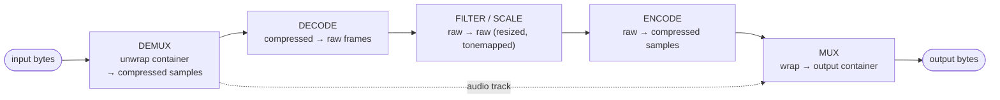
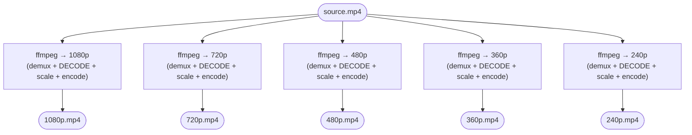
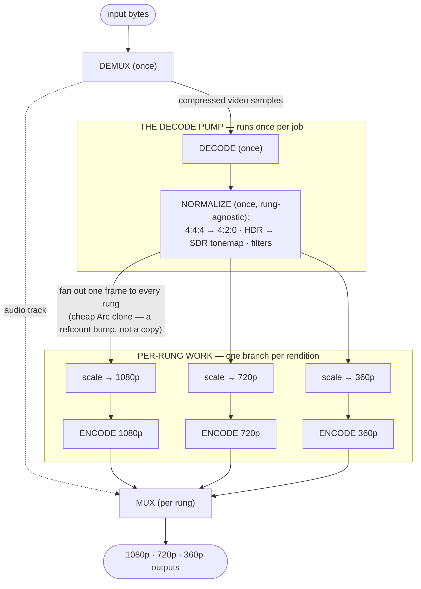
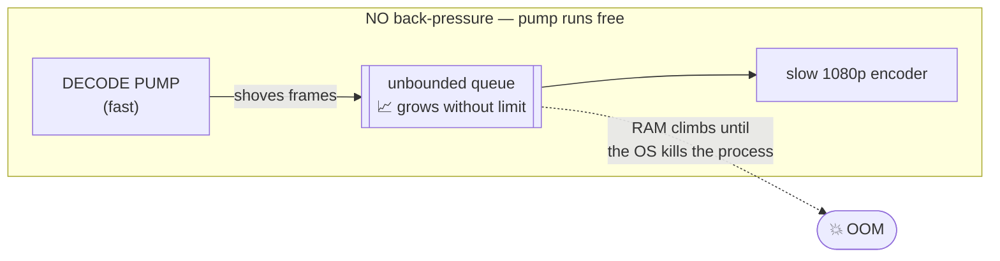
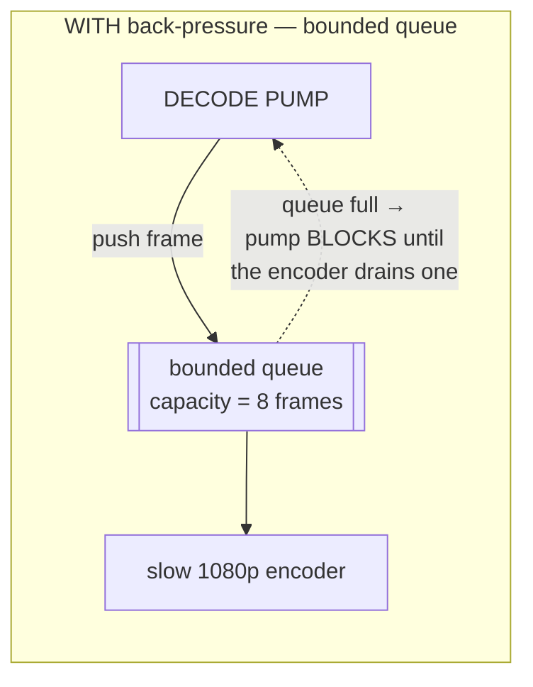
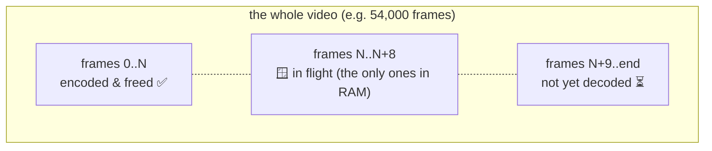
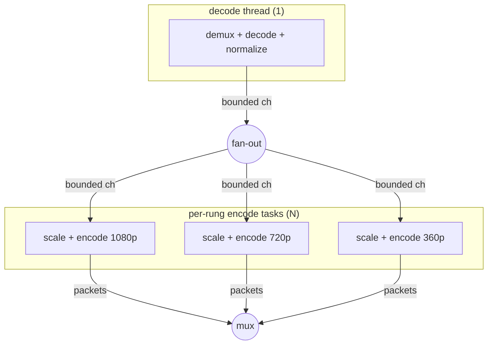
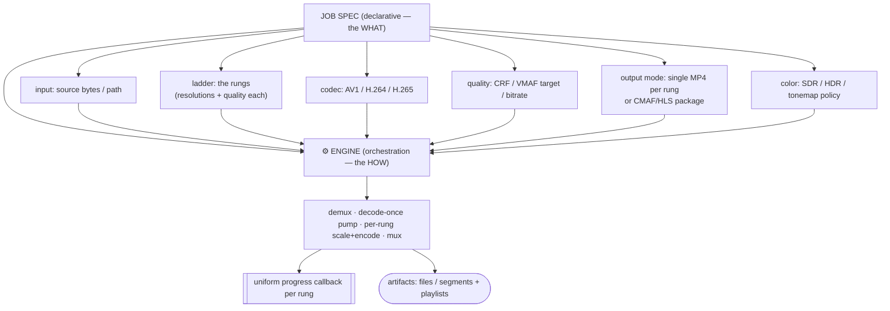
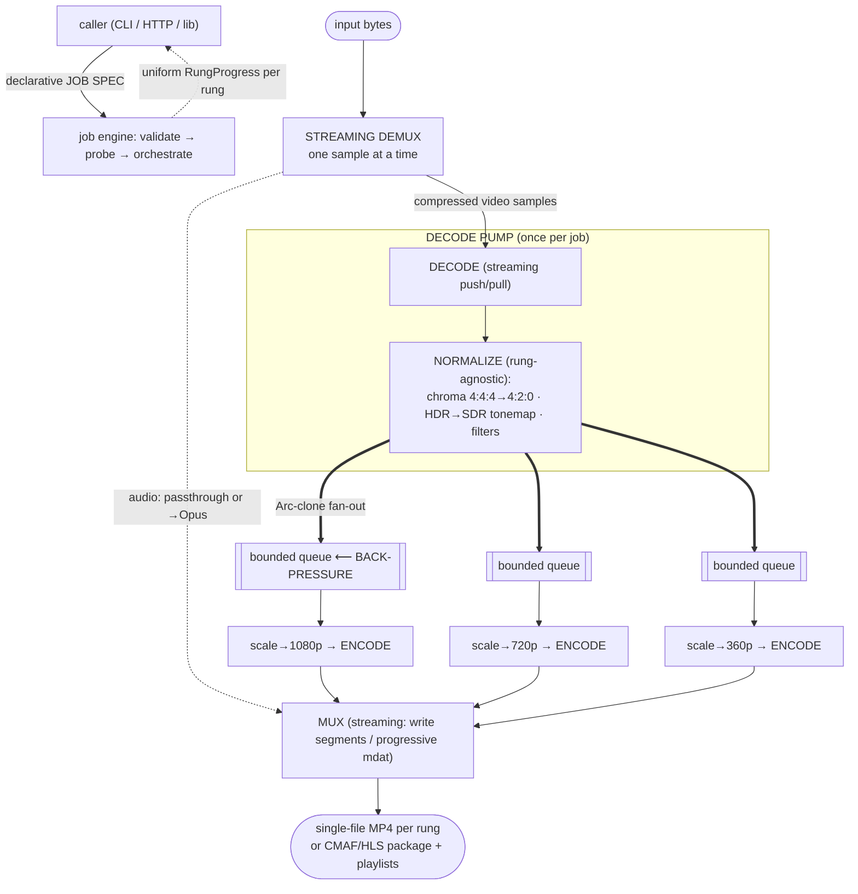

# Chapter 13 — The Transcoding Pipeline

> **Part V · Systems** — How the stages we've studied — demux, decode, filter, encode, mux — snap together into one engineered assembly line, and why the *shape* of that assembly line (decode once, fan out, with back-pressure) is the difference between an engine that hums on a 4 GB input and one that runs your machine out of memory.

Everything before this chapter was a part. We learned what a frame is ([Ch 01](01-what-is-video.md)), how color is stored ([Ch 02](02-color-and-pixels.md)), why and how codecs compress ([Ch 03](03-why-compression.md)–[Ch 06](06-encoders-and-rate-control.md)), how bytes are framed ([Ch 07](07-bitstreams-and-nal-units.md)), how audio rides along ([Ch 08](08-audio.md)), and how containers wrap and unwrap it all ([Ch 09](09-containers-and-muxing.md)–[Ch 10](10-demuxing.md)). This chapter is where the parts become a *machine*. We're going to build the whole assembly line as a **dataflow** — a chain of producers and consumers wired together by queues — and then make three design decisions that separate a toy from a production transcoder: **decode once and fan out**, **back-pressure**, and **bounded streaming memory**. This is, almost beat for beat, the architecture of the engine we built — rivet — so by the end you'll understand not just *a* pipeline but *ours*.

---

## What "transcoding" actually means

**Transcoding** is taking video in one form and producing it in another. "Form" is doing a lot of work in that sentence, so let's pin it down. A transcode can change any combination of:

- **Codec** — H.264 in, AV1 out (the most common, and the most expensive: a full decode + re-encode).
- **Resolution** — 4K source, a 1080p/720p/480p ladder out (scaling, [Ch 15](15-filters-scaling-tonemapping.md)).
- **Bitrate / quality** — a 50 Mbps camera original down to a 5 Mbps streaming master.
- **Container** — MKV in, fragmented-MP4/CMAF out ([Ch 09](09-containers-and-muxing.md), [Ch 11](11-adaptive-bitrate-streaming.md)).
- **Color / dynamic range** — HDR (PQ/HLG, BT.2020) tonemapped to SDR (BT.709), [Ch 15](15-filters-scaling-tonemapping.md).
- **Frame rate, audio codec, pixel format**, and more.

> 🧠 **Mental model:** A **transmux** (or "remux") rewraps the *same* compressed bytes into a different container — cheap, lossless, no pixels touched (MKV→MP4 by copying streams). A **transcode** decompresses to pixels and recompresses — expensive, generation-loss-prone, but the only way to change codec, resolution, or quality. This chapter is about transcoding; transmuxing is the easy special case where you skip the middle.

The reason transcoding is *the* core operation of every streaming service, every social platform, every video host is simple: **the form a creator uploads is almost never the form a viewer should download.** A phone uploads a 100 Mbps HEVC clip; a viewer on a train needs a 1.2 Mbps AV1 rendition that their browser can actually play. The transcoder is the machine in the middle that bridges those two worlds — at scale, reliably, and without melting.

---

## The assembly line: five stages as a dataflow

Strip a transcoder down to its essence and you get five stages in a line. Each stage **consumes** what the previous one **produces**:

Read it as a **pipeline of transformations**, each changing the *representation* of the video while preserving (most of) the *content*:

| Stage | Input | Output | What it does | Chapter |
|-------|-------|--------|--------------|---------|
| **Demux** | container bytes | compressed video samples + audio + timestamps | Parse the box/atom/EBML structure, pull out elementary streams, hand each sample its presentation time | [Ch 10](10-demuxing.md) |
| **Decode** | compressed samples (Annex-B / OBU) | raw frames (YUV pixel planes) | Run the codec's decode algorithm — entropy decode, inverse transform, motion compensation | [Ch 04](04-how-codecs-work.md) |
| **Filter / Scale** | raw frames | raw frames (transformed) | Resize, crop, tonemap HDR→SDR, color-convert, overlay — the pixel math in the middle | [Ch 15](15-filters-scaling-tonemapping.md) |
| **Encode** | raw frames | compressed samples | Run the encoder's rate-distortion search, emit a new bitstream | [Ch 06](06-encoders-and-rate-control.md) |
| **Mux** | compressed samples + audio | output container | Interleave A/V, write the index, finalize the container | [Ch 09](09-containers-and-muxing.md) |

Notice the audio dotted line: audio usually **bypasses** the decode/filter/encode middle entirely. If the source audio is already a format your output container can carry (AAC, Opus, AC-3), you **passthrough** the compressed audio bytes straight from demux to mux — no decode, no re-encode, no quality loss, near-zero cost. You only touch audio if you must transcode it (say, MP3 in → Opus out). We'll keep audio in the back of our minds; the heavy machinery is all on the video path.

> 🛠️ **In rivet:** This is exactly our crate boundary. `container` owns demux + mux; `codec` owns decode + filter + encode + colorspace + tonemap; the `rivet` crate is the orchestration that wires them into a job. Audio routing (passthrough AAC/Opus/AC-3/E-AC-3, transcode MP3/Vorbis→Opus, drop the rest) is handled once and shared across every output — it never gets re-done per rendition.

### Each stage is a producer *and* a consumer

The single most useful way to think about a pipeline is: **every stage is simultaneously a consumer (of the stage before) and a producer (for the stage after).** The decoder *consumes* compressed samples and *produces* raw frames. The encoder *consumes* raw frames and *produces* compressed samples. This producer/consumer framing is not just description — it's the design. It tells you exactly where the **seams** are, and the seams are where all the interesting engineering lives: how do you connect a producer to a consumer that run at different speeds? The answer — a **queue** — is the spine of the whole chapter.

---

## The naïve build, and why it's wrong

Here's the trap almost every first transcoder falls into. You want an **ABR ladder** ([Ch 11](11-adaptive-bitrate-streaming.md)) — say five renditions: 1080p, 720p, 480p, 360p, 240p — so a player can adapt to bandwidth. The obvious way to produce five renditions is to run your transcoder five times:

It works. It also **decodes the source five times.** Look at the highlighted word in every box: each independent run does its own full demux + **decode**. And decoding is *not* cheap — for a 4K HEVC source it can be the single most expensive stage in the whole pipeline, especially in software. You're paying for it five times to produce five renditions of the *same frames*.

This is the classic "`ffmpeg`-per-rung" build. It's wasteful in the most fundamental way: it redoes work that is provably identical across all five outputs. The demuxed samples are identical. The decoded frames are identical. The *only* thing that differs per rendition is what happens **after** decode — the scale-to-target-resolution and the encode. Everything upstream of the scaler is shared, and the naïve build throws that sharing away.

> 🧠 **Mental model:** Naïve ABR is a kitchen where five cooks each walk to the market, buy the same vegetables, and chop them — to make five variations of one dish. The smart kitchen sends **one** person to shop and chop, then hands the prepped ingredients to five cooks. Decoding is the shopping-and-chopping; it should happen once.

### How much waste, concretely

Suppose decode costs 100 units of work per frame and each encode costs 60/40/25/15/10 units for the five rungs (smaller frames encode faster). Per frame:

| Build | Decode work | Encode work | Total |
|-------|-------------|-------------|-------|
| **Naïve (×5 decode)** | 5 × 100 = **500** | 60+40+25+15+10 = 150 | **650** |
| **Decode-once** | 1 × 100 = **100** | 150 | **250** |

Decoding once cuts total work from 650 to 250 — a **2.6× speedup** on this toy example, and the gap *widens* as the source gets more expensive to decode (4K, HEVC, 10-bit) and as you add rungs. For a 4K HDR source feeding a six-rung ladder, decode-once is routinely a **3–5× win** before you've touched anything else. It is the single highest-leverage architectural decision in the whole system.

---

## The smart build: decode once, fan out

The fix is structural. Split the pipeline at the seam between "shared work" and "per-rendition work," and put a **fan-out** there. Decode the source **exactly once**, then broadcast each decoded frame to N per-rung encoders:

Three things make this work, and each is worth understanding deeply.

### 1. The decode pump

The **decode pump** is the shared front half: demux → decode → *rung-agnostic normalization*. It runs **once per job**, no matter how many rungs you're producing. Its job is to turn the source into a stream of clean, normalized, ready-to-scale frames and **fan each one out** to every rung's branch.

What belongs *in* the pump (shared, done once) versus *after* the fan-out (per-rung) is a precise distinction:

| Belongs in the pump (rung-agnostic, do once) | Belongs after fan-out (per-rung) |
|---|---|
| Demux | — |
| Decode | — |
| Chroma downsample (4:4:4 → 4:2:0) | — |
| HDR → SDR tonemap (same for every rung) | — |
| Crop / pad / rotate / overlay filters | — |
| — | **Scale to the rung's resolution** |
| — | **Encode at the rung's quality/bitrate** |

The rule is mechanical: **if the operation produces the same result for every rendition, do it once in the pump.** Tonemapping a frame from HDR to SDR yields identical pixels whether that frame is bound for the 1080p or the 240p rung — so it goes in the pump. Scaling does *not* (each rung scales to a different size), so it lives after the fan-out. Get this boundary wrong and you either re-do shared work (slow) or share per-rung work (incorrect).

### 2. Fan-out is (almost) free

"Broadcast every frame to five encoders" sounds like it should copy each frame five times — and a raw 1080p frame is ~3 MB, so five copies per frame at 60 fps is ~900 MB/s of pure memcpy. That would eat the savings.

The trick: **don't copy the pixels — share them.** A decoded frame is an immutable buffer; once decoded, nobody mutates it. So the fan-out hands each rung a *reference* to the same underlying pixel buffer, not a copy. In Rust this is an `Arc` (atomically reference-counted pointer): cloning it bumps a counter and hands out another handle to the *same* bytes. Five rungs sharing a frame means one buffer with a refcount of five, freed automatically when the last rung is done with it.

> 🔬 **Going deeper:** This is why decoded frames are treated as **immutable** in a well-built pipeline. The moment a stage needs to *change* pixels (scale, filter), it allocates a *new* buffer rather than mutating the shared one — copy-on-write discipline. The per-rung scaler reads the shared frame and writes a fresh, smaller frame; the shared frame is untouched and stays valid for the other rungs. Immutability is what makes zero-copy fan-out safe.

> 🛠️ **In rivet:** Our decode pump is literally one function that demuxes + decodes + normalizes the source once and fans each frame to a `Vec` of per-rung channels. Fan-out is a `VideoFrame::clone()` — and because the pixel `Bytes` are `Arc`-backed, that clone is a refcount bump, not a memcpy. A five-rung ladder decodes the input **once, not five times.** The normalization (chroma downsample, policy-driven HDR→SDR tonemap, the filter chain) all happens in the pump *before* fan-out precisely because it's identical for every rung; only scaling and encoding differ, and those are pushed down to per-rung tasks.

### 3. Per-rung branches

After the fan-out, each rung is an independent little pipeline: **scale → encode → (its slice of) mux.** The 1080p branch scales the shared frame to 1920×1080 and encodes it at the 1080p quality target; the 240p branch scales the *same* shared frame to 426×240 and encodes it at a much lower bitrate. These branches run **concurrently** — while the 1080p encoder is grinding on frame 100, the 240p encoder might be on frame 140. That concurrency is the next big idea, and it forces us to confront the question we've been circling: what happens when the producer and the consumer run at different speeds?

---

## Back-pressure: the load-bearing idea

Here's the situation. The decode pump produces frames at some rate. The 1080p encoder consumes them at a *slower* rate (it's the heaviest encode). The 240p encoder consumes them *faster*. They're all connected to the same fan-out. What happens?

Without anything to regulate it, the pump runs **as fast as it can**, shoving frames at every rung. The fast 240p rung keeps up. The slow 1080p rung falls behind — and the frames it hasn't consumed yet have to go *somewhere*. They pile up in a queue in front of it. The pump keeps decoding. The queue keeps growing. For a 15-minute 1080p60 video that's ~54,000 frames × ~3 MB = **~160 GB** of decoded frames buffered in RAM if the slow rung never catches up. Your process is killed by the OOM (out-of-memory) reaper long before the video finishes.

The fix is **back-pressure**: put a **bounded** queue between the producer and the consumer, and make the producer **block** (wait) when the queue is full.

Now the dynamics invert. When the slow encoder's queue fills to its cap (say 8 frames), the pump's next `push` **blocks**. The pump stops decoding. It waits. The moment the encoder pops a frame and frees a slot, the pump unblocks, pushes one frame, and (if the queue is full again) immediately blocks again. The result: **the pump runs exactly as fast as the slowest consumer can drain, and not one frame faster.** Memory is bounded to (number of rungs) × (queue capacity) × (frame size) — a handful of frames, kilobytes-to-megabytes, *regardless of how long the video is.*

> 🧠 **Mental model:** Back-pressure is a **conveyor belt with a fixed number of slots.** The worker upstream can only place a part when a slot opens; if the downstream worker is slow, the belt fills, and the upstream worker simply *waits* — arms folded — instead of dumping parts on the floor. The system self-regulates to the speed of its slowest station. No central controller, no rate calculation — the geometry of the bounded belt does it for free.

This is the same idea as TCP flow control, an `O_NONBLOCK` socket that returns `EWOULDBLOCK`, a Unix pipe that blocks `write()` when the reader is slow, and a bounded channel in Go (`make(chan T, 8)`) or Rust (`mpsc::sync_channel(8)`). It is one of the most important patterns in all of systems programming, and a transcoder lives or dies by it.

### What back-pressure buys you

- **Bounded memory.** Peak RAM is a function of queue depth, not video length. A 3-hour 4K film and a 3-second clip have nearly the same peak RSS. (We'll prove this in the next section.)
- **Automatic rate-matching.** No stage needs to know how fast any other stage runs. Each just produces/consumes and blocks on the queue. The system finds its own equilibrium at the slowest stage.
- **No frame loss.** Unlike "drop frames when overwhelmed" (acceptable for a live preview, fatal for a file transcode), back-pressure *slows the producer* instead of *losing data*. Every frame is processed.
- **Graceful degradation under contention.** If the machine is busy and the encoder slows down, the pump just decodes slower. Nothing breaks; the job takes longer. That's exactly the behavior you want.

> 🛠️ **In rivet:** Between the decode pump and each rung sits a **bounded** channel — that's our back-pressure point. The pump blocks when a rung's queue is full; the encoder worker blocks when it's empty. The cost of decode-once is explicitly *this* back-pressure: the slowest rung (usually the largest, whose encoder is slowest) throttles the whole pump. We accept that trade gladly — it's what keeps memory flat. In our multi-GPU HLS path the same discipline runs end-to-end: a small bounded `SegmentChunkQueue` (one CMAF segment's worth of frames) connects each rung's scaler to its encoder workers, "producer blocks when full, workers block when empty," so a fast 240p rung can't run the decoder ahead and balloon RAM waiting for the 1080p rung.

---

## Streaming, not buffering: keep memory flat

Back-pressure bounds the *queues between* stages. But there's a second, equally important rule: **no single stage may buffer the whole video either.** This is the **streaming** principle, and it applies up and down the pipeline.

The naïve version of *every* stage wants to load everything:

- A naïve demuxer reads the entire file into a `Vec<u8>`, parses it all, returns a `Vec<Sample>` of every sample. For a 4 GB file that's 4 GB resident before you decode a single frame.
- A naïve decoder decodes every sample into a `Vec<Frame>` and returns the lot. For a 15-minute 1080p video that's ~160 GB of raw frames. Instantly fatal.
- A naïve muxer collects every encoded packet in memory and writes the file at the end.

The streaming version of each stage processes **incrementally** — pull one unit, push one unit, never hold more than a small window:

- A **streaming demuxer** yields **one sample at a time** as the consumer asks for it. It reads the container structure incrementally (or memory-maps it and walks the index), holding only the current sample plus a little parser state. Peak demux memory: kilobytes.
- A **streaming decoder** takes one sample (`push_sample`) and yields whatever frames are now ready (`decode_next`) — typically one or a few. It never holds the whole stream.
- A **streaming muxer** for fragmented MP4/CMAF writes each segment to disk (or uploads it) as it completes, then drops it from memory. For plain MP4 it can write the `mdat` payload progressively and only build the small index at the end.

Chain streaming stages together with bounded queues, and the whole pipeline becomes a **sliding window** over the video: at any instant, only a few frames near the "now" position exist in memory. The frames behind have been encoded and freed; the frames ahead haven't been decoded yet.

> 🧠 **Mental model:** Don't think of a transcoder as "load the video, transform it, save it." Think of it as a **river with a turbine in it.** Water (frames) flows through; the turbine (your pipeline) extracts work as each parcel passes; no one tries to hold the whole river in a bucket. The bucket would need to be the size of the river. The turbine only needs to be the size of the channel.

> 🔬 **Going deeper:** There's a subtlety with codecs that **reorder** frames (B-frames, [Ch 04](04-how-codecs-work.md)). A B-frame is decoded *after* the frames it references but *displayed between* them, so decode order ≠ display order. A streaming decoder must hold a small **reorder buffer** (the DPB — decoded picture buffer) big enough to reorder within the codec's max reordering depth — typically a handful of frames. This is still bounded and tiny; it does *not* break streaming. It's the one place a decoder legitimately holds more than "one frame," and the bound comes from the codec level (e.g. H.264 level 4.1 caps it), not the video length.

> 🛠️ **In rivet:** Our demuxers are **streaming** by construction — `demux_streaming` dispatches on the container's magic bytes to a per-format streaming demuxer (MP4/MOV, MKV/WebM, MPEG-TS, AVI including OpenDML files >1 GiB) that yields one video sample at a time rather than materializing the whole file. Combined with the bounded fan-out channels and incremental CMAF segment writes, peak RSS stays flat as the input grows. We measured **single-digit-MiB peak resident memory** on a synthetic 15-minute 1080p60 input — versus a ~2.6 GiB projection for the buffer-everything approach. That's roughly a **500× reduction**, and it's the whole reason the engine can transcode a feature-length 4K file on a machine with ordinary RAM.

---

## Concurrency: threads, tasks, and how frames flow

We've said the pump and the per-rung encoders run "concurrently." Let's make that concrete, because the concurrency model is what turns the dataflow diagram into a running program.

A transcoder is naturally **pipeline-parallel**: different stages work on different frames *at the same time*. While the encoder compresses frame 100, the decoder is already producing frame 108, and the muxer is writing frame 95. Each stage is busy on its own frame; the queues between them carry the hand-offs. This is different from **data-parallel** work (split one array across cores); here we split the *pipeline* across workers and let frames stream through.

The standard structure:

- **One decode thread.** Decode is sequential by nature (frame N+1 may depend on frame N), so it's a single producer. It runs on its own thread — often a dedicated OS thread because hardware decode FFI calls are blocking ([Ch 14](14-gpu-acceleration.md)).
- **N per-rung encode tasks.** Each rung gets its own worker. These can be OS threads or async tasks; what matters is they run independently and pull from their own bounded queue.
- **Channels between them.** A **channel** (a.k.a. queue) is the only thing the stages share. The decode thread `send`s; the encode task `recv`s. The channel's bounded capacity *is* the back-pressure mechanism — `send` blocks when full.

> 🔬 **Going deeper — blocking vs async.** Hardware encode/decode calls (NVENC's `EncodePicture`, NVDEC's parse) are *blocking* — they don't return until the GPU is done. You can't `await` them. So the encode/decode workers are typically run on **blocking threads** (a dedicated pool), while the *orchestration* — spawning workers, collecting results, reporting progress — runs in an **async runtime** (Tokio). The bridge between the two worlds is a channel whose `send().await` is driven from the async side and whose `recv()` is called from the blocking side (or vice versa). Mixing "blocking work on blocking threads, coordination in async" is the standard shape, and it's exactly what we do.

### A/V sync rides on timestamps

Here's a question that trips people up: if audio bypasses the slow video path and gets muxed almost immediately, while video grinds through decode→scale→encode, how do they stay in sync in the output?

The answer: **synchronization is carried by timestamps, not by timing.** Every sample — video frame *and* audio packet — carries a **presentation timestamp (PTS)**: "show/play me at time T." (Video also carries a **decode timestamp (DTS)** because of B-frame reordering.) These timestamps are assigned at demux from the source container and **preserved end to end**. The video encoder stamps its output frames with the same PTS the source frame had; the muxer interleaves audio and video by PTS.

So it doesn't matter that audio reaches the muxer in 2 milliseconds and the corresponding video frame reaches it 200 milliseconds later. The muxer places each by its *timestamp*, and a player reads those timestamps and plays frame and sound together. The pipeline's *wall-clock* timing is irrelevant to sync; only the *media* timestamps matter. Lose or corrupt a PTS and you get drift (audio ahead of video) — which is why every stage treats timestamps as sacred, passing them through untouched.

> 🧠 **Mental model:** Timestamps are **luggage tags.** A suitcase (frame/packet) might take a fast route or a slow route through the airport (pipeline), but its tag says "carousel 4, flight 22:00," and it ends up in the right place at the right time regardless of which conveyor it rode. The muxer is baggage claim, sorting everything back into timed order by the tags.

---

## The job model: a declarative spec → an orchestrated run

We now have all the mechanism. The last piece is the **interface**: how does a caller *ask* for a transcode? The professional answer is a **declarative job spec** — a data structure that describes *what you want*, not *how to do it* — handed to an engine that figures out the *how*.

A good job spec captures:

The power of the declarative split is that the *same engine* services every front-end. A CLI flag, an HTTP request body, a config file — they all parse into the *one* spec type, and the engine doesn't know or care which surface produced it. Add a new knob once (a field on the spec) and every front-end gets it. This is the difference between a *tool* (a CLI you shell out to) and a *service* (an engine you embed and drive programmatically).

### Progress: a uniform callback per rung

A long-running transcode must report progress — for a UI bar, for logging, for a "is this stuck?" health check. The clean design is a **uniform progress structure** pushed through a **sink** (a callback the caller supplies):

Each rung streams updates with the *same shape* regardless of output mode: `{ rung index, label (e.g. "720p"), status (Pending → Running → Finalizing → Completed/Failed), percent, frames done/total, segments, bytes }`. The caller wires the sink to whatever it needs — a progress bar, a Tokio channel it `.recv().await`s, an HTTP job-status slot it polls, or nothing (`/dev/null`).

The critical design rule: **progress is advisory and must never block or fail the job.** If the consumer of progress is slow or gone, the engine *drops* updates rather than stalling the transcode. Progress is a side-channel, never load-bearing on the actual work.

> 🛠️ **In rivet:** This *is* our architecture. A declarative `OutputSpec` (input, ladder of `Rung`s, `VideoCodec`, per-rung `Quality`, `OutputMode::SingleFile` or `Hls`, `ColorPolicy`) is handed to `run_job`, which validates it up front, demuxes the header + audio once, spins up the shared decode pump, fans out to per-rung scale+encode workers, and assembles the requested output shape. Progress streams through a `ProgressSink` trait — a uniform `RungProgress` per rung (`Pending → Running → Finalizing → Completed/Failed`, percent, frames, segments, bytes) — that you wire to a closure, a Tokio mpsc channel, or your own impl. The *same* events back our CLI's progress bars and our HTTP API's job-status polling. One knob set, three front-ends (CLI, HTTP, Unix socket), all parsing into the same spec.

---

## Error handling: fail fast, don't silently degrade

The last property of a production pipeline is how it behaves when something goes wrong — and video has a *lot* of ways to go wrong (corrupt input, an unsupported codec, a missing GPU encoder, a malformed color combination). The governing principle: **fail fast and loud at the boundary; never silently degrade in a way the caller can't see.**

Concretely:

- **Validate the spec before doing any work.** If the request is impossible — HDR output on a build with no 10-bit encoder, a 10-bit H.264 encode (no hardware supports it), an empty ladder — reject it *up front* with a clear error, before spending a CPU-minute decoding. Cheap checks first.
- **Probe capabilities before dispatching workers.** If the job needs an AV1 encoder and the host has no AV1-encode silicon, find that out with a tiny pre-flight probe and error immediately — rather than spawning ten workers that each crash at encoder construction (and on some drivers *hang uncancellably*).
- **Don't substitute without telling anyone.** The cardinal sin is the "helpful" silent fallback: the user asks for GPU AV1, the GPU path quietly fails, and the engine drops to a 20×-slower software path — so the job "succeeds" but takes an hour and nobody knows why. That's worse than failing. Either do what was asked, or refuse and say so. (Falling back is fine *if it's a designed, documented tier and you can observe it happened* — silent and invisible is the problem.)
- **Isolate per-rung failures where it's safe.** In an ABR ladder, one rung failing (say the 4K rung hit a driver bug) shouldn't necessarily nuke the whole job — the other four rungs are still useful. A good engine reports the failed rung through the progress sink as `Failed` and only hard-errors the *job* if *every* rung failed. This is a deliberate policy, not an accident: "mission-critical jobs do not abort on a single recoverable hiccup."

> 🧠 **Mental model:** Fail-fast is a **smoke detector, not a silent air freshener.** A bad transcode should set off an alarm you can't ignore, not quietly spray perfume over the problem so the output *looks* fine but is secretly wrong (washed-out HDR, a software path that blew your latency budget, a dropped rung). The expensive failure is the one you don't find out about until a viewer does.

> 🛠️ **In rivet:** We validate the `OutputSpec` first (`spec.validate()` rejects impossible color/depth combos at the surface), then run a **pre-flight encoder probe** — construct a throwaway encoder to confirm the host can produce the requested codec *before* spawning any workers, which both gives a clear "no AV1 encoder available" error and dodges an uncancellable blocking-task hang on drivers (Ampere with no AV1 silicon) that would otherwise wedge. A *failed* rung is reported through the sink as `RungStatus::Failed` and excluded from the output; the job only hard-errors if *every* rung failed. And we never silently swap a GPU path for a slow software one without it being a designed, observable tier.

---

## The whole machine, in one diagram

Putting every idea together — decode-once, fan-out, bounded back-pressure, streaming, concurrency, the job spec, progress:

Every arrow is a producer/consumer seam. Every `==>` fan-out is a zero-copy `Arc` clone. Every `[[bounded queue]]` is a back-pressure point that caps memory. The whole thing streams: at any instant only a sliding window of frames is resident. That's the engineered assembly line — and it's what lets one machine turn a multi-gigabyte 4K source into a five-rung adaptive ladder without buffering the river.

The one thing this diagram *abstracts away* is the box labeled "ENCODE." On a real system that box is competing for a scarce, expensive resource — the GPU's fixed-function video engine — and scheduling N encoders across one or more GPUs is its own systems problem. That's the next chapter.

---

## Recap

- **Transcoding** decodes compressed video to pixels and re-encodes it in a new form (codec, resolution, bitrate, container, color). **Transmuxing** just rewraps the same bytes — the cheap special case. The five-stage line is **demux → decode → filter/scale → encode → mux**, with audio usually **passthrough** straight from demux to mux.
- Every stage is a **producer and a consumer**; the seams between them are where the engineering lives.
- The **naïve ABR build runs the transcoder once per rung** and **decodes the source N times** — wasteful, because everything upstream of the scaler is identical across rungs.
- The smart build **decodes once and fans out**: a **decode pump** does the shared, rung-agnostic work (demux, decode, chroma downsample, HDR→SDR tonemap, filters) one time, then broadcasts each frame to N per-rung scale+encode branches. Fan-out is **zero-copy** (an `Arc` refcount bump, not a memcpy), so a five-rung ladder decodes once, not five times — routinely a 3–5× win.
- **Back-pressure** — bounded queues between stages where the producer **blocks when full** — makes the pipeline self-regulate to its slowest stage and **caps memory** to a few frames. Without it, a slow encoder lets the decoder run ahead and buffers the whole video (tens to hundreds of GB → OOM).
- **Streaming** means no stage buffers the whole video: a streaming demuxer yields one sample at a time, a streaming decoder pushes/pulls incrementally, a streaming muxer writes segments as they complete. The result is a **sliding window** — peak RAM depends on queue depth, *not* video length.
- **Concurrency** is pipeline-parallel: one decode thread, N per-rung encode tasks, bounded channels between them; blocking hardware calls on dedicated threads, orchestration in async. **A/V sync rides on PTS/DTS timestamps**, preserved end to end — wall-clock timing is irrelevant to sync.
- The **job model** is a **declarative spec** (input, ladder, codec, quality, output mode, color) → an engine that orchestrates the run and streams a **uniform progress callback per rung**. One spec type services every front-end.
- **Fail fast, don't silently degrade:** validate the spec, probe capabilities up front, never swap a fast path for a slow one invisibly, and isolate recoverable per-rung failures instead of aborting the whole job.
- **In rivet, this is the architecture:** one decode pump with `Arc`-clone fan-out, a bounded frame channel per rung as the back-pressure point, per-rung encode tasks, streaming demux/mux, and a job engine driving it with a `ProgressSink`. We measured single-digit-MiB peak RSS on a 15-minute 1080p60 input — ~500× less than buffer-everything.

**Next:** [Chapter 14 — GPU Acceleration & Scheduling](14-gpu-acceleration.md) — that "ENCODE" box is a fixed-function silicon block, there may be several of them across multiple cards, and feeding them efficiently — leases, helpers, chunk-and-stitch — is the real systems problem behind a fast transcoder.
