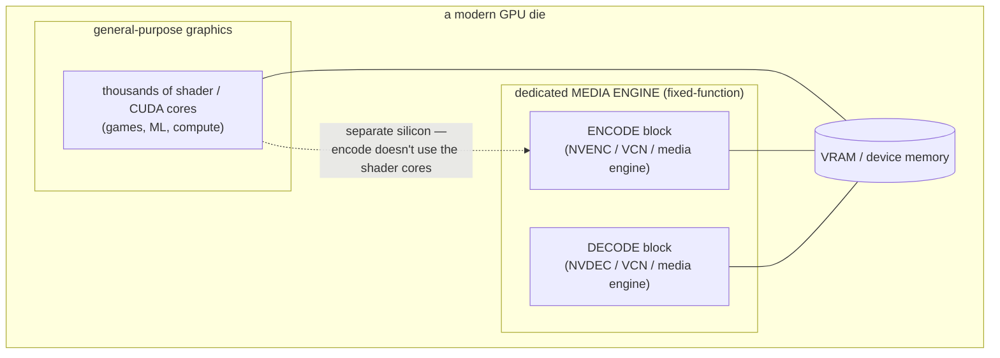
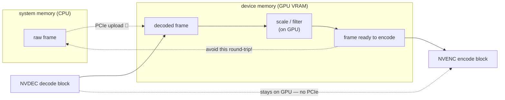
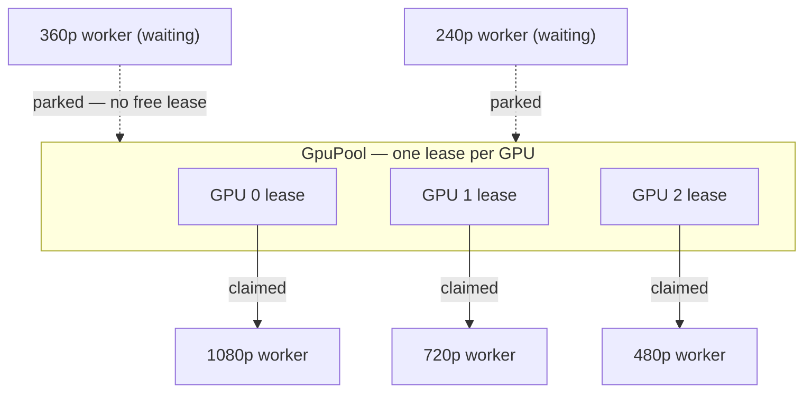
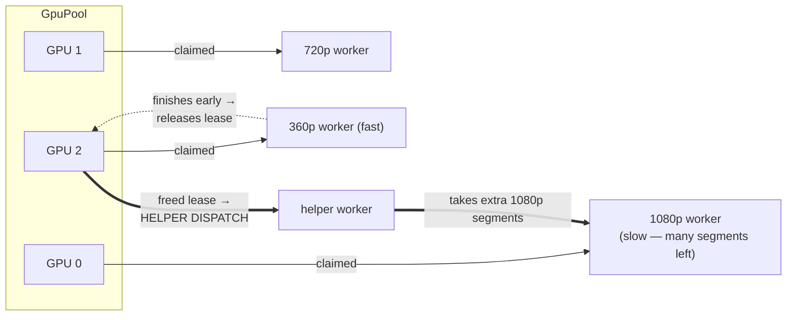
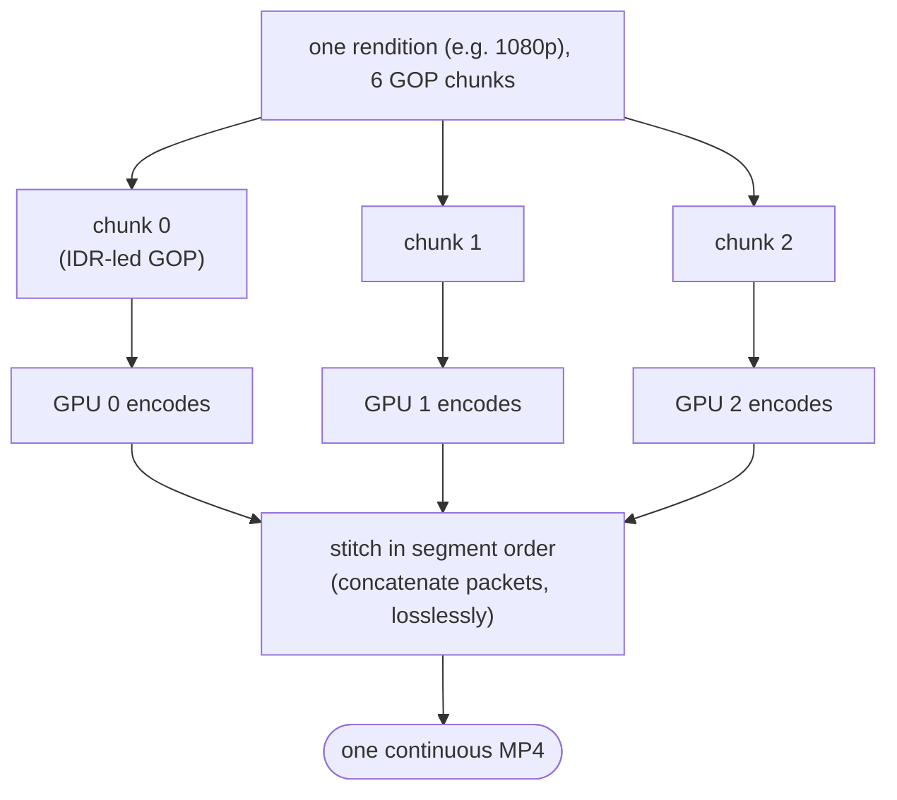
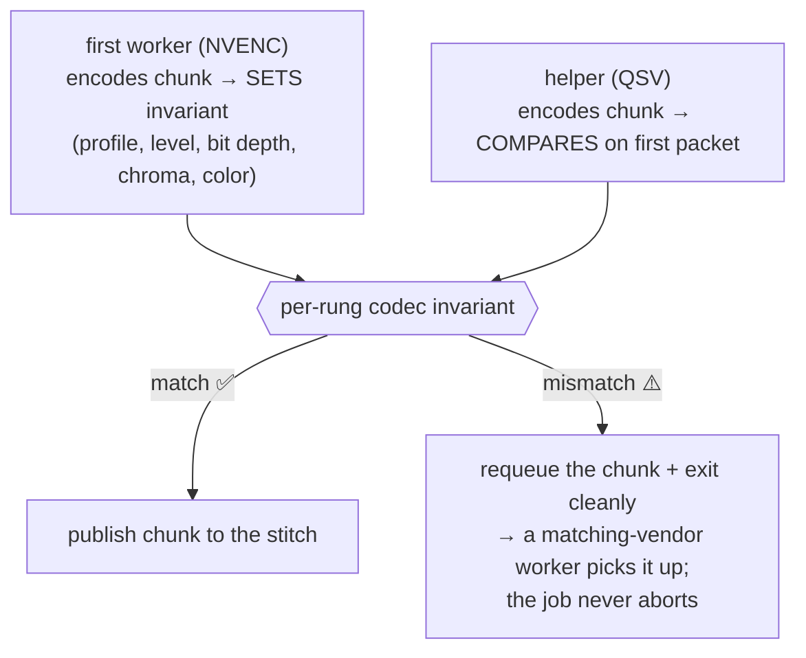
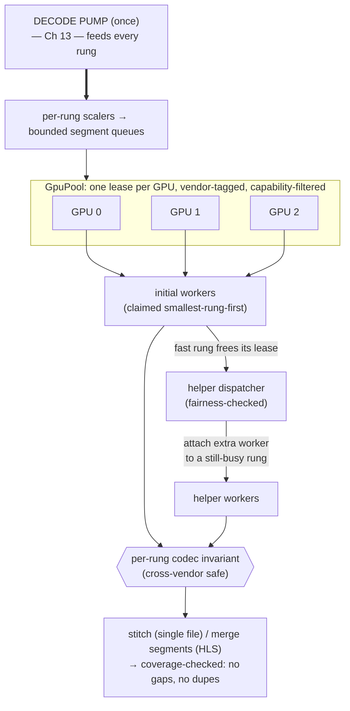

# Chapter 14 — GPU Acceleration & Scheduling

> **Part V · Systems** — Why a GPU encodes video 10–100× faster than a CPU (hint: it's *not* the CUDA cores), how the vendor frameworks and hardware surfaces actually work, the traps that silently turn a "GPU transcode" back into a slow software one — and the real systems problem on top: scheduling an ABR ladder across *several* GPUs without deadlocking or seaming.

In [Chapter 13](13-the-transcoding-pipeline.md) we built the assembly line and abstracted one box: **ENCODE**. On a real transcoder that box is the hot spot — the most expensive, most contended resource in the system. It also has a superpower most software doesn't: it can run on **dedicated silicon** that does nothing *but* video, hundreds of times faster than general-purpose code. This chapter opens that box. We'll see *why* the speedup exists, *how* you talk to the hardware, *where* it quietly betrays you (the "why is my GPU transcode at 100% CPU?" mystery), and then the genuinely hard part: **scheduling** many encoders across many GPUs — leases, helpers, chunk-and-stitch, and a cross-vendor invariant — which is exactly the engine we built into rivet.

---

## Why CPUs are slow at this (and GPUs aren't)

Start with the puzzle. A modern CPU runs billions of instructions per second across a dozen cores. Encoding 1080p60 video in software (x264, a slow preset) might manage *real-time on a good day* and bog a whole machine doing it. Meanwhile a $300 GPU encodes the same stream **many times faster** while sipping power and barely registering on the CPU. How?

The naïve guess is "the GPU has thousands of cores, so it's just more parallel." **That's wrong**, and the wrongness is the key insight. Video encoding is *not* embarrassingly parallel the way matrix math is — frame N+1 depends on frame N, motion search is a sequential refinement, entropy coding is inherently serial. Throwing 4,000 shader cores at it helps only modestly. So that's not where the speed comes from.

The real answer: a modern GPU has a **separate, dedicated block of fixed-function silicon** whose *only job* is video encode and decode. It is **not** the CUDA/shader cores. It's a purpose-built **state machine** — transistors wired specifically to do motion estimation, transform, quantization, and entropy coding for a fixed set of codecs — sitting on the same die as the graphics cores but architecturally distinct.

> 🧠 **Mental model:** A general-purpose CPU/GPU core is a **person following a recipe** — flexible, can cook anything, but reads each step and executes it. A fixed-function media block is a **factory machine that stamps one part** — it can *only* make that part, but it does so at a rate no recipe-follower can touch, because the operation is *baked into the wiring* rather than interpreted from instructions. Encoding H.264 on NVENC isn't "software running fast"; it's "a circuit *shaped like* an H.264 encoder."

This is why the speedup is so dramatic *and* so rigid. Dramatic, because fixed-function silicon doesn't pay the overhead of fetching/decoding/scheduling instructions — the data flows through a pipeline of dedicated units. Rigid, because the silicon implements *exactly* the codecs and features the chip designers chose, at the quality the search hardware was built for. You can't teach NVENC a new psychovisual trick the way you can patch x264 — the trick would have to be etched in silicon.

### The consequences fall right out of the architecture

| Property | Why it follows from "dedicated fixed-function block" |
|---|---|
| **Blazing fast** | No instruction overhead; a hardwired pipeline. Often many× real-time. |
| **Very low power** | A purpose-built circuit is far more energy-efficient than general cores doing the same work. Great for laptops, phones, dense servers. |
| **Frees the CPU/GPU** | Encode runs on its own block, so the CPU and shader cores are idle for other work (gameplay capture, your app's logic). |
| **Slightly worse quality per bit** | The search is fixed and shallower than a slow software preset; it can't do the fanciest tricks. Modern blocks have narrowed this to "a little worse," not "obviously worse." |
| **Limited concurrent sessions** | There are only one or two physical encode blocks per GPU; they serialize the streams they're given (more on this below — it's load-bearing). |
| **Generational feature support** | A given chip generation implements a fixed codec set. AV1 *encode* arrived only on recent silicon. |

That last pair — limited sessions, generational support — is exactly what makes *scheduling* a real problem later in this chapter. Hold onto them.

---

## The vendor frameworks: how you talk to the silicon

The media block is hardware; you reach it through a vendor **SDK** — a C API that hands compressed bitstreams and raw frames across the user/driver boundary. There are four you'll meet:

| Framework | Vendor | Encode | Decode | Notes |
|---|---|---|---|---|
| **NVENC / NVDEC** | NVIDIA | NVENC | NVDEC | Via the **Video Codec SDK**. The encode and decode blocks are independent. Mature, widely deployed. |
| **Quick Sync Video (QSV)** | Intel | ✓ | ✓ | Via **oneVPL** (the modern API, successor to Media SDK). Intel's iGPUs *and* the Arc discrete cards. |
| **AMF** (Advanced Media Framework) | AMD | ✓ (VCN) | ✓ (VCN) | AMD's "Video Core Next" engine. |
| **Vulkan Video** | cross-vendor | ✓* | ✓ | The vendor-neutral standard (`VK_KHR_video_*`). One API across NVIDIA/Intel/AMD — at the cost of doing more of the bitstream bookkeeping yourself. (*Encode extensions are newer/less universal.) |

The first three are **vendor-specific**: NVENC code only runs NVIDIA, AMF only AMD, QSV only Intel. Each has its own session model, its own surface formats, its own quirks. **Vulkan Video** is the ecumenical answer — write once, run on any vendor whose driver implements the extension — but it pushes work onto you: the app must parse slice headers and feed the driver the decode parameters that a vendor SDK would derive internally. It's the future of portability; it is not yet the easy path.

> 🔬 **Going deeper:** There's also a layer *above* all of these: **FFmpeg's `hwaccel`** wraps every vendor framework behind one CLI/library interface (`h264_nvenc`, `av1_qsv`, `hevc_amf`, …). It's the pragmatic way to get "one interface over every vendor" — but the abstraction is exactly where the silent-fallback traps (below) hide, because a wrong flag makes FFmpeg quietly pick a software encoder instead. Convenience and footguns, same coin.

> 🛠️ **In rivet:** We talk to the silicon directly. The hardware paths in our `codec` crate are **hand-rolled `dlopen` FFI** — we load `nvEncodeAPI` (NVENC), the oneVPL runtime (QSV), and the AMF runtime at runtime and call them in-tree, no external wrapper crate, building on **Windows + Linux**. Why hand-roll instead of lean on FFmpeg? Control and observability: we get to enforce our own session model (the lease pool below), surface a clear error instead of a silent software fallback, and keep the decode→encode path GPU-resident. FFmpeg is available as an *optional software tier* — a last-resort fallback and the only software-encode path — not the primary route.

---

## Hardware surfaces: where frames live, and the PCIe tax

To use the media block efficiently you have to think about **where a frame physically lives.** There are two memory worlds:

- **System memory (host RAM)** — where your program's normal data lives, attached to the CPU.
- **Device memory (VRAM)** — on the GPU, where the media block can read and write directly.

The media block operates on frames in **device memory**, in specific **surface formats** the silicon understands. The two you'll meet constantly:

| Surface format | Bit depth | Layout | Used for |
|---|---|---|---|
| **NV12** | 8-bit | Y plane, then a single **interleaved** UV plane (semi-planar 4:2:0) | The workhorse SDR format for hardware encode/decode |
| **P010** | 10-bit | Like NV12 but 16-bit samples (10 significant bits, high-aligned), interleaved UV | HDR / 10-bit (HDR10, HLG) |

NV12 is just 4:2:0 YUV ([Ch 02](02-color-and-pixels.md)) arranged the way the hardware wants it: full-res luma, then chroma at quarter resolution with U and V *interleaved* (`UVUVUV…`) rather than in separate planes. P010 is the 10-bit big sibling for HDR. If you hand the encoder a frame in the wrong format, best case it rejects you; worst case (the trap section) it silently converts on the CPU.

### The PCIe tax

Here's the cost that shapes everything: **moving a frame between system memory and device memory crosses the PCIe bus, and that's slow.** A 4K frame is ~12 MB; copying it host→device and back for every frame, at 60 fps, is gigabytes per second of bus traffic plus latency on each transfer. Do it naïvely and the **copies become the bottleneck** — your fast hardware encoder sits waiting for frames to arrive.

The optimization that falls right out: **keep frames on the GPU.** If you **decode** on the GPU (NVDEC) and **encode** on the GPU (NVENC), the decoded frame is *already* in device memory — hand it straight to the encoder without ever copying it back to host RAM. A decode→(GPU scale)→encode pipeline can stay **fully GPU-resident**, paying the PCIe tax only once on the way in (compressed bytes up) and once on the way out (compressed bytes down) — and compressed bytes are tiny compared to raw frames.

> 🧠 **Mental model:** Device memory is **the workshop floor**; system memory is **the loading dock outside.** Every trip a part makes between dock and floor costs time. The efficient shop receives raw stock once, does *all* the machining on the floor, and ships the finished product out once. The amateur shop carries each part out to the dock and back between every operation — and wonders why the expensive machine is idle half the time.

> 🛠️ **In rivet:** Our normalized frames carry `Arc`-backed pixel buffers ([Ch 13](13-the-transcoding-pipeline.md)) so fan-out across rungs is a refcount bump, not a copy. On the hardware path, the design goal is the same one this section preaches — minimize host↔device round-trips and keep the decode→scale→encode chain as GPU-resident as the surfaces allow, so the PCIe bus carries compressed bytes, not a firehose of raw frames.

---

## The traps: silent fallback and per-vendor quirks

Now the part that bites everyone. You enable "GPU encoding," run a transcode, and watch your **CPU** peg at 100% while the GPU sits at 3%. The transcode is slow. What happened? You hit a **silent software fallback.**

Hardware encode has a long list of preconditions: the right surface format, a supported resolution and codec, a session slot available, the correct color/bit-depth, driver capabilities present. When *any* precondition isn't met, a "helpful" abstraction layer (often FFmpeg's hwaccel, or a misconfigured pipeline) doesn't *error* — it **quietly substitutes a software encoder** and keeps going. The job "succeeds." It's just secretly running on the CPU at a fraction of the speed, and nothing told you.

Common triggers:

- **Wrong pixel/surface format.** You feed planar YUV where the encoder wants NV12; a conversion (or the whole encode) lands on the CPU.
- **A flag typo or missing `hwaccel`.** `-c:v h264_nvenc` engages NVENC; forget it and you get `libx264` — same output, 30× slower, no warning.
- **Unsupported codec/feature on this generation.** Ask a pre-AV1 card for AV1 encode and the layer falls back to a software AV1 encoder (libaom/SVT) — correct output, glacial speed.
- **All hardware sessions busy.** The block has limited concurrent sessions; overflow can spill to software.

> 🧠 **Mental model:** Silent fallback is a **detour sign with no warning.** You think you're on the highway (hardware); you've actually been routed onto a dirt road (software) that goes to the same town — eventually, hours later. The fix is the [Chapter 13](13-the-transcoding-pipeline.md) principle: **fail fast and loud**, or at minimum make the fallback *observable* (log it, surface it, count it). A fallback you chose and can see is fine; one that ambushes you is a bug.

### Per-vendor quirks are real

Each framework has its own landmines. A flavor of what "per-vendor quirks" means in practice (drawn from getting our own backends to actually produce correct bytes on real silicon):

- **NVENC:** concurrent encode *sessions* on a single context can deadlock at init past a small count — you must serialize session creation per GPU. H.264/H.265 want strict 1-in-1-out draining (disable lookahead/reorder) or the tail frames strand.
- **QSV (oneVPL):** 10-bit needs `Shift=1` on the P010 surface *and* the right bit-depth fields, or the driver silently reads the wrong 10 bits and encodes noise. Rate-control mode flags get rejected in specific combinations.
- **AMF:** surface lifetime is manual — release a surface too early and you get a use-after-free; properties are set by name and a typo'd property is silently ignored.

None of this is in a tidy spec. It's the tax of fixed-function hardware exposed through vendor SDKs, and it's why "GPU transcoding" is much easier to *enable* than to get *correct and fast*.

---

## Quality and the generational gap

Two honest caveats before we get to scheduling.

**Quality.** At the same bitrate, a good **software** encoder on a slow preset still **out-qualities** a hardware encoder ([Ch 06](06-encoders-and-rate-control.md)). The silicon's rate-distortion search is fixed and shallower; it can't do the deepest psychovisual tuning. But there's a knob: hardware encoders expose a **quality/speed preset** (NVENC `P1..P7`, etc.) and you can spend more silicon-time per frame for a better result. Modern AV1 hardware (Ada NVENC, Arc QSV) has narrowed the gap from "obviously worse" to "slightly worse" — close enough that for live, batch, and high-volume work the 10–100× speed and power win is decisive. For a prestige master you'll serve a billion times, software's efficiency edge can still pay for itself.

**Generational support.** This is the gotcha that strands real deployments. A GPU generation implements a *fixed* codec set, and crucially, **decode and encode support are separate**. The headline example is AV1:

| Capability | NVIDIA | Intel | AMD |
|---|---|---|---|
| **AV1 decode** | Ampere (RTX 30xx) and newer | broad (recent iGPU + Arc) | RDNA2 and newer |
| **AV1 encode** | **Ada (RTX 40xx)** and newer | **Arc** (and Meteor Lake+) | **RDNA3** and newer |

An RTX 3090 (Ampere) **decodes** AV1 happily but has **no AV1 *encode* silicon at all.** Point a "transcode to AV1" job at it and there is nothing to encode with — the hardware simply doesn't have the block. A correct engine must *know* this per card and per codec, or it'll either fail mysteriously or silently fall back to software.

> 🛠️ **In rivet:** This generational reality drives our **capability-aware** GPU pool. We probe each card for whether it can *encode* the requested codec (`encode_capable(device, codec)`, cached per `(gpu, codec)`) — and a card that can't (a pre-Ada NVIDIA asked for AV1) is **dropped from the encode pool** so no worker leases it and hard-fails the run. But — and this is the elegant part — it's **kept for decode.** A pre-Ada NVIDIA + an Arc on the same host will **decode on the NVIDIA (NVDEC) and encode on the Arc (QSV)** automatically, with no flags. Decode-capable and encode-capable are tracked as separate facts, exactly as the silicon demands.

---

## The real systems problem: scheduling across many GPUs

Everything so far concerns *one* encoder on *one* GPU. The production problem is bigger: you have an **ABR ladder** (N rungs, [Ch 11](11-adaptive-bitrate-streaming.md)) and possibly **several GPUs**, and you want to finish the whole job as fast as the hardware allows. This is a scheduling problem, and it has four parts: leases, ladder distribution, helper dispatch, and chunk-and-stitch. Let's build it up.

### Part 1 — the lease pool: one encoder per GPU

The first constraint is counterintuitive and load-bearing: **you generally want only one active encoder session per GPU at a time.** Not because the block can't *time-slice* multiple streams, but because — on at least one major vendor — spinning up several concurrent encode sessions on the *same context* can **deadlock at initialization** (we hit exactly this: NVENC wedging at around session 5/5, the GPU going idle, nothing encoding). The robust rule is to **serialize encoders per GPU** while still running them **in parallel across GPUs.**

The mechanism is a **lease pool**: model each GPU as a slot, hand out one **lease** per slot, and require an encoder worker to hold a lease for its lifetime. With G GPUs and W workers wanting to encode, the first G get leases immediately; the rest **wait** until a lease is released.

Two subtleties make this correct on real hardware:

- **The lease carries the GPU's *vendor*.** On a mixed host (NVIDIA + Intel Arc, both reporting "index 0" to their own driver), the lease tells the encoder factory *which* backend to dispatch — otherwise a naïve "try NVIDIA first" picks NVENC every time and the Arc sits idle. Vendor-on-the-lease is what lets a heterogeneous box use all its silicon.
- **Sparse indices survive.** If the operator masks GPUs (`CUDA_VISIBLE_DEVICES=0,2,5`), the pool keys on the *real* device index, not array position, so leases map to the right physical cards.

> 🧠 **Mental model:** The lease pool is a **set of keys to a small number of machines.** A worker can't run a machine without holding its key; when it's done it hangs the key back on the board, and the next worker in line takes it. The board enforces "one operator per machine" — which here prevents the init deadlock — while still letting all the machines run at once.

### Part 2 — distribute the ladder across GPUs

With a lease pool, distributing an N-rung ladder across G GPUs is natural: each rung is a unit of work that needs a lease to encode. Claim leases **smallest-rung-first** so the cheap, fast rungs grab GPUs first and *release them soonest* — which sets up the next trick. With three GPUs and a five-rung ladder, three rungs encode immediately; as each finishes and drops its lease, a waiting rung claims it.

But that leaves a problem: when the fast 240p rung finishes in 20 seconds and the slow 1080p rung still has 3 minutes to go, that freed GPU shouldn't sit **idle** for 3 minutes. Enter helpers.

### Part 3 — helper dispatch: idle GPUs help busy rungs

The insight: a rung's work isn't one indivisible blob — it's a stream of **segments** (or GOP-sized chunks), and *segments are independently encodable.* So when a fast rung frees its lease, a **helper dispatcher** grabs that freed lease and attaches an **extra encoder worker to a still-busy rung.** Now the slow 1080p rung is being encoded by *two* GPUs at once — its segments split between them — and finishes much sooner.

Because segment work is the unit of parallelism, throughput scales **close to linearly with GPU count** — no GPU sits idle while any rung still has segments to encode. The dispatcher just polls: "is any GPU free? is any rung still producing work? — then attach a helper." When no rung has work left, the helpers wind down.

> 🔬 **Going deeper — fairness.** There's a race to avoid: a helper grabbing a freed lease that a *parked initial worker* was waiting for. If the helper "steals" it, the legitimate worker starves. The fix is a fairness signal — the dispatcher checks whether any real worker is *already parked waiting* and, if so, backs off so the freed permit goes to the parked worker first. Helpers only soak up leases that *nobody else is waiting for.*

### Part 4 — chunk-and-stitch for a single file

Helpers parallelize an *HLS ladder* beautifully, because HLS is *already* segmented — each segment is a separate `.m4s` file, so two GPUs writing different segments is no problem. But what about a **single MP4 file** for one rendition? Can multiple GPUs cooperate on *one continuous file*?

Yes — with **chunk-and-stitch.** Split the rendition into **chunks at GOP boundaries** (each chunk an independent, IDR-led group of pictures — closed, self-contained, decodable on its own), encode the chunks **in parallel across GPUs**, then **concatenate the encoded packets** back together in segment order. Because each chunk starts with an IDR keyframe ([Ch 04](04-how-codecs-work.md), [Ch 07](07-bitstreams-and-nal-units.md)), the references reset cleanly at every seam — no chunk depends on a frame in another chunk — so the stitched stream just *plays*.

There's one catch, and it's a quality catch: **the seams must be invisible.** If each chunk is encoded with normal variable-bitrate rate control, two adjacent chunks might land at slightly different quality, and you'd *see* a step at the seam every couple of seconds. The fix is a **constant-quality mode** (constant-QP or CRF, [Ch 06](06-encoders-and-rate-control.md)): when every chunk targets the same *quality* rather than chasing a moving bitrate budget, independently-encoded GOPs splice with **no rate-control discontinuity** at the boundaries. Constant-quality encoding is precisely what makes the stitched seams safe — it's the reason CQP/CRF, which looked like a niche mode back in Chapter 6, turns out to be load-bearing for parallel single-file encode.

### Part 5 — the cross-vendor codec invariant

The final wrinkle. A helper attached to a rung might be running on a **different vendor's GPU** than the rung's first worker — an NVENC chunk and a QSV chunk contributing to the *same rendition*. Each vendor's encoder writes its own bitstream headers, and a video decoder configures itself **once** from the rendition's setup data (the `av01`/`avcC`/`hvcC` config box in the init segment, [Ch 07](07-bitstreams-and-nal-units.md)). If a later chunk's inline sequence header **disagrees** with that setup on a *mandatory* field — profile, level, bit depth, chroma subsampling, color — a strict decoder (dav1d in conformance mode, Safari, hls.js) **rejects the chunk.** Your "successful" stitch produces a file that won't play.

The guard is a **per-rung codec invariant**: capture the mandatory codec-config fields from the *first* contributing encoder, and require every subsequent contributor (including cross-vendor helpers) to **match** them on its first packet. The invariant deliberately checks only the *mandatory* fields and **ignores cosmetic ones** (timing-info presence, film-grain flag, operating-point detail) so that NVENC, QSV, and AMF can co-contribute without false rejections over a byte that doesn't affect decodability.

If a helper *mismatches*, it **requeues its chunk** and bows out cleanly — only that one contribution is lost, another (compatible) worker takes the chunk, and the **run never aborts.** This is the [Chapter 13](13-the-transcoding-pipeline.md) "isolate recoverable failures" principle applied at the chunk level: a single cross-vendor incompatibility costs one re-encode, not the whole job.

> 🛠️ **In rivet:** Parts 1–5 *are* our multi-GPU engine, and they're not aspirational — they run on real silicon. Our `GpuPool` hands out one lease per GPU (the one-encoder-per-GPU invariant exists because we *measured* the NVENC init deadlock at ~session 5/5 on 2026-05-02). Leases carry vendor; sparse indices survive; the encode pool drops cards that can't encode the chosen codec while keeping them for decode (**capability-aware dropout**). The **helper dispatcher** reassigns freed leases to still-busy rungs with a fairness check so it can't steal a parked worker's permit. **Chunk-and-stitch** parallelizes single-file output across GPUs at GOP boundaries with a `ChunkSeamMode` (`Parallel`, `ParallelConstQp` for seam-flat constant-QP, or `Serial` for one seam-free encoder). And the **cross-vendor codec invariant** (`RungCodecInvariant` — AV1 sequence-header fields, or the H.264/H.265 SPS profile/level/chroma/bit-depth) lets an NVENC + QSV + AMF mix on one rendition decode cleanly; a mismatched helper requeues its chunk and the job survives. We've validated H.264/H.265/AV1 chunk-and-stitch across **three Intel Arc cards** (A310/A380/A750) — segments dispatched over the lease pool, the codec invariant captured and matched with zero mismatches, output decoding 300/300 frames with zero errors. FFmpeg remains our software fallback tier underneath all of it.

---

## Putting it together: the scheduling flow

The whole multi-GPU schedule, end to end — decode-once feeding a lease pool feeding helpers:

Every box here is a lesson from this chapter or the last: the pump is decode-once ([Ch 13](13-the-transcoding-pipeline.md)); the bounded queues are back-pressure ([Ch 13](13-the-transcoding-pipeline.md)); the lease pool is the one-encoder-per-GPU deadlock fix; helpers are work-stealing on freed leases; the invariant is what makes cross-vendor contribution safe; and the final coverage check (exactly the expected segments, contiguous, no gaps or duplicates) is the fail-fast guard that a parallel encode actually produced a complete, playable result.

---

## Recap

- A GPU encodes/decodes video fast **not** because of its shader cores but because of a **separate, dedicated fixed-function media block** — purpose-built silicon (NVENC/NVDEC, Intel's media engine, AMD's VCN) wired to *be* a codec, not to *run* one. That architecture explains the whole profile: blazing speed, very low power, a CPU left free, slightly-worse-per-bit quality, **limited concurrent sessions**, and **fixed per-generation codec support.**
- The frameworks: **NVENC/NVDEC** (NVIDIA, Video Codec SDK), **QSV** (Intel, oneVPL), **AMF** (AMD, VCN), and **Vulkan Video** (cross-vendor, but you do more bookkeeping). FFmpeg's `hwaccel` wraps them all — convenient, and the usual home of silent fallbacks.
- Frames live in **device memory** as **NV12** (8-bit) or **P010** (10-bit) surfaces. Moving frames across **PCIe** is expensive, so keep them on the GPU: a **decode→scale→encode** chain can stay **GPU-resident**, paying the PCIe tax only on the tiny compressed bytes in and out.
- **The traps:** a wrong format, missing flag, unsupported codec, or busy session triggers a **silent software fallback** — the "GPU transcode" that's secretly at 100% CPU. Fail fast or at least make the fallback observable. Per-vendor quirks (NVENC session-init deadlock, QSV's P010 `Shift=1`, AMF surface lifetimes) are real and unspecced.
- **Quality:** hardware is a little worse per bit than a slow software preset, with a speed/quality knob to spend more; modern AV1 hardware narrowed the gap. **Generational support:** decode and encode are *separate* capabilities — e.g. NVIDIA **Ampere decodes AV1 but cannot encode it** (encode needs **Ada / Arc / RDNA3**).
- **Multi-GPU scheduling** is the real systems problem: a **lease pool** (one encoder per GPU — concurrent sessions on one context can deadlock; lease carries vendor; sparse indices survive); **distribute the ladder** across GPUs smallest-first; **helper dispatch** so an idle GPU joins a still-busy rung at segment granularity (near-linear scaling, with a fairness check); **chunk-and-stitch** to parallelize a single file at GOP boundaries (needs **constant-quality** mode so seams don't step); and a **cross-vendor codec invariant** so NVENC + QSV + AMF chunks on one rendition stay byte-compatible (mismatch → requeue, never abort).
- **In rivet:** hand-rolled `dlopen` FFI for NVENC/NVDEC, QSV (oneVPL), and AMF on Windows + Linux; our `GpuPool` leases, helper dispatch, chunk-and-stitch, codec invariant, and capability-aware dropout are exactly this design — validated on real NVIDIA and 3× Intel Arc hardware — with FFmpeg as the software fallback tier.

**Next:** [Chapter 15 — Filters: Scaling, Color & Tonemapping](15-filters-scaling-tonemapping.md) — the middle of the pipeline, where pixels get resized, color-converted, and HDR gets mapped into an SDR box without crushing the highlights or washing out the midtones.
