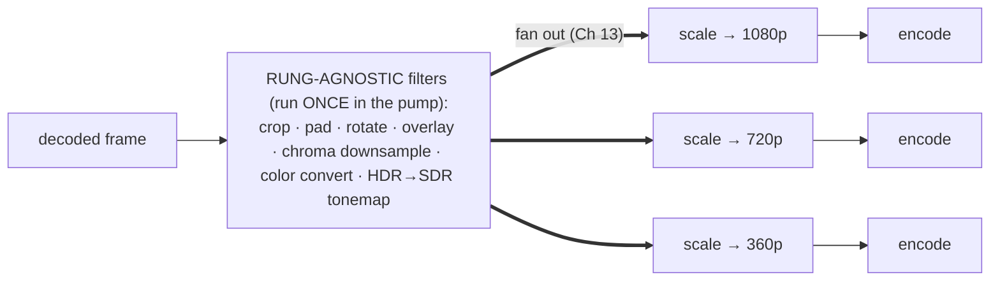
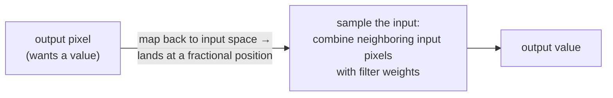
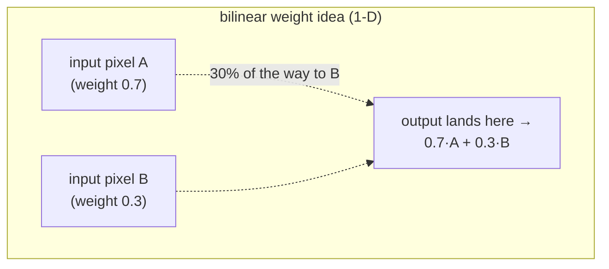
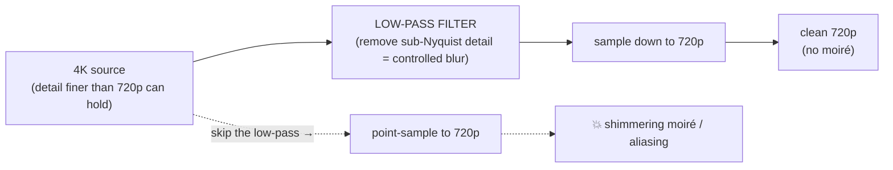
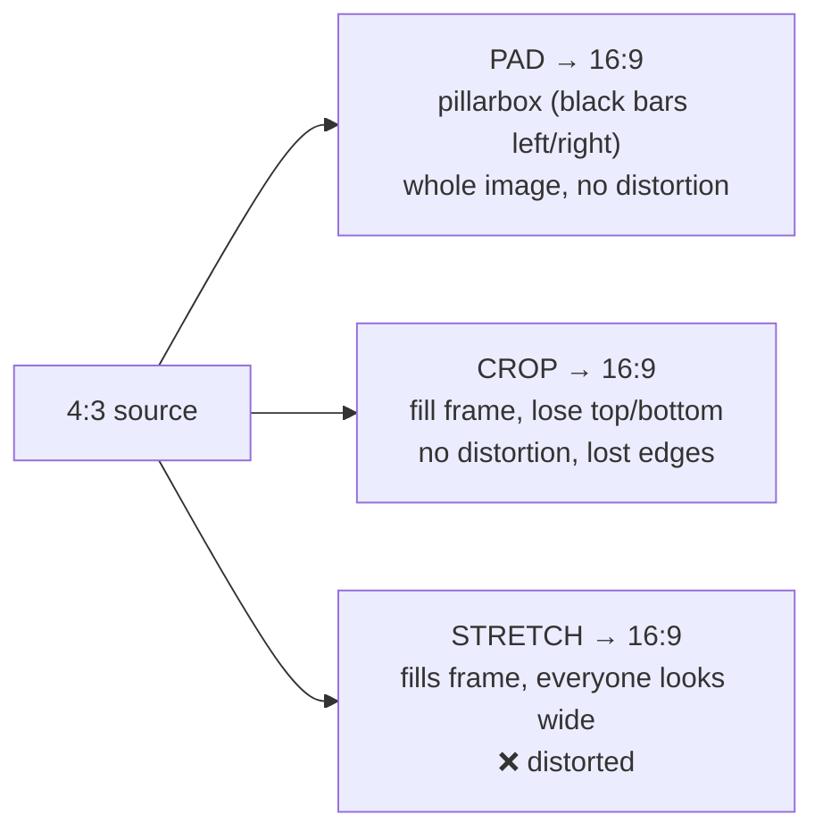
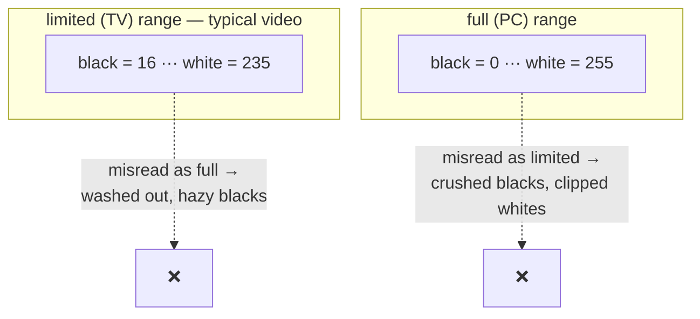
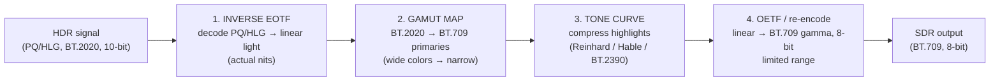

# Chapter 15 — Filters: Scaling, Color & Tonemapping

> **Part V · Systems** — The pixel math in the *middle* of the pipeline: how a 4K frame becomes a clean 720p one (and why downscaling without a low-pass filter gives you shimmering moiré), how color is converted between standards without wrecking it, and the genuinely hard one — squeezing 1000-nit HDR into a 100-nit SDR box without crushing the highlights or washing out the faces.

[Chapter 13](13-the-transcoding-pipeline.md) gave us the assembly line and [Chapter 14](14-gpu-acceleration.md) the engines that drive encode and decode. This chapter is about the stage *between* them — the **filter** stage, where decoded frames are transformed before re-encoding. Filters are where a transcoder does the work that *isn't* compression: resizing for an ABR ladder, fixing color standards, mapping HDR to SDR, cropping, watermarking, rotating. None of it is glamorous, and all of it is easy to get *subtly, visibly* wrong. We'll go deep on the three that matter most — **scaling**, **colorspace conversion**, and **HDR→SDR tonemapping** — because those are the ones where naïve code produces output that *looks* broken, and understanding the math is the only way to make it look right.

---

## Where filters sit, and why they run once

Recall the dataflow from [Chapter 13](13-the-transcoding-pipeline.md): demux → decode → **filter** → encode → mux. The filter stage operates on **raw frames** (decoded YUV pixels), transforming them into other raw frames. Some filters are **rung-agnostic** (they produce the same result for every ABR rendition) and some are **per-rung** (different per rendition):

The split is exactly the decode-once logic from [Chapter 13](13-the-transcoding-pipeline.md): if a filter's output is identical for every rung, do it **once** before the fan-out. Tonemapping HDR→SDR, converting BT.601→709, downsampling 4:4:4→4:2:0, cropping, overlaying a logo — all produce the same pixels regardless of which rung consumes them, so they belong in the shared pump. Only **scaling to the rung's resolution** is genuinely per-rung. Getting this boundary right is the difference between doing a tonemap once and doing it five times.

> 🛠️ **In rivet:** Our filter chain (crop, pad, hflip/vflip, rotate, grayscale, overlay/watermark, invert, brightness/contrast/saturation) is applied **once** in the decode pump, to the source, *before* fan-out — so a filter transforms every rendition uniformly. The 4:4:4→4:2:0 downsample and the policy-driven HDR→SDR tonemap also live in the pump. Only the per-rung **bilinear scale** runs after fan-out, in each rung's scaler. (If a crop changes the aspect ratio, you set the rung dimensions to match — the scaler resizes the cropped result, not the original.)

---

## Scaling: resampling an image grid

**Scaling** (a.k.a. **resampling**) changes a frame's pixel dimensions — 3840×2160 down to 1280×720, or 640×480 up to 1920×1080. It sounds trivial ("just stretch it") and is in fact a deep topic, because you're solving an interpolation problem: the output grid's pixels don't line up with the input grid's pixels, so you have to *invent* the output values from the input values. **How** you invent them — the **resampling filter** — decides the quality.

Here's the core picture. To compute an output pixel, you map its position back into the input image (it lands *between* input pixels) and combine nearby input pixels with weights:

The filters differ in **how many neighbors** they consider and **what weights** they assign:

| Filter | Neighbors used (per axis) | Weighting idea | Quality | Speed |
|---|---|---|---|---|
| **Nearest-neighbor** | 1 | Just copy the closest input pixel | Worst — blocky, jagged edges, "pixelated" | Fastest |
| **Bilinear** | 2 | Linear blend of the 2 nearest (weight ∝ distance) | Decent — smooth but slightly soft | Fast |
| **Bicubic** | 4 | Cubic curve through 4 nearest (preserves more edge detail) | Good — sharper than bilinear | Moderate |
| **Lanczos** | 6–8 | Windowed sinc function (the "ideal" reconstruction, truncated) | Best — crisp, but can **ring** near hard edges | Slow |

### What each one actually does

**Nearest-neighbor** picks the single closest input pixel and copies it. No math, no blending — which is why it's instant and why it looks terrible for photographic content (visible blocky steps). It has exactly one good use: scaling *pixel art* or content where you *want* hard pixel edges preserved.

**Bilinear** considers the 2 nearest pixels along each axis (so 2×2 = 4 pixels in 2D) and takes a **distance-weighted linear blend.** If the output position lands 30% of the way between input pixels A and B, the result is `0.7·A + 0.3·B`. It's the workhorse: fast, smooth, no nasty artifacts. Its weakness is mild softening — a straight line interpolation can't reconstruct sharp detail, so edges get a touch blurry.

**Bicubic** uses 4 pixels per axis (4×4 = 16 in 2D) and fits a **cubic polynomial** through them. The cubic can have a steeper slope than a straight line, so it reconstructs edges more faithfully — visibly sharper than bilinear, the common default for high-quality photo resizing.

**Lanczos** uses 6–8 pixels per axis and weights them with a **windowed sinc** function. Sinc is the *mathematically ideal* reconstruction filter (it perfectly reconstructs a band-limited signal); truncating it to a finite window gives Lanczos. It's the sharpest, most detail-preserving option — at a cost: near very hard edges the sinc's negative side-lobes cause **ringing** (faint ghost halos), and it's the slowest because it touches the most pixels.

> 🧠 **Mental model:** More neighbors = more context = a better guess at "what value belongs here," at the cost of more arithmetic. Nearest-neighbor asks one pixel; bilinear averages a tiny neighborhood; Lanczos consults a whole posse and weights their opinions by an optimal curve. It's the quality/speed triangle ([Ch 06](06-encoders-and-rate-control.md)) again, in pixel-resampling clothes.

### Downscaling needs a low-pass filter (or you get aliasing)

Here's the trap that catches everyone, and it's the most important idea in this section. When you **downscale** — say 4K to 720p, throwing away 8 out of 9 pixels — you can't just *sample* every Nth pixel. If you do, fine detail in the source (a striped shirt, a brick wall, a picket fence) that's *finer* than the output grid can represent will **alias**: it folds back into the image as bogus low-frequency patterns. You've seen this — the shimmering, crawling **moiré** on a tweed jacket or a far-off fence in a low-res video. That's aliasing, and it's *permanent* once it's baked into the downscaled frame.

The cause is a sampling-theory law: a signal can only represent detail up to **half the sampling rate** (the **Nyquist limit**). When you downscale, you're lowering the sampling rate, so detail above the *new* Nyquist limit is unrepresentable — and if you just point-sample, that detail doesn't vanish gracefully, it **folds back** as false low-frequency content (aliasing).

The fix: **low-pass filter (blur) the source *before* sampling**, to remove the detail that's too fine to survive — *then* sample. Removing it cleanly (as a blur) looks far better than letting it alias into moiré.

In practice the low-pass and the resample are **one operation**: a good downscaler uses an **area-averaging** filter (each output pixel is the *average* of all the input pixels it covers) or a properly *scaled* filter kernel whose width grows with the downscale factor — which inherently low-passes. The key takeaway:

> 🔬 **Going deeper:** **Downscaling and upscaling are not symmetric.** *Upscaling* invents new pixels *between* existing ones — bicubic/Lanczos shine here, reconstructing smooth detail, but there's a hard limit: **you cannot create information that isn't there.** Upscaling 480p to 4K gives you a *bigger, smoother* 480p, not real 4K detail (AI super-resolution is a different beast that *hallucinates* plausible detail — not what a transcoder's scaler does). *Downscaling* throws information away, and the danger is doing it *carelessly* and aliasing. So: upscaling's challenge is "reconstruct nicely"; downscaling's challenge is "low-pass first, don't alias." A filter tuned for one is wrong for the other.

> 🛠️ **In rivet:** Our per-rung scaler does **bilinear** scaling — the fast, smooth, artifact-free workhorse — in both 8-bit and 10-bit, with **AVX2** SIMD kernels on the CPU where it pays off (see Performance below). Since an ABR ladder is almost entirely *downscaling* from the source, the scaler's job is overwhelmingly "make smaller cleanly," and bilinear with proper sampling handles the ladder's rungs without the ringing risk of Lanczos.

---

## Aspect ratio: fitting one rectangle into another

Scaling changes size; **aspect-ratio handling** decides what to do when the source rectangle's *shape* doesn't match the target's. A 16:9 source into a 16:9 rung is a clean resize. A 4:3 source into a 16:9 frame, or a vertical 9:16 phone video into a 16:9 player, needs a policy:

| Strategy | What it does | Cost | When |
|---|---|---|---|
| **Letterbox / pillarbox (pad)** | Scale to fit, fill the leftover with black bars (horizontal bars = letterbox; vertical bars = pillarbox) | Wastes pixels on bars; preserves whole image + geometry | Default for "show everything, distort nothing" |
| **Crop** | Scale to fill, chop off the overflow | Loses edges of the image; preserves geometry of what remains | When filling the frame matters more than seeing every edge |
| **Stretch** | Squash/stretch to fit exactly | Free | **Almost never** — distorts everyone into funhouse shapes |

There's a fourth subtlety: **anamorphic** video. Some sources store **non-square pixels** — the storage dimensions don't match the *display* dimensions, and a **sample/pixel aspect ratio (SAR/PAR)** flag tells the player to stretch on playback (classic DVD: 720×480 storage displayed as 16:9). A correct transcoder reads that flag and **bakes the correct display geometry** into the output (resampling to square pixels at the right display size) rather than emitting a squished frame. Ignore the anamorphic flag and everyone comes out tall and thin.

> 🛠️ **In rivet:** Our `pad` filter does centered letterbox/pillarbox into a target canvas with neutral black; `crop` chops a centered (or positioned) region. Both round to even dimensions because 4:2:0 chroma needs even width/height ([Ch 02](02-color-and-pixels.md)). We never stretch — the ladder builder preserves the source aspect ratio and even-aligns every rung's dimensions, so renditions stay geometrically faithful.

---

## Colorspace conversion: matrices and range

Color is where transcoders quietly corrupt video, because the rules are invisible until they're violated. Recall from [Chapter 02](02-color-and-pixels.md) that video stores color as **Y′CbCr** (luma + two chroma) and that turning Y′CbCr into the R′G′B′ a display shows requires a **matrix** — and *which* matrix depends on the **color standard** the content was authored in:

| Standard | Era / use | Gamut (primaries) |
|---|---|---|
| **BT.601** | Standard-definition (SD), old | narrow |
| **BT.709** | High-definition (HD), the SDR web default | medium (≈ sRGB) |
| **BT.2020** | Ultra-HD / HDR | wide |

Each standard defines **different coefficients** for the Y′CbCr↔R′G′B′ matrix (because each weighs red/green/blue differently). **Use the wrong matrix and colors shift** — skin tones go slightly green or magenta, saturation drifts. The classic bug: decode an SD (BT.601) source but convert it with the HD (BT.709) matrix (or vice versa), and the whole frame's color is subtly but definitely *off.*

So colorspace conversion is: **decode Y′CbCr with the matrix the content was authored in, and re-encode with the matrix the output standard wants** — converting between them only when they differ.

### The range trap (limited vs full)

There's a second, even sneakier axis: **range.** Video luma is usually stored in **limited (TV) range** — black is the code value **16** and white is **235** (for 8-bit), leaving headroom/footroom — rather than **full (PC) range** where black is **0** and white is **255**. Mix these up and you get the two most common color bugs in all of video:

- **Treat limited-range content as full-range:** blacks lift to dark gray, whites dull — the image looks **washed out / hazy.**
- **Treat full-range content as limited-range:** blacks crush to pure black, whites clip — the image looks **too contrasty,** crushed.

Range and matrix are signaled in the bitstream and container (the `colr`/VUI color-info fields, [Ch 07](07-bitstreams-and-nal-units.md)); a correct pipeline **reads them, honors them, and re-signals the output's** color so the player doesn't have to guess.

### The cardinal rule: don't convert if you don't have to

Here's the discipline that prevents most color bugs: **avoid colorspace conversion you don't need.** Every matrix multiply is lossy (rounding) and every conversion is a chance to use the wrong coefficients. If the source is BT.709 limited-range SDR and the output is BT.709 limited-range SDR — which is the overwhelmingly common case for HD web video — there is **nothing to convert.** Pass the Y′CbCr through untouched and just re-signal it. Only convert when the standards genuinely differ (a real BT.601 SD source going to a BT.709 output, or the big one below: HDR BT.2020 → SDR BT.709).

> 🧠 **Mental model:** Color conversion is **translation between languages.** If two people already speak the same language (709→709), translating "just in case" only introduces errors. You translate when, and *only* when, they actually speak different ones — and then you'd better use the right dictionary (the right matrix and range), or you'll say something subtly wrong.

### Chroma resampling (4:2:0 ↔ 4:4:4)

One more conversion lives here: **chroma subsampling** ([Ch 02](02-color-and-pixels.md)). Pro sources may be **4:4:4** (full-resolution chroma) or **4:2:2**; consumer delivery codecs and hardware encoders overwhelmingly want **4:2:0** (chroma at quarter resolution). Converting **4:4:4 → 4:2:0** means *downsampling the chroma planes* — and that's a mini version of the scaling problem: do it with a proper averaging filter (not a careless drop-every-other-sample) to avoid chroma aliasing on saturated edges. Going the other way (4:2:0 → 4:4:4) interpolates chroma up and is rarely needed in delivery.

> 🛠️ **In rivet:** Our `colorspace` module carries a **BT.601→709** matrix converter (with both scalar and **AVX2** paths) for the genuine SD-source case, and a **4:4:4/4:2:2 → 4:2:0** downsample that averages chroma properly. Crucially, we follow the "don't convert needlessly" rule: the common 709-SDR-in, 709-SDR-out path passes color through untouched and just re-signals it. The one place we *always* act is HDR — which is its own beast, next.

---

## Tonemapping: HDR → SDR without wrecking it

This is the hard one, and the one where naïve "just convert it" looks the most broken. Let's set up the problem precisely.

**SDR** (standard dynamic range) content is mastered for a display peaking around **100 nits** (candela/m²), in the **BT.709** gamut, with a gamma curve. **HDR** content (HDR10, HLG) is mastered for displays peaking at **1,000–4,000+ nits**, in the wide **BT.2020** gamut, with a *very* different transfer function — **PQ** (Perceptual Quantizer, SMPTE ST 2084, absolute brightness) or **HLG** (Hybrid Log-Gamma, relative). HDR holds *far* more highlight range and far more colors than SDR can physically represent.

So **tonemapping** is the problem of cramming a 1,000-nit, wide-gamut signal into a 100-nit, narrow-gamut box **without it looking wrong.** And "wrong" has two failure modes that pull in opposite directions:

- **Naïvely clip the highlights** (anything over 100 nits → max white): the bright parts of the image — skies, windows, specular glints — **blow out** into featureless white. Detail in the highlights is gone.
- **Naïvely scale everything down linearly** (divide all brightness by 10): the highlights are preserved but the *whole image* becomes **dim and lifeless** — faces and midtones, which were perfectly bright in HDR, are now murky.

You can't win with a straight line. You need a **curve** — one that maps the SDR-range brightness *nearly 1:1* (so faces and midtones stay correct) but progressively **compresses** the highlights (so they roll off gracefully into white instead of clipping, keeping *some* highlight detail). That S-shaped roll-off curve is the heart of tonemapping.

### The real tonemap chain

A correct HDR→SDR tonemap is a *pipeline of its own*, not a single step. You must work in the right domain at each stage:

1. **Inverse EOTF — get to linear light.** PQ and HLG are *encodings* of brightness, not brightness itself. You must first apply the **inverse transfer function** to recover **linear light** (values proportional to actual photons/nits). *All* the tonemapping math has to happen in linear light — operating on the gamma/PQ-encoded values directly produces wrong, muddy results because the encoding is nonlinear.
2. **Gamut map — BT.2020 → BT.709.** HDR's wide BT.2020 gamut contains saturated colors BT.709 simply can't show. Map them inward — clip to the 709 boundary, or (better) compress saturation near the edges so vivid colors desaturate gracefully instead of hard-clipping to a flat patch.
3. **Tone curve — compress the highlights.** Now apply the S-curve that maps linear HDR brightness to linear SDR brightness: near-1:1 in the shadows/midtones, rolling off the highlights. The choice of curve is where the operators come in (below).
4. **OETF / re-encode.** Apply the SDR **BT.709 gamma** (the opposite-direction transfer function) to get back to encoded values, quantize to 8-bit, set limited range. Now it's ordinary SDR video ready to encode.

> 🧠 **Mental model:** Tonemapping is **packing a big suitcase into a carry-on.** You can't just sit on it (clip) — you'll crush everything. You can't shrink every item by 10× (linear scale) — your clothes become unwearable. You *fold* intelligently: the essentials (faces, midtones) go in at full size, and the bulky-but-less-critical stuff (extreme highlights) gets compressed to fit. The tone curve *is* that intelligent fold.

### The tone-curve operators

Several standard curves exist; they trade highlight retention against midtone contrast:

| Operator | Character | Notes |
|---|---|---|
| **Reinhard** | Simple `x/(1+x)` roll-off | Gentle, but tends to look **flat/desaturated** — compresses contrast everywhere, not just highlights |
| **Hable (filmic)** | An S-curve from film response (Uncharted 2 / "filmic") | Preserves midtone **contrast and punch** while rolling off highlights — looks "cinematic"; a production favorite |
| **BT.2390 (ITU)** | The standards-body reference EETF | Designed specifically for HDR→SDR display mapping; perceptually tuned, hue-preserving |
| **ACES / Mobius / others** | Various film/grading pipelines | Heavier machinery, used in color grading |

The practical winner for "make HDR uploads look good as SDR" is usually **Hable/filmic** or **BT.2390** — both keep faces looking right and highlights rolling off naturally, which is exactly what the failure modes demand.

### Why this matters so much (the eye-searing-upload problem)

There's a real, operational reason a transcoder *defaults* to tonemapping HDR down rather than passing it through. A huge fraction of "HDR" in the wild is **accidental** — phones record HDR (often HLG) by default, mastered a stop or two bright on the assumption that the *device's own* tonemapper will tame it for the viewing conditions. The moment that file leaves the phone's ecosystem and plays *as-is* on a viewer's SDR screen (or worse, gets mis-handled), it shows up **eye-searingly bright** or weirdly washed out. Platforms have whole engineering teams on this exact problem. For a general-purpose transcoder, the safe default is: **tonemap HDR to a clean SDR BT.709** at ingest, so a clip never lands blinding on someone's feed. Native HDR output is a deliberate, opt-in path — worth supporting, but not the silent default.

> 🛠️ **In rivet:** We ship an HDR→SDR **Hable** (filmic) tonemap, and our default **ColorPolicy tonemaps HDR to SDR BT.709** for exactly this reason — so clips don't land eye-searingly bright. The chain is the one above: PQ/HLG **inverse EOTF** → **BT.2020→709 gamut** map → **Hable** tone curve → **BT.709** 8-bit limited-range encode (in our `tonemap` + `colorspace` modules). It runs **once in the decode pump**, before fan-out, so every rung gets the same correctly-tonemapped SDR source. HDR-passthrough (HDR10 / HLG output) is a real, policy-gated path — `ColorPolicy::Hdr10`/`Hlg`/`Passthrough` keep the wide gamut and 10-bit — it's just not the default, because the default's job is to be *safe* for arbitrary uploads.

---

## The other filters

Scaling, color, and tonemapping are the deep ones, but the filter stage hosts a whole toolbox of simpler per-pixel and geometric transforms:

| Filter | What it does | Notes |
|---|---|---|
| **Crop** | Cut out a rectangular region | Geometry only; pure sample rearrangement |
| **Pad / letterbox** | Add bars to reach a target shape | The aspect-ratio tool above |
| **Overlay / watermark** | Alpha-composite a logo/image over the frame | The image's **alpha channel** is the blend mask; loaded once |
| **Rotate / flip** | 90/180/270 rotate, horizontal/vertical mirror | 90/270 swap width↔height |
| **Denoise** | Remove sensor/grain noise | Helps compression (noise is expensive to encode) but can smear detail — a quality tradeoff |
| **Brightness / contrast / saturation** | Per-pixel luma/chroma adjustment | Simple math; saturation=0 → grayscale |
| **Grayscale** | Drop chroma entirely | Cheapest "filter" — just zero the chroma planes |

Most of these are **geometry** (rearranging samples — works at any bit depth) or **simple point operations** (a function applied to each pixel independently). They're cheap compared to scaling and tonemapping, but they still belong in the rung-agnostic part of the pump when their result is shared across renditions.

### Frame-rate conversion

One filter deserves a special note: **frame-rate conversion** (e.g. 60 fps → 30 fps, or 24 → 25 for PAL). There are two fundamentally different methods:

- **Drop / duplicate frames.** To halve 60→30, drop every other frame; to go 24→30, duplicate some frames on a cadence. Cheap, exact on the timestamps, but can cause **judder** (uneven motion) when the ratio isn't clean — the classic 24→30 "3:2 pulldown" stutter.
- **Motion-interpolation.** *Synthesize* in-between frames by estimating motion between real frames and warping pixels along the motion vectors. Smooth, but expensive and prone to **artifacts** (warping errors around fast or occluded motion — the dreaded "soap opera" look and morphing edges).

For most transcoding, frame-rate changes are done by **drop/dup** (predictable, artifact-free even if slightly juddery); motion-interpolation is a specialist tool. The key constraint is that *timestamps* ([Ch 13](13-the-transcoding-pipeline.md)) must stay coherent — dropping a frame means its time budget is absorbed by neighbors, and the output PTS sequence must remain monotonic and correctly spaced so A/V sync holds.

---

## Performance: SIMD on the CPU, shaders on the GPU

Filters are **per-pixel** work, and a 4K frame is ~8 million pixels — at 60 fps that's ~500 million pixel operations *per second per filter*. Naïve scalar code (one pixel at a time) can't keep up, so filters are where two acceleration techniques earn their keep:

- **SIMD on the CPU.** *Single Instruction, Multiple Data* — one instruction operates on a *vector* of values at once. **AVX2** processes 8 or 16 pixels per instruction (256-bit registers holding 8×32-bit or 16×16-bit lanes); AVX-512 doubles that. A bilinear scaler or a color matrix rewritten with SIMD intrinsics runs **several times faster** than the scalar version — because the per-pixel arithmetic is identical across pixels, which is exactly what SIMD is built for.
- **Shaders on the GPU.** If frames are *already* on the GPU ([Ch 14](14-gpu-acceleration.md)), per-pixel filters are a perfect fit for **compute/fragment shaders** — thousands of cores each handling a pixel, massively parallel. And it keeps the frame GPU-resident, avoiding the PCIe round-trip. (This is *general-purpose* GPU compute — distinct from the fixed-function encode block of [Ch 14](14-gpu-acceleration.md).)

The discipline ([recall the AVX memory from our own work](#)): **only SIMD-optimize the loops that actually cost real time.** Profile first; specialize the hot per-pixel kernels (scaling, color matrix, tonemap); keep a scalar fallback for correctness and for CPUs without the instruction set; and **runtime-detect** the CPU's capabilities so the same binary uses AVX2 where present and falls back gracefully where it isn't.

> 🛠️ **In rivet:** Our hottest pixel kernels have **AVX2** implementations with **scalar fallbacks**, runtime-dispatched on CPU feature detection: the **bilinear scaler** (8- and 10-bit) and the **BT.601→709** color converter both ship a scalar reference *and* an AVX2 path, and we measured the SIMD versions running several times faster than scalar on the bench frames. We only specialize the loops that bench as a meaningful slice of wall time — the per-pixel scale and color math — and keep everything else scalar, which keeps the code auditable and portable while the hot paths fly.

---

## Recap

- The **filter stage** sits between decode and encode, transforming raw frames. **Rung-agnostic** filters (crop, pad, rotate, overlay, color convert, tonemap, chroma downsample) run **once** in the shared pump ([Ch 13](13-the-transcoding-pipeline.md)); only **per-rung scaling** runs after fan-out.
- **Scaling = resampling.** **Nearest-neighbor** (1 pixel, blocky), **bilinear** (2, smooth/slightly soft — the workhorse), **bicubic** (4, sharper), **Lanczos** (6–8 windowed-sinc, sharpest but can ring). More neighbors = better guess = more cost.
- **Downscaling must low-pass first** (area-average) or fine detail **aliases** into shimmering **moiré** — permanently. **Upscaling** can't create real detail; it just enlarges smoothly. The two directions are not symmetric and need different handling.
- **Aspect ratio:** **pad** (letterbox/pillarbox — keep everything, add bars), **crop** (fill — lose edges), or **stretch** (distort — almost never). Honor **anamorphic** (non-square-pixel) flags or geometry comes out squished.
- **Colorspace conversion** is matrix + range work: each standard (**BT.601 / 709 / 2020**) has its own Y′CbCr↔RGB **matrix** (wrong one → color shift), and **limited (16–235) vs full (0–255) range** mismatches cause **washed-out** or **crushed** blacks. **Don't convert if source and target already match** — pass through and re-signal. **Chroma resample** (4:4:4→4:2:0) needs proper averaging.
- **Tonemapping HDR→SDR** maps 1,000+ nit PQ/HLG BT.2020 into a 100-nit BT.709 box. A straight line fails both ways (clip → blown highlights; linear scale → dim image); you need an **S-curve**. The real chain: **inverse EOTF → linear light → gamut map (2020→709) → tone curve (Reinhard/Hable/BT.2390) → BT.709 OETF, 8-bit**. **Hable/filmic** and **BT.2390** keep faces right and highlights rolling off. Default to tonemapping (accidental phone HDR lands eye-searingly bright otherwise).
- Other filters: crop, overlay/watermark (alpha-masked), rotate/flip, denoise, and **frame-rate conversion** (drop/dup — predictable; motion-interpolation — smooth but artifact-prone), all keeping **timestamps** coherent.
- **Performance:** per-pixel filters are accelerated with **SIMD/AVX2** on the CPU (one instruction, many pixels) and **shaders** on the GPU; specialize only the hot kernels, keep scalar fallbacks, runtime-detect features.
- **In rivet:** AVX2 bilinear scalers (8/10-bit) + a BT.601→709 converter + an HDR→SDR **Hable** tonemap, all once-in-the-pump; the default **ColorPolicy tonemaps HDR to SDR BT.709** so clips don't land eye-searingly bright.

**Next:** [Chapter 16 — Patents & Royalties](16-patents-and-royalties.md) — we keep choosing AV1 and Opus for a reason that has nothing to do with pixels: the legal and licensing landscape that quietly shapes every codec decision in production.
