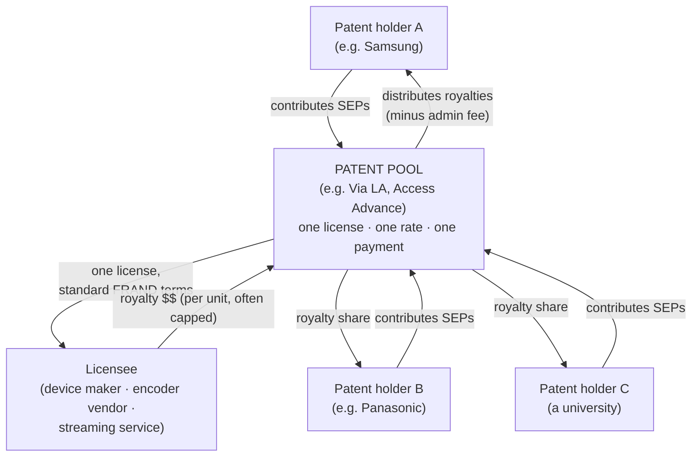
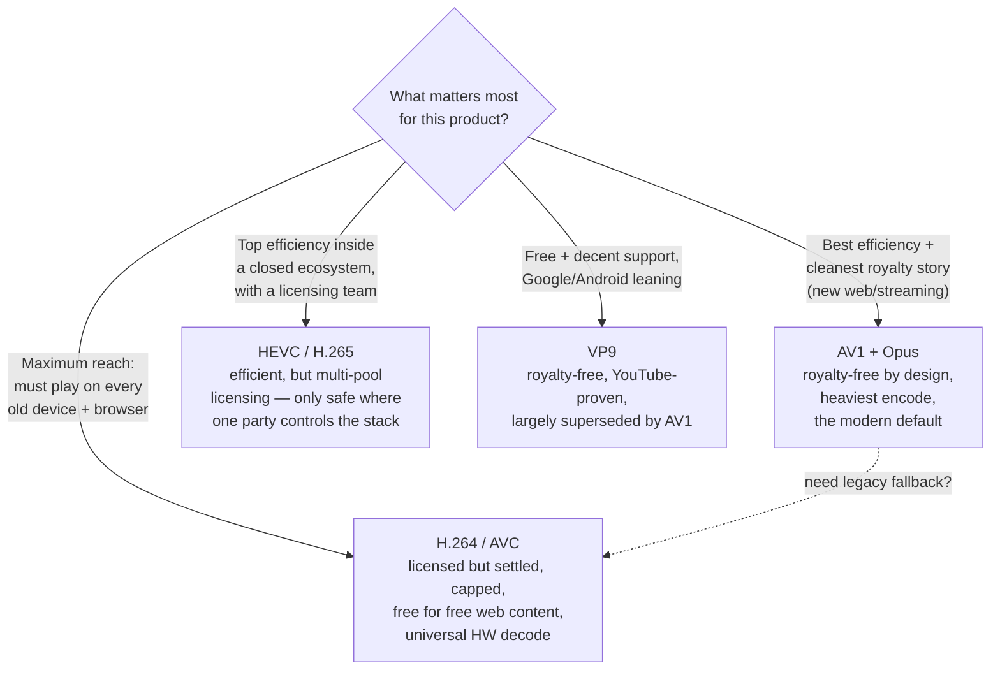

# Chapter 16 — Patents, Royalties & the Codec Wars

> **Part VI · The Real World** — Why some codecs cost money and others don't: the patents buried inside a codec spec, the pools that license them, the H.264 settlement and the HEVC mess, and the royalty-free counter-movement that produced AV1.

Every chapter so far has treated a codec as a piece of *engineering* — prediction, transforms, quantization, bitstreams. This one treats it as a piece of *property.* Here is the uncomfortable truth the previous fifteen chapters quietly skipped: **the bytes are just math, but the right to ship that math can be patented.** An H.265 decoder and an AV1 decoder are both "just" arithmetic running on a chip. One of them might cost you a per-device royalty and expose you to litigation; the other is designed not to. Which codec you choose is therefore not only a quality-and-compatibility decision — it's a *legal and financial* one, and getting it wrong has sunk products. This is the chapter engineers skip and businesses regret skipping.

> ⚖️ **This is an engineer's overview, not legal advice.** The goal here is to give you the vocabulary and the shape of the landscape so you can ask the right questions and know when to call a real lawyer. Patent law is jurisdiction-specific, fact-specific, and changes with every new suit and settlement. Treat everything below as a map, not a contract.

---

## Patents 101, for people who build software

A **patent** is a government-granted, time-limited monopoly (typically 20 years from filing) on a specific *invention* — a novel, non-obvious, useful method or device. In exchange for publishing how the invention works, the holder gets the exclusive right to stop others from *making, using, selling, or importing* anything that practices the invention. If you build something that does what the patent claims — even if you invented it independently, even if you never read the patent — you may be **infringing**, and the holder can sue.

Two features of patents matter enormously for codecs:

- **Patents cover *methods*, not *code*.** This is the crucial distinction from copyright. Copyright protects a *specific expression* — your exact source code. You can dodge it by writing your own implementation from scratch (a "clean-room" rewrite). A **patent** protects the *underlying technique* regardless of how you express it. If a patent claims "predict a block of pixels from a motion-compensated reference using quarter-pixel interpolation," then *any* encoder that does that — yours, mine, a clean-room rewrite, a hardware block — practices the claim. You cannot code your way around a patent the way you can around a copyright.
- **Independent invention is not a defense.** Unlike copyright (where independent creation is a complete defense), patent infringement doesn't care whether you copied. Build the technique yourself, in good faith, never having heard of the patent — you still infringe. This is why a "we wrote it all ourselves in Rust" implementation gives you **no** patent protection. rivet's demuxers and muxers are clean-room (which protects us from *copyright* claims on someone else's code), but a clean-room *encoder* for a patented codec would still owe royalties on the *techniques.*

> 🧠 **Mental model:** Copyright is about the *words* of the recipe — rewrite them and you're clear. A patent is about the *cooking technique itself* — "searing then braising." Invent searing-then-braising independently in your own kitchen and you still infringe the patent on it. For codecs, the spec *is* a list of patented cooking techniques, and implementing the spec means using them.

### Why a single codec touches *hundreds* of patents

Open the H.264 specification and you are looking at a 750-page catalogue of techniques: intra-prediction modes, motion-vector prediction, the deblocking filter, CABAC arithmetic coding, the integer transform, and on and on. **Each of those techniques may be independently patented**, and — here's the kicker — **by different companies.** The deblocking filter might be patented by one firm, the entropy coder by another, a particular motion-prediction shortcut by a third. A modern video codec is a quilt of *hundreds to thousands* of patent claims held by *dozens* of separate organizations (universities, electronics giants, specialist licensing firms).

These are called **standard-essential patents (SEPs)**: patents you *cannot avoid* if you implement the standard. You can't build a conformant H.264 decoder without the deblocking filter — it's in the spec, decoders must do it — so if that filter is patented, every H.264 decoder on Earth infringes that patent. "Essential" means exactly that: essential to compliance, hence unavoidable.

> 🔬 **Going deeper — FRAND.** Because SEPs give their holders a chokehold on an entire industry standard, standards bodies usually require holders to license them on **FRAND** terms — *Fair, Reasonable, And Non-Discriminatory.* The idea: if your patent became essential *because* a standards body baked it into a spec everyone must follow, you shouldn't be allowed to extort the industry; you must offer it to all comers at a reasonable, even-handed rate. FRAND is a beautiful principle and a perpetual battlefield — "reasonable" is in the eye of the licensor, and disputes over what a fair rate *is* drive much of the litigation in this space.

### The patent pool: one-stop shopping for hundreds of licenses

Now imagine you want to ship an H.264 encoder. The techniques you must use are patented by, say, 40 different companies. Negotiating 40 separate license agreements — finding every holder, haggling each rate, tracking 40 sets of terms — is a nightmare that would make implementing the standard practically impossible. This friction is the problem a **patent pool** solves.

A **patent pool** is an organization that aggregates the standard-essential patents from many holders into a *single license with one set of terms and one royalty payment.* You sign **one** agreement with the pool, pay **one** royalty, and you're covered for every patent the pool administers. The pool collects the money and distributes it to the member patent holders (minus an administration fee), in proportion to how many essential patents each contributed.

> 🧠 **Mental model:** A patent pool is a **bundle deal.** Instead of buying 40 separate streaming subscriptions, you buy one bundle that includes all 40 channels at a single price, and the bundler splits your money among the channel owners. When it works, it's genuinely convenient — *one* signature, *one* check, total coverage. The trouble begins when there are *multiple competing bundles* that each claim to cover the same standard (hello, HEVC) — or when some channel owners refuse to join *any* bundle and come knocking on their own.

The pool model is what made H.264 *administrable* at planetary scale. It's also, as we'll see, exactly what HEVC failed to replicate — and that failure is the whole reason AV1 exists.

---

## The H.264 / AVC story: the pool that worked

**H.264** (also called **AVC**, Advanced Video Coding) launched in 2003 and became the most successful video codec in history — the default for Blu-ray, broadcast, YouTube's early years, every webcam, every phone. Its patent licensing was administered by **MPEG-LA**, a private licensing-administration company (no relation to the *MPEG* standards committee itself, despite the confusing name; MPEG-LA has since merged into **Via LA Licensing**). MPEG-LA ran the H.264 pool, and it ran it well enough that the codec conquered the world.

The H.264 license had two royalty axes that are worth understanding because every later codec is compared against them:

1. **Per-unit royalties on codec *products*.** If you sell a device or a piece of software that *encodes or decodes* H.264 — a phone, a camera, an encoder application — you owe a small royalty per unit (historically on the order of **$0.10–0.20 per unit**), and crucially, **the total was *capped*** at an annual maximum (a few million dollars per year per company). For a giant like Apple shipping a billion devices, the cap meant the *marginal* cost per device fell to essentially zero past a point. The cap made H.264 *predictable* and *survivable* for high-volume vendors.
2. **Content / distribution royalties** — fees on *distributing* H.264 video (subscription services, paid downloads, broadcast). This is the axis that scared the internet.

### The carve-out that conquered the web

Here is the single most important licensing decision in the history of web video. There was deep industry fear in the late 2000s that MPEG-LA would start charging **content royalties on free internet video** — that every YouTube upload, every embedded clip, every web video served for free might one day owe a per-stream fee. That fear was a real threat to the open web, and it's exactly what motivated Google's first royalty-free codec push (WebM/VP8).

In response, in 2010 MPEG-LA announced — and later made **permanent** — that **internet video that is free to end users would never carry a content royalty.** If you stream H.264 to viewers for free (ad-supported or not), you owe *nothing* on the *content* side. (The per-unit royalties on the encoder/decoder *products* still applied — your browser vendor or device maker paid those — but the *distribution* of free web video was carved out entirely.)

> 🧠 **Mental model:** The H.264 deal that won the web was: **"making the tool costs a (capped) fee; using the tool to give away video is free."** Browser makers and device makers paid the per-unit product royalties (and hit the cap quickly), and everyone serving free video to viewers paid nothing for the content. That combination — capped, predictable product fees plus a free-content carve-out — is *why* H.264 became ubiquitous, and it's the bar every other codec's licensing is implicitly measured against.

This is the part to internalize: **H.264 is licensed, but the licensing is *settled, capped, and well-understood.*** The fees are known, the carve-out for free web video is permanent, and after twenty years there are no nasty surprises. "Costs money" is not the same as "risky." H.264's royalties are a *known, bounded line item*, which is a very different thing from HEVC's situation.

---

## The HEVC / H.265 mess: the pool that shattered

**HEVC** (H.265, High Efficiency Video Coding) arrived in 2013 as H.264's successor, delivering roughly **40–50% better compression** at the same quality (recall [Chapter 05](05-the-codec-zoo.md)). Technically it was a triumph. Commercially, its licensing became a *cautionary tale* — and arguably the single biggest reason HEVC never took over the web the way H.264 did.

The problem was **fragmentation.** Where H.264 had *one* pool (MPEG-LA) that the industry could go to, HEVC's patent holders splintered into **multiple competing pools plus a cohort of holdouts who joined no pool at all:**

| HEVC licensing body | Notes |
|---------------------|-------|
| **MPEG-LA** (now **Via LA**) | The original pool, modeled on its H.264 license. |
| **HEVC Advance** (now **Access Advance**) | A *separate* pool formed in 2015 with a *different* set of patent holders — and, controversially, terms that initially included **content royalties.** |
| **Velos Media** | For years a *third* pool with yet another set of holders (it wound down and returned patents to its members around 2023, but its existence deepened the confusion during HEVC's critical adoption years). |
| **Sisvel** | Runs its *own* HEVC pool as well. |
| **Unaffiliated holders** | A number of essential-patent owners joined *no* pool, meaning even licensing *every* pool might not guarantee full coverage. |

Three structural problems flowed from this fragmentation, and together they were poison:

1. **No single license covered you.** To be confident you were fully licensed, you might have to sign with *several* pools *and* chase down independent holders — the exact friction the pool model was invented to eliminate, now *worse* than negotiating individually because the pools' claims **overlapped** and nobody could tell you the total bill with certainty.
2. **Content royalties were back on the table.** Access Advance's early terms contemplated **per-title and per-subscriber content fees** — precisely the "you pay to *distribute* video" model that the H.264 free-web carve-out had killed. For a streaming service, an open-ended, uncapped content royalty is a financial landmine.
3. **Total cost was unknowable.** With multiple pools, overlapping claims, holdouts, and content fees, a company simply *could not compute* its total HEVC exposure in advance. And uncertainty, to a business, is often *worse* than a known-high cost — you can budget for an expensive line item, but you cannot budget for "an unknown number of lawsuits over an unknown number of years for an unknown amount."

> 🧠 **Mental model:** H.264 was *one bundle deal, capped, free for web content.* HEVC was *three competing bundle deals that overlap, some of which also charge you for using the channels, plus channel owners who refuse to join any bundle and might sue you directly.* Faced with that, the web's big players didn't haggle — they **left.** Browsers were slow to support HEVC; web streaming largely stuck with H.264 and then jumped to royalty-free codecs. HEVC found its home in *closed* ecosystems where one company controls the whole stack and can absorb the licensing (Apple devices, 4K Blu-ray, broadcast) — but on the open web it stalled.

The HEVC licensing debacle is the **direct cause** of everything in the next section. An entire industry looked at the mess, concluded "never again," and built an alternative.

---

## The reaction: royalty-free codecs and the Alliance for Open Media

If patented codecs are a legal minefield, the obvious escape is a codec that *isn't patented* — or more precisely, one **designed from the start so that everyone who could sue has instead promised not to.** That's the royalty-free strategy, and it unfolded in two waves.

### Wave 1 — Google's VP8 and VP9

Google acquired the codec company **On2** in 2010 and open-sourced its **VP8** codec, then developed its successor **VP9**, releasing both royalty-free. VP9 (≈2013) reached roughly HEVC-class efficiency and got a real-world proving ground: **YouTube.** If you've watched YouTube in 1080p or 4K in a browser, you've very likely watched VP9. It shipped in Chrome, Firefox, and Android, and on millions of hours of content — demonstrating that a royalty-free codec could work at planetary scale. (MPEG-LA did at one point assemble a VP8 patent pool and then settled with Google, which helped clear VP8's path.) VP9's limitation was political reach: it was largely a *Google* codec, and Apple and much of the hardware ecosystem never fully embraced it.

### Wave 2 — the Alliance for Open Media and AV1

The lesson of VP9 was that *one company's* royalty-free codec isn't enough — you need the *whole industry* behind it, contributing patents and promising not to sue. So in **2015**, a remarkable thing happened: the giants who normally compete (and litigate) formed a consortium specifically to build a codec **everyone** would agree to leave royalty-free.

The **Alliance for Open Media (AOM)** is a non-profit whose membership reads like a who's-who of computing — its founders and members include **Amazon, Apple, ARM, Cisco, Google, Intel, Meta, Microsoft, Mozilla, Netflix, Nvidia, AMD, Samsung** and dozens more. (Some, like Apple, joined after the 2015 founding; the point is that by the time AV1 shipped, essentially every major browser vendor, chip maker, OS vendor, and streaming service was inside the tent.) Their product is **AV1** (bitstream frozen 2018), explicitly *designed* to be royalty-free.

What makes AV1 royalty-free isn't magic or a claim that "no patents apply" — it's a **legal architecture**:

- **A member patent cross-license.** Every AOM member grants every other member (and the public) a royalty-free license to its patents that are essential to AV1. The companies most likely to *hold* AV1-essential patents are inside AOM and have *agreed in advance* not to charge for them.
- **A defensive-termination grant.** The AOM license has teeth: **if you use your patents to sue another AV1 user over AV1, you lose your own AV1 license.** This is a mutual-disarmament pact — it makes attacking the codec self-destructive, because the moment you sue, you become an infringer yourself. It aligns everyone's incentives toward *not* litigating.
- **Clean-room-conscious design.** Where possible, AV1's techniques were chosen and engineered to steer around known third-party patents, with patent attorneys in the design loop.

> 🧠 **Mental model:** AV1's royalty-free status is not "we proved no patent can ever touch it" (no one can prove that). It's **"we got everyone who plausibly *could* sue into one room, had them cross-license for free, and added a rule that punishes anyone inside who breaks ranks."** It's a *peace treaty among the people who own the weapons,* not a guarantee that no weapon exists.

---

## The honest caveat: "royalty-free" is a design intent, not a law of physics

Here is where a responsible course refuses to be a cheerleader. **"Royalty-free" is AOM's design intent and legal position — it is not a universal, guaranteed, court-tested fact.** You should understand AV1's situation clearly, including its risks:

- **Sisvel announced an AV1 (and VP9) patent pool.** In 2019, the licensing firm **Sisvel** declared that it had assembled a pool of patents it claims are essential to AV1 and VP9, and began offering licenses for them. AOM disputes that these patents are actually essential (or infringed), and the patents in Sisvel's pool come from holders *outside* AOM who never signed the cross-license. This is the textbook "holdout" scenario: the peace treaty only binds its signatories, and Sisvel's contributors didn't sign.
- **Other claims have surfaced.** There have been assertions and litigation in the broader AV1 space — including claims associated with patent holders such as **Dolby** — and the picture continues to evolve. None of this has produced a definitive, codec-killing judgment, but it means the "zero royalty" story is **contested, not settled.**
- **AOM defends its members.** AOM has publicly committed to *standing behind* AV1 — backing the codec, disputing essentiality claims, and **indemnifying / organizing a legal defense for members** against patent assertions. For a company *inside* AOM, that backing is meaningful; for a small outside adopter, you inherit the codec's royalty-free *intent* but not necessarily a contractual shield.

So the honest, balanced summary is this:

> ⚖️ **The state of play (and it is genuinely evolving):** AV1 is *designed and intended* to be royalty-free, backed by the largest coalition in the industry, with a cross-license and defensive-termination structure that makes it the **cleanest royalty story available today.** But "royalty-free" is a legal *position and design goal*, not a proven impossibility of any claim ever — there is an active patent pool (Sisvel) and ongoing dispute. The risk is *far lower* than HEVC's tangle and lower than H.264's known fees, but it is **not literally zero.** Anyone making a high-stakes bet should read the current state and talk to counsel.

This nuance is *the* thing engineers get wrong in both directions — either treating AV1 as magically immune to all patents (over-optimistic) or treating the Sisvel pool as proof AV1 is "just as bad as HEVC" (over-pessimistic). The truth is in between, and it leans strongly in AV1's favor, but it is not absolute.

---

## Audio has the same split: Opus vs AAC

The codec wars aren't only about video. Audio ([Chapter 08](08-audio.md)) has the exact same royalty-free-vs-licensed divide, and it maps cleanly:

| | **Opus** | **AAC** |
|---|---|---|
| **Standardized by** | IETF (RFC 6716) | MPEG / ISO |
| **Licensing** | **Royalty-free** — designed by Xiph, Mozilla, Skype to be unencumbered; the analog of AV1 for audio | **Licensed** — administered via Via Licensing (now Via LA) / Fraunhofer; royalty-bearing |
| **Quality** | Excellent across the whole range — beats MP3 and matches/beats AAC at most bitrates | Excellent; the long-time streaming default |
| **Support** | Every modern browser; in MP4, playable on Apple (Safari 14+ / recent iOS/macOS) | Universal — every device made in 20 years |
| **The catch** | Slightly less *universal* on very old hardware | Royalties + the licensing-encoder question (a clean-room AAC *encoder* needs a license) |

**Opus is to audio what AV1 is to video:** the modern, royalty-free, technically-excellent choice, championed by an open standards body, now broadly supported. **AAC is the H.264 of audio** — licensed, ubiquitous, settled, the safe-compatibility pick. Pairing AV1 with Opus gives you a fully royalty-clean A/V stack; pairing it with AAC trades a clean audio royalty story for maximum device reach (and AAC *passthrough* — copying the bytes without re-encoding — sidesteps the *encoder* license entirely, since you're not encoding anything).

---

## A timeline of the codec wars

The fastest way to hold the whole story in your head is as a sequence of moves and counter-moves — every royalty-free push is a *reaction* to a licensing scare on the patented side:

| Year | Event | Why it mattered |
|------|-------|-----------------|
| **2003** | **H.264 / AVC** standardized; MPEG-LA runs the pool | One administrable pool → the codec that conquered the web. |
| **2010** | Google open-sources **VP8** (from the On2 acquisition); MPEG-LA threatens a VP8 pool | The first serious royalty-free counter-move — and the first patent push-back against one. |
| **2010** | MPEG-LA pledges **free internet video to end users carries no content royalty** | The carve-out that cemented H.264's web dominance and calmed the open-web panic. |
| **2013** | **HEVC / H.265** standardized — ~40–50% better than H.264 | Technically superb; licensing about to go sideways. |
| **2013** | **VP9** ships, proven at scale on **YouTube** | Demonstrates a royalty-free codec can work planet-wide — but it's mostly *Google's* codec. |
| **2013** | Google and MPEG-LA **settle** over VP8 patents | Clears VP8/VP9's path; signals the patent fights are real. |
| **2015** | **HEVC Advance** (now **Access Advance**) forms as a *second* HEVC pool — with content-royalty terms | The fragmentation begins; the industry takes fright. |
| **2015** | The **Alliance for Open Media (AOM)** is founded | "Never again." The giants band together to build a royalty-free successor. |
| **2018** | **AV1** bitstream frozen | A royalty-free codec backed by nearly the entire industry. |
| **2019** | **Sisvel** announces an **AV1 / VP9 patent pool** | The residual-risk asterisk on "royalty-free"; AOM disputes essentiality. |
| **2020s** | Hardware AV1 decode spreads (phones, TVs, GPUs); ongoing AV1 patent disputes | Adoption climbs; the legal picture keeps evolving (see the caveat above). |

> 🧠 **Mental model:** The pattern is a **pendulum.** Every time the patented side raises a licensing scare (a threatened VP8 pool, the HEVC fragmentation, content royalties), the industry swings toward a royalty-free alternative (VP8 → VP9 → AV1). And every royalty-free codec, once it matters, draws a patent-pool response (the VP8 pool, then Sisvel's AV1 pool). The fight isn't over; it oscillates.

---

## Worked example: should this product ship HEVC or AV1?

Make it concrete. You're the engineer advising a startup building a **free, ad-supported web video app** (think a small YouTube competitor). The two efficient codecs on the table are **HEVC** and **AV1** — both roughly 40–50% better than H.264, so on pure *quality-per-bit* it's a wash. The decision turns entirely on the non-engineering axes from this chapter. Walk it:

1. **Delivery is free web video to end users.** That instantly reframes the question around *content* royalties. AV1 has none by design. HEVC's pools have, at various times, contemplated **per-subscriber or per-title content fees** — an open-ended, *uncapped* cost that scales with your *success.* A codec whose bill grows the more users you get is a terrifying thing to build a free product on.
2. **Can we even compute the HEVC bill?** With multiple pools (Via LA, Access Advance, Sisvel), overlapping claims, and unaffiliated holders, the honest answer is *no* — you cannot get a single, certain number in advance. For a startup, "unknowable legal exposure that scales with growth" is often a *fundraising-killer*, not just a line item.
3. **What's the device-reach gap?** HEVC has strong hardware decode on Apple devices; AV1's hardware decode is newer but now ships on recent phones, TVs, and GPUs — and *every* current browser decodes AV1 (in software if needed). For a *web* app, browser support is what matters, and AV1 has it.
4. **What about the viewers AV1 can't reach?** Old devices without AV1 decode. The fix isn't HEVC — it's an **H.264 fallback rung** ([the decision matrix below](#the-decision-matrix)): H.264's licensing is *settled, capped, and free for free web content,* so the fallback adds known, bounded cost and universal reach.

**Verdict:** ship **AV1** as the primary (clean royalties, efficiency, browser support) with an **H.264 fallback** for legacy reach — and *avoid HEVC entirely* for this open-web use case, precisely because its licensing is unknowable and its content-royalty risk scales with success. HEVC would only become the right answer inside a *closed* ecosystem (e.g. an all-Apple app) where one party controls the stack and can absorb the licensing. This is not a hypothetical — it's essentially the reasoning that drove the whole industry's codec strategy over the last decade, and it's why AV1 exists.

> 🔬 **Going deeper — the injunction risk.** The scariest part of patent exposure isn't the *money*, it's the **injunction**: a court order to *stop shipping* until you license or redesign. Damages are a number you can reserve against; an injunction can halt your product overnight. SEPs under FRAND obligations are *somewhat* protected from injunctions (the holder agreed to license, so courts are reluctant to let them block you), but non-FRAND assertions and disputes over whether terms *are* FRAND keep the risk alive. For a small company, the *uncertainty* of an injunction is often the deciding factor — another reason the predictable, settled options (H.264's known fees, AV1's royalty-free design) win over the unknowable one (HEVC's tangle).

---

## A crucial clarification: the container is free

People new to this often assume MP4 "costs money" because they associate it with the licensed codecs inside it. **It doesn't.** This is a vital distinction:

> 🧠 **Mental model:** **Royalties attach to the *codec*, not the *box.*** The container — MP4 (ISO/IEC 14496-12, the ISO Base Media File Format / ISOBMFF), MKV, WebM — is a *file format*: a way of arranging boxes, tracks, timestamps, and sample tables ([Chapter 09](09-containers-and-muxing.md)). The ISOBMFF specification itself carries **no codec royalty.** What costs money (or doesn't) is the *compressed video and audio streams you put inside it.*

So:

- **MP4 containing AV1 + Opus** → **zero codec royalty exposure.** The box is free; both streams are royalty-free.
- **MP4 containing H.264 + AAC** → the box is free; the *codecs* carry their (settled, capped) licensing.
- **MP4 containing HEVC** → the box is free; the *HEVC stream* drags in the whole multi-pool mess.

The same AV1+Opus streams could equally live in a WebM or a fragmented-MP4/CMAF package with no change to the royalty picture. You never pick a container *to save royalties* — you pick the **codecs.** (You pick the container for *compatibility* and *streaming shape*, which is [Chapter 12](12-web-delivery-and-compatibility.md)'s topic.)

This is exactly why our default — **AV1 + Opus + MP4** — is the cleanest royalty story you can ship: a free box wrapping two royalty-free streams.

---

## The decision matrix

Putting it all together, here's how the four codecs you'll actually weigh stack up. There is no single "best" — each row is a different bet:

| Codec | Efficiency | Device reach | Royalty story | Encode cost | When to reach for it |
|-------|:----------:|:------------:|---------------|:-----------:|----------------------|
| **AV1** (+ Opus) | ★★★★ (best) | Growing fast (all modern browsers; newer phones/TVs have HW decode) | **Cleanest** — royalty-free *by design*; small, evolving residual risk (Sisvel pool) | **Heaviest** (slow software encode; HW encode needs recent silicon) | New web/streaming products that want efficiency **and** a clean royalty story; the modern default |
| **H.264 / AVC** | ★★ (oldest) | **Universal** — plays on literally everything | **Settled & cheap** — capped per-unit product fees; free for free web content | **Cheapest** (decades-mature, HW everywhere) | Maximum compatibility, legacy devices, lowest-friction baseline; when "it must just play" trumps efficiency |
| **HEVC / H.265** | ★★★★ (≈AV1-class) | Strong in *closed* ecosystems (Apple, 4K Blu-ray, broadcast); weak on open web | **Minefield** — multiple overlapping pools, possible content royalties, holdouts, unknowable total | Moderate (mature HW) | Inside a controlled ecosystem (e.g. an all-Apple pipeline) where you can absorb the licensing; rarely for the open web |
| **VP9** | ★★★ (≈HEVC-ish) | Good — Chrome/Firefox/Android, YouTube-proven; weaker on Apple/HW | **Free** — royalty-free (Google) | Moderate–heavy (software) | Google-ecosystem delivery, a free stepping-stone to AV1; largely superseded by AV1 for new work |

And as a decision *flow* — start from what you care about most:

> 🧠 **Mental model:** **Efficiency, compatibility, and royalty-freedom form a triangle you usually can't max out all at once** — the same shape as the quality/size/speed triangle from [Chapter 06](06-encoders-and-rate-control.md). AV1 wins efficiency *and* royalty-freedom but pays in encode cost and (still-growing) device reach. H.264 wins compatibility and cost but loses efficiency. HEVC wins efficiency but loses on royalties for open use. Pick your two; know what you're trading.

> 🛠️ **In rivet:** This entire chapter is *why* we default to **AV1 + Opus + MP4.** When you run `rivet transcode` with no codec flag, you get AV1 video, Opus (or passed-through AAC) audio, in an MP4 — **zero codec-royalty exposure on the output by construction:** a free container wrapping two royalty-free streams. We made that the *default* deliberately, so the safe choice is the one you get without thinking. But we're not dogmatic: `--codec h264` and `--codec h265` are there for when **legacy-player compatibility** is the overriding requirement — with the explicit understanding (documented, not hidden) that you're taking on the patent-licensing obligations AV1 was designed to avoid. Likewise our audio policy passes **AAC through** untouched (a byte copy is not a licensed encoding activity) and *transcodes* MP3/Vorbis **to Opus** rather than to a licensed format. The royalty position isn't an afterthought bolted onto the engine — it's baked into every default we ship.

> 🔬 **Going deeper — why this is genuinely in flux.** Unlike the fundamentals in Parts I–IV (which change on a scale of decades), the patent landscape moves *month to month* — a new suit is filed, a pool revises its terms, a court rules on essentiality, a holdout settles. Any specific figure in this chapter (royalty rates, which pool holds what, the status of a given lawsuit) may be stale by the time you read it. What *won't* go stale is the **structure**: SEPs, pools, the H.264 settled-and-capped model, the HEVC fragmentation failure, and the AOM royalty-free architecture with its residual-but-small risk. Learn the shape; look up the current facts when money is on the line; and when it really matters, **call a lawyer** — because, one more time:

> ⚖️ **This was an engineer's overview, not legal advice.** It exists to make you *conversant* — able to read a licensing page, weigh a codec choice, and know which questions are above your pay grade. The decisions that carry real money or legal risk belong to qualified counsel who can read the *current* state of a fast-moving field.

---

## Recap

- **The bytes are math, but the right to ship the math can be patented.** A codec is a piece of *property* as much as a piece of engineering, and codec choice is a legal/financial decision, not only a technical one.
- **Patents cover *techniques*, not *code.*** Clean-room rewriting dodges *copyright*, not *patents* — and independent invention is no defense. A clean-room implementation of a patented codec still owes royalties on the techniques.
- A codec spec bundles **hundreds of standard-essential patents (SEPs)** held by **dozens of companies** — patents you can't avoid if you implement the standard. A **patent pool** aggregates them into one license + one royalty (ideally on **FRAND** terms), so you don't negotiate dozens of deals.
- **H.264 / AVC** is the pool that *worked*: one administrator (MPEG-LA, now **Via LA**), **capped** per-unit product royalties, and a permanent **carve-out making free-to-end-user internet video royalty-free** — settled, predictable, ubiquitous. "Licensed" ≠ "risky" here.
- **HEVC / H.265** is the pool that *shattered*: **multiple competing pools** (Via LA, **Access Advance**, Velos Media, Sisvel) plus holdouts, **content royalties** back on the table, and an **unknowable total cost** — uncertainty that chilled HEVC on the open web and pushed it into closed ecosystems.
- The reaction was **royalty-free codecs**: Google's **VP8/VP9** (YouTube-proven), then the **Alliance for Open Media (AOM)** — Amazon, Apple, ARM, Cisco, Google, Intel, Meta, Microsoft, Mozilla, Netflix, Nvidia and more — producing **AV1**, royalty-free *by design* via a member cross-license and a **defensive-termination** grant (sue over AV1, lose your AV1 license).
- **The honest caveat:** "royalty-free" is AOM's *intent and legal position*, not a proven impossibility of any claim. **Sisvel** runs an AV1/VP9 pool, other claims (e.g. Dolby-related) exist, and the situation is **contested and evolving** — but AOM backs and indemnifies members, and the risk is *far* below HEVC's. Cleanest story available, not literally zero.
- **Audio mirrors video:** **Opus** (IETF, royalty-free — the AV1 of audio) vs **AAC** (licensed, Via LA / Fraunhofer — the H.264 of audio). AAC *passthrough* sidesteps the encoder license.
- **The container is free.** MP4/ISOBMFF carries **no codec royalty** — royalties attach to the *codec streams inside the box*, not the box. AV1+Opus+MP4 = a free box wrapping two royalty-free streams = the cleanest shippable royalty position.
- **The decision is a triangle:** efficiency vs compatibility vs royalty-freedom. AV1 (efficiency + royalty-freedom, costs encode + reach), H.264 (compatibility + cost, loses efficiency), HEVC (efficiency, loses on royalties for open use), VP9 (free, superseded). Pick two.
- **This was an engineer's overview, not legal advice** — get conversant, look up the current state, and call counsel when money is on the line.

**Next:** [Chapter 17 — Putting It All Together](17-putting-it-all-together.md) — one real file, end to end: probe a 4K HDR ProRes upload, build an ABR ladder, transcode to royalty-clean AV1/HLS, and inspect every byte of the output — wiring together every concept in the course.
