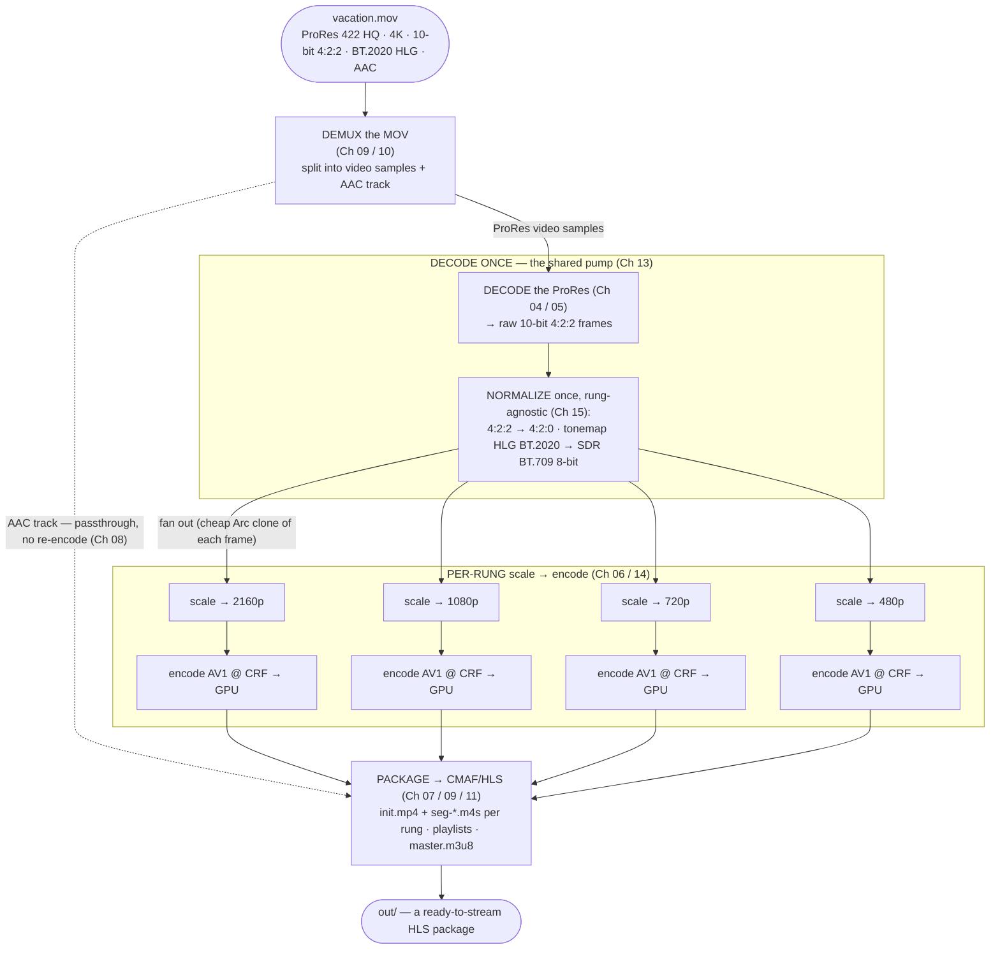

# Chapter 17 — Putting It All Together

> **Part VI · The Real World** — One real upload, end to end. We take a 4K HDR ProRes file a creator just dropped on us and walk it — probe, decide, decode-once, tonemap-and-scale per rung, encode AV1, package as HLS, play in a browser — naming every concept the whole course taught and linking each back to its chapter.

You've met every piece of the machine separately: frames and color (Part I), codecs and bitstreams (Part II), containers (Part III), streaming (Part IV), the pipeline and GPUs (Part V), and the patent landscape ([Chapter 16](16-patents-and-royalties.md)). This chapter is where the assembly line runs **start to finish on a single job.** No new theory — instead, the satisfying click of watching all of it engage at once. By the end you'll be able to look at a real `rivet transcode` command, predict exactly what happens at every stage, and read the files it produces. If something below feels unfamiliar, the cross-link will take you to the chapter that built it.

---

## The job: a creator uploads `vacation.mov`

A creator films a holiday on a recent mirrorless camera and exports a master in **Apple ProRes 422 HQ**. They upload `vacation.mov` to our service. Here's what's actually in that file:

| Property | Value | Where you learned it |
|----------|-------|----------------------|
| **Container** | QuickTime `.mov` (Apple's flavor of ISOBMFF) | [Ch 09](09-containers-and-muxing.md) |
| **Video codec** | ProRes 422 HQ (an intra-only mezzanine codec) | [Ch 05](05-the-codec-zoo.md) |
| **Resolution** | 3840 × 2160 ("4K" / 2160p) | [Ch 01](01-what-is-video.md) |
| **Frame rate** | 30 fps (progressive) | [Ch 01](01-what-is-video.md) |
| **Chroma / bit depth** | 4:2:2, 10-bit | [Ch 02](02-color-and-pixels.md) |
| **Color** | BT.2020 primaries, **HLG** transfer — i.e. **HDR** | [Ch 02](02-color-and-pixels.md) |
| **Audio** | AAC-LC, stereo, 48 kHz | [Ch 08](08-audio.md) |

This is a deliberately *hard* input — it exercises almost everything the course covered. It's **huge** (ProRes is lightly compressed — a few minutes can be several gigabytes; recall from [Chapter 03](03-why-compression.md) and [Chapter 05](05-the-codec-zoo.md) that mezzanine codecs trade size for edit-friendliness). It's **10-bit 4:2:2 HDR**, which web players and the AV1 4:2:0 web profile don't want as-is. And it's in a **QuickTime container** with **AAC** audio we'd like to keep without re-encoding. Our task: turn this into a **web-ready adaptive stream** that plays cleanly in a browser, on a phone, on a laptop — at whatever quality each viewer's connection can sustain.

Let's walk it.

---

## Stage 1 — Probe: *what did we just receive?*

Before touching a single pixel you must **identify** the input — you cannot decode what you can't name. **Probing** ([Chapter 10](10-demuxing.md)) reads the container's metadata — the `moov` box, track headers, sample descriptions, the `colr` color tags from [Chapter 02](02-color-and-pixels.md) — *without* decoding the video. It's the cheap reconnaissance pass that tells the pipeline what it's dealing with.

```sh
rivet probe vacation.mov
```

A human-readable summary comes back (the machine-readable form is `rivet probe vacation.mov --json`):

```text
vacation.mov
  container : QuickTime / MOV (ISOBMFF)
  video     : prores  3840x2160  30.000 fps  progressive
  pixel fmt : yuv422p10le  (4:2:2, 10-bit)
  color     : BT.2020 primaries / HLG transfer  →  HDR
  audio     : aac-lc  48000 Hz  stereo
  duration  : 0:03:12
```

Every field here is a concept from the course, recovered from the bytes:

- **container = MOV** → [Chapter 09](09-containers-and-muxing.md). We'll need the MOV/ISOBMFF **demuxer** ([Chapter 10](10-demuxing.md)) to pull the elementary streams out of the box.
- **video = ProRes** → [Chapter 05](05-the-codec-zoo.md). An intra-only codec (every frame is an I-frame — no inter-prediction, [Chapter 04](04-how-codecs-work.md)), which is why it's so big and so easy to decode.
- **10-bit 4:2:2** → [Chapter 02](02-color-and-pixels.md). More chroma than the 4:2:0 web target wants, and more bit depth than an 8-bit SDR output needs.
- **BT.2020 / HLG** → [Chapter 02](02-color-and-pixels.md). Wide gamut + an HDR transfer curve. A browser that doesn't handle HDR — or our decision to ship SDR — means we must **tonemap** it down ([Chapter 15](15-filters-scaling-tonemapping.md)).
- **audio = AAC** → [Chapter 08](08-audio.md). Already a web-friendly codec, so we can **pass it through** (copy, don't re-encode) — the passthrough-vs-transcode distinction from Chapter 08, and a royalty bonus from [Chapter 16](16-patents-and-royalties.md) (copying AAC bytes isn't a licensed encoding activity).

> 🧠 **Mental model:** Probe is the **triage nurse.** It doesn't treat the patient (decode), it just reads the vitals (codec, resolution, color, audio) so the pipeline can plan the right treatment. Get the vitals wrong — misread HLG as SDR, miss the 4:2:2 — and every later stage produces something subtly (or spectacularly) wrong.

---

## Stage 2 — Decide the output: *what should this become?*

Now we choose the *target.* This is a product decision informed by Parts IV and VI, and for a web-delivery service it resolves cleanly:

| Decision | Choice | Why · chapter |
|----------|--------|---------------|
| **Delivery shape** | Adaptive bitrate (ABR) over HLS | One file can't serve a phone on cellular *and* a desktop on fiber; ABR adapts. [Ch 11](11-adaptive-bitrate-streaming.md) |
| **Packaging** | **CMAF / HLS** (fragmented MP4 segments + playlists) | The modern, browser-friendly streaming package. [Ch 11](11-adaptive-bitrate-streaming.md) · [Ch 12](12-web-delivery-and-compatibility.md) |
| **Video codec** | **AV1** | Best efficiency + cleanest royalty story. [Ch 06](06-encoders-and-rate-control.md) · [Ch 16](16-patents-and-royalties.md) |
| **Audio codec** | **Opus** (or AAC passthrough) | Royalty-clean; here AAC is already fine, so pass it through. [Ch 08](08-audio.md) · [Ch 16](16-patents-and-royalties.md) |
| **Color** | **Tonemap HDR → SDR** (BT.709, 8-bit) | Maximum compatibility; avoids eye-searing/washed-out HDR on non-HDR screens. [Ch 02](02-color-and-pixels.md) · [Ch 15](15-filters-scaling-tonemapping.md) |
| **The ladder** | 2160p / 1080p / 720p / 480p rungs | Cover the range from 4K TVs to phones on weak connections. [Ch 11](11-adaptive-bitrate-streaming.md) |

The **rendition ladder** ([Chapter 11](11-adaptive-bitrate-streaming.md)) is the heart of the plan: instead of one output, we produce *several* versions of the same content at descending resolutions and bitrates ("rungs"), so a player can pick — and *switch between* — them based on measured bandwidth. From a 4K source we'll build four rungs:

| Rung | Resolution | Rough target bitrate (AV1) | Audience |
|------|-----------|----------------------------|----------|
| **2160p** | 3840 × 2160 | ~12 Mbps | 4K TVs, fast connections |
| **1080p** | 1920 × 1080 | ~4.5 Mbps | most laptops/desktops |
| **720p** | 1280 × 720 | ~2.5 Mbps | tablets, average mobile |
| **480p** | 854 × 480 | ~1.2 Mbps | weak/cellular connections |

> 🧠 **Mental model:** We're not making *a* video. We're making a **menu** — the same scene at four quality tiers — plus a *maître d'* (the master playlist) that lets each viewer's player order the tier their connection can afford, and re-order mid-meal if the connection changes. That's ABR ([Chapter 11](11-adaptive-bitrate-streaming.md)) in one sentence.

> 🔬 **Going deeper — the codec/color choice _is_ the royalty choice.** Notice that "AV1 + Opus + tonemap-to-SDR-MP4-fragments" isn't only a quality/compatibility decision — per [Chapter 16](16-patents-and-royalties.md) it's also the **cleanest royalty position** we can ship: a free CMAF/ISOBMFF container wrapping a royalty-free video codec and a royalty-free (or passed-through) audio codec. The technically-best web choice and the legally-cleanest choice happen to coincide, which is exactly why we made AV1+Opus the default.

---

## Stage 3 — Run the pipeline: *decode once, transform per rung, encode*

Here's the engine room. The naïve way to build a 4-rung ladder is to run a transcoder four times — decode the ProRes four times, once per output. That's wasteful: decoding 4K ProRes is expensive, and doing it four times quadruples the cost. The professional pipeline ([Chapter 13](13-the-transcoding-pipeline.md)) **decodes the source exactly once** and **fans the decoded frames out** to all four rungs.

Trace one input frame all the way through:



Walk the stages:

### 3a. Demux (Ch 09 / 10)

The MOV **demuxer** opens the container, reads the box tree, and pulls out two **elementary streams**: the compressed ProRes video samples and the AAC audio. The audio takes a shortcut — it's already a fine web codec, so it's set aside for **passthrough** ([Chapter 08](08-audio.md)): we'll copy its bytes straight into the output, never decoding or re-encoding it. (Royalty bonus, [Chapter 16](16-patents-and-royalties.md): a byte copy of AAC is not a licensed *encoding* activity.) Only the video needs real work.

### 3b. Decode — exactly once (Ch 04 / 13)

The ProRes samples flow into the **decoder** ([Chapter 04](04-how-codecs-work.md)), which reverses the codec to produce **raw frames** — full 10-bit 4:2:2 pixel grids. Because ProRes is intra-only ([Chapter 05](05-the-codec-zoo.md)), every frame decodes independently; there's no GOP reordering, no PTS/DTS divergence to untangle ([Chapter 09](09-containers-and-muxing.md)). This decode happens **one time** for the whole job, no matter how many rungs we're building — the single most important efficiency in the pipeline ([Chapter 13](13-the-transcoding-pipeline.md)).

> 🔬 **Going deeper — ProRes decodes on the CPU, not a GPU video block.** GPUs have fixed-function decoders ([Chapter 14](14-gpu-acceleration.md)) for the *delivery* codecs (H.264, HEVC, VP9, AV1) — but **not** for ProRes, a professional mezzanine format no consumer GPU implements in silicon. So this one input is decoded on our **software/FFmpeg decode tier** rather than a hardware NVDEC/QSV block. That's fine: ProRes is *cheap* to decode (it's intra-only, no motion search to reverse), and — critically — the *expensive* half of the job, the **AV1 encode**, still runs on the GPU. The lesson: "GPU-accelerated transcoding" doesn't mean *every* stage is on the GPU; it means the stages that *matter for throughput* are. Decode the lightweight ProRes on the CPU, spend the GPU on the heavy AV1 encode.

### 3c. Normalize once (Ch 15) — the rung-agnostic transforms

Some transformations are identical for *every* rung, so we do them **once, in the shared pump, before the fan-out** — never four times. Two apply here, both from [Chapter 15](15-filters-scaling-tonemapping.md):

- **Chroma downsample 4:2:2 → 4:2:0.** The web AV1 profile wants 4:2:0 ([Chapter 02](02-color-and-pixels.md)); we average the extra vertical chroma resolution away. Same operation for all rungs → do it once.
- **Tonemap HLG BT.2020 (HDR) → BT.709 8-bit (SDR).** This is the careful one ([Chapter 15](15-filters-scaling-tonemapping.md)): map the wide-gamut, HDR-curve pixels down to standard SDR so the clip looks *right* on an ordinary screen instead of washed-out or eye-searingly bright. It involves the inverse HLG curve, a gamut conversion from BT.2020 to BT.709 primaries, and a tone-curve that compresses the HDR highlights into SDR's range. Identical math for every rung → do it once, before fan-out.

### 3d. Fan out → scale per rung (Ch 13 / 15)

The normalized SDR 4:2:0 frame is now **fanned out** to the four rungs. The copy is cheap — frames are reference-counted, so "cloning" a frame to four rungs is a refcount bump, not four full-frame memory copies ([Chapter 13](13-the-transcoding-pipeline.md)). Each rung then **scales** ([Chapter 15](15-filters-scaling-tonemapping.md)) the shared frame to *its* resolution: the 2160p rung keeps it at 4K, the others downscale to 1080p / 720p / 480p with a resampling filter (bilinear/bicubic/Lanczos, Chapter 15). Scaling *is* per-rung (each target size differs), so it lives *after* the fan-out — unlike tonemapping, which is shared and lives *before* it.

### 3e. Encode AV1 per rung (Ch 06 / 14)

Each rung's scaled frames feed an **AV1 encoder** ([Chapter 06](06-encoders-and-rate-control.md)), which runs a *fresh* encode loop ([Chapter 04](04-how-codecs-work.md)) — choosing new I/P/B structure, GOP length, partitions, motion vectors, and **QP** to hit that rung's quality target (a **CRF**, [Chapter 06](06-encoders-and-rate-control.md), often with a per-rung bitrate cap — "capped CRF"). This is the heavy compute, and it runs on the **GPU encode block** (NVENC / QSV / AMF, [Chapter 14](14-gpu-acceleration.md)), staying GPU-resident so frames don't bounce back and forth across the slow PCIe bus. With several GPUs available, the rungs (and the chunks within them) are **leased across all of them** ([Chapter 14](14-gpu-acceleration.md)): a fast rung that frees its GPU early gets put to work helping a slower rung, so throughput scales close to linearly with GPU count.

One subtlety that pays off in the next stage: every rung's encoder is told to place **keyframes at the same fixed interval**, so the I-frames line up across all four renditions ([Chapter 04](04-how-codecs-work.md) on GOPs; [Chapter 11](11-adaptive-bitrate-streaming.md) on why alignment is non-negotiable). Hold that thought.

> 🧠 **Mental model:** The pipeline is a **kitchen with one prep station and four cooks.** Prep — decode the ProRes, downsample chroma, tonemap to SDR — is done *once* at the shared station (it's the same for every plate). Then the prepped ingredient is handed to four cooks, each plating it at a different portion size (resolution) and searing it to a different doneness (CRF). Doing prep once instead of four times is the whole efficiency game.

---

## Stage 4 — Package: *wrap it for streaming*

We now have four AV1 video streams plus one AAC audio stream. **Packaging** ([Chapter 11](11-adaptive-bitrate-streaming.md)) turns them into a **CMAF/HLS** bundle a player can stream.

Each rung's AV1 stream is **muxed** ([Chapter 09](09-containers-and-muxing.md)) into **fragmented MP4** ([Chapter 11](11-adaptive-bitrate-streaming.md)): a one-time **`init.mp4`** (the initialization segment — the `moov`-equivalent header carrying the codec config, resolution, timescale, and color tags, but *no* media) followed by a sequence of **media segments** `seg-00001.m4s`, `seg-00002.m4s`, … (each a self-contained `moof`+`mdat` fragment, a few seconds of video). The audio gets the same treatment in its own rendition group. Crucially, because we aligned keyframes in Stage 3e, **every rung's segments cut at the same timestamps** — `seg-00001.m4s` covers exactly the same moment across all four resolutions ([Chapter 11](11-adaptive-bitrate-streaming.md)). *That* is what lets a player switch rungs mid-stream without a glitch: it can finish 720p segment 12 and fetch 1080p segment 13 because they meet exactly on a keyframe boundary.

Then we write the **playlists**:

- A **media playlist** (`playlist.m3u8`) per rung — the ordered list of that rung's segments and their durations.
- A **master playlist** (`master.m3u8`) — the menu. It lists every rung with its **`BANDWIDTH`** (peak bitrate), **`RESOLUTION`**, and **`CODECS`** string ([Chapter 07](07-bitstreams-and-nal-units.md) — e.g. `av01.0.08M.08` for AV1, the codec-string format that tells a player *exactly* what it must be able to decode *before* downloading a byte of media), and points at the per-rung media playlists and the audio rendition group.

The result is a directory tree like this:

```text
out/
├── master.m3u8                     ← the menu: rungs + BANDWIDTH/RESOLUTION/CODECS + audio group
├── audio/
│   ├── init.mp4                    ← AAC init segment (passed through, never re-encoded)
│   ├── seg-00001.m4s
│   ├── seg-00002.m4s
│   └── audio.m3u8                  ← audio media playlist
└── video/
    ├── 2160p/
    │   ├── init.mp4                ← AV1 init segment (codec config, color tags)
    │   ├── seg-00001.m4s           ← ~a few seconds of AV1, starts on a keyframe
    │   ├── seg-00002.m4s
    │   ├── …
    │   └── playlist.m3u8           ← 2160p media playlist
    ├── 1080p/
    │   ├── init.mp4
    │   ├── seg-00001.m4s           ← SAME timespan as 2160p/seg-00001 — segment-aligned
    │   ├── …
    │   └── playlist.m3u8
    ├── 720p/
    │   ├── init.mp4
    │   ├── seg-*.m4s
    │   └── playlist.m3u8
    └── 480p/
        ├── init.mp4
        ├── seg-*.m4s
        └── playlist.m3u8
```

And the **master playlist** itself, annotated:

```m3u8
#EXTM3U
#EXT-X-VERSION:7

# --- the audio rendition group: one shared Opus/AAC track every video rung points at ---
#EXT-X-MEDIA:TYPE=AUDIO,GROUP-ID="aud",NAME="English",DEFAULT=YES,AUTOSELECT=YES,URI="audio/audio.m3u8"

# --- one entry per video rung; the player reads these BEFORE downloading any media ---
#EXT-X-STREAM-INF:BANDWIDTH=12000000,RESOLUTION=3840x2160,CODECS="av01.0.12M.08,mp4a.40.2",AUDIO="aud"
video/2160p/playlist.m3u8
#EXT-X-STREAM-INF:BANDWIDTH=4500000,RESOLUTION=1920x1080,CODECS="av01.0.09M.08,mp4a.40.2",AUDIO="aud"
video/1080p/playlist.m3u8
#EXT-X-STREAM-INF:BANDWIDTH=2500000,RESOLUTION=1280x720,CODECS="av01.0.05M.08,mp4a.40.2",AUDIO="aud"
video/720p/playlist.m3u8
#EXT-X-STREAM-INF:BANDWIDTH=1200000,RESOLUTION=854x480,CODECS="av01.0.04M.08,mp4a.40.2",AUDIO="aud"
video/480p/playlist.m3u8
```

Read it like a player would ([Chapter 07](07-bitstreams-and-nal-units.md) on codec strings, [Chapter 11](11-adaptive-bitrate-streaming.md) on the manifest, [Chapter 12](12-web-delivery-and-compatibility.md) on what the browser does with it):

- **`BANDWIDTH`** is the peak bitrate the player must sustain to play that rung without stalling — its primary input for matching a rung to your connection.
- **`RESOLUTION`** lets the player avoid fetching a 4K rung for a 360-pixel-wide `<video>` element.
- **`CODECS="av01.0.09M.08,mp4a.40.2"`** is the contract: `av01...` = AV1 (with profile/level/bit-depth fields), `mp4a.40.2` = AAC-LC. A browser checks `MediaSource.isTypeSupported(...)` against this string and *skips* any rung it can't decode — *before downloading a single segment* ([Chapter 12](12-web-delivery-and-compatibility.md)).
- **`AUDIO="aud"`** ties every video rung to the one shared audio rendition group, so audio isn't duplicated four times.

> 🧠 **Mental model:** The master playlist is a **restaurant menu written for a robot.** Each line says "this dish (rung) needs *this* much bandwidth, comes at *this* resolution, and requires a stomach that can digest *these* codecs." The player reads the whole menu, discards anything it can't digest (`CODECS`), and orders the richest dish its connection can afford (`BANDWIDTH`) — re-ordering between courses (segments) as conditions change.

---

## Stage 5 — Playback: *the browser adapts*

The package lands on a CDN; a viewer hits play ([Chapter 12](12-web-delivery-and-compatibility.md)). Here's the closing handshake:

1. The browser fetches **`master.m3u8`** and parses the rung list. It checks each rung's **`CODECS`** string against `MediaSource.isTypeSupported(...)` and drops any it can't decode — on a browser without AV1 decode, *none* of these rungs qualify, which is why a production service often *also* ships an H.264 fallback rung ([Chapter 16](16-patents-and-royalties.md)'s compatibility-vs-royalty trade, made real).
2. It picks a **starting rung** (often a middle one — say 720p — to begin fast without guessing too high) and fetches that rung's `init.mp4` + first `seg-*.m4s`, feeding the bytes to the decoder through **Media Source Extensions (MSE)** — the browser API that lets JavaScript push media segments into the `<video>` element ([Chapter 12](12-web-delivery-and-compatibility.md)).
3. As segments download, the player **measures throughput** — how fast did that 4-second segment actually arrive? ([Chapter 11](11-adaptive-bitrate-streaming.md)) If the connection is faster than the current rung's `BANDWIDTH`, it **steps up** (fetch the next segment from a higher rung); if segments arrive slowly and the buffer drains, it **steps down.** Because the rungs are **segment-aligned** (Stage 4), each switch lands cleanly on a shared keyframe boundary — no glitch, no gap.
4. The viewer just sees *their video,* smoothly, at the best quality their connection sustains — quietly shifting between 1080p and 720p as the Wi-Fi wavers, never noticing the machinery.

```mermaid
flowchart LR
    M["master.m3u8"] --> CHK["check CODECS<br/>(Ch 07/12)<br/>can I decode av01?"]
    CHK --> PICK["pick starting rung<br/>by BANDWIDTH (Ch 11)"]
    PICK --> FETCH["fetch init.mp4 + seg-*.m4s<br/>feed via MSE (Ch 12)"]
    FETCH --> MEASURE{measure throughput<br/>vs buffer (Ch 11)}
    MEASURE -->|"bandwidth up"| UP["step up a rung"]
    MEASURE -->|"bandwidth down"| DOWN["step down a rung"]
    UP --> FETCH
    DOWN --> FETCH
    MEASURE -->|"steady"| PLAY([smooth playback,<br/>best sustainable quality])
```

That's the whole assembly line, from a creator's 4K HDR ProRes master to a glitch-free adaptive stream on a stranger's phone.

---

## The one command that does all of it

Every stage above — probe, decide, decode-once, normalize, fan-out, scale, encode, package — is what a single `rivet transcode` invocation orchestrates. Here is the real, end-to-end run:

```sh
# 1. Look before you leap (Stage 1)
rivet probe vacation.mov

# 2. Transcode to a royalty-clean AV1 HLS ladder (Stages 2–4)
rivet transcode vacation.mov \
    -o out/ \
    --mode hls \
    --ladder --max-short-side 2160 \
    --codec av1 \
    --color sdr \
    --segment-seconds 4
```

Flag by flag, mapped to the stages you just walked:

| Flag | Effect | Stage |
|------|--------|-------|
| `-o out/` | The HLS asset root — the package directory shown above | 4 |
| `--mode hls` | Emit a CMAF/HLS package (vs `single` MP4) | 2, 4 |
| `--ladder` | Auto-derive a standard ABR ladder from the source resolution | 2 |
| `--max-short-side 2160` | Keep the top rung at 4K (the default cap is 1080 — raise it to retain a 2160p rung) | 2 |
| `--codec av1` | Encode AV1 — the royalty-clean default ([Ch 16](16-patents-and-royalties.md)) | 3e |
| `--color sdr` | Tonemap any HDR source (our HLG input) down to 8-bit SDR BT.709 — the default policy | 3c |
| `--segment-seconds 4` | Target ~4-second segments (they still break on keyframes) | 4 |

> 🛠️ **In rivet:** This is not a toy example — it's a real `rivet transcode --mode hls --ladder --codec av1` run, start to finish, on exactly the kind of file a creator actually uploads. **`--audio auto`** (the default) handles the AAC track for us: it sees a web-friendly AAC stream and **passes it through** untouched ([Ch 08](08-audio.md)) — had the source carried MP3 or Vorbis, it would have transcoded that to **Opus** ([Ch 16](16-patents-and-royalties.md)) instead. The HDR→SDR tonemap is the **default `--color sdr` policy** ([Ch 15](15-filters-scaling-tonemapping.md)): we never silently leave an HLG clip to render eye-searingly bright on a viewer's SDR screen. The ProRes decodes on our software/FFmpeg tier (no GPU does ProRes), the four AV1 rungs encode on the **GPU**, the decode runs **once** and fans out, and the rungs **lease across every GPU on the box** ([Ch 13](13-the-transcoding-pipeline.md) · [Ch 14](14-gpu-acceleration.md)). Run it on a single-GPU laptop or a multi-GPU server and the *same command* produces the *same* segment-aligned, royalty-clean HLS package — the engine scales the work to the hardware. Every default in that command line is a decision this course spent sixteen chapters justifying.

---

## You now understand the whole assembly line

Step back and look at what just happened. A creator handed us a **flipbook** ([Chapter 01](01-what-is-video.md)) of 4K still frames, stored in **wide-gamut HDR color** ([Chapter 02](02-color-and-pixels.md)), lightly compressed by an **intra-only mezzanine codec** ([Chapter 05](05-the-codec-zoo.md)) because **raw video is impossibly large** ([Chapter 03](03-why-compression.md)), wrapped in a **QuickTime container** ([Chapter 09](09-containers-and-muxing.md)) alongside an **AAC audio track** ([Chapter 08](08-audio.md)).

We **probed** it to read its vitals ([Chapter 10](10-demuxing.md)), **demuxed** the streams out of the box ([Chapter 10](10-demuxing.md)), **decoded** the ProRes back to raw frames via the universal **predict-transform-quantize** machine run in reverse ([Chapter 04](04-how-codecs-work.md)), **tonemapped and scaled** those frames ([Chapter 15](15-filters-scaling-tonemapping.md)), and **re-encoded** them into four AV1 rungs — each a fresh **rate-distortion search** governed by **CRF** ([Chapter 06](06-encoders-and-rate-control.md)) — running on **GPU encode silicon** ([Chapter 14](14-gpu-acceleration.md)) fed by a **decode-once pipeline** ([Chapter 13](13-the-transcoding-pipeline.md)). We **packaged** the result into segment-aligned **CMAF/HLS** ([Chapter 11](11-adaptive-bitrate-streaming.md)) with **codec strings** in the manifest ([Chapter 07](07-bitstreams-and-nal-units.md)), choosing **AV1 + Opus/AAC** for a clean **royalty position** ([Chapter 16](16-patents-and-royalties.md)), so a browser could read the menu, check what it can decode, and **adapt** its quality to the viewer's bandwidth in real time ([Chapter 12](12-web-delivery-and-compatibility.md)).

Every box in that paragraph was a chapter. You can now read a `rivet transcode` command — or an `ffmpeg` incantation, or a streaming service's settings page — and *see the whole machine,* not a magic spell. When something goes wrong (a stretched picture, a stalled stream, a washed-out HDR clip, a codec a device won't play), you know *which stage* to look at and *why.* That's the difference this course set out to make: not "you can run a transcoder," but **"you understand what a transcoder is doing, end to end, and could explain it to the next person."**

> 🧠 **Mental model:** The whole field is **one assembly line — demux → decode → filter → encode → mux — wrapped in a delivery system that ships multiple quality tiers and lets the player choose.** Everything else, all 750 pages of every spec, is detail hung on that frame. Hold the line in your head and you'll never be lost again.

There is always more depth — the specs run to thousands of pages, the encoders hide decades of psychovisual craft, and the patent landscape shifts monthly. But you now have the *map*, and the map is the hard part. Where to dig next — the standards, the books, the talks, and the command-line tools to inspect any file yourself — is in **Further Reading**.

---

## Recap

- A real job — a creator's **4K, 10-bit 4:2:2, BT.2020 HLG (HDR), AAC** `vacation.mov` in ProRes — exercises nearly every concept in the course, and turning it into a web stream walks the entire assembly line.
- **Probe** (Ch 10) reads the vitals — container, codec, resolution, color, audio — *without* decoding, so the pipeline can plan.
- **Decide** (Ch 11/12/16): web ABR → **AV1** video + **Opus**/AAC audio + **CMAF/HLS**, **tonemap HDR→SDR** (Ch 15), a **2160p/1080p/720p/480p ladder** (Ch 11) — the technically-best *and* royalty-cleanest choice at once (Ch 16).
- **Run the pipeline** (Ch 13/14): **demux** (Ch 09/10) → **decode the ProRes once** (Ch 04) → **normalize once** (4:2:2→4:2:0 + HDR tonemap, Ch 15) → **fan out** cheaply → **scale per rung** (Ch 15) → **encode AV1 at a CRF on the GPU** (Ch 06/14), with rungs **leased across all GPUs** (Ch 14). Decode-once is the master efficiency; ProRes decodes on the CPU while the heavy AV1 encode runs on the GPU.
- **Package** (Ch 07/09/11): mux each rung into **fragmented MP4** — `init.mp4` + `seg-*.m4s` — write per-rung **media playlists** and a **`master.m3u8`** carrying **`BANDWIDTH` / `RESOLUTION` / `CODECS`** (Ch 07), **segment-aligned** across the ladder (Ch 11) so switches land on shared keyframes.
- **Playback** (Ch 12): the browser reads `master.m3u8`, checks **`CODECS`** support, picks a rung by **`BANDWIDTH`**, feeds segments through **MSE**, **measures throughput**, and **adapts** up/down mid-stream — invisibly.
- It's **one `rivet transcode --mode hls --ladder --codec av1` command**, and every default in it is a decision this course justified.
- **You now understand the whole assembly line — demux → decode → filter → encode → mux, wrapped in adaptive delivery.** Everything else is detail hung on that frame.

**Next:** [Further Reading & Tools](../FURTHER-READING.md) — the specs, books, talks, and command-line tools to go deeper, plus how to inspect any file yourself.
